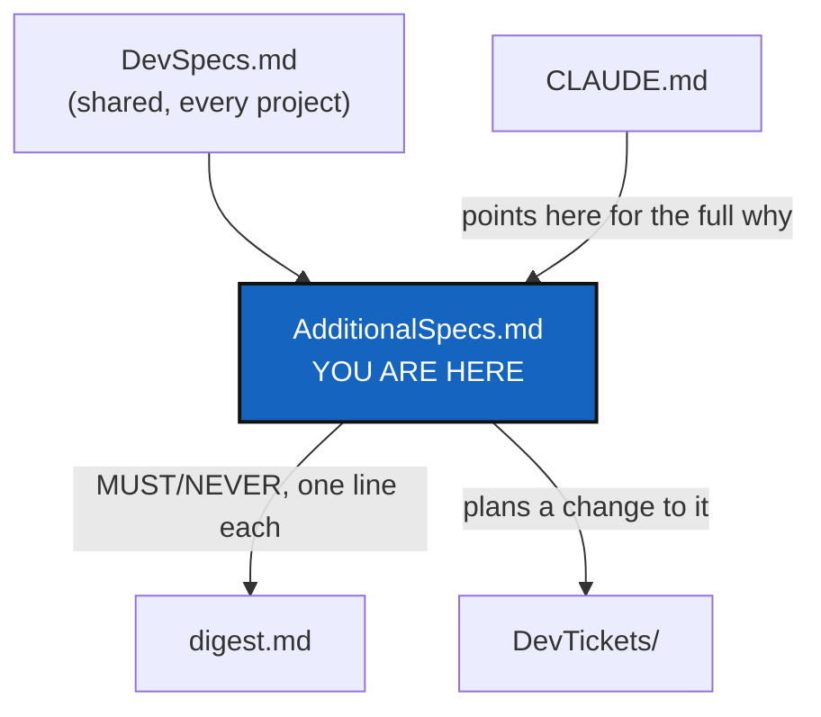

# AdditionalSpecs — ComplexGitSync-Specific Constraints

*Created: 2026-05-13*

## Abstract — read this first

**The one-line version.** Everything that is true of ComplexGitSync in
particular, on top of the general `DevSpecs.md`: its architecture and
rings, its formats, its memory and ledger, its prohibitions, its
and the way it is built and tested, which lives next door in `.dev`.

**What this document is.** This file documents project-specific constraints and refinements that apply
**on top of** the general [DevSpecs](../../.distant/dev-sync/DevSpecs.md). Every rule in `DevSpecs.md`
applies here; this file only adds or tightens rules for `ComplexGitSync`.

**Planning lives next door.** `.agent/.local/.dev/DevTickets/` holds every planning
ticket for this project — the owner's short tickets, the ranked open plans,
and the archive — and [its README](../.dev/DevTickets/README.md) explains the loop
they move through. It is in this private repository, not in the public
`ComplexGitSync` one, so that installing the tool never ships the workshop:
the same PROJECT/private separation the tool itself implements. This file
stays the authoritative *specification*; a ticket only plans a change to it.

**Why it exists.** `DevSpecs.md` is shared by every project that adopts
it, so it cannot say anything specific to this one. A rule this project
adds or tightens has to live somewhere a reader of this project will
find it, and this is that place.

**What you will find.** The architectural overview and module
responsibilities, the install frontier and the tree profile, the ring
model and import rules, format ownership, module shape, document
formats, the lifecycle contract, the memory, ledger and self-history
designs. Testing, branches and ticket topics, and versioning are process,
not product, and moved to `.dev` (see the last section). The
binding MUST/NEVER lines are also in `digest.md`, one line each.

**Who it is for.** Anyone changing this project's code, specs or
tickets, human or agent. A user of `cgitsync` never needs it.

**What you need to do with it.** Read the section that governs what you
are changing before you change it, and update that section in the same
change when the change moves a responsibility or a rule.



---

## Architectural Overview

The design is split into three explicit tiers.  Every class belongs to exactly
one tier; dependencies only flow **downward** (API → Actions → Core).

```
┌─────────────────────────────────────────────────────┐
│  Tier 3 — Client / API                              │
│  ComplexGitSyncClient  ·  Orchestre  ·  CLI         │
│  Exposes class methods gated by TreeLifecycleState  │
└────────────────────────┬────────────────────────────┘
                         │ calls (state-gated)
┌────────────────────────▼────────────────────────────┐
│  Tier 2 — Actions                                   │
│  initialise · load · pull · clone                   │
│  checkout · add · commit · push · tag · freeze      │
│  Each action is only accessible from VALID states   │
└────────────────────────┬────────────────────────────┘
                         │ reads / mutates
┌────────────────────────▼────────────────────────────┐
│  Tier 1 — Core Data (information processing)        │
│  GitTree · GitRepo · WorkingGitTree · WorkingRepo   │
│  RepoAddress                                        │
│  Centred on reference and working tree structures   │
└─────────────────────────────────────────────────────┘
```

### Architectural positioning (T37)

ComplexGitSync is not a replacement for Git, monorepos, or submodule metadata.
It is a deterministic synchronization layer that coordinates multiple Git
repositories as one workspace contract.

The model explicitly combines:

- **Git DAG**: each repository keeps its own commit graph and remote semantics.
- **GitTree DAG**: the workspace-level parent/leaf dependency graph used for
  propagation and execution ordering.

Operational consequences:

- workspace state propagation uses ordered graph traversal (parent-first for
  branch targeting and restore preparation; leaf-first for mutation actions),
- `.gts` is the canonical deterministic workspace checkpoint (schema + hash),
- `.lgr` is the local identity and replay layer (stable snapshot ids + ledger),
- cross-declared nested references may form a local declaration tangle, but
  runtime expansion is normalized to a DAG by `fix_circularities`.

### Tier 1 — Core Data

The reference model is centred on **`GitTree`**, which owns canonical
**`GitRepo`** identities. **`WorkingGitTree`** extends it with the parent-leaf
runtime graph of mutable **`WorkingRepo`** nodes.

```
GitTree
  ├── project identity  (GitRepo)
  └── dependency identities (GitRepo, ...)

WorkingGitTree
  └── root       (WorkingRepo, NodeType = ROOT)
        ├── dep  (WorkingRepo, NodeType = PARENT)
        │     └── sub  (WorkingRepo, NodeType = LEAF)
        └── lib  (WorkingRepo, NodeType = LEAF)
```

Key classes and their role in information processing:

| Class | Role |
|---|---|
| `GitRepo` | Canonical reference identity of one repository (provider, namespace, project name, protocol, SHA) |
| `GitTree` | Reference-tree structure containing `GitRepo` objects and format-adapter metadata |
| `WorkingGitTree` | Authoritative runtime graph; maps repo IDs to mutable `WorkingRepo` records |
| `WorkingRepo` | One mutable runtime node — canonical identity plus tree and synchronization state |
| `RepoAddress` | Derives the remote URL from a `GitRepo`; no side-effects |
| `RepoNode` | Immutable snapshot of a node's tree position for read-only traversal |
| `ProjectTreeState` | Frozen snapshot of overall tree readiness (returned by the Client to callers) |

`GitRepo` construction is side-effect free. Remote branch and tag availability
is resolved explicitly by `GitRunner` during runtime clone/resolution steps;
`.cgs` parsing and validation never query a remote.

Supporting enumerations:

| Enum | Values |
|---|---|
| `NodeType` | ROOT / PARENT / LEAF |
| `TreeLifecycleState` | user-facing: LOADED → PENDING → READY; implementation retains internal readiness states |
| `RepoLifecycleState` | DECLARED → PENDING → READY / FALLBACK_READY; side: MISSING, ERROR |
| `SyncState` | ALIGNED / FALLBACK_APPLIED / DIRTY / AHEAD / BEHIND / DIVERGED / ERROR / PENDING |
| `DiscoveryState` | PENDING / RESOLVED / DISABLED / MISSING |
| `RefKind` | AUTO / BRANCH / TAG / DETACHED / UNKNOWN |
| `GitProvider` | github / gitlab / codeberg / custom |
| `AccessProtocol` | ssh / https |

### Tier 2 — Actions

Actions are operations that read or mutate the Core tier.  Each action is
implemented as a method on `ComplexGitSyncClient` or a free function called by
the client.  **Every action is gated by the current `TreeLifecycleState`**:

| Action | Minimum required state | Produces state |
|---|---|---|
| `initialise(.cgs)` | none | `.gts READY` (clone) |
| `initialise(.gts)` | none | `.gts READY` (restore) |
| `load(.cgs)` | none | `.gts DECLARED` |
| `load(.gts)` | none | `.gts READY` (direct) |
| `expand(.cgs)` | none | `.gts PENDING`; runs nested discovery + `fix_circularities` (SCC + hash-compatibility) |
| `fix_circularities()` | any (after load/expand) | two-phase cycle-breaking engine; removes back-edge duplicates; state unchanged |
| `pull(.cgs)` | none | `.gts READY` |
| `pull(.gts)` | none | `.gts READY` |
| `checkout(.gts)` | `READY` | `READY` |
| `add` | `READY` | `READY` |
| `git(tree, "commit", msg)` | `READY` | `READY` |
| `git(tree, "push")` | `READY` | `READY` + updated hash |
| `git(tree, "tag", name)` | `READY` | `READY` + updated tag |
| `freeze` | `READY` | next `.gts` id |

Actions that **must reject** a non-READY tree:
`add`, `git("commit")`, `git("push")`, `git("tag")`, `freeze`.

CLI dry-run mode (T36): `add`, `commit`, `push`, `tag`, and `freeze` accept
`--dry-run` to print a non-mutating execution plan (`plan_actions`,
`plan_order`) without dispatching write operations.

Workspace preflight invariants:
- `commit`, `push`, `tag`, and `freeze` all run a workspace preflight engine before mutation.
- The engine checks dirty worktrees, detached HEADs, missing remotes, branch divergence,
  unresolved merges, and stale recorded `commit_sha` values.
- Diagnostics are severity-based: warnings are emitted for actionable-but-allowed states
  (for example ahead branches, dirty trees on `commit`/`freeze`, or stale snapshot SHAs),
  while blocking errors stop the operation.
- `tag` must still reject dirty worktrees and pre-existing tags.
- Tag creation is always non-forcing (`git tag <name>`); replacing an existing tag is not allowed.

### Branch Topology Propagation Rules (T35)

`validate_branch_topology(registry, git_runner) → BranchTopologyReport` is the
authoritative inspection function for workspace branch coherence.  It formalises
the propagation rules used by `checkout_tree`, `commit_tree`, `push_tree`,
`tag_tree`, and `freeze_release_tree`.

**Propagation rules (deterministic and inspectable):**

1. **Reference branch**: The root repository's current branch is the canonical
   reference.  All other repositories must match it.

2. **Leaf-to-root inheritance direction**: Branch targeting flows root-first
   (parent to children) via `propagate_global_branch` and
   `create_global_branch`.  `validate_branch_topology` verifies that the
   on-disk state is coherent with this rule without issuing any git writes.

3. **Allowed divergence**: Repositories whose `resolved_ref_kind` is `TAG` are
   flagged as `tag_divergence` but do **not** make the topology incoherent —
   they represent frozen (released) state.

4. **Incoherent (blocking) states**:
   - `misaligned_branch`: repo is on a different branch than root.
   - `detached_head`: repo is in detached HEAD state without a tag reference.

**`BranchTopologyReport` fields:**

| Field | Type | Description |
|---|---|---|
| `reference_branch` | `str \| None` | Root's active branch (reference for all repos) |
| `is_coherent` | `bool` | `True` when no blocking conflicts are present |
| `conflicts` | `list[BranchTopologyConflict]` | One entry per problematic repo |
| `repo_branches` | `dict[str, str \| None]` | `{repo_name: current_branch}` |

**`BranchTopologyConflict.conflict_kind` values:**

| Kind | Blocking | Description |
|---|---|---|
| `misaligned_branch` | ✓ | Repo is on a different branch than root |
| `detached_head` | ✓ | Repo is in detached HEAD without a tag |
| `tag_divergence` | — | Repo is on a tag (allowed divergence) |
| `missing_root` | ✓ | Registry has no root entry |

**Python API:**

```python
from ComplexGitSync import ComplexGitSyncClient

client = ComplexGitSyncClient()
client.load_gts("project.gts")
report = client.validate_branch_topology()
print(report.format())           # human-readable summary
assert report.is_coherent        # True if all repos are aligned
```

**CLI:**

```bash
cgitsync validate-topology --gts project.gts
# exits 0 if coherent, 1 if not
```

Actions that **must produce READY** or fail explicitly:
`initialise(.cgs)`, `initialise(.gts)`, `pull(.cgs)`, `pull(.gts)`, `checkout(.gts)`.

When `.cgs` entries declare `branch` or `tag`, format validation checks only
their static document representation. Runtime resolution selects the declared
target (`tag` takes precedence when both are present) and verifies its remote
availability through `GitRunner`.

### Tier 3 — Client / API

`ComplexGitSyncClient` is the single public facade.  It:

- Holds references to `Orchestre`, `GitRunner`, `RuntimeStateStore`, and the
  live `WorkingGitTree`.
- Computes the current `TreeLifecycleState` on demand and gates every action
  against it.
- Emits structured log events for every state transition, action start/end,
  fallback decision, and `.gts` write/load.
- Exposes both rich tree rendering (`format_project_tree`) and minimalist
  repo-outline rendering (`format_repo_tree`).
- Exposes terminal observability views: `view_tree` (topology + branch/local/sync)
  and `view_operation` (tabular runtime state).

`Orchestre` is the coordination layer between the Client and the tree models.
The CLI (`cli.py`) collects arguments or interactive prompt values and delegates
them to the non-interactive `ComplexGitSyncClient.configure()` Python API.
That facade delegates format semantics to `cgs_format.py`; runtime commands
remain separate Client operations.

### Tier and Ring are two different groupings of the same modules

The sections below (moved here from `audit.md`, which used to
carry them alongside its actual audit findings) describe the same module
set through a second, orthogonal lens: **Ring**, an *import-direction/
I/O-boundary* grouping, mechanically checked by
`scripts/check_module_ceilings.py`, as opposed to Tier's *lifecycle-role*
grouping above. The two do not collapse 1:1 — see
`docs/DevGuide/architecture.md` §1 for the full Tier↔Ring reconciliation
table; that document remains the place to look when the mapping between a
Tier and a Ring needs spelling out precisely.

## The install frontier

*Added 2026-09-30 (InstallFrontier).* `initialise` is the **nested install**
and `bootstrap` the **standalone install**, and that line is enforced, not
advised. Which one applies is a fact about where the running ComplexGitSync
sits relative to the workspace, not a choice between two ways of doing the
same thing.

| | `initialise` — nested | `bootstrap` — standalone |
|---|---|---|
| Running ComplexGitSync | Inside the workspace; `settings.resolve_use_case(CGSHOME)` is `NESTED` | Outside it; `STANDALONE` |
| Install name | None — the workspace is already there | Optional; the `[project] name` the `.cgs`/`.gts` declares unless one is given (`PathResolver.resolve_source_project_name`) |
| CGSHOME | `$CGSPATH/<project name>` | `$HOME/.cgs/<name>-<timestamp>`; `DIR/<name>` with `--cgs-path DIR` (BootstrapLanding, 2026-10-07) |
| Root repository | Already checked out; never cloned, never deleted | Cloned with everything else |
| Input | A `.cgs` (branch tips) or a `.gts` (recorded commits) | The same |
| Refuses, before touching the disk, when | CGSHOME is not a Git checkout (a detached `HEAD` is fine), or the installation is not inside it — naming `bootstrap` | The target is not empty — naming `initialise` when it is a checkout |

Consequences: the two commands never fall back into each other
(`InstallFrontierError`); `settings.UseCase` is *obeyed* by these two commands and
observed by every other; a standalone install can administer a workspace that
holds a nested ComplexGitSync, which is one repository of the tree to it, and
neither writes into the other. The suite injects the nested case at the one
place the installer asks (`Installer._use_case_of`) — never a flag a user can
pass.

**One clone path.** `Installer._clone_pending` serves all four entry points
(`initialise_cgs`, `clone_cgs`, `initialise_gts`, the `.gts` bootstrap); they
differ only in how CGSHOME is derived and whether the root is cloned. From a
`.gts` each repository is cloned on the branch the snapshot resolved and put
back on the recorded commit (`git checkout -B`), and the entry is restored to
what the snapshot said so the rebuilt tree carries the same State name. A
commit no remote holds any more is refused, listing every repository, before
anything is cloned (`GitRunner.remote_holds_commit`); the tip of a branch is
never substituted, because that would be a different State.

**One branch rule, before the first clone.** A `private, writable` repository
targets `git_branch.private_local_branch(<tree's project>, <tree's branch>)`
when the tree loads (`GitTreeBranches.declare_targets`, after privacy
propagates) and when it is first cloned (`client._select_private_local_ref`:
computed branch, then the entry's `fallback_branch`, then the remote's own
active branch — that branch is created lazily by a private commit, so on a
first install it is usually absent). A typed `default_branch` on such an entry
that is neither the computed name nor the project's own default is a
`ConfigValidationError`.

**A State is a `.gts`.** Nothing writes a `.cgs` into `state/` or
`.cgitsync/.cgs/`. `memory reboot` still exports one into the mount's `.cgs/`,
on purpose; leftovers already pushed stay, and `verify` ignores them.

## The tree profile

*Added 2026-09-30 (UserDevProfile).* A loaded tree is **USER** or **DEV**,
read off what it holds and never configured. This is the one statement of
the rule; everything else points here.

- **DEV** when at least one repository is effectively private
  (`WorkingRepo.effective_private`, after `propagate_privacy`), read-only or
  writable alike; **USER** otherwise. `WorkingGitTree.profile` in
  `git_tree.py` is the only code that answers it. `install.cgs` mounts no
  private repository, so a user install is USER; this project's developer
  spec is DEV. A memory entry is itself private, so a tree that declares a
  memory is DEV by construction.
- **Every memory is local first.** Both profiles record into `.cgitsync/`
  and fold into `.cgitsync/.memory`. Only a DEV memory is synced, and only to
  the remote its `.cgs` declares; a USER memory never leaves the disk
  (`default_memory.py`).
- **A DEV tree that declares no memory is offered one, never refused.** The
  work is still recorded in a local default memory. On the first command
  that records a State, a terminal is asked for the provider (default
  `github`), the owner (the most frequent owner among the private
  repositories; on none or a tie, the root repository's owner; else asked)
  and the name (default `.memory`), and shown the creation command
  (`gh`, `glab` or `tea`). Accepting runs `memory setup`: create the
  repository with the provider's tool, add the entry to the `.cgs` with its
  comments kept, adopt the local memory — stopping at the first step that
  fails. The `.cgs` edited is the one the tree was built from, even when a
  `bootstrap` left it outside the workspace (owner, 2026-09-30); its path is
  shown before asking, and `--cgs` names another. Declining — or answering
  so that nothing can be created — is remembered in
  `.cgitsync/memory-setup-declined`, so it is asked once. With no terminal (`--json`, CI, a Python caller), after a
  refusal or after a failed step, it only warns that the work has no memory
  back-up and no global ledger record, and names the command that fixes it;
  a Python caller gets it as `MemorySetupWarning`. `memory status` says the
  same on such a tree.
- **The one command a developer runs, at any time: `cgitsync memory setup
  [--provider P] [--owner O] [--name N] [--cgs FILE]`** (client:
  `memory_setup`). It needs no offer and ignores an earlier "no": run it
  whenever a DEV tree has no memory declared, and it creates the repository,
  declares it in the `.cgs` and adopts the local memory, stopping at the
  first step that fails. On a tree that already declares a memory, or a USER
  tree, it says there is nothing to set up. `tutorials/06_memory.md` §2 is
  where a reader meets it.
- `status` prints `profile=user|dev` on its summary line and `status --json`
  carries a `profile` field (additive).

This is a second axis, independent of the install frontier: `UseCase` says
where the running ComplexGitSync sits, the profile says what the workspace
holds. Two developers on one project branch share one `.memory` branch;
divergence is `autofix`'s job and the per-developer question is Omniscience's.

## Responsibility boundaries

Rewritten 2026-08-30 against the post-isolation-Wave-2 module set
(`.agent/.local/.dev/DevTickets/archive/20260828_Isolation_DevPlanTicket.md`) — `orchestre.py` used to
carry most of this table's Tier 2/3 responsibility directly; it now
delegates each to its own module. See each module's own docstring header
(`Ring:`/`Contract:`/`Imports:`, `.agent/.local/.dev/DevTickets/archive/20260828_Isolation_DevPlanTicket.md` §3.2) for the
authoritative, machine-cross-checked version of this table — this is the
human-readable summary.

| Module | Ring | Responsibility |
|---|---|---|
| `errors.py` | 0 | The package's public exception hierarchy. |
| `cgs_format.py` | 0 | `.cgs` TOML parsing/authoring grammar, normalization, static validation, `CgsDocument`, serialization. Deterministic and offline at its core — no `subprocess`, no Git, no remote calls; its `ConfigDocumentIOMixin`-derived file I/O is the one explicit Ring-1 exception. |
| `environment_spec.py` | 0 | Pure Environment record/Drift values and canonical digest, plus `.cgs` requirements and validation: `environment_root`, tools, compilers, system libraries, services, and extra manifest patterns. |
| `git_repo.py` | 0 | Canonical repository identity, provider registry, remote URL construction, per-repository runtime state. Owns `RepoScope`: which repositories a tree-wide command may write. `private` = a repository that configures the project rather than being it, read-only unless the entry adds `writable = true`; `--private` targets the writable ones. Scope reads the *effective* flags — `git_tree.propagate_privacy` pushes a parent's privacy onto everything nested inside it. |
| `provider.py` | 0 | **Which command-line tool creates a repository on which host, and with what arguments.** Runs nothing: `git_runner.run_tool` does that, for the same reason `toolchain.py` asks it for a version. Holds no credential, reads none and sends none — `gh`, `glab` and `tea` each keep their own, under their own `auth login`. The owner or group comes from `parse_repo_id` and from nowhere else. |
| `git_branch.py` | 0 | The only implementation of the `.cgs` branch fallback chain (target: `default_branch` → `project.default_branch` → `DEFAULT_BRANCH`; fallback: `fallback_branch` → `DEFAULT_BRANCH`, or for a private/local entry its own `default_branch`) and of the privacy rule — including the private/local naming rule (`private_local_branch`): `<project name>` on `main`, `<project name>_<branch>` otherwise. Its separator constant never leaves this module. Also owns the closed-branch naming rule: `closed_branch_name` (`closed/<branch>`, a `/` that can never collide with `private_local_branch`'s `_`) and `closeable` (false for the project's own default branch and for `ANCESTORS_BRANCH`, the permanent branch that keeps what closed branches alone held). Ring 0 — pure, offline; a resolver, not a registry: it holds no tree and no privacy state (`git_tree_branch.py` holds the tree's branch state and asks this module for every rule). Do not write a second copy of that chain anywhere. |
| `git_tree_branch.py` | 2 | The tree's branch *state*, where `git_branch.py` owns the *rule*: which branch the tree is on (the root's — printed by `status` as `cgitsync_branch`), which branch each repository targets when the tree moves, which branch it is actually on, and where those two disagree. Also owns `tree_project_name`. It restates no rule — every answer comes from `git_branch.py` — and it is the only place that reads the root's branch to speak for the tree. An instance caches what Git said, so build a new one after a checkout or a pull. `declare_targets()` gives a not-yet-cloned private/local repository its computed branch at load. `project_branches()` lists the project's own branches — the root's, local and on origin — with the repositories that hold or lack each (`branch --list`). |
| `git_tree.py` | 1 | Tree structures (`GitTree`/`WorkingGitTree`), traversal, lifecycle state; `to_cgs()` only delegates to `cgs_format.py`. Also maintains `.gitignore` across the tree (`sync_gitignore`) — filesystem-only, no Git/subprocess. Owns privacy state: `propagate_privacy` makes a parent's `private`/`writable` cover everything nested inside it. `WorkingGitTree.profile` is the only answer to USER or DEV: DEV when any repository is effectively private (`AdditionalSpecs.md`, *The tree profile*). |
| `gts_integrity.py` | 0 | The three-level hash that names a State (`integrity_schema = 1`): `repo_hash` per repository, an RFC 6962 Merkle root over them (`merkle_root`), and the State hash on top (`snapshot_hash`). Pure, on plain dicts; domain-tagged SHA-256. Pinned by golden vectors that CI runs on Linux, macOS and Windows. A released schema is immutable: any change is a new schema. See *What a State's name is computed from*. |
| `gts_document.py` | 0 | `.gts` runtime state-snapshot parsing/validation; the one builder of each repository's canonical leaf, which it hands to `gts_integrity.py`. The State hash **names the State** (`.cgitsync/state/<hash>.gts`), so it holds only what the workspace *is*: tree-relative paths, refs, commits, who each repository is. No absolute path, no `source_cgs_path`, no toolchain version — those say where a tree was materialised or what observed it, and hashing them gave one tree two names on two machines. `document.integrity_schema` says which hash contract a document was written under. A stamped document without it predates schema 1, and one declaring a higher schema came from a newer build; both are refused by name (`UnsupportedSnapshotFormatError`) before any hash is computed — never recomputed under today's rules and reported as a false mismatch. See `.agent/.local/.localSpec/AdditionalSpecs.md`, *What a State's name is computed from*. |
| `git_runner.py` | 2 | Git subprocess wrapper — the sole `import subprocess` module, and the sole owner of how Git's output is decoded (`errors="replace"` at both wrappers; `_query_bytes` for callers that must search raw bytes) and of the environment Git runs in: `_non_interactive_git_env()` stops Git prompting for credentials *and* pins its message locale to English, because this project reads Git's prose and a translated message costs a non-English user the `--force-protocol` hint. Every question goes through `_query`/`_query_bytes`, so neither policy can be bypassed. `merge`/`fetch`/`mergetool` are operations; `can_merge_cleanly`/`branch_known`/`configured_merge_tool` are read-only questions that never touch a worktree, which is what lets a preflight ask about every repo before acting on any. `can_merge_cleanly` returns the conflicting paths, not a verdict, and counts a binary conflict — which prints no marker and is named on stderr — as a conflict. Read-only questions `is_repository_root`, `remote_head_branch`, `remote_holds_commit`; `checkout_commit` pins a clone. |
| `clone_guard.py` | 2 | `CloneGuard`: whether a directory `initialise` is about to delete and re-clone holds work that exists nowhere else: a dirty worktree, or commits no remote has. Read-only and worktree-free, so `orchestre.py` can ask about every pending repository before deleting any — a refusal leaves the whole tree on disk. Asks "which commits does no remote hold?", not "is this branch ahead of its upstream", so a detached `HEAD` on a pinned submodule commit does not block. Says nothing about whether a mount point is owned outright. |
| `operations/` | 2 | A package, one class per operation family — `Preflight`, `BranchOperation`, `RestartOperation`, `CommitOperation`, `RemovalOperation`, `MergeOperation`, `PushOperation`, `FetchOperation` and the `RepoOutcome` every write returns — each operation a static method; `operations/__init__.py` re-exports every name it always exported (`merge_tree = MergeOperation.merge_tree`), so no caller changed. Leaf/parent-first Git operations over a `WorkingGitTree` + `GitRunner`. Preflight checks only the repositories the operation's `RepoScope` selects, and measures a private repo against its own declared branch. `merge_tree` checks the whole scope before merging any of it, so a conflict anywhere leaves nothing merged; `merge_tree_one_at_a_time` (`merge --resolve`) gives that up on purpose, stopping at the first conflict so a merge tool has a conflicted worktree to open. `merge_status` is the single place a repository's fate is decided, so the dry run and the merge cannot disagree. `add_tree`/`commit_tree`/`push_tree`/`remove_paths` return one `RepoOutcome` per repository visited — what changed, or why nothing did — so "nothing happened" is reportable rather than silent. `remove_paths` is the one scoped operation given its paths instead of sweeping for them, so its scope is a *filter*: a path owned by a repository outside the scope is refused by name, and nothing is removed anywhere. `close_branch` renames a branch to `git_branch.closed_branch_name`'s name, tree-wide leaf-first, never deletes, and refuses before touching any repository when the branch is the project's own default or any repository in scope is currently checked out on it (`assert_closeable`). `AncestorOperation` (`ancestors.py`) says what deleting a branch would lose, keeps it on `ancestors` with a keep-tree merge that only adds a commit, says whether a recorded relocation resolves, and deletes a closed branch only once nothing it holds can be lost. |
| `registry.py` | 2 | `RegistryTranslator`: translates `.cgs`/`.gts` documents to/from `WorkingGitTree`. **The `.gts` prevails over the `.cgs`** — a snapshot is the attested state, and a hand-edited `.cgs` must never be able to widen write access behind it. |
| `autofix/` | 2 | Diagnoses and repairs a git situation, starting from the error `cgitsync` already produced (`cgitsync autofix`, `ComplexGitSyncClient.autofix`). **Its purpose is easing the merge procedure, and it rewrites nothing**: it repairs only by adding a commit, never by amending, rebasing or force-pushing (`AdditionalSpecs.md`, *The hard prohibitions*). When a merge error comes from a bad commit message, it names the commit and the rule it breaks and proposes ways to extract the message intact (`git show -s --format=%B <sha>`), and does nothing else. One `repair_*.py` module per repair purpose, each with its own class implementing `base.Repair` (`matches`/`repair`) — growth is one new module and one line in `repair_from_cli.FromCliRepair._REGISTRY`, never a branch inside an existing class, so the package does not become a melting pot as incidents accumulate. `repair_from_cli.py` is the dispatcher `cgitsync autofix` calls: `find_last_error` reads the most recent `.cgitsync/logs/*.log`'s failing command, so a caller never has to retype what just failed. `repair_divergent_user.py` is the first repair — a private repository whose branch diverged because two machines each wrote to it independently, where the content has a sequencing invariant a plain merge cannot see (`.memory`'s hash-chained `lgr/`, per `base.CHAIN_SHAPED_REPOS`); it re-sequences both sides' new entries in `recorded_at` order and verifies the result before ever committing, refusing outright rather than guessing if the two sides are not disjoint. `repair_merge_conflict.py` is the second, and the one that only ever *diagnoses*: a tree-wide merge that refused, re-checked against Git (`can_merge_cleanly`, read-only) rather than trusted from the log line, then reported with the repositories, the paths and the `merge --resolve` that opens them. It resolves nothing on purpose — which side of a content conflict is right is a person's call — and that is still the whole gain, because the answer it replaces was "no failing command found in the run log". A peer of `operations.py`, not part of `memory/`: it orchestrates `git_runner.py` for the Git half and `memory/` for the chain half, and — like every module here — never imports `subprocess` itself. |
| `settings.py` | 1 | `Settings`: where workspaces live (`$CGSPATH`, else `$HOME/.cgs`), the default workspace a command falls back to when discovery finds nothing — created once, recorded in `$HOME/.cgs/default`, holding an empty but valid `.gts` that never claims to be `READY` — the other workspaces the CLI offers as a hint, and the `STANDALONE`/`NESTED` use case, derived from whether the running installation sits inside the resolved CGSHOME. Answers all of it before a workspace is open, which `master.py` cannot. `UseCase` is obeyed by `initialise`, which refuses `STANDALONE` and names `bootstrap`. |
| `paths.py`, `state_store.py`, `discovery.py`, `status_render.py`, `snapshot_resolver.py` | 0, 1 | Path/CGSHOME resolution (`PathResolver` — the one owner of the `$HOME`/`$CGSTREE` markers; `registry.py` no longer keeps a copy), state-directory allocation, nested-config/`.gitmodules` discovery, pure status-table rendering (including the `SCOPE` column's user-facing wording: `project` / `private/local` / `private/distant` for project / private+writable / private read-only), and default-`.gts`-snapshot resolution — each extracted from `orchestre.py`/`cli/` during the isolation work (`.agent/.local/.dev/DevTickets/archive/20260828_Isolation_DevPlanTicket.md`). `snapshot_resolver.py`'s `describe_*` functions also carry *which input* chose the workspace (`--search-dir` > `$CGSHOME` > current directory) so `cli/` can print it and warn when the resolved CGSHOME does not contain the current directory; the module itself never prints. |
| `universal_clock.py` | 1 | The sole reader of the real wall clock, high-resolution counter, PID and entropy source anywhere in `src/`. Defines `ClockProtocol` — the injectable interface every dated fact this project writes goes through — and `SystemClock`, the one real implementation. Every other module accepts a `clock: ClockProtocol` rather than reading `datetime`/`time`/`os`/`secrets` itself, checked unconditionally by `pixi run check-ceilings` the same way `subprocess` confinement is. `memory/ledger_entry.py` (Ring 0) keeps a structurally identical `ClockProtocol` of its own rather than importing this (Ring 1) module's — Ring 0 must be self-contained — and Python's structural typing makes the two interchangeable at every call site regardless. |
| `memory/` | 1 | Everything a workspace remembers, including `repository.py`: what it takes for a memory to *be* a repository — the `.cgs` entry mounting it at `.cgitsync`, which branch of the shared `.memory` repository this project uses, the message its own commit carries — while still running no Git itself. A State records exactly one machine path, the tree's own root; everything else is written against the tree as `$CGSTREE/...`, because a memory gets pushed. The rest of the package: States (`states.py`), content-addressed Environment records (`environment.py`), the hash-chained ledger (`ledger_entry.py`, `ledger_store.py`; an entry's additive `relocations` record what a branch kept on `ancestors`), commit/publish evidence (`commit_log.py`), verification (`integrity.py`), and the legacy register reader (`store.py`). Every command that writes a State appends an entry carrying its toolchain and Environment reference. **Class-based throughout** (ClassFirstPackage): `LedgerStore` is the one door to the ledger, `PendingMemory` reads folded and pending as one, `MemoryRepository`, `CommitLog`, `EnvironmentStore`, `MemoryStates` (the State files and their name grammar), `ChainVerifier`, and the records — `LedgerEntry`, `SelfHistoryRecord`, `AgentContractRecord` — write and read themselves; `conformity.py` holds the score a self-history record carries and `conformity_scale.py` the scale it is read against (maxima 33/33/34, total 100, always rendered with its maxima); `as_of.py` selects the ledger entry recorded at or before a moment, in chain order (`memory as-of`). **Nothing here runs Git.** |
| `toolchain.py` | 2 | `Toolchain`: the five version strings a ledger entry records, read at most once per process and reported as `none` when a tool is not installed. Asks `git_runner.tool_version`, so no second module imports `subprocess`. Versions are provenance, never identity: they never enter a State's name. |
| `commit_message.py` | 1 | `CommitMessagePolicy`: whether a hand-written commit message keeps `AgentConduct.md` §2's shape — `<project-name><version>` prefix, three lines at most, no backtick, no `$(`, no agent-credit trailer — and which rule it broke. Ring 1: reads the tree's `pyproject.toml`, runs no Git, never rewrites a message. **Binds only a tree that has adopted DevSpec** (its root holds `AgentConduct.md` and a `pyproject.toml`); any other tree gets `None` and commits as before. Called by `ComplexGitSyncClient.commit`, and so by `freeze_release`; messages ComplexGitSync writes for itself never reach it. Cannot see damage a shell already did: substituted text is ordinary prose. Nothing in ComplexGitSync ever rewrites a message once committed (`AdditionalSpecs.md`, *The hard prohibitions*); a damaged one is reported, never amended. |
| `tree_env.py` | 2 | `TreeObserver`: observes and content-hashes secret-free machine, tool, authentication and manifest facts, and compares them with `.cgs` requirements. Environment metadata never enters a State hash. |
| `orchestre/` | 3 | A package. `orchestre/client.py` is the `ComplexGitSyncClient` facade: it holds the client's state and the private helpers shared by several collaborators, and each of its public methods delegates to the collaborator that owns it — `Installer`, `DocumentLoader`, `TreeCommands`, `MemoryCommands`, `DiscoveryCommands`, `Reporting`, `EnvironmentCommands`, `GitignoreSync` — which reach the client's methods and state *through the client*, so a caller that patches a client method is still obeyed. `Orchestre` (`orchestre/orchestre.py`) survives as the small holder of the one `GitTree` (`client.orchestre.git_tree`); it stays because callers reach the tree that way, and it is no longer described as a coordination layer. Read-only helpers live in `GitProbes`, `AuthFailureHints`, `MemoryFacts` and `MemoryChapters` (a memory chapter or State read from Git: its branch, its closed name, or the copy `ancestors` keeps); `DefaultMemory` (`default_memory.py`) makes, recognises and describes the local memory a workspace gets when its `.cgs` declares none: created lazily before the first State is written, no remote, on `MemoryRepository.branch`'s name, marked by a file inside the mount's own `.git`; `memory push` folds and commits into it but never pushes it (not even with a remote added by hand), and `memory adopt` is the only opt-in. `MemorySetup` (`memory_setup.py`) is its DEV counterpart: a DEV tree with no declared memory is flagged before each State, offered `memory setup` (create with the provider's tool, declare in the `.cgs`, adopt — stopping at the first failure), and warned when it cannot be asked; it never prompts itself. `CommandRunLogger`, `RuntimeStateStore` and the report values have files of their own. `orchestre/__init__.py` re-exports every name it always exported. `Installer` is the frontier: `initialise` is the nested install and `bootstrap` the standalone one (`AdditionalSpecs.md`, *The install frontier*), both taking a `.cgs` or a `.gts`, through one `_clone_pending`. Delegates to every module above rather than re-implementing them; still owns run logging and the `.lgr` register/sync ledger directly. A run's log no longer depends on that run writing a State: `CommandRunLogger.ensure_log_file` binds one on its own, which is what lets a *refused* command — a conflicting merge, which by definition writes no State — leave the record `autofix` later reads. `write_gts_snapshot` was the sole binder before, so the failing run was precisely the one that left no trace. Every command that moves `HEAD` writes a State, `merge` included: it reads the branch it is merging into once, up front, from `git_tree_branch.py` (`merge b` is `merge b --into <the tree's branch>`), so the State and the log can both say what merged into what. |
| `config_document.py` / `config_document_io.py` | 0, 1 | Format-neutral `ConfigDocument` base (pure) and its file-I/O mixin (Ring 1), shared by `CgsDocument`/`GtsDocument`. |
| `master.py` | 1 | Workspace-local Git identity (`MasterConfig`) for ComplexGitSync's own automated commits; defaults to local git config, overridable/persisted per `CGSHOME` via `.cgitsync/master.toml` — not part of the `.cgs`/`.gts` project spec. |
| `json_render.py` | 0 | `JsonRender`: the shape of every machine-readable answer (`status --json`, `verify check --json`, and the error object a JSON-capable command prints when it fails), plus `SCHEMA_VERSION` and the serialiser. Defined once for all commands, never in `cli/`. Kept apart from `status_render.py` because a table column may be reworded and a JSON field may not — something is parsing it. Additive only: fields may be added, never repurposed or removed. |
| `cli/` | 4 | Argument/prompt collection only, including `exit_codes.py`; delegates all semantics downstream. `_shared.py` holds cross-command helpers; `minimalist.py`, `expert.py`, `configuration.py`, and `environment.py` own command groups; `memory_prompt.py` owns `memory setup` and the terminal-only offer after a recording command; `memory_asof.py` owns `memory as-of`; `branch_command.py` and `fetch_command.py` handle `branch` and `fetch`, registered from `expert.py`; `help_text.py` holds every help sentence and example, and `help_format.py` lays the help out and owns `cgitsync help [--all]` — help text is never added to a command module; `suggest.py` offers typo hints without rewriting arguments; `__init__.py` assembles the parser. |

`__init__.py` and `__main__.py` are out of scope for this audit (public
re-exports and the module entry-point shim respectively) — they carry no
`.cgs`/provider/runtime boundary logic of their own. `L0.py` no longer
exists — its TIME-L0 anchor generation was absorbed into `ledger_entry.py`
with an injectable clock (Wave 1).

The `.cgs` dependency path is:

```text
CLI values --------> ComplexGitSyncClient.configure() <-------- Python caller
              \                   |
               \-----------> master.py
                                  |
.cgs TOML ----------------> cgs_format.py <----> config_document.py / config_document_io.py
                                  |          \---> git_branch.py (Ring 0: which branch,
                                  |                 and why -- the only fallback chain)
                              CgsDocument
                                  |
                                GitTree
                                  |
                              orchestre/ ---------> registry.py (Ring 2: .cgs/.gts <-> WorkingGitTree)
                                  |            \---> operations/ (Ring 2: Tier 2 actions)
                                  |            \---> git_tree_branch.py (Ring 2: which branch the
                                  |                  tree is on, and who follows it -- asks
                                  |                  git_branch.py for every rule)
                                  |            \---> discovery.py, paths.py, memory/,
                                  |                  settings.py, status_render.py
                                  |                  (Ring 1/0: delegated concerns)
                                  |            \---> git_branch.py (Ring 0: the same resolver
                                  |                  registry/operations/discovery/git_tree call)
                                  |
                        GitRepo / git_runner.py (Ring 2: the sole subprocess boundary)
```

`cgs_format.py` is deterministic and offline at its Ring-0 core. It does not
import `subprocess`, run Git, resolve remote references, or check repository
existence. Constructing a `GitRepo`, `RepoAddress`, `GitTree`, or
`CgsDocument` has no remote side effects. (Its `ConfigDocumentIOMixin`-derived
`from_toml`/`to_toml` methods do real file I/O — that boundary is now
explicit via the Ring-1-adapter co-location noted in the table above, not
implicit in an otherwise "pure" module.)

### Architecture rules that bind every change

Update this section's responsibility table and dependency-path diagram
whenever a task adds, removes, or moves module responsibility (new module,
changed delegation, changed boundary) — before committing, as part of that
task's change, not as a separate follow-up. Which ring a module sits in is
the table in *Ring model and import rules*, below.

Data flow: `CLI / Python caller → ComplexGitSyncClient.configure() → cgs_format.py → CgsDocument → GitTree → orchestre/ → registry.py / operations/ → GitRepo / git_runner.py`.

`parse_repo_id()` in `cgs_format.py` is the *only* repo-identifier parser —
don't add another one in `cli/`, `git_tree.py`, `git_repo.py`, or
`orchestre.py`. The same rule holds for branches: `git_branch.py` is the
*only* implementation of the `.cgs` branch fallback chain and of the
privacy rule — it was six private copies across five modules before that
module existed. Keep parsing/validation offline-safe; only explicit runtime
Git operations may touch the network.

**The CLI mirrors the Python API.** End users only use the CLI, so every
capability must exist in both layers: implement it as a
`ComplexGitSyncClient` method carrying all the semantics, then wire a thin
`_handle_*` → `_execute_*` pair in the owning `cli/<group>.py` module (per
the Minimalist/Expert/Configuration grouping `cgitsync --help` and the user guide show) that collects arguments,
calls that one method, and prints. A client method with no CLI surface is
unreachable for users; a CLI command with logic of its own breaks the
mirror. `cli/` must never touch `subprocess`/Git or parse repository
identifiers. Every new command follows `DevSpecs.md`'s *CLI Grammar*
(subcommands are plain words, `--` is only an option), which
`tests/unit/test_cli_grammar.py` checks on the real parser.

## Ring model and import rules

Added by `.agent/.local/.dev/DevTickets/archive/20260828_Isolation_DevPlanTicket.md` (P6) once the
isolation work gave the package enough real modules for these rules to be
checkable rather than aspirational. See `.agent/.local/.dev/DevTickets/archive/20260828_Isolation_DevPlanTicket.md` for
the full design rationale; this section is the enforced-in-practice
summary, and the authoritative source the rest of the docs (`CLAUDE.md`,
`docs/DevGuide/architecture.md`) point back to.

### The ring table

Imports flow downward only — a module may import from a lower-numbered
ring, never a higher one.

| Ring | Modules |
|---|---|
| 4 — ADAPTER | `cli/` package (`_shared.py`, `minimalist.py`, `expert.py`, `configuration.py`, `environment.py`, `suggest.py`, `__init__.py` assembling them) |
| 3 — ORCHESTRATION | `orchestre/` package (`client.py`: `ComplexGitSyncClient`; the collaborators it delegates to; `orchestre.py`: `Orchestre`) |
| 2 — GIT PROCESS | `git_runner.py` (sole `subprocess` importer), `clone_guard.py`, `git_tree_branch.py`, `operations/`, `autofix/`, `registry.py`, `toolchain.py`, `tree_env.py` |
| 1 — FILESYSTEM | `paths.py`, `commit_message.py` (reads `pyproject.toml`; the commit-message rule), `universal_clock.py` (sole reader of the real wall clock/PID/entropy source — see `.agent/.local/.dev/DevTickets/archive/20260920_UniversalClock_DevPlanTicket.md`), `memory/` (`states`, `environment`, `agent_contract`, `self_history`, `ledger_entry`, `ledger_store`, `commit_log`, `integrity`, `store`, `repository`), `settings.py`, `snapshot_resolver.py`, `discovery.py`, `master.py`, `git_tree.py` (`.gitignore` writes) |
| 0 — PURE / OFFLINE | `errors.py`, `git_repo.py`, `git_branch.py`, `provider.py`, `environment_spec.py`, `ledger_entry.py`, `integrity.py`, `gts_integrity.py`, `json_render.py`, `status_render.py`, plus the Ring-0 core of `config_document.py`/`cgs_format.py`/`gts_document.py` (each also carries a Ring-1 I/O adapter for real call-site compatibility — see those modules' own docstrings) |

### The five import rules (machine-checked)

1. **No upward imports.** Ring *n* imports from rings `< n` only.
2. **`import subprocess` appears in exactly one module** — `git_runner.py`.
3. **Ring 0 performs no I/O at all** — no `subprocess`, no `open()`, no
   `pathlib` writes, no `os.environ`, no clock reads. Enforced for modules
   listed in `scripts/ceiling_baseline.json`'s `ring0_modules` by
   `pixi run check-ceilings`; extend that list as more modules earn it.
4. **Ring 1 performs no `subprocess`.** Filesystem only.
5. **`datetime.now`/`datetime.utcnow`/`time.time_ns`/`os.getpid`/
   `secrets.token_hex` appear in exactly one module** — `universal_clock.py`
   (Ring 1), which defines `ClockProtocol` and `SystemClock`, the real
   implementation. Every other module injects a `ClockProtocol` rather than
   reading the wall clock, PID or entropy source itself — the same shape as
   rule 2, and enforced the same way, unconditionally, by
   `pixi run check-ceilings` (not tied to a declared subset the way rule 3
   is). `memory/ledger_entry.py` keeps a structurally identical
   `ClockProtocol` of its own — Ring 0 must be self-contained, so it cannot
   import Ring 1's — which Python's structural typing makes interchangeable
   with the canonical one at every call site. See
   `.agent/.local/.dev/DevTickets/archive/20260920_UniversalClock_DevPlanTicket.md`.

### Ceilings

`scripts/check_module_ceilings.py` (`pixi run check-ceilings`) enforces a
**ratchet, not a fixed number**: a module may never grow past its recorded
baseline in `scripts/ceiling_baseline.json`; it may always shrink one.

**Raising a baseline is the owner's call, never the implementer's.** When a
change genuinely needs room, report that and ask — do not contort code to
fit, and do not raise the number quietly. The owner granted such a raise on
2026-09-06, with a standing allowance of roughly 1000 LOC per module where a
change needs it, on the grounds that the project is already held by many
other invariants. That allowance is a ceiling to ask against, not a target
to fill: the ratchet still tightens automatically every time a module
shrinks, and `--write-baseline` records both directions at once. On 2026-09-30 the owner also approved the internal-import raises
UserDevProfile needed (`orchestre/client.py` 57, `cli/expert.py` 33,
`orchestre/memory_commands.py` 50, `cli/_shared.py` 23): import counts are
not covered by the standing allowance and are asked for each time. On 2026-10-01 the owner also approved +1 import for each of `cli/expert.py`, `cli/minimalist.py`, `cli/environment.py`, `cli/memory_prompt.py` and `cli/__init__.py` (HelpErgonomy: the shared help text and the help layout). Also on 2026-10-01: +1 import for `orchestre/memory_commands.py` (`memory/as_of.py`) and for `cli/expert.py` (`cli/memory_asof.py`) (AsOfRetrieval). Also on 2026-10-01, on the condition that the change keeps to the class-only domain logic behind one universal CLI (it does): the owner approved the baseline raise `branch --list` needed (BranchList) — roughly +9 LOC in `git_runner.py` and `git_tree.py`, +28 in `operations/branch.py`, +4 in `operations/__init__.py` and `orchestre/client.py`, +11 in `orchestre/tree_commands.py`, and one public symbol each in `operations/branch.py` and `operations/__init__.py` (`RepoBranches`). The CLI half went into its own `cli/branch_command.py`, which took `branch` out of `cli/expert.py` and shrank it. Also on 2026-10-02 the owner approved the baseline raise ProjectBranchList needed: roughly +85 LOC and one public symbol (`ProjectBranch`) in `git_tree_branch.py`, +10 LOC and one public symbol (`closed_branch_origin`) in `git_branch.py`, +14 in `git_runner.py`, +33 in `cli/branch_command.py`, +9 in `orchestre/tree_commands.py`, +3 in `orchestre/client.py` and +5 in `cli/expert.py`. The same day the owner approved +3 in `orchestre/client.py` and +5 in `orchestre/tree_commands.py` for `tree_branch_label()`, the client method that lets `branch --list` print `cgitsync_branch=detached`. Also approved: +1 LOC and one public symbol in `status_render.py`, `_tree_branch_label` made public as `tree_branch_label` so `orchestre/tree_commands.py` no longer imports a private name. Also on 2026-10-02 the owner approved the raise TreeFetch needed for `cgitsync fetch`: +8 LOC in `cli/expert.py`, +12 in `git_runner.py` (the `prune` flag), +6 LOC and one public symbol (`fetch_tree`) in `operations/__init__.py`, +9 in `orchestre/tree_commands.py`, +3 in `orchestre/client.py` and +1 in `cli/help_text.py`; the rest is in the new `operations/fetch.py` and `cli/fetch_command.py`. The import counts that raise needed were approved the same day: `cli/expert.py` 36 → 37 (`cli/fetch_command.py`), `operations/__init__.py` 17 → 18 (`operations/fetch.py`) and `orchestre/tree_commands.py` 26 → 28 (`fetch_tree` and `RepoOutcome`). The same day, folding the review's three fetch findings into 3.14.0 (a `failed` flag on `RepoOutcome` instead of matching message text, a one-line failure reason, and a raised error so a failed fetch leaves a run log), the owner approved +3 LOC in `cli/fetch_command.py`, +1 in `operations/fetch.py` and +4 in `operations/outcome.py`. Also on 2026-10-02, for RuleConformity B1 and B2, the owner approved +19 LOC in `git_runner.py` (`merge`'s `allow_unrelated` and identity, `remove_remote`, the `scratch_directory` seam), +3 in `memory/ledger_store.py`, +5 in `universal_clock.py`, +8 in `orchestre/default_memory.py` and +61 in `orchestre/memory_commands.py` (adopt keeps the local history, joins by merge and rolls back a refused adoption). Also on 2026-10-02, for TmpBranchClosure WP2 (`close-branch` closes a project branch per repository), the owner approved +18 LOC in `operations/branch.py`. Also on 2026-10-02, for CliGrammar (the CLI grammar respelling), the owner approved +22 LOC in `cli/expert.py`, +9 in `cli/help_text.py`, +20 LOC and one public symbol (`subcommands_line`) in `cli/suggest.py`, and +1 in `cli/environment.py`. Also on 2026-10-02, for TmpBranchClosure WP5 (the `pull-force` guard and the stash), the owner approved +27 LOC in `git_runner.py` (`commits_force_pull_would_drop`, the guard and the stash in `force_pull`, net of removing `reset_hard`) and +32 in `operations/restart.py` (the whole-tree check before any change, and the warning). Also on 2026-10-02, for BranchAncestors, the owner approved the LOC raise it needed, inside the standing allowance: +105 in `git_runner.py` (the `ancestors` primitives: `create_root_commit`, `commit_keeping_tree`, `update_branch`, `delete_local_branch`, `exclusive_commits` and their kin), +157 in `orchestre/tree_commands.py`, +62 in `orchestre/memory_commands.py`, +62 in `cli/branch_command.py`, +47 in `cli/expert.py`, +32 in `memory/ledger_entry.py`, +23 in `operations/branch.py`, +22 in `memory/integrity.py`, +14 in `orchestre/client.py`, and under +10 each in `autofix/repair_divergent_user.py`, `cli/help_text.py`, `cli/memory_asof.py`, `git_branch.py`, `memory/__init__.py`, `memory/ledger_store.py`, `operations/__init__.py` and `orchestre/document_loader.py`; one public symbol each in `git_branch.py` (`ANCESTORS_BRANCH`), `memory/ledger_entry.py` (`Relocation`) and `cli/branch_command.py` (`print_ancestry`); and the two new modules `operations/ancestors.py` and `orchestre/memory_chapters.py`. The same day the owner approved the import counts it needed: `orchestre/tree_commands.py` 28 → 35, `orchestre/memory_commands.py` 51 → 54, `operations/__init__.py` 18 → 20, `operations/branch.py` 17 → 19, `orchestre/client.py` 59 → 61, `cli/branch_command.py` 6 → 8, and +1 each in `cli/expert.py`, `memory/__init__.py`, `memory/integrity.py`, `memory/ledger_store.py`, `orchestre/document_loader.py` and `autofix/repair_divergent_user.py`; 12 for `operations/ancestors.py` and 7 for `orchestre/memory_chapters.py`. After the independent review the same day, the owner approved the follow-up fixes' raise: +40 LOC in `orchestre/memory_chapters.py` (resolving a chapter by the ledger's recorded `to` address), +15 in `operations/ancestors.py` (origin re-checked before a delete), +8 in `git_runner.py` (`remote_branch_sha`) and +4 in `cli/branch_command.py`; imports `orchestre/memory_chapters.py` 7 → 10 and `cli/branch_command.py` 8 → 9. On 2026-10-07 the owner approved the raise BootstrapLanding needed, inside the standing allowance: +22 LOC in `paths.py` (`resolve_source_project_name`, the one-segment name check), +7 in `orchestre/installer.py` and +1 in `orchestre/client.py`; no import or public-symbol increase. The same day the owner approved the raise DiscoverWriteRoot needed: +3 LOC in `orchestre/discovery_commands.py` (a relative `--write` resolved inside ROOT) and +4 in `orchestre/reports.py` (`DiscoverReport.written_to`); no import or public-symbol increase. Also on 2026-10-07, for FallbackMain's follow-up, the owner approved +3 LOC in `cgs_format.py` and +1 in `git_branch.py` (code no longer squeezed to fit, and the chain drawn as a target chain and a fallback chain); no import or public-symbol increase.
Directional targets, for context: ≤500 LOC hard / ≤350 target per module,
≤7 public symbols, ≤6 internal imports. Cyclomatic complexity is enforced
separately and absolutely via `ruff`'s `C90` selector (`pyproject.toml`,
max 12) — a handful of pre-existing functions carry a documented
`# noqa: C901` (search the codebase for "Pre-existing complexity debt");
new code has no such exemption.

### Docstring contracts

Every module in `src/ComplexGitSync/` should open with:

```python
"""module_name — one-line summary.

Ring: <0-4> (why, if not obvious)
Contract: what this module guarantees, in one or two sentences.
Imports: comma-separated internal modules, or "none"
"""
```

`scripts/check_module_ceilings.py` cross-checks the declared `Imports:`
list against the module's real `from .x import ...` statements when both
are non-trivial — keep them in sync rather than let the header rot.

### Spec tree

The rule — the two levels, the digest, the manifest and the check — is
[SpecTree.md](../../.distant/dev-sync/SpecTree.md), in `DevSpec`. This
section says only how this project's script applies it.

`scripts/spec_tree.py` (`pixi run check-spectree`, and folded into
`pixi run test` via `tests/unit/test_spec_tree.py` the same way
`check_module_ceilings.py` is) applies the ceiling ratchet's own idea —
"checked in CI, not trusted by eye" — to the spec documents themselves
rather than to `src/`:

- **The graph.** Nodes are `DECLARED_SPEC_FILES`, read from
  [AgenticManifest.md](AgenticManifest.md) — the one hand-written list of
  the mounts under `.agent/` and their spec documents — not a glob over every
  `.md` under `.agent/` (that would pull in a mounted documentation
  repository's own theme docs and every planning ticket). Edges are markdown
  links, resolved relative to the linking file, plus backtick-quoted bare
  filenames resolved only against a same-directory sibling (the real gap the
  SpecTree ticket found: `CLAUDE.md`'s own `AGENT.md` mention has no
  markdown link at all).
- **`--check`.** Fails on a broken link whose *source* this project can
  edit; on any declared spec unreachable from `CLAUDE.md` by any chain of
  edges (an orphan); on a manifest that disagrees with the developer
  `.cgs`'s mounts; and on a local spec whose level in the manifest
  contradicts its `*Fills in:*` line (or the missing one). A broken link
  sourced from `.agent/.distant/` (shared, read-only) is reported, never a
  failure: this project cannot fix another repository's own prose.
- **`--check-digest`.** Verifies every citation in `digest.md`
  (`.agent/.local/.localSpec/digest.md`) still resolves inside the reachable
  graph, and that every declared spec is cited or exempt with a reason. It
  cannot verify a line still says what its source currently says, which
  stays that file's own editorial upkeep.
- **`pixi run check-ceilings`** also checks every `.agent/` path cited in
  `src/` and `scripts/` and every `DevTickets/` path cited in `tests/`: a
  path that does not exist, or an open ticket cited by path, fails, and a
  mount that is not checked out is skipped. It also checks the relative
  links inside the open tickets and `DevTickets/README.md`.

### Commit discipline

One concern per commit — `DELETE`/`MOVE`/`CHANGE` never mixed in the same
commit. This is the same discipline
`.agent/.local/.dev/DevTickets/archive/20260826_Deletion_DevPlanTicket.md` and
`.agent/.local/.dev/DevTickets/archive/20260828_CleanupPass2_DevPlanTicket.md` used successfully; the isolation
work continues it. A commit that both deletes duplicated code from
`orchestre.py`/`cli/` and authors a brand-new module is two concerns —
split it.

### The hard prohibitions

> **Never hand-edit anything under `.cgitsync/`.** If a workspace's state
> looks wrong, fix it by running the normal lifecycle commands again, or —
> once wired into real use — `cgitsync verify repair`, which only ever
> repairs the `HEAD` cache and never rewrites or deletes a ledger entry.
> An agent that corrupts `.cgitsync/` by hand and doesn't notice is the
> realistic worst case in this workflow.

> **ComplexGitSync rewrites nothing** (owner, 2026-10-02, in force until
> the owner lifts it). No command, `autofix` included, changes a commit
> that already exists: not its message, content, author or place in
> history. That rules out `git commit --amend`, rebase, squash,
> cherry-picking to replace, `filter-branch`/`filter-repo`, and resetting
> a pushed branch to drop commits. It never force-pushes. A commit
> message is a security and integrity record: once made, only its author
> changes it, by hand, outside ComplexGitSync. This holds even when the
> owner hands over a corrected message, and even for a commit no remote
> has seen. An agent must not plan, build or run such a step, and a
> ticket that asks for one is wrong and goes back to the owner.

**What `autofix` is for.** It eases the merge procedure, which is always
the complex one: it reads the error a failed merge or pull left, says
which repositories and paths are in the way, and repairs only by *adding*
a commit. That means a merge commit, or `DivergentUserRepair`'s
re-sequenced ledger, which is verified before it is committed. When the
cause is a bad commit message (malformed against `AgentConduct.md` §2,
or text a shell swallowed), `autofix` names the commit and the rule it
breaks. It then proposes ways to extract the message intact, for example
`git show -s --format=%B <sha> > message.txt`, or `git cat-file commit
<sha>` for the raw object, and does nothing else.

**Commands that move a branch, or delete work, and how the rule treats
each** (TmpBranchClosure WP5, 2026-10-02):

| Command | Ruling |
|---|---|
| `branch close` | Allowed. It renames, never forces, and refuses when a local branch lacks commits its remote holds. Before renaming it keeps what the branch alone holds on `ancestors` and records the move (BranchAncestors), so **a closed branch is one any tool may delete**: plain Git or the provider's page loses no commit. |
| `branch delete` | Allowed (BranchAncestors). Only a closed branch, and only once `branch check` would call every repository `safe` or `recorded`: it keeps and records what is not yet kept, verifies the ledger, then deletes on origin and locally; the local delete is `update-ref -d` against the checked commit. Nothing becomes unreachable. |
| `ancestors` | Never closed, never deleted, never forced. It gains one keep-tree merge (`commit-tree`, the same commit `merge -s ours --no-ff --allow-unrelated-histories` makes, written without a checkout) per branch it keeps, pushed as a fast-forward. |
| `memory reboot` | Allowed. The old branch is kept as `<branch>.archived-<date>`; the branch name then carries unrelated history. |
| `memory adopt` | Allowed. It keeps the local memory's commits and joins the remote's history by a merge commit (RuleConformity B2). |
| `pull --force` | Allowed only while no commit would be left on no branch. It ends in `GitRunner.force_pull`, which refuses (`commits_force_pull_would_drop`), and the tree-wide path asks first, so a refusal changes nothing. Uncommitted changes and untracked files are set aside with `git stash push -u`, not discarded (owner, 2026-10-02), and `pull-force` warns per repository. |
| `freeze-release-force`, `--force-gitignore-sync` | **Removed** (GitLikeCli WP2). Both only reached `force_pull`; run `pull --force`, then `freeze-release`. |
| `--force-reclone`, `clean-init`, `purge` | **Removed** (GitLikeCli WP1; owner, 2026-10-02: "I think we can eliminate force-reclone"). Each deleted clones holding commits no remote has, and `purge` asked no `CloneGuard` question at all. `initialise` now always refuses such a clone (`CloneGuard`): commit and push, or move the directory aside yourself. |
| `GitRunner.reset_hard` | Removed. No command called it. |
| install pin (`checkout -B <b> <sha>`) | Allowed. It pins a fresh clone, which has nothing local to lose. |

## The CLI grammar, as this project applies it

`DevSpecs.md`'s *CLI Grammar* is followed by every `cgitsync` command, and
`tests/unit/test_cli_grammar.py` checks rules 1, 3, 4 and 5 on the real
parser. The respelling that brought the CLI in line (CliGrammar, 4.1.0):

| Before | Now |
|---|---|
| `branch <name>` | `branch create <name>` |
| `branch --list [--per-repo]` | `branch list [--per-repo]` |
| `close-branch <b>` | `branch close <b>` |
| `pull-force` | `pull --force` |
| `verify`, `verify --repair` | `verify check`, `verify repair` |
| `import-submodules [--apply]`, `init-from-submodules` | `submodules report`, `submodules import`, `submodules init` |
| `env`, `env check` | `env show`, `env check` |
| `memory self-history` | `self-history list` |

Typing an old spelling prints its new form and runs nothing
(`cli/suggest.py`, `RESPELLED`), two-word ones included (`branch --list`,
`verify --repair`, `memory self-history`). A group run without one of its
subcommands (`branch feature-x`, `verify --json`, `env`) is refused and
names the subcommands it takes. No alias is kept. Run logs and `autofix`
keep hyphenated internal names (`branch-close`, `pull-force`,
`verify-check`); they are identifiers, not syntax a user types. The Python
client keeps its method names, since `src/` is not a public interface.

**Ruled as conforming:** `--all` means "both halves" on `add`, `commit`,
`merge` and `push`, and "every command" on `help`. It is read as one meaning
under rule 6, "everything this command can cover", and the two never meet on
one command. `freeze-release`, `view-tree` and `self-history` are single
names (rule 4): neither half is a command of its own.

## Format ownership

`cgs_format.py` contains the only implementation of `parse_repo_id()` and the
only repository-authoring regexes (`_PROVIDER_RE` and
`_REPOSITORY_SEGMENT_RE`). Both `.cgs` input and repeatable CLI `--repo` values
flow through `CgsDocument` normalization. The public
`ComplexGitSyncClient.configure()` facade delegates to that boundary without
parsing identifiers itself. No parser exists in `cli/`, `git_tree.py`,
`git_repo.py`, or `orchestre.py`.

**The same rule applies to branches.** `git_branch.py` contains the only
implementation of the `.cgs` branch fallback chain (target:
`default_branch` → `project.default_branch` → `DEFAULT_BRANCH`; fallback:
`fallback_branch` → `DEFAULT_BRANCH`) and of the privacy rule. An entry that
declares no `fallback_branch` falls back to `DEFAULT_BRANCH`, no longer to its
own `default_branch` — a private/local entry excepted, which falls back to its own `default_branch`
(FallbackMain, 2026-10-07: the owner's `['lMOLO', 'lMOLO']` report was a
target and a fallback collapsed into one branch). Before it, that chain was written
out by hand in six places across five modules, none of which read
`DEFAULT_BRANCH` — each was a private copy stopping at a different link, so
changing the constant moved only one of them. Do not add a second one:
`cgs_format.py`, `discovery.py`, `registry.py`, `operations.py`,
`git_tree.py` and `orchestre.py` all call the resolver. Four sites in the
source still spell the literal `"main"`; each is a *different* decision
(Git's own `.gitmodules` default, a bare-path last resort, a frozen
snapshot-hash input), each carries a comment saying so, and
`tests/unit/test_git_branch.py` counts them and fails when a new one
appears.

The supported authoring grammar is:

```text
provider:owner/repository
```

Minimal TOML is the standard serialized form. Exceptional configuration uses
inline repository tables. `GitTree.to_cgs()` delegates conversion to
`CgsDocument.from_git_tree()`; TOML formatting and minimization remain in
`cgs_format.py`. The required round trip is semantic, not byte-for-byte.

## Provider contract

| Provider | Canonical host | SSH and HTTPS | Validation |
|---|---|---|---|
| `github` | `github.com` | deterministic | owner and repository required |
| `gitlab` | `gitlab.com` | deterministic | group/owner and repository required |
| `codeberg` | `codeberg.org` | deterministic | owner and repository required |
| `custom` | none | derived from explicit URL | `gitprovider_url` required; no host guessing |

The provider registry is defined once in `git_repo.py`, next to remote
construction. `cgs_format.py` uses that registry for static document validation
without performing Git or network operations.

---

## Object Model — Class Grouping by Tier

### Tier 1: Core Data

```
git_repo.py   GitRepo, WorkingRepo, RepoAddress, RepoNode,
              provider registry and repository-level enums
git_tree.py   GitTree, WorkingGitTree, ProjectTreeState,
              TreeLifecycleState, traversal and tree-state helpers
```

### Tier 2: Actions

```
operations.py            propagate_global_branch, create_global_branch
                         checkout_tree, commit_tree, push_tree
                         tag_tree, freeze_release_tree
orchestre.py             registry builders, nested discovery, runtime
                         documents and orchestration services
```

### Tier 3: Client / API

```
orchestre.py             Orchestre, ComplexGitSyncClient, GitRunner,
                         CommandRunLogger, RuntimeStateStore
master.py                MasterConfig — workspace-local Git identity for
                         ComplexGitSync-authored commits (not project spec)
cli.py                   argument/prompt collection, build_parser, main
```

### Document layer (cross-cutting, read by Tier 2)

```
config_document.py       ConfigDocument  (shared format-neutral base)
cgs_format.py            CgsDocument and the complete .cgs boundary
orchestre.py             GtsDocument runtime document
errors.py                exception hierarchy
```

---

## Module shape

*Added 2026-09-30 by the AgentGuardrails ticket, from the owner's rules
stated in conversation. `DevSpecs.md` §Object-Oriented Design says domain
concepts are classes; this section is how this project reads it, and what
`digest.md` cites.*

- **One major class names the module.** Every `.py` has one clear major
  class that gives the module its file name, and at most two or three
  classes in all. A second or third class is a subsidiary of the first.
- **Only behaviour counts against that cap.** A *behaviour class* has
  methods of its own beyond dunders. Enums, exception types and
  method-less value objects ride with the class they describe and are not
  counted — `git_repo.py` is eight enums around `GitRepo`, `RepoAddress`
  and `WorkingRepo`, and conforms.
- **Over 2000 lines, a module with more than one class becomes a
  directory** of its own name, split so each file keeps one major class.
  `orchestre/` and `operations/` are the two that did (ModulePackagisation).
  The rule splits a file along its classes, so a module holding a **single**
  behaviour class has nothing to split along: it may pass the line, is
  recorded at its size, and may not grow without the owner's deliberate
  baseline raise (`cli/expert.py` and `orchestre/memory_commands.py` are
  recorded this way; `UnrelatedHistoryMerge`, 3.4).
- **`memory/` and the ledger are class-based.** No domain concept there
  lives in module-level functions, and none writes to disk from one: a
  writer is a method on the thing it writes.
- **`cli/` is the one exemption.** It is derived from client methods
  implemented elsewhere, collects arguments and prints, and holds no
  domain concept to name a module after. It is exempt from the class
  rules, not from the 2000-line rule's spirit — `cli/expert.py` is held at
  its current size by the ceiling ratchet.

**Checked, not trusted.** `scripts/check_oo_conformance.py`
(`pixi run check-oo`, and `tests/unit/test_oo_conformance.py` inside `pixi run
test`) measures five lists — modules with no behaviour class, modules over
the class cap, modules over 2000 lines, modules whose `__all__` is missing or
incomplete, and module-level functions that write to disk — against
`scripts/oo_conformance_baseline.json`. A list may shrink and never grow.
`tests/unit/test_cli_mirrors_client.py` checks the CLI half: every CLI
command calls a client method, and every public client method is reached from
`cli/` or named, with its reason, as not being.

Where the code does not yet conform, the baseline says by how much and the
ModulePackagisation ticket corrects the rest; this section states the rule,
not the current state of `src/`.

---

## Monolithic Package

The package is `ComplexGitSync`, exposed through the `cgitsync` CLI entrypoint.
Do **not** split it into plugins or separate packages.

---

## Python Tooling

`DevSpecs.md` allows Python projects to standardise on either `uv` or `pixi`.
`ComplexGitSync` standardises on `pixi` for contributor and CI workflows.

- Local bootstrap, dependency installation, and command execution use `pixi`.
- Repository instructions must not prescribe direct `pip` / `venv` workflows.

---

## Document Formats

| Document type | Extension | Format |
|---|---|---|
| Local authoring spec | `.cgs` | TOML |
| Generated Git Tree State snapshot | `.gts` | TOML |
| Local Git Register | `.lgr` | TOML |

- A standalone LaTeX document under `docs/` (one with its own
  `\documentclass`) carries `\date{\today}` on its title page; keep it on any
  new one.
- TOML read uses stdlib `tomllib`; TOML write uses `tomli-w`.
- YAML support is optional and guarded by a soft import of `PyYAML`.
- Every document class must expose `to_toml`, `to_json`, `to_yaml`,
  `from_toml`, `from_json`, and `from_yaml`.

### `.cgs` authoring contract

The preferred TOML form contains `project = "<name>"` and a `repos` array of
`provider:owner/repository` identifiers. Loading is explicitly
`PARSE -> NORMALIZE -> VALIDATE`: normalization produces the complete
canonical `CgsDocument` used by `GitTree`, supplies `main`, `ssh`, automatic
nested discovery, and deterministic relative paths, and infers `.` for one
unambiguous project-name repository. Inline or legacy repository tables remain
available for explicit overrides. Authoring syntax is not the internal
representation.

An author may also identify the repository where the working environment is
installed and declare requirements that observation alone cannot infer:

```toml
environment_root = "my-project"

[environment]
tools = { git = "2.43", pixi = "0.66" }
compilers = ["cc"]
system_libraries = ["libssl"]
services = ["postgresql"]
manifests = ["Cargo.lock"]
```

The root must name a configured repository (or `root`). Dependency values are
minimum versions when supplied. Manifest entries extend the fixed discovery
list; Environment records keep their tree-relative paths and digests, never
their contents. `initialise` and `pull` only warn about drift, while the
explicit `cgitsync env check` command returns non-zero for missing or older
requirements and never installs anything.

`cgs_format.py` is the unique, bidirectional `.cgs` boundary. Its parse,
normalize, validate, tree-projection, minimize, and serialize paths are offline
and deterministic. `GitTree.to_cgs()` is only a delegation point. Serializing
and parsing again must preserve canonical semantics, although byte equality is
not required.

### `.gts` formal snapshot contract

`.gts` snapshots are canonical workspace checkpoints with deterministic hashing.

- `document.format_version` tracks the broad `.gts` compatibility family (`1.0` today).
- `document.schema_version` identifies the concrete `.gts` field-level contract (current: `1.1`) used by validation and canonical hashing logic.
- `document.hash_algorithm` is `sha256`.
- `document.integrity_schema` is the hash contract (current: `1`);
  `document.snapshot_hash` is the State hash over `project`, `tree_state`,
  the freeze manifest and `[tree_integrity].merkle_root`, which is the
  Merkle root over each `repo_state`'s own `repo_hash`. Volatile metadata
  (`generated_at`, `command_origin`) is never hashed. See *What a State's
  name is computed from*.
- freeze snapshots (`document.command_origin` in `freeze`, `freeze_release`,
  `freeze_state`) must include `[freeze_manifest]` with invariant markers:
  immutable snapshot, validated workspace, synchronized tag reference,
  ledger checkpoint, and restore operation `launch_state`.
- Canonical ordering is deterministic: repositories are ordered by
  `relative_path` (POSIX, `.` for the root) compared as UTF-8 bytes, which
  must be unique within a State; non-root entries must include
  `parent_absolute_path`.
- READY/FALLBACK_READY repositories must include `commit_sha`; every repo state
  must include at least one resolved/current/target ref name.

Why these fields are required:

- `format_version` allows compatibility grouping across long-lived document families.
- `schema_version` allows strict parser/validator behavior to evolve while preserving explicit backward intent.
- `snapshot_hash` gives deterministic identity for workspace state, enabling integrity checks on load and stable `.lgr` snapshot deduplication.

---

## Lifecycle Contract

The canonical user-facing lifecycle contract is:

1. `initialise(.cgs)` → clone all repos → `.gts READY`  *(new project)*
   - `client.initialise("install.cgs")`
   
   OR `initialise(.gts)` → restore from snapshot → `.gts READY`  *(existing project)*
   - `client.initialise(".cgitsync/state/<hash>.gts")`
   - Before the tree is confirmed ready, every repo with children (root or
     any nested repo that itself has further nested children) is safely
     pulled (parent-first) and has its `.gitignore` updated with the
     relative path of each immediate child — nested repos are plain
     independent clones, not gitlinks, so without this a parent's `git
     status`/`git add` would otherwise see a child's working tree as
     ordinary untracked content. If the safe pull for one of these repos
     fails, `initialise` raises immediately and nothing is written — no
     forcing is attempted on the caller's behalf. (`--force-gitignore-sync`,
     which fell back to `pull-force`, was removed in GitLikeCli: run
     `pull --force` yourself if a pull cannot sync.)
     By default nothing is staged, committed, or pushed by this step; it
     only writes the file and prints what changed
     (`.gitignore updated (not committed): ...`). Passing
     `--commit-gitignore` is explicit approval to also stage (only
     `.gitignore`, never `git add --all`), commit — with a message listing
     exactly which children were added — and push each changed repo; the
     printed report then reads `committed and pushed` instead. The CLI logs
     this as the `GT-GITIGNORE` phase, after `GT-CLONE`. The commit identity
     defaults to whatever `git config user.name`/`user.email` already
     resolves to locally — nothing extra is passed to `git commit` unless an
     override is configured. `--git-user-name`/`--git-user-email` set that
     override via `MasterConfig` (`master.py`) and persist it to
     `CGSHOME/.cgitsync/master.toml`, a workspace-local file that is not part
     of the `.cgs`/`.gts` project spec and is not generated clone state.
     `MasterConfig.load()` reads any previously persisted override at the
     start of `initialise`/`pull`, so it applies to every subsequent invocation on
     that workspace without repeating the flags.

2. `pull(.cgs/.gts)` → resync an existing tree → `READY`
   - `client.pull("install.cgs")`
   - `.gts` input is loaded as the starting registry, then the tree is pulled
     in parent-first order: `ROOT -> PARENT -> LEAF`. Every repository — root,
     parent, and leaf alike — is a plain independent clone and receives its
     own `git pull`.
   - If the safe fast-forward pull fails because local files would be
     overwritten, the CLI suggests `cgitsync autofix` first and names what
     `pull --force` would discard.
   - `pull --force` (`pull-force` before 4.1.0) is the destructive recovery
     variant: every repository runs `git fetch`, sets uncommitted and
     untracked work aside with `git stash push -u`, then
     `git checkout -B <branch> FETCH_HEAD` and `git clean`, in
     `ROOT -> PARENT -> LEAF` order, and the whole tree is refused first while any commit exists that no
     remote holds.
   - `pull` (`.cgs` source) also runs the same `.gitignore` sync described
     under `initialise` above, once the tree-wide pull completes.
     `pull --force` does not — it is a destructive recovery command, not a
     lifecycle path this sync is wired into.

3. Global git operations driven by a GitTree instance; same command for all
   GitRepos from leaves to parents to the root project repository:
   - `client.checkout("feature/my-branch")`
   - `client.add()`
   - `client.git(registry, "commit", "message CGS#VERSION")`
   - `client.git(registry, "push")`  — updates hash in GitTree
   - `client.git(registry, "tag", "v1.2.3")`  — updates tag in GitTree

4. `freeze` → emit the next `.gts` id
   - `client.freeze("release-2026.05")`
   - freeze snapshots include deterministic `freeze_manifest` invariants and are
     restored through `launch_state(<snapshot.gts>)`

Python API power users:

- `load(.cgs)` — smart load: parses spec, runs expand+validate pipeline, writes `.gts`
- `load(.gts)` — direct load of a saved snapshot

Additional guidance:

- **`READY`** means the dependency-tree registry is complete and synchronised —
  not that worktrees are clean.
- `initialise` is the canonical entry point; `clone` remains available for direct use.
- `git(tree, command, ...)` is the unified interface for git operations; individual
  `commit`, `push`, and `tag` methods remain available.
- `load`, `expand`, `validate` are internal implementation steps; users do not need
  to call them directly.

---

## Cycle Breaking Engine

`fix_circularities` is the authoritative algorithm for resolving cyclic
cross-references in the dependency registry.  It operates in two phases.

### Phase 1 — SCC detection (Tarjan's algorithm)

A directed dependency graph is built from the registry (function
`_build_path_graph`): each node is an absolute path; each edge goes from the
parent's absolute path to the child's absolute path.

`find_strongly_connected_components(graph)` runs Tarjan's algorithm on this
graph and returns all SCCs.  Any SCC with more than one node represents a
genuine cycle (e.g., A→B→A where A and B are physical repository paths).

For each non-trivial SCC, `_select_scc_anchor` selects an *Anchor* path using
three heuristics applied in order:

1. **Most external incoming edges** — the node with the most edges from
   outside the SCC is the most externally referenced and is preferred.
2. **Closest to project root** — fewest `:`-separated segments in `repo_id`.
3. **Smallest SHA-256 hash** — deterministic tie-breaker on the path string.

All registry entries that resolve to the anchor's path *and* whose parent
belongs to a non-anchor SCC node are *back-edge* entries.  These are flagged
`is_external_reference = True` then removed from the registry.

The `is_external_reference` flag on `WorkingRepo` marks a repository
reference that must **not** be cloned recursively.  It represents a
SYNC_DEPENDENCY edge that has been downgraded to an EXTERNAL_REFERENCE to
break the cycle.

### Phase 2 — Hash-compatibility deduplication

After cycle breaking, entries are grouped by resolved absolute path.  Residual
duplicates (entries not caught by Phase 1) are removed when compatible with
the canonical entry (same lifecycle/sync state, no conflicting commit SHA or
worktree marker).

### Sync stack

`clone_cgs` maintains a `sync_stack: set[Path]` — the set of absolute paths
already entered into the clone pipeline during the current run.
`_pending_clone_entries` excludes:
- entries whose `repo_lifecycle_state` is not `DECLARED`,
- entries whose `is_external_reference` is `True`,
- entries whose `absolute_path` is already in the sync stack.

This provides defence-in-depth against infinite-recursion scenarios where a
residual back-reference escapes the registry cleanup phase.

### Topological sort

`topological_sort(registry)` uses Kahn's algorithm (BFS-based) to return
registry entries in **parent-first** order, which is the safe sequential order
for clone/pull operations.  It is also exported from the public package API.

---

## Memory vocabulary

The words below are fixed (`MemoryArchitecture`, §1) and mean one thing each
everywhere in the code, the specs and the docs. The word **register** is the
one that used to mean three things; it now means only the legacy file.

| Word | What it is | Where it lives |
|---|---|---|
| **State** | One `.gts` snapshot: what the tree contained at one moment, named by the hash of its content | `.cgitsync/state/<hash>.gts` |
| **Ledger** | The ordered, hash-chained record of when each State was seen, by which tool versions, and what Environment it ran in. Older text calls it *the hash-chained register*; it is the same thing | `.cgitsync/lgr/` |
| **Commit log** | What one State's commits said, and whether each was published | `.cgitsync/commit-logs/` |
| **Environment** | What machine and tools a State was observed on, content-addressed, beside the State it names | `.cgitsync/env/` |
| **Memory** | One project's States, Ledger, Commit logs and Environments — everything `.cgitsync/` holds, folded into a repository | `.cgitsync/` (pending) and `.cgitsync/.memory` (the repository) |
| **Journal** | The distant record where several developers' memories of one project would meet. Not built; `Omniscience` is its design | its own repository, on another account |
| **Register** | Only the legacy single-file `<project>.lgr` (next section), read but no longer written | the workspace root or `.cgitsync/` |

**Pending and folded.** Every command writes into `.cgitsync/` (*pending*).
`memory push` folds the pending content one level down into `.cgitsync/.memory`
and commits it there (*folded*); `PendingMemory` reads both as one. Only the
fold ever writes into `.memory`'s worktree, which is why `merge` and `checkout`
can treat it like any other private/local repository.

**Local first, for everyone.** A memory is always a local repository before it
is anything else. A `.cgs` that declares no memory gets one made locally
(`orchestre/default_memory.py`), which is never pushed; a memory the `.cgs`
declares is pushed to the remote it names. A memory holds no absolute path and
no user name: paths are written against the tree as `$CGSTREE/...`, and commit
messages travel exactly as written (`MemoryArchitecture`, D5).

## Memory architecture

What a workspace remembers, how it survives the machine, and what the memory
system refuses to be. This section is the reference the MemoryArchitecture
ticket used to be (archived 2026-09-30); the words it uses are fixed in
*Memory vocabulary* above.

**Three layers.**

1. **Local.** Every command writes States, ledger entries, Environment
   records, commit logs and run logs into `.cgitsync/` on the machine it runs
   on; the run logs never go further than that folder. This is complete on its own: a machine with no network keeps a valid,
   verifiable memory.
2. **Memory repository.** `memory push` folds the pending content into
   `.cgitsync/.memory`, a local git repository, and commits it there. When
   the `.cgs` declares that repository — `github:<owner>/.memory`, private and
   writable, one branch per project named by the private/local rule in
   `git_branch.py` — the commit is also pushed. When it does not, the tool
   makes the repository itself and never pushes it (`default_memory.py`).
3. **Journal.** Where several developers' memories of one project would
   meet. Not built; `Omniscience` (on `memory-dev`) is its design and carries
   the multi-developer question.

**Local first, and only a developer's memory is synced.** Every memory is a
local repository before it is anything else. A tree holding no private
repository is a USER tree, and its memory never leaves the disk; a tree
holding at least one is a DEV tree, and its memory is synced to the remote
its `.cgs` names (owner direction, 2026-09-30). The rule is stated once, in
*The tree profile*.

**The owner's decisions** (MemoryArchitecture §3, all answered):

| D | Question | Answer |
|---|---|---|
| D1 | What a push sends | The ledger, States, Environment records and commit logs. Run logs stay local: never folded, never pushed, the last 200 kept (`LocalRunLogs`, landed 2026-10-01). Run logs an older version already pushed are left where they are on the branches that hold them; only a `memory reboot` leaves them off its fresh branch |
| D2 | One memory repository per project, or one for all | One for all, `flipoyo/.memory`, one branch per project. Cost, kept on record: a reader of `.memory` can read every project's branch |
| D3 | How a memory repository is addressed | Declared in the `.cgs` like any private entry; its branch forks and merges with the project's. ComplexGitSync holds no credential and calls no provider API: when a memory repository must be created, it runs the provider's own tool (`gh`, `glab`, `tea`) — `cgitsync repo create`, or all three steps at once with `cgitsync memory setup` (*Creating a repository*, *The tree profile*). Corrected 2026-10-01: this row used to say ComplexGitSync never creates a repository on a provider, which stopped being true when `repo create` landed |
| D4 | When a sync happens | On `memory push`, and before `push`, `tag` and `freeze`, which fold and send the memory first; a failed send only warns. Never in the background, and never for a USER memory |
| D5 | What a memory may contain | No absolute path except the tree's own root, no user name, no credential; arguments scrubbed before hashing; commit messages exactly as written |
| D6 | How much toolchain an entry carries | All five versions (cgitsync, git, pixi, dvc, git-lfs) on every entry, `none` when a tool is absent, each asked at most once per command |

**What it refuses to do.** It is not a backup of the working tree: restoring
means re-cloning from a State. It is not a sync service: no daemon, no
scheduler, every network operation is a command someone typed. It works
offline. It does not merge chains: a local memory is a strict chain, and a
divergence between two machines is re-sequenced by `autofix`
(`repair_divergent_user`), never merged silently.

## Local Git Register and Sync Ledger (`.lgr`)

Each project maintains a project-local register file named `<Project_name>.lgr`.
The file is a TOML document with three sections:

| Section | Purpose |
|---|---|
| `[register]` | Current snapshot pointer (id, hash, path) |
| `[[snapshots]]` | Stable `gts-XXXXXX` identifiers, deduplicated by SHA-256 hash |
| `[[ledger]]` | Append-only DAG of sync operation events |

### Register and Snapshots

The `.lgr` register is responsible for:

- assigning one local id to each generated `.gts`
- tracking the current snapshot associated with the project
- staying in sync with the project-local lifecycle state

`print(.gts)` and `pull(.gts)` are available. Snapshot writes update the
project-local `.lgr` register and keep the current snapshot pointer aligned.

### Sync Ledger (`[[ledger]]`)

Every synchronisation operation that produces a `.gts` snapshot is recorded as
an immutable event appended to the `[[ledger]]` array.  Events form a directed
acyclic graph (DAG) via `parent_sync_ids`, enabling full reconstruction of
workspace evolution history.

**Event schema:**

```toml
[[ledger]]
sync_id         = "lgr-000001"      # sequential, lgr-XXXXXX format
parent_sync_ids = []                 # list of parent sync_ids (DAG links)
operation       = "clone"            # command_origin that produced the snapshot
timestamp       = "2026-05-20T19:48:50.159Z"
actor           = "username"         # OS user detected at event time
workspace_hash  = "<sha256>"         # document.snapshot_hash of the .gts file
gts_snapshot_id = "gts-000001"       # links to [[snapshots]] entry
affected_repos  = ["demo", "dep-a"]  # sorted list of repo names in registry
```

**Guarantees:**

- Events are **append-only** — past events are never modified.
- `workspace_hash` is the canonical SHA-256 digest (`GtsDocument.snapshot_hash`)
  linking each ledger event directly to the immutable workspace state.
- `parent_sync_ids` chains events into a DAG; the first event always has an
  empty list.
- `SyncLedger.history()` and `SyncLedger.replay()` return events in topological
  order (parents before children), enabling deterministic replay.

**Python API:**

```python
from ComplexGitSync import SyncLedger

# Direct ledger access
ledger = SyncLedger("project/demo.lgr")
history = ledger.history()   # topological order
replay  = ledger.replay()    # alias for history()

# Via ComplexGitSyncClient
client.get_ledger_history("project/demo.lgr")
client.replay_ledger("project/demo.lgr")
```

---

## What a State's name is computed from

A **State** is one `.gts` snapshot, written at `.cgitsync/state/<hash>.gts`.
The hash is the document's own content digest, so the same tree yields the
same file name on any machine — which is what makes a memory portable, and
what lets two writes over an unchanged workspace produce one State instead
of two.

**A State is named by what it contains; the ledger is ordered by time.**
Those are the two halves, and each keeps out of the other's business: a
State says *what* a workspace held, an entry in the ledger says *when* it
was seen and by what. Being seen twice is two entries pointing at one
name, which is why nothing counts occurrences in a file name any more.

### Three levels: repository, tree, State

The name is built in three levels, so a mismatch can say *which*
repository changed instead of only "this State is wrong"
(`gts_integrity.py`; `document.integrity_schema = 1`):

```
H_REPO    = SHA256( b"CGS:REPO:v1\x00"  || canonical_json(repo_leaf) )        -> repo_state[i].repo_hash
H_NODE    = SHA256( b"CGS:NODE:v1\x00"  || raw(H_LEFT) || raw(H_RIGHT) )
H_STATE   = SHA256( b"CGS:STATE:v1\x00" || canonical_json(state_payload) )    -> document.snapshot_hash
```

- **The leaf** is each repository's identity fields, the left column of the
  table below. `relative_path` is POSIX (`.` for the root) on every
  platform.
- **The tree** (`[tree_integrity].merkle_root`) is RFC 6962 §2.1 over the
  leaves ordered by `relative_path` as UTF-8 bytes: split at the largest
  power of two below N, no leaf ever duplicated. A duplicate
  `relative_path` is invalid, never a tie broken by name. One repository is
  its own root; an empty tree has RFC 6962's empty root, SHA-256 of the
  empty string, and is allowed only while the tree is not `READY` (the
  default workspace) — owner, 2026-10-08.
- **The State payload** is `project.name`, `tree_state`, the freeze
  manifest and `gittree_root` as a hex string. `repo_state` contributes only
  through the root.

`verify check` recomputes bottom-up and reports every level that disagrees:
`REPO_HASH_MISMATCH` naming the repository's path, `GITTREE_ROOT_MISMATCH`,
then `STATE_DIGEST_MISMATCH` against the State's own name. The stored
`repo_hash` and `merkle_root` are checkpoints; their authority comes from
recomputation and, in the end, from the State's name in the ledger, so an
edit that rewrites them too still fails on the name. This is
tamper-evidence inside the CGS model, not an external trust anchor: whoever
controls a whole memory can recompute a consistent chain from a new
genesis. Checking `commit_sha` against the live working tree is I/O and
stays in Ring 1 and above.

**A released integrity schema is immutable.** Any change to what is hashed
or how is `integrity_schema = 2`, with schema 1 still verifiable. Schema 1
replaced three earlier, flat canonicalisations with no compatibility path,
before any release: a stamped snapshot without `integrity_schema` is
refused with a pointer to `memory reboot`, which opens a new genesis.
Reboot is the one reader of such a State: it takes the repositories it
held and sets every recorded hash aside (`GtsDocument.unmeasured`), then
writes a fresh schema-1 State in its place.

**A reader that meets a version it does not know refuses by name, before
computing anything.** This is the general rule every stored format in this
project follows, not a `.gts`-specific one: a document declares its own
version, and a build encountering a *higher* one than it understands must
say so and stop, rather than apply its own rules to a payload it was never
designed for. Applying today's hash rules to a document written
under tomorrow's produces a hash that is simply wrong — not close, not a
useful approximation — and a wrong hash next to a mismatch check reads as
*corrupt*, which is the worst possible answer, because it is not true and
it invites deleting the one thing that was fine. This is exactly what
happened once, self-hosted (`SnapshotVersionGuard`,
`.agent/.local/.dev/DevTickets/archive/20260918_SnapshotVersionGuard_DevPlanTicket.md`):
`checkout main` wrote a version-2 State and, in the same run, swapped this
editable checkout's own code to a build that only understood version 1 —
which then recomputed the hash the old way, got a different digest, and
reported a perfectly good snapshot as corrupt. `GtsDocument` now raises
`UnsupportedSnapshotFormatError` — a `ConfigValidationError` subclass the
CLI maps to exit `2` unconditionally, even under `validate` — the moment a
document's declared `integrity_schema` exceeds the one this build knows,
before any hash is computed.

### Identity, or metadata

The rule: **identity is what the workspace *is*; metadata is what was
observed about it on one machine.** Only identity is hashed.

| Hashed — identity | Not hashed — metadata |
|---|---|
| `project.name` | `project.root_absolute_path` — where this tree was materialised |
| Each repository's `relative_path`, and the tree order that follows from it | Each repository's `absolute_path` and `parent_absolute_path` |
| `name`, `node_type`, provider, owner, repo name, group, provider URL | `source_cgs_path` — where the `.cgs` happened to sit |
| `commit_sha`, the three refs, `fallback_branch` and why it applied | `access_protocol` — ssh or https is a transport preference |
| `repo_lifecycle_state`, `sync_state`, `discovery_state`, `worktree_state`, `is_reachable` | `private` / `writable` — what commands may touch a repository, not what it is |
| `tree_state` and the `freeze_manifest` | `generated_at`, `command_origin` — facts about the run |
| | **Toolchain versions** — cgitsync, git, pixi, dvc, git-lfs |
| | **Environment records** — machine, Python and tool versions, credential facts and manifest digests |

**Toolchain versions are the one worth stating twice.** They belong to the
ledger entry, never to a State: hashing them would give one tree two names
on two machines running different git versions, and a version bump would
rename every State in a workspace.

**The tool's own version once leaked in exactly this way**
(`memory-dev_1-2_StateVersionLeak_DevPlanTicket.md`): an earlier
canonicalisation hashed the running package's `CGS_VERSION`, so two builds
named the identical tree twice. An earlier one still hashed the three path
rows above and ordered repositories by absolute path — a location, not an
identity. Schema 1 hashes neither.

### What sits beside a State

| Path | What it is |
|---|---|
| `.cgitsync/state/<hash>.gts` | The State |
| `.cgitsync/state/<hash>.cgs` | The spec it was built from — part of what that State was |
| `.cgitsync/env/<hash>.toml` | The content-addressed Environment record observed when a ledger entry was written; metadata only, never part of the State hash |
| `.cgitsync/<project>.lgr` | The register, at one path. It used to be copied into every state directory before each write |
| `.cgitsync/logs/<command>-<timestamp>.log` | A record of a run, named for the run. Two runs leaving the tree identical share one State and keep their own logs. **Local only**: never folded into the memory repository and never pushed, and only the 200 most recent are kept (`CommandRunLogger.MAX_RUN_LOGS`, deleted oldest-first by whichever writer creates a new one, never the one just written). `autofix` reads this folder, which is why it must stay out of the fold |
| `.cgitsync/.cgs/<project>-<branch-slug>.cgs` | The stable copy of the hand-authored spec the tree was last built from — one file, overwritten on every write |
| `.cgitsync/.memory/.cgs/<project>-v<N>.cgs` | **Not** the stable copy above, and never overwritten: `memory reboot`'s export of the tree's *current shape* (`to_cgs()` against the loaded `.gts`, not a hand-authored file), one file per reboot, `N` incrementing from the implicit, never-written `v1`. A permanent, ordered record of every shape this project's memory has ever described — the one thing a reboot's own "clear this branch's tracked content" step does not clear (`memory-dev_1-4_MemoryReboot_DevPlanTicket.md` §1.4, §2) |

Writing a State goes through a temporary file in the same directory and one
rename, so a reader never sees a half-written snapshot.

---

## The hash-chained ledger: schema, storage and threat model

**This is the ledger ComplexGitSync writes.** One file per entry under
`.cgitsync/lgr/`, hash-chained, appended to by every command that writes a
State. The single-file `.lgr` described in the section above is the older
format: still read — every workspace created before this holds one — and no
longer written by anything.

Its rules were written in `IsolationPlan.md` §2, a planning document that no
longer exists; they are **binding**, so they live here. `src/` cites this
section, not a ticket: an archived ticket is a historical record and is
never edited, and a live schema must not sit inside one.

### Entry schema

One entry is these thirteen fields and the hash over them, and adding or
renaming one is a change to this section first:

| Field | Meaning |
|---|---|
| `seq` | Position in the chain, from 1, no gaps and no duplicates |
| `prev` | The previous entry's `entry_hash`; the genesis entry carries `sha256:` + 64 zeros |
| `recorded_at` | When the entry was written |
| `command` | The command that produced it |
| `argv` | Its arguments, secrets scrubbed |
| `state_id` | The State the entry records |
| `state_dir` | Where that State was written |
| `outcome` | How the command ended |
| `toolchain` | The versions that produced it: cgitsync, git, pixi, dvc, git-lfs |
| `commit_log` | The digest of the commit-log rows this entry wrote; absent when it wrote none |
| `environment` | `env(<hash>)`, pointing to `.cgitsync/env/<hash>.toml`; absent when none was observed |
| `release` | `semver`, `git_tag`, and one `artefact:<name>` pair per versioned artefact (`src` and `agent_contract` today; `data` once that ticket lands); absent except on the entry `freeze_release()` writes for an actual release |
| `relocations` | The address mutations this entry records (BranchAncestors WP3): one item per asset a branch alone held that was kept on `ancestors`, each with `asset` (`commit:<repo>:<sha>`, or `lgr:<repo>:<chapter>:<seq>` for a ledger entry), `from` (`<repo>:refs/heads/<branch>`, or `.../closed/<branch>` when kept at delete), `to` (`<repo>:refs/heads/ancestors`, `<project>_ancestors` in a private/local repository) and `ancestor` (the commit sha, or the entry's `entry_hash`, at its old address). A commit asset is the branch's tip, which stands for every commit it reaches. Absent except on the entry written by the step that keeps a branch |
| `entry_hash` | `sha256:` over every field above, in canonical form |

The toolchain is inside the hash like every other field, so an edited
version string is as detectable as an edited command. An entry written
before the field existed carries none, and hashes exactly as it did then —
the key is absent from the payload rather than present and empty.
`commit_log`, `environment`, `release` and `relocations` were added the
same way and follow the same rule: an older entry omits them and therefore
retains its original hash (`tests/unit/test_ledger_relocations.py` pins one).

**A relocation is verified against Git.** `verify` checks every recorded
relocation (`UNRESOLVED_RELOCATION`, structural): a commit must be reachable
from its `to` branch, locally or on origin, and a ledger entry must be found,
with the recorded `entry_hash`, in a history the `to` branch keeps. A move is
identified by `asset`, `to` and `ancestor`, not by `from`: closing renames
`x` to `closed/x`, and the delete that follows must find the relocation the
close wrote rather than record it again.

**The canonical form is an explicit field list**, serialised with sorted
keys and no whitespace — never "whatever the record happens to hold" — so
an unrelated addition to the entry object cannot silently change a hash.
`entry_hash` covers every other field and never itself.

### Storage

One file per entry, written with `O_EXCL` so two writers cannot silently
share a sequence number. The `HEAD` pointer beside them is a **cache and is
always treated as untrusted**: it is compared against the chain recomputed
from the entries, never believed. Permission bits are best-effort — a
filesystem that cannot honour them is not a reason to refuse to record
history.

### What is scrubbed

Command arguments and URLs are scrubbed of credentials **before** hashing
and writing, so a secret never enters the chain at all and no later pass
has to rewrite an entry to remove one.

### Threat model, and the rule that follows from it

The ledger is **tamper-evident, not tamper-proof**. Anyone who can write
the files can edit them; the chain's job is to make that visible.

Two consequences, both load-bearing:

- **A break contaminates everything downstream.** Once a link fails,
  `verify` reports every later entry as unverifiable rather than
  resynchronising on a later entry's own hash. Bytes that are
  self-consistent among themselves still describe a history nobody can
  vouch for.
- **`verify` never heals.** `--repair` corrects the untrusted `HEAD` cache
  and nothing else. Entries are never rewritten or deleted: a ledger that
  can be edited back into looking clean is evidence of nothing.

### What the chain is checked against

Two passes, and the second became possible only once a State was named by
its content:

- **The chain**, on its own: links, entry hashes, sequence gaps and
  duplicates, and the `HEAD` cache against the recomputed head.
- **The States on disk**: an entry naming a State that is not there
  (`MISSING_STATE`), a stored snapshot whose content no longer hashes to the
  name it is filed under (`STATE_DIGEST_MISMATCH`, preceded by
  `REPO_HASH_MISMATCH` for each edited repository and
  `GITTREE_ROOT_MISMATCH`), and a State on disk that no entry records
  (`ORPHAN_STATE`).
- **The commit logs**: rows that no longer digest to what the entry that
  wrote them recorded — edited, added or removed (`COMMIT_LOG_MISMATCH`) —
  and commit messages kept under a State that is gone
  (`ORPHAN_COMMIT_LOG`). The second is reported and never deleted: removing
  a record because the thing beside it went missing is how a record stops
  being one.

### Merging when the tree contains the tool

`pixi.toml` installs this checkout editable and the developer tree *is*
`CGSHOME` — the `NESTED` use case `settings.py` names. So a tree-wide
checkout rewrites the code that runs the **next** command.

> **A checkout and the merge that follows it must be one command.**
> `cgitsync checkout <older>` then `cgitsync merge <newer>` makes the older
> build perform the merge, against a workspace the newer one wrote.

`merge --into <target>` (`operations.merge_into_tree`) is that one command.
The property it relies on is that **Python imports its modules at start-up**,
so a running process keeps the build it began with whatever happens to
`src/` underneath it; the code on disk when it finishes is the merged code.
Nothing may be inserted between its checkout and its merge that starts
another process, and the two must never be split into separate commands
again.

Three supporting rules:

- **Every repository is checked before any is touched**, so a conflict or a
  missing target leaves the whole tree on the source branch — the promise
  `merge_tree` already made, extended to cover the checkout.
- **`checkout` warns and never refuses** when it is about to install a
  different build (`ComplexGitSyncClient._warn_if_build_changes`). Checking
  out an older branch to read it is legitimate; `main_1-2_SnapshotVersionGuard`
  is what makes that older build fail honestly if it is then used.
- **A scoped call's preflight does not check branch alignment.** The shared
  preflight (`operations._run_preflight_checks`) enforces "this repository
  is on the branch the tree expects" for every other command, because for
  them that is a real precondition — `checkout`/`branch` were meant to have
  put it there already. `merge --into` is the one command whose job is
  taking a repository *from* wherever it sits *to* the branch named by the
  call, so "not yet there" is this command's input, not a fault. Without
  this, a `--private` or `--all` call run after an earlier scoped `--into`
  would refuse the very repositories it exists to move — see
  `main_1-1_MergeIntoScopeSync`.

### Creating a repository: the one thing this project asks another tool to do

ComplexGitSync used to state that it never creates a repository on a host,
"because that would mean a network call and a stored credential where there
is neither". The second half was the reason, and it still holds. The rule is
therefore amended rather than dropped:

> **This project stores no credential and implements no provider's API.**
> When a repository must be created, it runs the provider's own
> command-line tool, which the user has already signed in to.

| Provider | Tool | Signed in with |
|---|---|---|
| `github` | `gh` | `gh auth login` |
| `gitlab` | `glab` | `glab auth login` |
| `codeberg` / Gitea | `tea` | `tea login add` |

`provider.py` (Ring 0) decides which tool and which arguments;
`git_runner.run_tool` runs it, because that module is the project's only
`import subprocess` and a second importer would put the decoding and
environment policies out of reach. The same split `memory/repository.py`
already uses: decide in one place, run in another.

Three answers, and none of them is an exception for the ordinary cases:

- **created** — it did not exist and now does.
- **exists** — it was already there. Asked with `git ls-remote` before any
  tool runs, so creating a repository twice costs nothing and cannot fail.
  This is the normal answer for anybody who created it by hand first.
- **unavailable** — the tool is missing or signed out. The command to run is
  returned, and the exit code is `2` (*could not run*) — which is what this
  project did for repository creation before it could do any of it.

`cgitsync memory setup` (*The tree profile*) is the one other caller: it runs
`repo create` as its first step, so the same three answers apply.

Everything else about a repository is still plain Git.

### The commit log: what was written, and whether anyone else has seen it

**One file per State**, at `.cgitsync/commit-logs/<state hash>.toml`, so
"given this State, what was committed?" is answered by swapping one
directory name. Two tables, both **append-only**:

| Table | One row per | Fields |
|---|---|---|
| `[[commit]]` | Repository a `commit` wrote to | `entry`, `repository`, `repo_id`, `scope`, `branch`, `sha`, `message`, `authored_at` |
| `[[published]]` | Commit a `push` made public | `entry`, `repository`, `sha`, `remote`, `ref`, `at` |

`entry` is the ledger `seq` that wrote the row. `repo_id` is the
repository's position in the tree, which is what tells two repositories of
the same name apart; `scope` is `project` or `private`, the two halves of
one change. `remote` is the canonical `provider:owner/repository`, the form
`parse_repo_id` reads — never a URL, which can carry a user name.

**Publication is a row of its own, not a field inside the commit's row.**
An entry carries the digest of the rows it wrote, so a later `push` editing
a commit's row would break a digest recorded before that push existed. Rows
are therefore only ever appended, and every digest stays true for ever —
the same rule the ledger follows, for the same reason.

**The digest covers the rows one entry wrote, in a fixed order**: the
commits first, then the publications, each ordered by State name and then
by the order the file lists them. A `push` writes into the logs of the
States whose commits it publishes, which is why the order has to be stated
rather than assumed — an entry can write into more than one file.

Nothing here records a path or a user name. A commit made outside
`cgitsync` gets no row at all: the memory speaks for what it watched.

### What a State records about the machine that wrote it

**One path, and it is the tree's own root.** Everything else a State
records — each repository's path, its parent's, the `.cgs` it came from —
is written against the tree as `$CGSTREE/...`, and a path outside the tree
is not recorded at all.

The reason is that a memory gets pushed. A snapshot that said
`$HOME/work/demo/docs` published one developer's directory layout to
everyone who could read the memory; `$CGSTREE/docs` says the same thing
about the tree and nothing about the disk. The root survives because a
snapshot handed to `pull` from outside any workspace still has to say where
its tree goes; it carries no user name, because `$HOME` is substituted.

`$CGSTREE` is deliberately not `$CGSHOME`: that names an environment
variable which may be unset or pointing at a different workspace, and a
path that resolves differently depending on a shell is the trap the token
exists to avoid. A reader resolves it against the workspace it found the
snapshot in — which is what makes a memory cloned onto another machine
rebuild *that* machine's tree — and falls back to the root the document
records.

The same rule governs a ledger entry's `argv`: a path inside the tree
becomes `$CGSTREE/...`, and a path outside it keeps only its file name.

### Which snapshot is "current"

The newest entry names it. Resolution asks the chain first, then falls back
to the single-file register and finally to the most recently modified
snapshot — the two rules that serve workspaces written before the chain
existed. Deciding from a filesystem timestamp is what the register used to
do to pick a parent, and it is what the chain exists to stop.

### The five answers `verify` owes

A verification pass ends in exactly one of these, never a blur of two:

| Answer | When | Exit |
|---|---|---|
| **verified** | A non-empty chain was read and every link checked out | `0` |
| **no history** | Nothing has been recorded here yet. A new workspace is not a broken one | `0` |
| **legacy** | History exists only in the single-file `.lgr` format, which carries no chain: readable, not verifiable | `1` |
| **corrupt** | A chain was read and it does not hold | `1` |
| **time-inconsistent** | The chain holds — every link checked out — and its own timestamps move backwards somewhere | `1` |

`Finding` enumerates what "does not hold" can mean: `BROKEN_LINK`,
`BAD_ENTRY_HASH`, `SEQ_GAP`, `SEQ_DUPLICATE` and `HEAD_STALE` for the chain
and its cache, plus `MISSING_STATE`, `ORPHAN_STATE`,
`STATE_DIGEST_MISMATCH`, `REPO_HASH_MISMATCH` and `GITTREE_ROOT_MISMATCH`,
for the store-level pass that becomes
possible once a State is named by its content, `UNRESOLVED_RELOCATION` (a
recorded move whose asset is not at its new address), and `TIME_REGRESSION`
below.

#### `time-inconsistent`, and why it is not `corrupt`

**The chain fixes the order of entries; each entry also says when it was
written. Put those together and each checks the other**: entry *N+1* was
written after entry *N*, which the hash chain proves, so `recorded_at`
moving backwards is a detected fault rather than a difference of opinion.
That is what turns a local clock reading from an unchecked claim into a
checked one, with no network, no signature and no third party.

It catches a clock corrected mid-session, a restored VM snapshot, a
dual-boot machine disagreeing about the hour — and a **backdated entry**,
which is the tampering case: a date cannot be forged downwards without
contradicting the chain around it.

**It is a verdict of its own, and never folded into `corrupt`.** The
history *did* hold; only the clock that stamped it did not, and the two
send a reader to look at completely different things. Calling an intact
chain corrupt is the specific false alarm this project has already paid
for once — see *What a State's name is computed from*, where a perfectly
good snapshot was reported as corrupt and the note that this "is the worst
possible answer, because it is not true and it invites deleting the one
thing that was fine". It still exits `1`: the history holds, but something
is wrong that a build gating on `verify` should not sail past.

**What it does not claim.** That the dates are *true*. A machine whose
clock was wrong from the start, consistently, produces a perfectly
monotonic chain of wrong timestamps. Absolute time needs a witness outside
the machine, which is the Omniscience layer's business, not this one's.

`integrity.resolve_state()` is the single authority on which findings mean
which verdict — structural findings beat `TIME_REGRESSION`, which beats
`ORPHAN_STATE` (reported, never fatal). Both the chain pass and the
store-level pass call it, so a finding cannot mean one thing to one of
them and something else to the other.

---

## The self-history record: schema and what has landed so far

**This is the AgentReport ticket's own record**, content-addressed the
same way an Environment record or an `AgentContractRecord` is —
`memory/self_history.py`, `SelfHistoryRecord.digest()` over sorted-key
compact JSON, sha256, no prefix. Written to
`.cgitsync/.self-history/<hash>.toml` (the pending half); `memory push`
folds it into `.cgitsync/.memory/.self-history/<hash>.toml` (the folded
half, a repository of its own once adopted — see *What has landed so far*
below) leaf-first, before folding and pushing `.memory` itself.

### Entry schema

| Field | Meaning | Source |
|---|---|---|
| `ticket` | The ticket served, by its short name — never a path, which the lifecycle renames | Declared |
| `goal` | The ticket's objective, at most 3 lines of plain English | Declared |
| `action` | The main action taken, at most 3 lines of plain English | Declared |
| `worker` | `{role, vendor, model}` — the agent that implemented the ticket. `role` is validated against `.localSpec/AGENT.md`'s six-role roster | Declared |
| `orchestrator` | Same three fields, for the independent agent that quoted the work and wrote the record | Declared |
| `conformity` | `{spec_respect, gating, quality}`, each `{score, basis, reasoning}` — `basis` is `"measured"` or `"asserted"`, never blended; plus an optional `explanation`. Scored on the scale in *The conformity score* below | Declared |
| `contract` | The current signed `AgentContractRecord`'s own hash, or `""` when nothing is signed | **Observed** — `agent_contract.read_current_contract()` |
| `checks.status_errors` | This workspace's own `errors=` count, when a tree is loaded | **Observed** — `ComplexGitSyncClient._collect_status()` |
| `checks.lint_passed` / `checks.tests_passed` | Whether `pixi run lint`/`pixi run test` passed | Declared — the tool cannot run Pixi itself; `subprocess` stays confined to `git_runner.py` |
| `state_before` / `state_after` | `state(<hash>)` ids | `state_before` Declared; `state_after` **Observed** when omitted (the ledger's own most recent entry) — both **verified** against the ledger regardless of who supplied them (see below) |
| `repos_written` | `[{repo, scope}, ...]` | **Observed** when `state_before`/`state_after` both resolve — `_repos_written_between` diffs the two States' own `commit_sha` per repo (WP4/D5); Declared otherwise (no `state_before` to diff against) |
| `pushed` / `pushed_reason` | Whether anything reached a remote, and on whose instruction | Declared |
| `recorded_at` | ISO timestamp, from the caller's own `ClockProtocol` — this module reads no clock | Declared, by the caller |

### The conformity score

An orchestrator's quote of the work is out of **100**, built from three
criteria the owner weighted at 33, 33 and 34. Each is scored from **0 up to
its own maximum**, and the total is their **plain sum**: no percentage, no
rounding, no average.

| Criterion | Maximum | What a full score means |
|---|---|---|
| `spec_respect` | **33** | Every rule in the specs was followed: lint and tests pass, `status` shows `errors=0`, `bump-build` done for `src/` and followed by `bump-version` at `patch` at least, tickets stamped and moved, docs kept in line. |
| `gating` | **33** | Nothing crossed the public/private line: only declared writable repositories were written, nothing private reached a public one, nothing was pushed unasked. Nearly all of it is checkable. |
| `quality` | **34** | The work is sound, tested and no more complicated than it had to be. Almost all of it is the orchestrator's judgement. |
| **total** | **100** | The sum of the three. |

How a number is reached: start each criterion at its maximum and take off
points for each shortfall the orchestrator can name. Each `reasoning` says
what was taken off and why (**guidance, not enforced**: the tool checks only
the range and the sum, not the deductions); `basis` says whether the points rest on
something the tool checked (`measured`) or on the orchestrator's judgement
(`asserted`). A score outside `0..maximum` is refused. `ConformityScale`
(`memory/conformity_scale.py`, Ring 0) is the one place the maxima live.

**The maximum is always shown.** `self-history list` and `self-history
add` print `spec_respect=26/33 (asserted)  gating=32/33 (measured)
quality=26/34 (asserted)  total=84/100`, never a bare number. The optional
`--conformity-explanation` is a short account, in the orchestrator's own
words, of how the total came about (for example *"33+33+34, less 7 for an
unenforced rule, 1 for one untested path, 8 for a gap left open on
purpose"*); it is stored in the record and printed beneath the score.

`checks` is present only when at least one of its three fields has a
value — the same "absent, not present-and-empty" discipline the ledger's
own optional fields use, so a record written before a field existed (or a
record whose caller genuinely could not observe it) hashes honestly rather
than carrying a fabricated default.

### What has landed so far (AgentReport WP1, WP2, WP2b, WP3, WP4, WP5, WP6 — done, ticket archived)

- `ComplexGitSyncClient.self_history_add()` and `cgitsync self-history add`
  — write one record to the pending half, filling `contract` and
  `checks.status_errors` in from what the tool can itself check.
- The record format above, with validation: `goal`/`action` at most 3
  lines, `ticket` non-empty, `worker`/`orchestrator` roles from the AGENT.md
  roster, `conformity` bases restricted to `measured`/`asserted`.
- **The nested repository, and its own lifecycle riding `.memory`'s.**
  `memory/repository.py`'s `config_memory_document()` writes the nested
  `.cgs` that makes `.self-history` a real, discoverable child of `.memory`
  (`relative_path = ".self-history"`, both entries falling back to the
  same `project.default_branch` so the two mounts can never disagree about
  which branch they are on). `ComplexGitSyncClient.self_history_adopt()`
  (`cgitsync self-history adopt`) is the **one place this fact is decided**
  — it writes `config-memory.cgs` the first time, for a brand-new project
  or as the explicit retrofit for a `.memory` adopted before self-history
  existed (this project's own, among others). Every other reader only
  repeats that decision back, never re-derives or probes for it: `memory_adopt()`
  follows it automatically (`_adopt_self_history_if_declared`, see below)
  when `.memory`'s own just-fetched content already has it — via
  `fallback_branch`, the same mechanism that lets `.memory`'s own adopt
  inherit shared history; `memory_push()` folds and pushes it leaf-first,
  before folding and pushing `.memory`; `memory_clone()` brings it back
  too, reading which repository to clone from `config-memory.cgs` itself
  (`_clone_self_history_if_declared`); `memory_reboot()` never touches it,
  by construction — it only ever opens `.memory`'s own mount (D7).
- `ComplexGitSyncClient.memory_self_history()` and `cgitsync memory
  self-history` — every record this workspace holds, folded and pending
  merged, for consultation.
- **"Empty but initiated" means a real commit, not an unborn branch.**
  `_finish_self_history_adopt` gives `.self-history` one contentless
  commit (`git commit --allow-empty`) the moment it is adopted, before
  configuring its remote or fetching. Without it, `.self-history` was a
  genuinely unborn branch — no commit for `HEAD` to resolve at all — which
  crashed three different call sites the same way, in three separate live
  incidents on this project's own tree, before `git_runner.py` itself was
  fixed: `current_branch()` (`git rev-parse --abbrev-ref HEAD`, used by
  `memory push`/`memory reboot`'s `_push_self_history` and by `pull`'s
  tree-wide checkout) now asks `git symbolic-ref --short -q HEAD` instead,
  which answers with the branch's real name for an unborn branch exactly
  as it does for one with commits — only a genuinely detached `HEAD`
  degrades to `None`. `head_commit_sha_or_none()` is `rev_parse_head`'s
  sibling for the one caller (`operations._refresh_repo_after_checkout`,
  run by `pull`'s tree-wide checkout for every discovered repository) that
  can legitimately meet a repository with no commit yet — `git_repo.py`'s
  `commit_sha: str | None` already modelled that state; nothing did until
  now. `rev_parse_head` itself keeps raising for every other caller, where
  an unresolved `HEAD` is a real bug (after a `commit`, after checking out
  a branch already known to have one), not a normal shape. Without the
  initial commit, `.self-history` would still crash nothing, but could
  never make a tree `READY`: `git_tree.py`'s `is_ready()` requires a real
  `commit_sha` for every repository it holds.
- **`state_before`/`state_after` verified against the ledger, not merely
  shape-checked (WP3).** `orchestre._resolve_ledger_state` asks the same
  three questions `verify`'s own `MISSING_STATE`/`STATE_DIGEST_MISMATCH`
  findings ask (`_verify_states_on_disk`): does some ledger entry actually
  name this state_id, is the State it names on disk, and does that file's
  content still hash to the name it is filed under. `self_history_add`
  raises rather than recording a citation that fails any of the three — a
  fabricated or stale reference is refused, not accepted as fact.
  `state_after` is additionally **observed**, not merely validated, when
  not given: the ledger's own most recent entry at the moment
  `self_history_add` runs.

**Why this is a ledger question, not a `.cgs`/registry one.** A `.gts` is
a static snapshot of an already-discovered tree — a READY tree does not
re-run discovery, and the fact that a `.gts` can be loaded at all is
downstream of it having been generated from a tree that went through
discovery once already. Two mistakes an earlier draft of this section made,
both from asking the wrong layer:

- Whether `memory_adopt` should also handle self-history was first designed
  as a check against `.memory`'s own `nested_config` field on the loaded
  registry. That fails silently for the ordinary case, because
  `RegistryTranslator.from_gts_document` never sets `nested_config` at
  all (it is `.cgs`-only information — see `_apply_repo_identity` in
  `git_tree.py`) — not a bug to route around, just the wrong question:
  `.gts` does not need to re-answer "should I discover this," because a
  properly-discovered tree already has the answer baked into its own
  `repo_state` entries the moment such an entry exists. The actual
  question `_adopt_self_history_if_declared` asks is simpler and does not
  touch the registry at all: has *this project's `.memory`, as actually
  committed*, already decided to use self-history —
  `config-memory.cgs`'s presence in what `.memory`'s own adopt just
  fetched.
- A later revision replaced that check with a blind `remote_reachable`
  probe on every `.memory` adopt, treated as the opt-in itself. That is
  also the wrong mechanism: it asks a network question to answer a
  question about the tree's own declared shape, and a repository being
  reachable is not evidence that *this* tree decided to use it.
  `_self_history_identity_from_config` — reading `config-memory.cgs` back,
  the one artefact `self_history_adopt` actually committed — is the
  correct signal; reachability is only ever checked afterward, to decide
  whether the already-declared repository can actually be fetched right
  now.

Both mistakes shared a root cause: reaching for a runtime check
(re-discovery, a network probe) to answer a question the tree's own
already-verified state — what the ledger recorded, what `.memory` already
committed — could answer directly. `_resolve_ledger_state` (WP3, above) is
the same correction applied to a different question: whether a State
citation is real is a ledger question, answered the way `verify` already
answers it, never a matter of re-parsing or re-deriving something from a
transformed document.

**`repos_written` is now observed too, when it can be (WP4/D5).** The
session-wide write-outcome accumulator this client does not have
(`last_write_outcomes` is overwritten by every write call, not
accumulated) turned out to be the wrong tool for the job: `orchestre.
_repos_written_between` diffs two already-verified States' own per-repository
`commit_sha` instead — any repository whose commit changed between
`state_before` and `state_after` was written, and its scope reads from the
same `private`/`writable` flags `cgitsync status` labels a row with. No
accumulator, no new state to keep consistent — just two `.gts` documents
already on disk, read the same way `_resolve_ledger_state` already reads
one. It falls back to whatever the orchestrator declared only when there
is no `state_before` to diff against.

**`checks.lint_passed`/`checks.tests_passed` stay caller-supplied,
permanently, by design.** Making them genuinely observed would need
`cgitsync` itself to run Pixi, which the `subprocess` confinement rule
does not allow — not a gap this client will close later, a boundary it
does not cross.

---

## Per-Repo Identity Keys

Every repository entry is identified by three fields: provider, namespace, and
repository name. The namespace field is called `project_owner_name`; note that
GitLab uses the term _group_ for the same concept.

**Provider: `gitprovider`**

One of `github`, `gitlab`, `codeberg`, or `custom`; defaults to `github`.

| Provider | Host URL (auto-set) | Required namespace field | Required name field |
|---|---|---|---|
| `github` | `github.com` | `project_owner_name` | `repo_name` (defaults to `project_name`) |
| `gitlab` | `gitlab.com` | `group_name` (fallback: `project_owner_name`) | `repo_name` (defaults to `project_name`) |
| `codeberg` | `codeberg.org` | `project_owner_name` | `repo_name` (defaults to `project_name`) |
| `custom` | `gitprovider_url` (required) | `project_owner_name` | `repo_name` (defaults to `project_name`) |

> **Terminology note:** GitHub calls the top-level namespace an _owner_;
> GitLab calls it a _group_. This project uses `project_owner_name` for both;
> `project_owner_name` is the portable namespace. For GitLab, an explicit
> `group_name` overrides it when constructing the remote URL.

**`RepoAddress` composition**

`RepoAddress` composes the full remote URL from:

```
<gitprovider_url>/<project_owner_name>/<repo_name>[.git]   (SSH or HTTPS)
```

- SSH format: `git@<host>:<project_owner_name>/<repo_name>.git`
- HTTPS format: `https://<host>/<project_owner_name>/<repo_name>.git`

Access protocol defaults to `ssh`; use `https` only when explicitly selected.
`gitprovider_url` is required when `gitprovider` is `custom`; it is
automatically inferred for `github`, `gitlab`, and `codeberg`. No host is
guessed for `custom`.

---

## Logging — Additional Events

On top of the general DevSpecs logging requirements, the following events must
always be preserved in file logs regardless of console verbosity:

- command start and end
- `GitTree` and `GitRepo` state transitions
- fallback proposals and decisions
- `.gts` writes and loads
- validation failures
- readiness-gating failures
- release operations

`whisper_sync` mode may reduce informational console noise but must **never**
suppress `WARNING`, `ERROR`, fallback decisions, `.gts` events, or state
transitions.

CLI display requirements:

- `initialise(.cgs)` must explicitly show the lifecycle pipeline
  (`load -> expand -> validate -> clone -> gitignore`).
- command output must explicitly show the selected per-run log file path
  (`log_file=...`).
- git actions must print the concrete git command being applied.
- tree display should have a minimalist repo-only outline (project / parent /
  leaf with indentation or line connectors).

---

## Where the process rules are

Three sections of this file were process, not product, and moved on
2026-10-08 (`AgenticTwoLevels`). Each now has exactly one home:

- **Testing** — the layout, the integration suite, and the rule that a test
  asserting on a date injects the date: [cgitsync-dev.md](../.dev/cgitsync-dev.md),
  *Testing*.
- **Branches and ticket topics** — which branches this project has and the
  filename prefix each gives a ticket:
  [DevTickets/README.md](../.dev/DevTickets/README.md), §2.
- **Versioning** — SemVer against the CLI contract, the two numbers,
  `bump-version`, `bump-build` and the release register:
  [Versioning.md](../.dev/Versioning.md).
