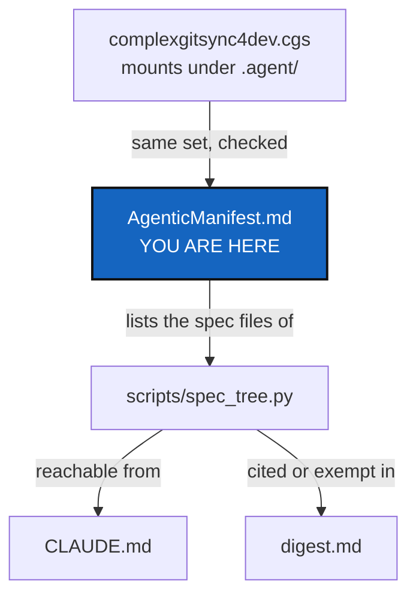

# Agentic manifest — every mount under `.agent/`, and which of its files are specs

*Created: 2026-09-30*

*Fills in: ../../.distant/dev-sync/SpecTree.md*

## Abstract — read this first

**What this document is.** The one written list of the repositories mounted
under `.agent/` by `examples/complexgitsync4dev.cgs`, what each is for, and
which Markdown files in them are specs the spec tree must reach.

**Why it exists.** `scripts/spec_tree.py` used to hold a hand-written list of
spec files, and the list fell behind the mounts. It now reads this file, and
fails when a mount is in the `.cgs` and not here, or here and not in the
`.cgs` (the SpecTreeManifest ticket).

**What you will find.** A table of mounts, then a table of spec files. Each
spec file has a *level*: a shared `pattern`, a local file that `fills in` a
pattern, or a `standalone` local file (the product's own specification, with
no pattern above it). The rule is the two-level rule of
[SpecTree.md](../../.distant/dev-sync/SpecTree.md) §2.

**Who it is for.** An agent looking for where a kind of rule lives; the
script that checks the spec tree.

**What you need to do with it.** Read the *role* column to find the right
mount. When a mount is added to or removed from the `.cgs`, or a spec file
is added to a mount, change this file in the same change.

---

## Mounts

*Side* is `local` (this project's own, writable) or `distant` (shared by every
project that conforms to `DevSpec`, read-only here). The project's own
`docs/` and the `.memory` mounted at `.cgitsync` are not agentic mounts and
are not listed. Who may write which mount is `AGENT.md`'s subject, not this
file's.

**`.agent/` is a plain directory and never itself a mounted repository**
(`ProjectSpecSplit` WP2 tried it and it broke). `propagate_privacy` caps a
nested repository's writability at its parent's, and there is no parent that
is both writable and distant, so a local child under a shared parent would
either force the parent writable (putting it on a branch its own remote does
not have) or be capped read-only. Every repository below is therefore declared
directly in the developer `.cgs`, nests inside `.agent/` purely through its own
`relative_path`, and answers only to its own `private`/`writable` flags.

| mount | repository | side | role |
|---|---|---|---|
| `.agent/.distant/ticket` | `github:flipoyo/.ticketing` | distant | How a planning ticket is named, ranked, moved and closed, and the loop that turns a short ticket into plans. |
| `.agent/.distant/dev-sync` | `github:flipoyo/DevSpec` | distant | The development philosophy, the agent conduct rules (checklist shape, commit message, attribution), how a project numbers its releases, the spec-tree rule, and the generic agent-role template. |
| `.agent/.distant/documentation` | `github:flipoyo/DocSpec` | distant | How any Markdown document in the project is written. |
| `.agent/.local/.dev` | `github:flipoyo/.dev` | local | How this project's work gets done: the before-committing checklist with this project's commands, its versioning and release script, and the planning surface (`DevTickets/`). |
| `.agent/.local/.localSpec` | `github:flipoyo/.localSpec` | local | The deeper specs: architecture, agent roles, audit findings, the digest and this manifest. |
| `.agent/.local/.claude` | `github:flipoyo/.claude` | local | What an agent is handed at session start: `CLAUDE.md` and the reading order. |

## Spec files

*Level* is `pattern` (shared, states a rule once), `standalone` (the
product's own specification, no pattern above it), or `fills in` followed by
a link to the pattern it fills in. A file that fills in a pattern carries a
`*Fills in: <path>*` line naming the same file, and `scripts/spec_tree.py
--check` fails when the two disagree.

*Digest* is `cited` when a line of `digest.md` cites the file, or
`exempt: <reason>` when it states no rule of its own. The spec tree reaches
every file below from `CLAUDE.md`, and a file listed here that does not
exist is a failure.

| file | mount | level | digest |
|---|---|---|---|
| [CLAUDE.md](../.claude/CLAUDE.md) | `.agent/.local/.claude` | fills in [SpecTree.md](../../.distant/dev-sync/SpecTree.md) | cited |
| [AGENT.md](../.claude/AGENT.md) | `.agent/.local/.claude` | standalone | exempt: a pointer stating the reading order; carries no rules of its own |
| [AdditionalSpecs.md](AdditionalSpecs.md) | `.agent/.local/.localSpec` | standalone | cited |
| [audit.md](audit.md) | `.agent/.local/.localSpec` | standalone | exempt: findings and open risks, not rules |
| [AGENT.md](AGENT.md) | `.agent/.local/.localSpec` | fills in [AGENT.md](../../.distant/dev-sync/AGENT.md) | exempt: the roster of agent roles; the handoff rules are cited from dev-sync/AGENT.md |
| [digest.md](digest.md) | `.agent/.local/.localSpec` | standalone | exempt: the digest itself |
| [AgenticManifest.md](AgenticManifest.md) | `.agent/.local/.localSpec` | fills in [SpecTree.md](../../.distant/dev-sync/SpecTree.md) | cited |
| [README.md](../.dev/README.md) | `.agent/.local/.dev` | standalone | exempt: a pointer to the mount's documents; carries no rules |
| [cgitsync-dev.md](../.dev/cgitsync-dev.md) | `.agent/.local/.dev` | fills in [AgentConduct.md](../../.distant/dev-sync/AgentConduct.md) | cited |
| [Versioning.md](../.dev/Versioning.md) | `.agent/.local/.dev` | fills in [Versioning.md](../../.distant/dev-sync/Versioning.md) | exempt: this project's choices; the binding rules are cited from the pattern |
| [README.md](../.dev/DevTickets/README.md) | `.agent/.local/.dev` | fills in [TICKETLIFECYCLE.md](../../.distant/ticket/TICKETLIFECYCLE.md) | exempt: where tickets sit and this project's branches; the rules are cited from TICKETLIFECYCLE.md |
| [AgentConduct.md](../../.distant/dev-sync/AgentConduct.md) | `.agent/.distant/dev-sync` | pattern | cited |
| [AgentDataContract.md](../../.distant/dev-sync/AgentDataContract.md) | `.agent/.distant/dev-sync` | pattern | exempt: states the owner's intent and what a document can and cannot deliver; the binding half is AgentConduct.md §3 |
| [DevSpecs.md](../../.distant/dev-sync/DevSpecs.md) | `.agent/.distant/dev-sync` | pattern | cited |
| [Versioning.md](../../.distant/dev-sync/Versioning.md) | `.agent/.distant/dev-sync` | pattern | cited |
| [SpecTree.md](../../.distant/dev-sync/SpecTree.md) | `.agent/.distant/dev-sync` | pattern | cited |
| [AGENT.md](../../.distant/dev-sync/AGENT.md) | `.agent/.distant/dev-sync` | pattern | cited |
| [anthropic.md](../../.distant/dev-sync/legalTerms/anthropic.md) | `.agent/.distant/dev-sync` | pattern | exempt: a provider-terms assessment, not a rule set |
| [DOCSTYLE.md](../../.distant/documentation/DOCSTYLE.md) | `.agent/.distant/documentation` | pattern | cited |
| [TICKETLIFECYCLE.md](../../.distant/ticket/TICKETLIFECYCLE.md) | `.agent/.distant/ticket` | pattern | cited |
