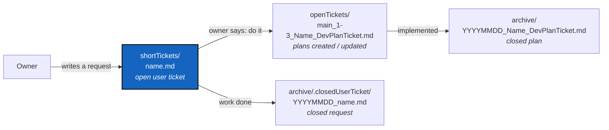

# DevTickets — how work is asked for, planned, and closed

*Created: 2026-09-13*

## Abstract — read this first

**The one-line version.** The owner writes a short ticket saying what they
want; on the owner's word the agent turns it into changes across every open
planning ticket; the short ticket is then stamped and filed under
`archive/.closedUserTicket/`, and the plans it changed carry the work from
there.

**What this document is.** The rationale and the working rules for
`.localSpec/DevTickets/` — the whole planning surface of ComplexGitSync:
what each directory holds, who writes into it, and how a request becomes a
plan and then a closed record.

**Why it exists.** Two reasons. First, the loop above is not obvious from
the directory names: a reader who finds `shortTickets/` next to
`openTickets/` cannot tell which one they are supposed to write in.
Second, this whole tree used to sit in the public `ComplexGitSync`
repository as `AgentSpec/`, so anyone installing the tool also got the
workshop — sixty-odd internal plans, half of them about work that was
abandoned. The product is public; how the product is developed is private.
That is the same separation the tool itself draws between a project
repository and the private repositories that configure it.

**What you will find.** §1 the four directories. §2 the orchestration loop
and who does what in it. §3 how a short ticket is closed. §4 the naming
rules — branch, priority and rank — and where they are defined. §5 what
does *not* belong here.

**Who it is for.** The owner, who writes short tickets, and the agent, who
turns them into plans. Nobody using `cgitsync` ever needs this directory —
that is why it is private.

**What you need to do with it.** Writing a request: put it in
`shortTickets/` (§2.1). Acting on one: §2.2, then close it (§3). Opening or
finishing a plan: [TICKETLIFECYCLE.md](../../.agentSpec/TICKETLIFECYCLE.md)
is authoritative; §4 here only says which conventions this project uses.



---

## 1. The four directories

| Directory | Holds | Written by |
|---|---|---|
| `shortTickets/` | Open requests, in the owner's own words. A few lines is a normal size. | The owner |
| `openTickets/` | Planning tickets: the analysed, ranked work. `<branch>_<priority>-<rank>_<Name>_DevPlanTicket.md` | The agent, on the owner's word |
| `archive/` | Planning tickets whose work has landed, or that were dropped. `YYYYMMDD_<Name>_DevPlanTicket.md` | The agent, in the commit that finishes the work |
| `archive/.closedUserTicket/` | Short tickets that have been acted on. `YYYYMMDD_<name>.md` | The agent, when the request is satisfied |

`DevTickets/` holds nothing else. Specifications are not tickets and live
elsewhere (§5).

## 2. The orchestration loop

### 2.1 The owner emits a short ticket

A short ticket says what the owner wants, in whatever words come naturally.
It is not analysed, not ranked, not formatted, and not obliged to be
consistent with anything already planned — working out what it collides
with is the next step's job, not the owner's.

It goes in `shortTickets/` under a plain descriptive name
(`memoryDev.md`, `memorySpecs.md`). No priority prefix: a short ticket has
no rank, because it is a request rather than a queued piece of work.

A request the owner makes in conversation is the same thing and is filed
the same way, so that the record of what was asked for does not live only
in a chat log.

### 2.2 The agent orchestrates, on the owner's word

Nothing happens to a short ticket until the owner asks for it. When they
do, the agent's job is not to implement the request in code — it is to
**make every open ticket agree with it**:

- read every ticket in `openTickets/`, not only the obviously related ones;
- create, split, re-rank, rename, or retire tickets as the request implies;
- carry the request into the specifications it changes
  (`.localSpec/AdditionalSpecs.md`, `.claude/CLAUDE.md`,
  `.agentSpec/TICKETLIFECYCLE.md`, `docs/`), because a rule that lives only
  in a ticket is a rule nobody will find;
- repair every cross-reference the changes break.

The point of doing it in one pass is consistency. A request answered in one
ticket and forgotten in six others leaves the pile saying different things
in different files, and the next reader has no way to tell which one is
current.

### 2.3 The plans carry the work

Implementation happens against `openTickets/`, one ticket at a time, under
the rules in [TICKETLIFECYCLE.md](../../.agentSpec/TICKETLIFECYCLE.md). By
then the short ticket has done its job.

## 3. Closing a short ticket

When the orchestration pass is done — the plans say what the request asked
for — the short ticket is closed:

```bash
git mv .localSpec/DevTickets/shortTickets/<name>.md \
       .localSpec/DevTickets/archive/.closedUserTicket/<YYYYMMDD>_<name>.md
```

**Same rules as a planning ticket.** `YYYYMMDD` is the date the request was
satisfied, not the date it was written. It happens in the same change that
satisfies the request, not as a later tidy-up. The file is never edited
afterwards: it is the record of what was asked for, in the words it was
asked in, and rewriting it to match what was built would destroy the only
independent account of the two.

A request that is refused or dropped is closed the same way. The stamp
records when it stopped being live, and the plans — or the answer given at
the time — say why.

## 4. Naming: branch, priority, rank

[TICKETLIFECYCLE.md](../../.agentSpec/TICKETLIFECYCLE.md) defines these and
is authoritative; this is the short version, with what is specific to
ComplexGitSync.

- **Branch prefix.** The filename opens with the branch the work lands
  on — `main_` for everything except the memory workstream, which is
  `memory-dev_`. It is always written out, `main` included. See *Branches
  and ticket topics* in [AdditionalSpecs.md](../AdditionalSpecs.md) for
  which branches this project has.
- **Priority and rank.** `1` is prioritary, `2` is stand-by; the rank is
  the position inside that pile, compacted at each Ticket review.
- **Branch line.** Every planning ticket also states its branch under its
  `*Created:*` line: `*Branch: main*`, or `*Branch: memory-dev*` for
  memory work. It says the same thing the filename does, and the two must
  agree.
- **Referring to a ticket** in prose: use its short name (`VerifyHonesty`),
  never its ranked filename — ranks move, and nothing tells you when a
  written-out rank goes stale.

## 5. What does not belong here

Specifications and living documents are not tickets. A ticket describes
work to be done and stops being true once it is done; a specification
describes how things are and is kept true.

| Belongs in | Not in `DevTickets/` |
|---|---|
| `.localSpec/AdditionalSpecs.md` | Architecture, rings, formats, branch policy |
| `.localSpec/audit.md` | Findings, legacy references, open risks |
| `.localSpec/AGENT.md` | The agent roles and how they hand off |
| `.agentSpec/` | The project-agnostic rules: `TICKETLIFECYCLE.md`, `DevSpec/` |
| `docs/DevGuide/` | How the code is put together, for contributors |
| The public repository | Anything a user of `cgitsync` needs |
