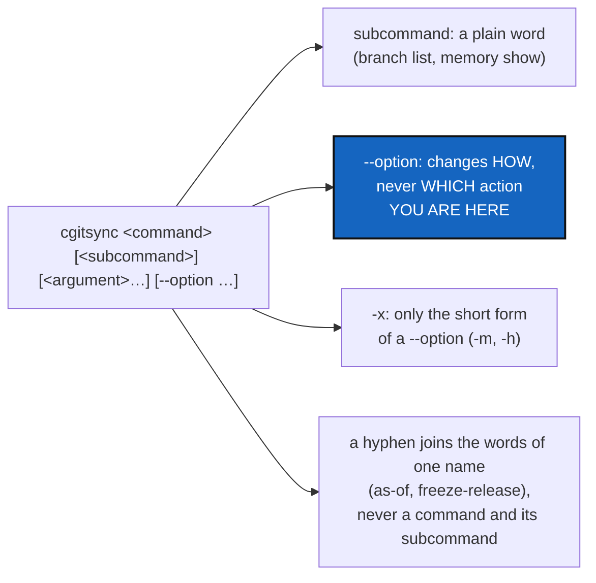

# CliGrammar — one grammar for every command: subcommands are plain words, `--` is only an option

*Created: 2026-10-02*

*Branch: main*

> **Implemented — 2026-10-02, archived.** Released as **4.1.0**, a minor
> release by the owner's ruling, since 4.0.0 had just opened. The owner did not
> answer §4, so its recommendations were taken as the rulings: the §3 mapping
> exactly, `branch create`, `verify check`/`repair`, `--all` kept, and a hint
> instead of an alias. The grammar is in `DevSpecs.md` *CLI Grammar* (a shared
> mount; pushing it is the owner's call), and this project's table is in
> `AdditionalSpecs.md`. `tests/unit/test_cli_grammar.py` checks rules 1, 3, 4
> and 5 on the real parser. An old spelling prints its new form, and a bare
> group lists its subcommands. An independent orchestrator scored the work
> 87/100 after fixing missing hints, stale messages, the unswept README and
> specs, and a hyphen check that missed `close-branch`.

> **From the owner's short ticket `archive/.closedUserTicket/20261002_homogenize-cmd.md`.**
> "The usage of cgitsync cmd subcmd options is not clear. Look for instance
> at `cgitsync memory subcmd` and `cgitsync branch --subcmd`. The status of
> `--` should be either subcmd or option but not both. [...] `-h` is for
> option shortcuts of `--option`, so subcmd should remain plain without `--`.
> In the same vein there are cmd-subcmd cgitsync commands, they must follow
> the same convention. This must be CLI specs in DevSpec, then src/* should be
> refactored."

## Abstract — read this first

**The one-line version.** Write one grammar into `DevSpecs.md`:
`<tool> <command> [<subcommand>] [<argument>…] [--option …]`. A subcommand
is always a plain word, a `--name` is always an option, and a `-x` is always
the short form of a `--name`. Then make `cgitsync` obey it.

**What this document is.** The grammar, the current commands that break it
(measured from the parser itself), the mapping from each to its new form,
the decisions for the owner, and the work packages.

**Why it exists.** Today `cgitsync memory show` uses a subcommand and
`cgitsync branch --list` uses an option for the same kind of choice, and
`close-branch` is a command glued to the name of another command. A user
cannot tell, from one command, how the next one is spelled. A rule
written once, and checked by a test, settles that for every command to come.

**What you will find.** §1 the grammar. §2 what breaks it today. §3 the
mapping. §4 the decisions for the owner. §5 the work packages. §6
acceptance.

**Who it is for.** The owner, for §4; the worker and orchestrator, for §5.

**What you need to do with it.** Owner: answer §4. Worker: WP1 (the specs)
can start once §4.1 is answered.

---

## 1. The grammar (to be written into `DevSpecs.md`, for every tool that adopts it)

1. **Shape.** `<tool> <command> [<subcommand>] [<argument>…] [--option[ <value>] …]`.
2. **A subcommand is a plain word.** It never starts with `-`. It names
   *which* action runs: `branch list`, `memory show`.
3. **An option starts with `--` and changes *how* an action runs, never
   *which* action.** Scope (`--private`), output (`--json`), preview
   (`--dry-run`), safety (`--force`) and inputs (`--gts FILE`) are options.
   **The test:** if the flag changes what the command does, so that the
   result is a different kind of thing (creating instead of listing, writing
   instead of reporting), it is a subcommand.
4. **`-x` is only the short form of a `--option`**, like `-m` for
   `--message` and `-h` for `--help`. No option exists in short form alone.
5. **A hyphen joins the words of one name** (`as-of`, `freeze-release`,
   `self-history`). It never glues a command to its subcommand or option:
   if `<a>` is itself a command, `<a>-<b>` is spelled `<a> <b>` or
   `<a> --<b>`.
6. **A command either has subcommands or acts itself, never both.** A
   command with subcommands takes no argument of its own, and run bare it
   prints its subcommands.
7. **One option name means one thing** across the tool.

## 2. What breaks it today (from the parser, 3.14.11 → 4.0.0)

| Today | Rule broken | Why |
|---|---|---|
| `branch --list [--per-repo]` | 2, 3, 6 | `--list` selects a different action from `branch <name>` (create) |
| `close-branch <b>` | 5 | `branch` is a command; this is its "close" action |
| `pull-force` | 5 | `pull` is a command; this is `pull`, forced |
| `verify --repair` | 3 | Reporting and repairing are different kinds of result |
| `import-submodules [--apply]` | 3, 5 | `--apply` turns a report into a conversion. The submodule commands are one subject spelled in two forms (`import-submodules`, `init-from-submodules`) |
| `env` and `env check` | 6 | `env` acts by itself and also has a subcommand |
| `memory self-history` and `self-history add/adopt` | 5, and one noun with two homes | Reading records lives under `memory`, writing them under `self-history` |
| `--all` (scope on `add`/`commit`/`merge`/`push`; "every command" on `help`) | 7 | One name, two meanings |

Conforming already: `memory …`, `repo create`, `self-history add/adopt`,
`-m/--message`, `-h/--help`, and every other option. The names
`freeze-release`, `view-tree`, `as-of` and `self-history` are single names
whose words are joined by a hyphen (rule 5), because neither half of any
of them is a command of its own.

## 3. The mapping (recommended; §4 asks the owner)

| Today | New | Note |
|---|---|---|
| `branch <name>` | `branch create <name>` | Rule 6: `branch` becomes a group |
| `branch --list [--per-repo]` | `branch list [--per-repo]` | `--per-repo` stays an option: it changes how the list is shown |
| `close-branch <b>` | `branch close <b>` | |
| *(BranchAncestors, planned)* `branch --delete <b>` | `branch delete <b>` | BranchAncestors' ruling 2 is respelled, not changed |
| `pull-force` | `pull --force` | The same action, forced: an option (rule 3) |
| `verify [--repair]` | `verify check`, `verify repair` | Rule 6 then makes `verify` a group |
| `import-submodules [--apply] [--recursive]`, `init-from-submodules …` | `submodules report`, `submodules import [--recursive]`, `submodules init …` | One group for the subject. Every option of `init-from-submodules`, `--force` included, moves unchanged to `submodules init` |
| `env`, `env check` | `env show`, `env check` | |
| `memory self-history`, `self-history add`, `self-history adopt` | `self-history list`, `self-history add`, `self-history adopt` | One noun, one home |
| `help --all` | `help --all` (unchanged) | `--all` on `help` is renamed only if the owner rules so (§4.5) |

Unchanged: every other command and option. The Python client keeps its
method names (`close_branch`, `pull_force`, …): `src/` is not a public
interface (README *What is stable*), and the CLI/client mirror test maps
each new spelling to the method it already calls.

**Old spellings are not kept as aliases.** A user who types one gets the
typo hint `cli/suggest.py` already gives, extended to name the new form,
for example "`close-branch` is now `branch close`". The hint runs nothing.

## 4. Decisions for the owner

1. **Where the grammar lives:** in `DevSpecs.md` (shared), as the short
   ticket says, with this project's mapping in `AdditionalSpecs.md`
   (recommended). `DevSpecs.md` is a shared, read-only mount, so pushing it
   reaches every project that mounts it, which is the owner's call, as it
   was for TICKETLIFECYCLE.
2. **The mapping of §3**, row by row: agree, or keep any of today's
   spellings.
3. **`branch <name>` → `branch create <name>`** (recommended, rule 6), or
   keep `branch <name>` as Git does, which needs an exception written into
   rule 6.
4. **`verify`** as a group (`verify check`, `verify repair`, recommended), or
   keep `verify` bare and ruled an exception to rule 3.
5. **`--all`**: keep both meanings, ruled as one ("everything this command
   can cover"), or rename `help --all` (recommended: keep both, the
   meanings never meet on one command).
6. **Old spellings:** a hint only (recommended, the same choice GitLikeCli
   made), or hidden aliases for one major version.

## 5. Work packages

| WP | What | Done when |
|---|---|---|
| **WP1** | **The specs.** The grammar of §1 goes into `DevSpecs.md` (a *CLI grammar* section) and this project's mapping into `AdditionalSpecs.md`. Add one digest line per rule, and a line in `CLAUDE.md` *The CLI mirrors the Python API* saying a new command follows the grammar. | `check-spectree` and the digest check pass |
| **WP2** | **A grammar test** over the real parser that fails when: a subcommand starts with `-`; a single-dash option has no long form; a top-level name is `<a>-<b>` where `<a>` is another top-level command; a command has both subcommands and an argument of its own. (Rule 3 cannot be checked by a test, which is why it is written down.) | It fails on today's parser and passes after WP3 |
| **WP3** | **The refactor** of §3 as ruled: the parsers in `cli/` (`expert.py`, `branch_command.py`, `minimalist.py`, `environment.py`, the submodule commands), `help_text.py` keys and examples, the help grouping, `cli/suggest.py`'s hint for each old spelling, and the tests. Commands that `autofix` and the run log recognise by name (log files are named after the command, and `autofix` reads which command failed) learn the new names. Ledger entries already written keep the names they were recorded with. | WP2 passes; every test passes |
| **WP4** | **Docs**: the README command table and the `--private` list, `docs/Text/user_guide.tex`, `api_python.tex`, the tutorials, and `CHANGELOG.md` (one line per respelled command: old form → new form). Coordinate with BranchAncestors, whose delete becomes `branch delete`. | `git grep` finds no old spelling outside history, the changelog and the hint table |
| **WP5** | **Release.** `bump-build`, then `bump-version` at the level the orchestrator judges (renamed commands change the CLI contract). Rebuild the five PDFs. | Versions agree everywhere |

**Order with BranchAncestors.** BranchAncestors' WP5 adds the delete
command, so this ticket's WP1 to WP3 should land first, letting that
command be born as `branch delete`.

## 6. Acceptance

- The grammar is in `DevSpecs.md`, the mapping in `AdditionalSpecs.md`, and
  the rules in the digest.
- WP2's test passes on the real parser and fails on a planted violation of
  each checkable rule.
- Every respelled command does what it did before, with the same options:
  the existing tests of each one pass under the new spelling, and `discover`,
  `init-from-submodules` (now `submodules init`) and `freeze-release` keep
  every option.
- Typing an old spelling prints the new one and runs nothing.
- `pixi run lint`, `pixi run test`, `pixi run check-ceilings` and
  `pixi run check-spectree` pass, and `cgitsync status` shows `errors=0`.
