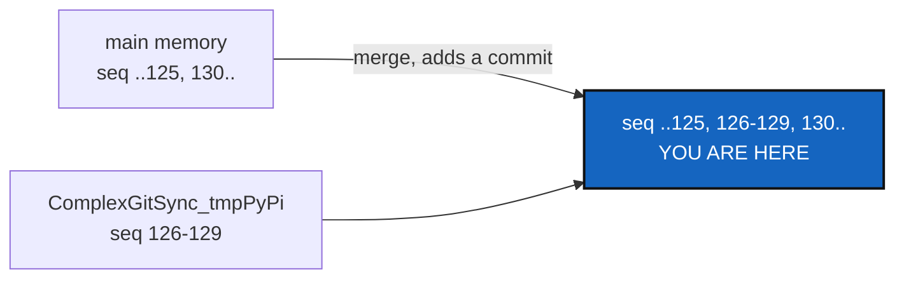

# MemoryForkRepair — `main`'s memory verifies again, without a commit rewritten

*Created: 2026-10-02*

*Branch: main*

> **Implemented — 2026-10-02, archived, narrowed by the owner's reboot.**
> The corrupt chain is gone from the live memory (`memory reboot`), and
> `cgitsync verify` reports `verified` with no findings. What this ticket did
> with what was left, measured by content against the live branch and the
> `archived-20261002` branch:
> - **Agent-work records, kept.** Two records existed only on
>   `.self-history`'s `tmpPyPi` and `tmpAutoFix` branches. Each branch added
>   exactly that one file, so both were merged into the live `ComplexGitSync`
>   branch, locally, as two merge commits. No sha changed; the old tip is an
>   ancestor. Pushing is the owner's call.
> - **Ledger entries, left where they are.** Entries 126 to 129 exist only on
>   `.memory`'s `ComplexGitSync_tmpPyPi`, entries 145 to 149 (a different
>   chain from the archived 145 to 149) only on `closed/ComplexGitSync_tmpAutoFix`,
>   and entries 1 to 4 of an earlier chapter only on
>   `closed/ComplexGitSync_tmp-main-1-2_DiscoverRoundTrip`. They belong to
>   closed chapters, and closing a branch keeps them reachable.
>   **Tested in a throwaway clone, not applied:** merging `tmpPyPi` into the
>   archived branch adds 126 to 129 and the chain then verifies with all 168
>   entries; it conflicts only on the `lgr/HEAD` cache and one state file. Left
>   alone, because the live chain is clean and healing a closed chapter adds
>   nothing a reader needs. **`tmpPyPi` must be closed, not deleted**, or 126 to
>   129 would be the only copy lost (TmpBranchClosure WP3).
> - No code changed, so no version bump.

> **Premise changed — 2026-10-02.** The owner ran `cgitsync memory reboot`, and `cgitsync verify` now reports `verified` with no findings. The corrupt chain this ticket repairs is gone from the live branch; the old one is kept as the archived branch. What remains is whether entries 126 to 129, recorded on `tmpPyPi`, still need bringing across, and the agent-work records that exist only on the `tmp` branches. The owner decides whether to narrow the ticket to that or archive it.

> **Ticket review — 2026-10-02, after RuleConformity.** Renumbered `main_1-4` → `main_1-3`: [RuleConformity](../archive/20261002_RuleConformity_DevPlanTicket.md) was implemented and archived, so the priority-1 ranks were compacted.

> **Ticket review — 2026-10-02.** Renumbered `main_1-3` → `main_1-4`: RuleConformity found rule breakages in 3.14.2 and takes `main_1-1`, per the owner's instruction.

> **From TmpBranchClosure** (WP1), the CorrTicket closing the `tmp`
> branches. It must land before any `.memory` branch is renamed.

## Abstract — read this first

**The one-line version.** `cgitsync verify` reports this project's memory
as `corrupt`, because entries 126–129 were recorded on the `tmpPyPi`
branch and never reached `main`. Bring them back by a merge, so the chain
holds again.

**What this document is.** The plan for one repair, and the rule it must
keep.

**Who it is for.** The worker and the orchestrator.

**What you need to do with it.** Diagnose (§1), repair (§2), check against
§3.

---

## 1. Diagnosis (2026-10-02)

`cgitsync verify`: `status=corrupt`, 33 findings (31 when first counted; two entries were recorded since). The first two: `seq=130
SEQ_GAP missing 4 seq(s) between 125 and 130`, and `seq=130 BROKEN_LINK`.
Every later finding is "chain already broken upstream". `.memory`'s
`ComplexGitSync_tmpPyPi` holds one commit `main` lacks: "129 state(s), 129
ledger entr(ies)", 2026-10-01. Confirm first that entries 126–129 are
exactly what that commit adds, and that 130's `prev` hash is 129's.

## 2. Repair

- Merge `.memory`'s `ComplexGitSync_tmpPyPi` into its `ComplexGitSync`,
  the shape `autofix`'s `DivergentUserRepair` already handles for a
  chain-shaped repository: both sides' new entries, verified before the
  merge commit is made. If the existing repair recognises the situation,
  use it rather than a hand merge.
- The same for `.self-history`'s `ComplexGitSync_tmpPyPi` and
  `ComplexGitSync_tmpAutoFix` records, and `.memory`'s
  `ComplexGitSync_tmpAutoFix` and `ComplexGitSync_tmp-main-1-2_DiscoverRoundTrip`
  commits, if they hold entries or records `main` lacks. An agent-work
  record must not be lost.
- **Rewrites nothing**: no rebase, no amend, no reset, no force-push
  (`AdditionalSpecs.md`, *The hard prohibitions*). If the chain cannot be
  made to verify by adding commits alone, stop and report to the owner.
- `.memory` is private. Pushing it is the owner's call.

## 3. Acceptance

- `cgitsync verify` passes on this tree.
- No commit in `.memory` or `.self-history` changed sha; the repair added
  merge commits only.
- `pixi run lint` and `pixi run test` pass, and `cgitsync status` shows
  `errors=0`. If code changed, `bump-build`, then `bump-version patch` at
  least.
