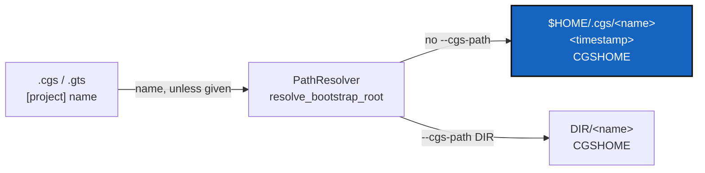

# BootstrapLanding — a bootstrapped project lands on a directory named after it

*Created: 2026-10-07*

*Branch: main*

> **Implemented — 2026-10-07, archived.** WP1–WP6 landed in `cgitsync4.3.0`; the follow-up `cgitsync4.3.1` refuses a name that is not one directory segment with a `ConfigValidationError` (one line, exit 2) instead of a traceback. The owner approved the ceiling raise (+22 `paths.py`, +7 `orchestre/installer.py`, +1 `orchestre/client.py`). Quoted by an independent orchestrator at 93/100 (4.3.0) and 98/100 (4.3.1). **Left open for the owner:** `_handle_bootstrap` reads the source before the run logger starts, so an unreadable source leaves no run log for `autofix`; `initialise` has the same shape.

> Opened from the owner's short ticket `bootstrap-landing.md` (2026-10-07):
> *"bootstrap lands on .cgs/CGS<TimeStamp>/given-name. This is not
> convenient. A project should automatically land on
> .cgs/<project-name><TimeStamp>, with <project-name> corresponding to the
> one given in .cgs or .gts"*. The owner asked for it to be implemented in
> the same request, so the decisions in §4 were taken by the agent from the
> request's own words and are recorded here for the owner to overturn.

## Abstract — read this first

**The one-line version.** `cgitsync bootstrap x.cgs` lands on
`$HOME/.cgs/<project-name><timestamp>`, where the project name is the one
the `.cgs` or `.gts` declares, and the name argument becomes optional.

**What this document is.** What happens today (§1), what changes (§2),
work packages (§3), decisions (§4), acceptance (§5).

**Why it exists.** Today the user must type a name the file already
holds, and the workspace sits two levels down under a directory whose name
says nothing (`CGS20261007104123`). With several workspaces side by side in
`~/.cgs`, the user cannot tell which is which without opening each one.

**Who it is for.** Whoever implements it, and the owner for §4.

**What you need to do with it.** §2, then §3.

---

## 1. What happens today

`cgitsync bootstrap <source> <project_name> [--cgs-path DIR]`.
`project_name` is a required positional argument and the last segment of
CGSHOME. Without `--cgs-path`, `PathResolver.resolve_bootstrap_root`
creates `$HOME/.cgs/CGS<YYYYmmddHHMMSS>/` and CGSHOME is
`$HOME/.cgs/CGS<timestamp>/<project_name>`. The `.cgs`/`.gts` document's own
`[project] name` is ignored.

## 2. What changes

- Without `--cgs-path`, CGSHOME is `$HOME/.cgs/<name><YYYYmmddHHMMSS>` —
  one level, no `CGS` prefix.
- `<name>` is the document's `[project] name` — from a `.cgs` or a `.gts` —
  or the source file's stem when the document declares none. That is the
  rule `initialise` already uses. `PathResolver.resolve_source_project_name`
  states it for a source file; `bootstrap` calls it, and so does
  `initialise` for a `.gts` (for a `.cgs`, `initialise` takes the name from
  the document it has already parsed).
- The positional `project_name` becomes optional. Given, it replaces the
  document's name — so `bootstrap x.cgs Foo` lands on `$HOME/.cgs/Foo<ts>`.
- `--cgs-path DIR` keeps its meaning: CGSHOME is `DIR/<name>`, with no
  timestamp. The caller named the place, so nothing is added to it.
- A name that is not a single path segment (`a/b`, `..`) is refused before
  anything is created, now that the name can come from a file rather than
  from what the user typed. It is a `ConfigValidationError`, so the CLI
  prints one line and exits 2.
- `Settings.other_workspaces` lists workspaces one level under the root as
  well as two, so the "other workspaces" hint still shows bootstrapped
  ones. The default workspace (`CGS<timestamp>/cgitsync`) is not changed.

## 3. Work packages

| WP | Files | Change |
|---|---|---|
| **WP1** | `paths.py` | `resolve_source_project_name(source)`; `resolve_bootstrap_root` defaults to `$HOME/.cgs/<name><ts>` and checks the name is one segment; `resolve_initialise_cgshome` calls the shared name rule for a `.gts`. |
| **WP2** | `orchestre/installer.py`, `orchestre/client.py` | `bootstrap(source, project_name=None, ...)`; `resolve_bootstrap_root(project_name=None, *, source=None, cgs_path=None)` — backward compatible, reads the name from *source* when none is given. The "run `cgitsync bootstrap <spec> <name>`" hints lose the name. |
| **WP3** | `cli/minimalist.py`, `cli/help_text.py`, `status_render.py` | `project_name` positional becomes `nargs="?"`; help and hints show the short form. |
| **WP4** | `settings.py` | `other_workspaces` also globs `*/.cgitsync`. |
| **WP5** | tests | `tests/unit/test_paths.py`, `test_registry_client.py`, `test_settings.py`, the CLI fakes in `test_cli_minimalist.py`/`test_cli_smoke.py`; one new test per rule in §2. |
| **WP6** | docs and specs | `docs/Text/user_guide.tex` (`bootstrap`), `docs/Text/getting_started.tex`, `docs/Text/worked_examples.tex`, tutorials 01–03, `README.md`'s install line, `AdditionalSpecs.md` *The install frontier*, `CLAUDE.md` *Bootstrapping a working checkout*, `CHANGELOG.md`. PDFs rebuilt. |

## 4. Decisions

| # | Question | Taken |
|---|---|---|
| **D1** | One level (`.cgs/<name><ts>`) or two (`.cgs/<name><ts>/<name>`)? | **One**, as the request writes it. |
| **D2** | Separator between name and timestamp? | **None**, as the request writes it (`CGSil120261007104123`). A name ending in a digit runs into the timestamp; a `-` would fix that if the owner wants it. |
| **D3** | Keep the positional name? | **Optional**, overriding the document's name, so every existing call still works and a second copy of one project can be named apart. |
| **D4** | What does `--cgs-path` do now? | **Unchanged** (`DIR/<name>`): `main_1-1_ReleaseTags` and the CGSil1 integration test rely on it. |

**Out of scope, noted.** `bootstrap` writes under `$HOME/.cgs` even when
`$CGSPATH` is set, while `Settings.cgs_root` honours it; and the CLI
resolves the root once for its `command_start` log event and `bootstrap`
resolves it again, so with a timestamp the two can differ by a second.
Both predate this ticket.

## 5. Acceptance

- `cgitsync bootstrap examples/CGSil1.cgs` with no name lands on
  `$HOME/.cgs/CGSil1<timestamp>` and the tree is READY.
- A `.gts` source lands on its recorded project name.
- `bootstrap x.cgs Foo` lands on `$HOME/.cgs/Foo<timestamp>`;
  `--cgs-path DIR` still gives `DIR/<name>`.
- `pixi run lint`, `pixi run test` pass; `cgitsync status` shows `errors=0`.
