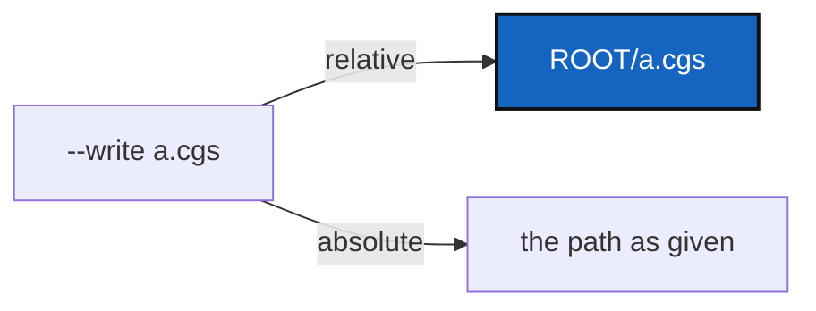

# DiscoverWriteRoot — `discover --write FILE` writes FILE inside ROOT

*Created: 2026-10-07*

*Branch: main*

> **Implemented — 2026-10-07, archived.** WP1–WP4 landed in `cgitsync4.3.3`: a relative `--write` FILE is resolved inside ROOT by `discover_repos` and reported as `DiscoverReport.written_to`, which the CLI prints. The follow-up `cgitsync4.3.4` brought the `discover --write` examples in `getting_started.tex`, `c_cgs.tex` and `api_python.tex` into line and made the run log record the path written. The owner approved the ceiling raise (+3 `orchestre/discovery_commands.py`, +4 `orchestre/reports.py`). Quoted by an independent orchestrator at 96/100 (4.3.3) and 100/100 (4.3.4).

> Opened from the owner's short ticket `discover-write.md` (2026-10-07):
> *"cgitsync discover --write a.cgs root writes a.cgs in ./ when it must
> write it in root"*.

## Abstract — read this first

**The one-line version.** A relative `--write` path is resolved against the
scanned ROOT, not against the directory the command is typed from.

**What this document is.** What happens today (§1), what changes (§2),
work packages (§3), acceptance (§4).

**Why it exists.** The draft describes ROOT and is read back against it;
landing it in the current directory puts it where nobody looks, and the
next `validate` or `initialise` is pointed at the wrong place.

**Who it is for.** Whoever implements it.

**What you need to do with it.** §2, then §3.

---

## 1. What happens today

`cli/configuration.py` passes `--write` through untouched;
`DiscoveryCommands.discover_repos` hands it to `configure`, which resolves
it against the current directory. The CLI then prints
`Path(write).resolve()`, also against the current directory.

## 2. What changes

- `discover_repos(root, output=...)`: a relative *output* is joined to the
  resolved root; an absolute one is used as given. The Python API and the
  CLI behave the same, because the rule lives in the client.
- `DiscoverReport` gains `written_to: Path | None` (additive, defaults to
  `None`), the path actually written, and the CLI prints it rather than
  resolving the argument a second time.
- The `--write` help and the user guide's `discover` section say a relative
  FILE is inside ROOT.

## 3. Work packages

| WP | Files | Change |
|---|---|---|
| **WP1** | `orchestre/discovery_commands.py`, `orchestre/reports.py` | Resolve *output* against root; record `written_to`. |
| **WP2** | `cli/configuration.py` | Print `report.written_to`; help text. |
| **WP3** | tests | A relative `output` lands in root from another working directory, through the client and through the CLI; an absolute one is unchanged. |
| **WP4** | `docs/Text/user_guide.tex`, `CHANGELOG.md` | One sentence each. |

## 4. Acceptance

- `cd /tmp && cgitsync discover ~/work/p --write a.cgs` writes
  `~/work/p/a.cgs` and prints that path.
- `--write /abs/a.cgs` writes `/abs/a.cgs`.
- `pixi run lint`, `pixi run test` pass; `cgitsync status` shows `errors=0`.
