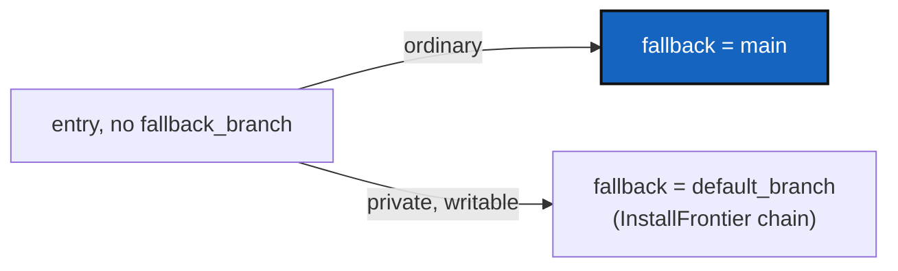

# FallbackMain — an entry that names no fallback falls back to `main`

*Created: 2026-10-07*

*Branch: main*

> **Implemented — 2026-10-07, archived.** WP1–WP3 landed in `cgitsync4.4.0` (MINOR: a documented default changed meaning): `git_branch.apply_declared_defaults` gives an entry with no `fallback_branch` the fallback `main`, a private/local entry its own `default_branch`; `cgs_format` asks that function instead of restating it. Among the shipped specs only `molonari-light.cgs` changes (5 entries, fallback `CGS-MOLO` → `main`); such a tree records its next State under a new name once, since `fallback_branch` is part of a State. The follow-up `cgitsync4.4.1` drew the target and fallback chains separately in the docstring and specs, fixed the wording, added the nested and write-back tests, and un-crammed the code under an owner-approved raise (+3 `cgs_format.py`, +1 `git_branch.py`). Quoted by an independent orchestrator at 96/100 (4.4.0) and 99/100 (4.4.1; one changelog sentence, then corrected before commit).

> Opened from the owner's short ticket `fb.md`: *"When ComplexGitSync
> discovers a leaf on the fly and neither `fallback_branch` nor
> `default_branch` is defined, it currently sets both to `project_branch`.
> Change the default so `fallback_branch` is always `main`. Keep the
> existing behavior for `default_branch` unless explicitly configured
> otherwise."* Scope settled with the owner on 2026-10-07, after reading the
> history (§1): every ordinary entry, root `.cgs` and nested alike;
> private/local entries keep their own chain.

## Abstract — read this first

**The one-line version.** A `.cgs` entry that declares no `fallback_branch`
now falls back to `main`, not to its own `default_branch`, so the target and
the fallback can no longer collapse into one branch.

**What this document is.** History and cause (§1), what changes (§2), work
packages (§3), decisions (§4), acceptance (§5).

**Why it exists.** When the target and the fallback are the same string,
the fallback gives no second chance: a missing branch fails the clone
instead of landing on `main`. Hand-written specs work around it by typing
`fallback_branch = "main"` on nearly every entry.

**Who it is for.** Whoever implements it; the owner for D1.

**What you need to do with it.** §2, then §3.

---

## 1. History and cause

- `fallback_branch` = `default_branch` is the original normalization rule
  (`2db54a7`, 2026-08-19), moved into `git_branch.apply_declared_defaults` by
  MultiBranchSync (`fd44434`, 2026-09-07). It was not added to fix a bug.
- Its failure mode is the owner's `bug-cgs.md` (2026-09-22): `No cloneable
  branch found for ComplexGitSync: expected one of ['lMOLO', 'lMOLO']`, and
  `MOLONARI-API` resolving to `CGS-MOLO`/`CGS-MOLO` in the same log — target
  and fallback read from one field. Both were root-`.cgs` entries, not
  leaves discovered on the fly.
- InstallFrontier (2026-09-30) fixed that report for **private/local**
  entries only: computed branch, then `fallback_branch`, then the remote's
  active branch. Ordinary entries still collapse, wherever they are read.
- `cgs_format._repo_data_from_tree` (writing a tree back to a `.cgs`) holds a
  second copy of the same default, against the rule that `git_branch.py` is
  the only implementation of the chain.

## 2. What changes

- `git_branch.apply_declared_defaults`: `fallback_branch` defaults to
  `DEFAULT_BRANCH` (`main`). An entry declaring `private = true, writable =
  true` keeps the old default, its own `default_branch`, so a configuration
  repository shared by several projects is never sent to another project's
  `main`.
- `cgs_format._repo_data_from_tree` calls that function instead of
  restating the chain.
- `default_branch` is unchanged everywhere. A declared `fallback_branch` is
  unchanged everywhere.

## 3. Work packages

| WP | Files | Change |
|---|---|---|
| **WP1** | `git_branch.py`, `cgs_format.py` | §2. |
| **WP2** | tests | Root and nested entries without a fallback get `main`; a private/local one gets its `default_branch`; a declared fallback wins; the round trip through `to_cgs` agrees. Existing tests that assumed fallback = default are updated. |
| **WP3** | `AdditionalSpecs.md`, `CLAUDE.md`, `docs/Text/user_guide.tex`, `CHANGELOG.md` | The chain as documented: `fallback_branch` → `main`. |

## 4. Decisions

| # | Question | Taken |
|---|---|---|
| **D1** | Only when *neither* field is declared, or whenever `fallback_branch` is not? | **Whenever it is not declared** — the ticket says "always `main`", and `molonari-light.cgs`'s entries declare `default_branch = "CGS-MOLO"` with no fallback, the exact shape of the 2026-09-22 bug. |
| **D2** | Which entries? | Every ordinary entry (owner, 2026-10-07); private/local keep theirs. |

**Known limit.** Normalization sees only what an entry declares. A repository
that is private/local only because a parent's privacy propagates to it
(`git_tree.propagate_privacy`) gets `main` as its fallback, after its
computed branch.

## 5. Acceptance

- `project.default_branch = "lMOLO"`, an entry with no branch fields:
  target `lMOLO`, fallback `main`.
- The same entry in a nested `.cgs`: the same.
- `private = true, writable = true` with no fallback: fallback = its
  `default_branch`.
- `pixi run lint`, `pixi run test` pass; `cgitsync status` shows `errors=0`.
