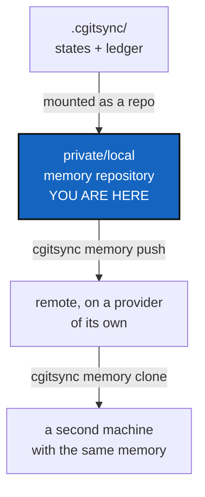

# MemoryRepoLocal — a project's memory survives its machine

*Created: 2026-09-12*

*Branch: memory-dev*

> **Milestone M5** of [MemoryArchitecture](memory-dev_1-1_MemoryArchitecture_DevPlanTicket.md).
> Carries §4 of `.localSpec/DevTickets/archive/20260912_StateMemory_DevPlanTicket.md`,
> which designed `.cgitsync/` as a repository and set the gates it has to
> pass first.

## Abstract — read this first

**The one-line version.** `.cgitsync/` becomes a private/local repository,
mounted like any other, so a project's states and ledger are committed,
pushed, and still there when the disk is not.

**What this document is.** The milestone that makes a memory portable in
practice rather than in principle. It is the first one that touches a
network, and the first that can leak something.

**Why it exists.** Everything before this makes the memory correct, single
and verifiable — on one machine. This is the point of the exercise: a
laptop that dies takes a project's whole synchronisation history with it,
and a second machine that clones the same tree starts with no memory at
all.

**What you will find.** §1 why `.cgitsync/` is ignored today and what that
decision actually was. §2 the gates, which are the real content of this
ticket. §3 what graduation changes. §4 the work. §5 acceptance.

**Who it is for.** Whoever takes M5, after
[MemoryModule](../archive/20260916_MemoryModule_DevPlanTicket.md). The owner signs off §2
before anything is pushed.

**What you need to do with it.** Check every gate in §2 honestly. A gate
you argue around is a leak you ship.



---

## 1. Why it is ignored today, and what that decision was

`.gitignore` excludes `.cgitsync/` and the root `<name>.lgr`, written into
every tree root by `sync_gitignore`. That came from
`archive/20260903_CgitsyncGitignoreLeak_DevPlanTicket.md`, which
reproduced a real leak: running a tutorial against a real project committed
`.cgitsync/state(366ca0a3…)_0/…` into that project as ordinary content.

That fix was never "the memory must not be versioned". It was "the memory
must not be committed **into the project repository, as untyped project
content**". Those are different statements and only the second was ever
true. While the format was churning, ignoring it was right — a store whose
schema changes weekly is scratch, and scratch does not belong in a
project's history.

M2 and M3 are what end the churn. Once a State's name is a checksum of its
content and the ledger is a verifiable chain, the memory stops being
scratch and starts being evidence.

## 2. The gates

Graduation is not a date, it is a checklist. Every item is objectively
checkable, and all of them hold before §3 begins:

| # | Gate | How it is checked |
|---|---|---|
| G1 | State names are content-derived | M2 landed; `grep` finds no `new_time_l0_anchor` in the state-naming path |
| G2 | Cross-machine determinism | The same tree, cloned twice, yields the same State name — an integration test on two runner images |
| G3 | The chain is real | `verify` reports a non-empty chain on a workspace with history, and reports a bad entry hash when one byte is flipped |
| G4 | Store-level integrity | M3's three findings implemented, each provoked by a test |
| G5 | **No secrets, no machine identity** | The memory carries no credential, no OS user name, no absolute path outside the tree root |
| G6 | Schema pinned, with a migration path | The ledger declares a version; one written by version *X* is read by *X+1*, proven by a fixture rather than asserted |
| G7 | One memory, one implementation | M3 closed; `.cgitsync/` holds exactly one ledger |

### The gates, checked — 2026-09-16

| # | Gate | Evidence |
|---|---|---|
| G1 | State names are content-derived | `grep -rn new_time_l0_anchor src/` finds one docstring mention in `orchestre.py`'s `SystemClock` and no call anywhere in the naming path |
| G2 | Cross-machine determinism | `tests/integration/test_state_identity.py` — the same tree in two directories yields one name, and a toolchain version does not move it |
| G3 | The chain is real | `tests/integration/test_one_register.py` — a real operation writes an entry, `verify` reports a verified chain, and one flipped byte makes it corrupt |
| G4 | Store-level integrity | The same file: a State that is gone, a State edited, a State nobody recorded — one test each |
| G5 | **No secrets, no machine identity** | `tests/integration/test_memory_repository.py` — a memory made under a fake `$HOME` holds no user name, no directory above the tree, and at most one `$HOME`; a path in a recorded command line is written against the tree |
| G6 | Schema pinned, with a migration path | `document.hash_canonicalisation` declares which algorithm measured a snapshot, and a version-1 document is read under version 1 for ever (`test_state_identity.py`); an entry written without a toolchain hashes exactly as it did before the field existed |
| G7 | One memory, one implementation | Nothing writes the single-file register: `grep` finds no `LocalGitRegister(...)` construction in `src/` outside its own definition |

**G5 as taken, in full.** A State records exactly one machine path — the
tree's own root, with `$HOME` substituted — because a snapshot handed to
`pull` from outside a workspace still has to say where its tree goes. Every
other path is written against the tree (`$CGSTREE/...`), and a path outside
the tree is not recorded at all. `actor` is gone with the single-file
register that carried it. **The residue is deliberate and worth naming:**
the root path still shows the directories between `$HOME` and the tree. It
is the one path the gate's own wording allows, and dropping it would cost
loose snapshots the ability to locate their tree. Say so if that trade
should go the other way; it is one line.

**G5 is the one most likely to be waved through.** Today's live register
records `snapshot_path = "$HOME/.cgs/CGS…/ComplexGitSync/…"` and `actor =
"flipoyo"`. The `$HOME` prefix is substituted; the rest of the path and the
login name are verbatim. `ledger_store` already scrubs credentials from
argv and URLs, while `LocalGitRegister`/`SyncLedger` scrub nothing at all.
Pushing that today publishes one developer's directory layout and user
name. Paths become relative to the tree root, and `actor` becomes a
deliberate, documented, opt-in field — before anything leaves the machine,
not after someone notices.

G5 also governs the **commit logs** a memory will carry
([CommitMemory](memory-dev_1-8_CommitMemory_DevPlanTicket.md)): a commit
message travels exactly as written, because it is authored content and
rewriting it would destroy the record — but nothing around it does. No
absolute path, no OS user name, no diff. If that milestone has not landed
when this one does, the gate still applies the day it lands: this is the
ticket that decides what leaves the machine.

G5 also governs the toolchain each entry now carries
([OneRegister](../archive/20260916_OneRegister_DevPlanTicket.md) §3.1). A version
string may leave the machine; the path the tool was found at and the user
it ran as may not. `"git 2.39.5"` is fine and useful.
`"/home/someone/.pixi/envs/default/bin/git"` is the same leak as
`snapshot_path`, arriving by a new route, and the scrubber must treat it
that way.

## 3. What graduation changes

The memory is declared in the `.cgs` like any other private entry:

```toml
memory = { repository = "github:flipoyo/.memory", relative_path = ".cgitsync", private = true, writable = true }
```

> **Owner direction — 2026-09-16**, from
> `.localSpec/DevTickets/archive/.closedUserTicket/20260916_memoryRepo.md`:
> one shared `.memory` repository, working *exactly* as every other
> private/writable mount — a branch per project, and a derived
> `<project>_<branch>` branch while the project is on one of its own. The
> repository exists. This reverses the architecture's D2, which recommended
> one repository per project; the trade it makes is written there.

**Nothing new is needed to make this work.** That is the point of the
decision: the mount, the privacy flags, the branch derivation, the
`--private` scope and the preflight that measures a private repo against
its own branch all exist and are tested. A memory is a private/local
repository that happens to hold States instead of settings.

Two consequences worth stating before they are discovered:

- **The memory forks when the project branches.** On `memory-dev` it is
  `ComplexGitSync_memory-dev`; it merges back when the branch does. Work
  recorded on one branch is invisible from the other until then — this
  project hit exactly that with `.localSpec` on 2026-09-16 and recovered by
  merging, never by copying files between branches.
- **Everyone who can read `.memory` can read every project's branch.** The
  architecture's D2 records that cost; this ticket only inherits it.

The parent's `.gitignore` still lists `.cgitsync/`, because that is the
ordinary rule for every child mount — the same line that keeps `docs/` out
of ComplexGitSync's own index. **The line stays and its meaning changes**,
from suppressed scratch to a mounted repository with a history of its own.

The commands, mirroring the client as `CLAUDE.md` requires:

| Command | Does |
|---|---|
| `cgitsync memory init` | Writes the `.cgs` entry above — `github:<owner>/.memory`, mounted at `.cgitsync`, private and writable — and mounts it once the user accepts. **It does not create the repository on the host:** nothing in ComplexGitSync talks to a provider's API, and teaching it to would mean a network call and a credential where there is neither today. It prints the entry and the one command that creates the repository, and waits |
| `cgitsync memory push` | Commits what the memory gained — States, ledger entries, and commit logs once [CommitMemory](memory-dev_1-8_CommitMemory_DevPlanTicket.md) writes them — and pushes it |
| `cgitsync memory clone` | Brings a project's memory onto a machine that does not have it — the right branch of `.memory`, not a repository of its own |

No automatic push. D4 of the architecture says the cadence question is
answered from evidence once there is a protocol to measure, and until then
every network operation is a command somebody typed.

**Offline is not a failure mode**, it is the normal case. A machine with
no network keeps a complete, valid, verifiable local memory and pushes it
later. Nothing in the local write path may depend on a remote being
reachable.

## 4. The work

| WP | Depends on | Touches | Deliverable |
|---|---|---|---|
| **WP-L1** | — | `memory/`, `orchestre.py` | G5: paths relative to the tree root, `actor` opt-in and documented, both scrubbers unified |
| **WP-L2** | WP-L1 | `memory/`, `cgs_format.py` | The memory mount: declared in the `.cgs`, resolved like any private entry |
| **WP-L3** | WP-L2 | `memory/`, `operations.py` | `init` / `push` / `clone`, with the Git work done through `operations.py` and `git_runner.py`, driven by `memory/` |
| **WP-L4** | WP-L3 | `cli/`, `README.md`, `docs/` | The three commands, in the README table, the user guide and the API doc |
| **WP-L5** | — | `tests/integration/` | The rewritten leak regression of §5, plus a memory-as-a-git-repository test mode |
| **WP-L6** | all | this ticket | Every gate in §2 checked and recorded, then archive under [TICKETLIFECYCLE.md](../../../.agentSpec/TICKETLIFECYCLE.md) |

**Explicitly not here.** The distant reference ledger — that is M6. Merge
rules for two people writing one memory repository: the architecture's §5
says that is its own ticket, opened when someone needs it.

## 5. Acceptance

- Every gate in §2 holds, each with the evidence recorded in this ticket.
- A memory repository can be initialised, pushed, and cloned onto a second
  machine, where `cgitsync memory status` reports the same States and the
  same chain.
- With no network, every local command still works and the memory still
  verifies.
- **The leak regression is rewritten to the invariant that survives**:
  `git ls-files .cgitsync` is empty in the project repository, whatever
  mechanism keeps it out. No test asserts that `.cgitsync/` is invisible to
  Git, because under this ticket it is a repository.
- A pushed memory contains no absolute path outside the tree root and no OS
  user name unless the user configured one deliberately.
- `pixi run lint` and `pixi run test` pass.
