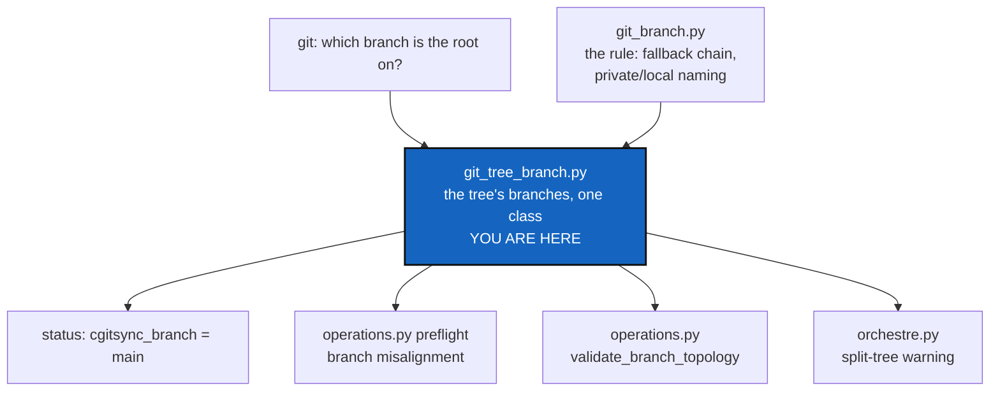

# StatusCurrentBranch — print the tree's branch, and give it an owner

*Created: 2026-09-16*

*Branch: main*

> **Owner specs — 2026-09-16.** Two requirements were added after this
> ticket was first written, and they widen it:
>
> - **`status` must display `cgitsync_branch = <branch-name>` explicitly.**
>   The field has a name now, and it is not `branch` — it says whose branch
>   it is, which is the whole point (§2.1). D1 keeps only the question of
>   where the field sits.
> - **The GitTree's branches must be a class, in a `.py` of its own.**
>   Reading the tree's branch is not a helper `status` writes for itself:
>   the same computation is copied in four places today (§2.2), and this
>   ticket is where it gets one home. That is the larger half of the work.

## Abstract — read this first

**The one-line version.** `cgitsync status` never says which branch the
workspace is on, because nothing in the code owns that question — four
places each work it out again, and this ticket gives it a class and then
prints its answer.

**What this document is.** A planning ticket, from the short ticket
`display_branch_for_status.md` — *"Update the command cgitsync status, to
display the current branch"* — and the two specs added on top of it.

**Why it exists.** "Which branch am I on?" is the first question anyone
asks before committing, and `status` is the command they ask it with.
Today the answer is in the table, but only if you already know that the
row with `PATH` `.` is the project, that the table is printed leaf first
so that row is last, and that a `private/local` row saying
`ComplexGitSync_apoub` is a derived name rather than a branch anybody
typed. Underneath that, the tree's branch has no owner: `operations.py`
computes it three times and `orchestre.py` a fourth, each with its own
loop and its own way of reporting the answer.

**What you will find.** §1 what `status` prints today. §2 the two things
missing — the field, and the owner. §3 the decisions the owner must make.
§4 work packages. §5 acceptance. §6 what this does not cover.

**Who it is for.** Whoever picks this up, and the owner, who answers §3.

**What you need to do with it.** Answer §3, then work §4 in order — the
class first, the printed field second. Doing it the other way round adds a
fifth copy of §2.2's computation.



---

## 1. What `status` prints today

```text
summary ready=true complete=true repos=7 dirty=1 staged=0 ahead=0 behind=0 unmeasured=0 recorded_mismatch=0 errors=0
REPOSITORY         PATH                SCOPE            LOCAL_BRANCH    UPSTREAM_BRANCH        LOCAL  SYNC    HEAD      RECORDED
--------------------------------------------------------------------------------------------------------------------------------
DocSpec            docs/DocSpec        private/distant  main            origin/main            clean  synced  e6f1b0bf  e6f1b0bf
DocComplexGitSync  docs                project          main            origin/main            clean  synced  dd76ac42  dd76ac42
.localSpec         .localSpec          private/local    ComplexGitSync  origin/ComplexGitSync  dirty  synced  ddb132a6  ddb132a6
.claude            .claude             private/local    ComplexGitSync  origin/ComplexGitSync  clean  synced  1783baf5  1783baf5
DevSpec            .agentSpec/DevSpec  private/distant  main            origin/main            clean  synced  a5d34329  a5d34329
.agentSpec         .agentSpec          private/distant  main            origin/main            clean  synced  8a74f4f7  8a74f4f7
ComplexGitSync     .                   project          main            origin/main            clean  synced  3efd27e4  3efd27e4
legend: SCOPE — ...
READY ready=true complete=true gittree_created=true gittree_active=true
```

| Piece | State |
|---|---|
| Per-repository branch | `LOCAL_BRANCH`, one column, correct — added by `UpstreamBranchDisplay` |
| The tree's own branch | **Nowhere.** Not in the `summary` line, not in the trailing `READY` line |
| A class that owns it | **None.** §2.2 |
| The rule that derives the others | `resolve_propagated_ref` in `git_branch.py` — `private_local_branch` turns the tree's branch into `<project>` or `<project>_<branch>` |
| A warning when the tree is split | Present: `warning: tree is split across branches — ...` |

## 2. What is missing

### 2.1 The field

The tree has one branch — the root repository's. Everything else follows
from it: `checkout` propagates it, and a `private/local` repository's name
is derived from it by `private_local_branch`. That single value is the one
thing `status` does not print.

Three things make the table a poor substitute.

**The root row is not marked as the root.** It is `PATH` `.`, which is
correct and quiet. Rows are printed leaf first, so it is the last line of
the table, furthest from the `summary` line the reader started at.

**Half the rows carry a different branch on purpose.** `ComplexGitSync` in
the `.localSpec` row above is a derived private/local name, not a branch
anybody typed. A reader scanning `LOCAL_BRANCH` sees three plausible
answers and no rule saying which is the tree's.

**A split tree makes the column ambiguous exactly when it matters.** The
warning already reports a split, but it reports it as deviations — "`X` is
on `foo`, expected `bar`" — and "expected" is measured against a branch
the output never names.

Hence the explicit name the owner asked for: `cgitsync_branch`. `branch`
alone would be a fourth plausible answer on a page that already shows
seven; `cgitsync_branch` says which one the tool itself is steering by.

### 2.2 The owner — the class this ticket must create

"Which branch is the tree on, which branch should each repository be on,
and which is it actually on" is computed independently in four places
today. Every copy reads the root's branch, walks the tree, calls
`resolve_propagated_ref` with `tree_project_name`, and compares:

| Where | What it does with the answer |
|---|---|
| [`operations.py:1290`](../../../src/ComplexGitSync/operations.py#L1290) `validate_branch_topology` | `BranchTopologyConflict` records, with its own `missing_root` and `detached_head` kinds |
| [`operations.py:1552`](../../../src/ComplexGitSync/operations.py#L1552) `_collect_branch_alignment_diagnostics` | `PreflightDiagnostic`s that block an operation |
| [`orchestre.py:3783`](../../../src/ComplexGitSync/orchestre.py#L3783) `_branch_incoherence` | The `status` warning line |
| [`operations.py:295`](../../../src/ComplexGitSync/operations.py#L295) `_restart_tree_common` | Reads the root's branch to propagate it before pulling |

Three of the four answer the *same* question and disagree in the details:
one returns early when the root is detached, one records it as a conflict
kind, one skips the repository. `propagate_global_branch` and
`create_global_branch` then re-derive the per-repository target a fifth
and sixth time from `tree_project_name` + `resolve_propagated_ref`.

This is the shape that produced `git_branch.py`: the fallback chain was
six private copies across five modules before it had a module.
`git_branch.py` fixed the *rule*; the **state** — a live tree, a runner, and
what Git says each repository is on right now — was left where it was, and
copied itself instead.

The split to keep is the one the project already draws between
`git_repo.py` (identity, pure) and `git_tree.py` (tree state):

| Module | Owns |
|---|---|
| `git_branch.py` (Ring 0, unchanged) | The **rule**. Fallback chain, `RefKind`, `BranchSource`, `private_local_branch`, `resolve_propagated_ref`. Holds no tree |
| **new module** (this ticket) | The **state**. Which branch this tree is on, what each repository should be on under it, what each is on now, and where those disagree. Holds the tree and the runner; never restates the rule |

Adding a module makes `.localSpec/AdditionalSpecs.md`'s responsibility
table, its ring table, its dependency diagram and `CLAUDE.md`'s table part
of this change, per `CLAUDE.md` — not a follow-up.

## 3. Decisions — your call

### D1. Where does `cgitsync_branch` go, and in what spelling?

The name is settled. Recommendation for the rest: **a field in the
`summary` line**, directly after `complete=`, spelled the way every other
field on that line is spelled — `key=value`, no spaces:

```text
summary ready=true complete=true cgitsync_branch=main repos=7 dirty=1 ...
```

This is the one place the spec is not followed to the letter: it was
written `cgitsync_branch = <branch-name>`, with spaces. The `summary` line
is read by scripts splitting on whitespace, and a spaced field would be
three tokens where every neighbour is one. The alternative, if the spacing
matters more than the convention, is a line of its own above the summary,
where `cgitsync_branch = main` reads naturally and costs a second line to
parse. **Say which you want.**

Either way this changes the exact field set pinned by
`tests/integration/test_golden_release_gaps.py::TestStatusGoldenOutput` —
that test doing its job, and updating it is part of the work.

### D2. Which branch is "the tree's branch"?

Recommendation: **the root repository's**, as read by the new class — the
same value `_branch_incoherence` and `_collect_branch_alignment_diagnostics`
already use. It is the branch `checkout` sets, the one private/local names
are derived from, and the one the split warning already measures against.
No new notion of a tree branch is invented.

### D3. What is printed when there is no single answer?

The field must be present in all three cases — a field that sometimes
vanishes is worse to parse than one that says it does not know:

| Case | Recommended value |
|---|---|
| Root is on a branch | the branch name |
| Root is on a detached `HEAD` | `detached` — the word `LOCAL_BRANCH` already uses for that state |
| Root unreadable, or the tree has no root | `unknown` |

The third is the case [CgshomeDefault](2-3_CgshomeDefault_DevPlanTicket.md)
creates on purpose: an empty default workspace has no root, and its
`status` must answer without a `KeyError`. Settling the word here keeps
both tickets printing the same one.

### D4. Should a split tree mark the value?

Recommendation: **no.** `cgitsync_branch=main(split)` makes a script strip
a suffix to read a branch name, and the warning line already says it in
words. If the split deserves weight in the summary it is a count
(`off_branch=2`), not a decoration — and it is not asked for here.

### D5. Does the trailing `READY ...` line carry it too?

Recommendation: **no.** `_format_tree_state_line` in `cli/_shared.py`
reports lifecycle, not Git position, and five other commands print it.
Printing the branch twice in one output invites the two copies to
disagree.

### D6. What are the module and the class called?

Recommendation: **`git_tree_branch.py`**, holding **`GitTreeBranches`**.
It reads beside the three modules it sits between — `git_repo.py`,
`git_branch.py`, `git_tree.py` — and the plural says it holds every
repository's branch, not one. Alternatives if you prefer: `tree_branch.py`
/ `TreeBranch`, or `branch_state.py` / `BranchState`. The name is yours;
everything below is written with the recommended one.

Proposed surface, deliberately small:

| Member | Answers |
|---|---|
| `GitTreeBranches(tree, git_runner)` | — |
| `.tree_branch` | The tree's branch: a name, or `None` for detached/rootless (D2, D3) |
| `.label` | That value as the one word `cgitsync_branch=` prints |
| `.expected(repo)` | What this repository should be on — delegates to `resolve_propagated_ref`, never restates it |
| `.observed(repo)` | What Git says it is on, read once per repository per instance |
| `.deviations()` | Every repository where the two differ, as data — each caller renders it its own way |

### D7. Which ring, and may it run Git?

Recommendation: **Ring 2**, importing `git_tree`, `git_branch`, `git_repo`
and `git_runner` — the same-ring import `operations.py` already makes of
`git_runner.py`. It must not import `operations.py` or `orchestre.py`;
they import it.

The alternative is a pure Ring-0/1 class handed a mapping of observed
branches. It tests without Git, and it pushes the reading loop back into
the four callers — which is the duplication this ticket exists to remove.
Recommendation: Ring 2, with the runner injected so tests can pass a fake.

### D8. Does `tree_project_name` move into it?

Recommendation: **yes.** It lives in `operations.py` today and its
docstring already says what it is for — "the project's name, which is what
a private/local branch is named after". That is this module's subject, and
six call sites currently import it from an operations module to feed a
branch rule. `operations.py` imports it from the new home. This is module
responsibility moving, so both responsibility tables change with it.

### D9. How many call sites move in this ticket?

Recommendation: **all four in §2.2, plus `propagate_global_branch` and
`create_global_branch`.** A class that owns the question while three
copies of the question survive beside it is worse than no class: the next
reader cannot tell which one is current. If that is too much for one
change, the honest split is the class plus §2.2's three *readers* here,
with the two propagation helpers in a follow-up ticket named in this one —
not a silent remainder.

## 4. Work packages

| WP | Depends on | Touches | Deliverable |
|---|---|---|---|
| **WP-B1** | D6, D7, D8 | `git_tree_branch.py` (new), `scripts/ceiling_baseline.json` | The class and its module docstring contract (`Ring:`/`Contract:`/`Imports:`). `tree_project_name` moves in. New baseline entry recorded with `--write-baseline`. Unit tests against a fake runner: named branch, detached root, rootless tree, private/local derivation, deviations |
| **WP-B2** | WP-B1, D9 | `operations.py`, `orchestre.py` | Migrate the call sites: `validate_branch_topology`, `_collect_branch_alignment_diagnostics`, `_branch_incoherence`, `_restart_tree_common`, `propagate_global_branch`, `create_global_branch`. Each keeps its own output type and its own wording; only the computation is shared. No behaviour change — the existing tests for all three reporting paths must pass untouched |
| **WP-B3** | D1, D3, WP-B1 | `status_render.py`, `orchestre.py` | The field. `status_render.py` owns the wording (`detached`/`unknown`) beside the existing `SYNC_*` constants — Ring 0, no Git call. `status()` asks `GitTreeBranches` once and prints `cgitsync_branch` |
| **WP-B4** | WP-B3 | `tests/integration/test_golden_release_gaps.py`, `tests/unit/test_registry_client.py` | Update the pinned field set. New cases: a named branch, a detached root, a rootless tree, and a split tree where the field names the root's branch while the warning names the deviations |
| **WP-B5** | WP-B1, WP-B2 | `.localSpec/AdditionalSpecs.md`, `CLAUDE.md` | The responsibility table, the ring table, and the dependency diagram gain the module — in this change, per `CLAUDE.md`. Say there what `git_branch.py` keeps and what moved, so the two are not read as rivals |
| **WP-B6** | WP-B3 | `README.md` §*What `status` tells you*, `docs/Text/user_guide.tex` §`status` | Document the field and its three values, and say plainly that the tree's branch is the root's and that private/local names are derived from it |
| **WP-B7** | all | `pixi`, this ticket | `pixi run lint`, `pixi run test`, `pixi run check-ceilings`; `pixi run bump-version`; rebuild the docs PDFs if WP-B6 touched `.tex`; archive this ticket in the implementing commit |

## 5. Acceptance

- `cgitsync status` prints `cgitsync_branch` with the tree's branch, in the
  spelling D1 settles, and a test asserts the whole field set in order.
- After `cgitsync branch apoub`, `status` reports `cgitsync_branch=apoub`
  while the `.localSpec` and `.claude` rows still show their derived
  `ComplexGitSync_apoub` — a test covers exactly that pairing.
- A detached root reports `detached`; a tree with no root reports
  `unknown`. Neither raises. The field is never absent.
- On a split tree the field names the root's branch and the existing
  warning still names each deviation.
- `git_tree_branch.py` exists, carries the standard docstring contract, and
  is the only place that turns "the tree's branch" into "what this
  repository should be on".
- `grep -n "current_branch(root" src/ComplexGitSync/*.py` returns the new
  module and nothing else.
- The branch rule itself is still in `git_branch.py` alone: no fallback
  chain, no `PRIVATE_LOCAL_SEPARATOR`, no `<project>_<branch>` composition
  in the new module.
- Every existing test for preflight misalignment, branch topology and the
  split warning passes without being edited — the migration changes where
  the answer comes from, not what it is.
- `.localSpec/AdditionalSpecs.md` and `CLAUDE.md` list the module.
- `pixi run lint`, `pixi run test` and `pixi run check-ceilings` pass.

## 6. What this does not cover

* **`--json`.** `status --json` is [CliContract](2-1_CliContract_DevPlanTicket.md)'s
  WP-C2. Its object carries `cgitsync_branch` as a field of its own; this
  ticket settles the value and the name so both renderings answer alike.
* **The empty-workspace answer.** [CgshomeDefault](2-3_CgshomeDefault_DevPlanTicket.md)'s
  WP-C5 owns what `status` prints for a workspace with no repositories.
  D3's third row is the branch half of it, agreed here.
* **The per-repository columns.** `LOCAL_BRANCH`, `UPSTREAM_BRANCH` and
  `SYNC` are correct and stay as they are.
* **The split-branch warning's wording**, and any new count for it (D4).
* **Changing what a branch move does.** `checkout`, `branch`, the fallback
  chain and the private/local rule keep their behaviour exactly. This
  ticket moves where the tree's branch is computed and prints it; it
  decides nothing new about branches.
