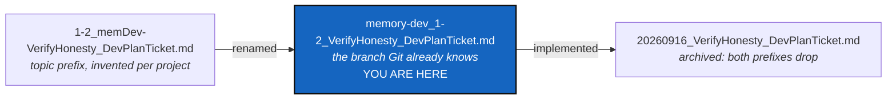

# TicketBranchNaming — a ticket's filename says which branch its work lands on

*Created: 2026-09-16*

*Branch: main*

> **Written and implemented the same day.** The request was a naming
> convention, so the plan and the renaming are one change; the ticket is
> stamped and archived under the rule in
> [TICKETLIFECYCLE.md](../../../.agentSpec/TICKETLIFECYCLE.md) §5 rather
> than sitting open over work that is already done. Its open name would
> have been `main_1-8_TicketBranchNaming_DevPlanTicket.md`, which is the
> convention it introduces.

## Abstract — read this first

**The one-line version.** An open planning ticket is now named
`<branch>_<priority>-<rank>_<Name>_DevPlanTicket.md` — the branch first,
`main` when nothing else applies — and the topic prefix it replaces is
gone.

**What this document is.** A planning ticket, from the short ticket
`formatting DevPlanTicket name.md`: *"Format the DevPlanTicket name as
cgitsync-branch_PRIORITYID-ID_DevPlanTicket.md. default
cgitsync-branch=main"*.

**Why it exists.** A ticket's filename is the only thing most readers ever
see of it, and it was missing the fact that is most expensive to get
wrong: which branch the work lands on. The old filename carried an
optional topic prefix (`memDev-`) that marked the same group the branch
already marked, spelled differently — so a reader had to learn that
`memDev-` meant `memory-dev`, and an author had to keep two names in step
for no gain. Committing a workstream's change to the wrong branch is cheap
to do, expensive to unpick, and caught by nothing in the diff or the test
suite.

**What you will find.** §1 what the names were. §2 what they are now. §3
the decisions and who made them. §4 what was changed. §5 acceptance. §6
what this did not touch.

**Who it is for.** Anyone opening, ranking or finishing a ticket from now
on, and anyone wondering where `memDev-` went.

**What you need to do with it.** Name new tickets as §2 says.
TICKETLIFECYCLE.md is the authoritative rule; this ticket only records the
change and why.



---

## 1. What the names were

```
openTickets/<priority>-<rank>_[<topic>-]<Name>_DevPlanTicket.md
```

| Piece | State before |
|---|---|
| Priority and rank | `1-2`, working as intended |
| Name | Present, and referred to in prose |
| Branch | **Only inside the file**, as the `*Branch:*` line |
| Topic | An optional `memDev-` prefix, defined per project, marking the memory workstream |

The topic prefix and the branch line were two records of one fact. The
project had exactly one topic, `memDev-`, and exactly one branch other than
`main`, `memory-dev`, and they meant the same group of tickets.

## 2. What they are now

```
openTickets/<branch>_<priority>-<rank>_<Name>_DevPlanTicket.md
```

```
main_2-1_CliContract_DevPlanTicket.md
memory-dev_1-2_VerifyHonesty_DevPlanTicket.md
```

- **`<branch>`** is the branch the work lands on, spelled as Git spells it.
  It is always written out, `main` included.
- **`<priority>-<rank>`** is unchanged: `1` prioritary, `2` stand-by, rank
  counted from 1 inside its own pile and compacted at each Ticket review.
- **`<Name>`** is unchanged, and is still how a ticket is named in prose.
- **The topic prefix is gone.** Nothing replaces it; the branch was always
  what it meant.
- **Archiving is unchanged**: both prefixes come off and the file becomes
  `archive/<YYYYMMDD>_<Name>_DevPlanTicket.md`.

The `*Branch:*` line inside the ticket stays. The filename is what a
directory listing shows and the line is what a reader sees inside the
document; the two must agree, and a ticket that says two different things
is worse than one that says neither.

## 3. Decisions

| # | Question | Answer |
|---|---|---|
| **D1** | Does the short name survive in the new pattern? | **Yes** — owner, 2026-09-16. The pattern as written had no name slot. Dropping it would have made every filename in a pile near-identical, and broken both the rule that a ticket is named by its short name in prose and the archive form, which is built on the name |
| **D2** | Does the branch prefix stay on an archived ticket? | **No** — owner, 2026-09-16. It drops with the rank, for the same reason: by then the branch has merged. The ticket's own `*Branch:*` line still records where the work landed |
| **D3** | Is `main_` written out, or implied by having no prefix? | **Written out.** "Default `main`" fixes the value when a ticket does not say otherwise, not a licence to omit it. An always-present field is easier to read by eye and by script than one that vanishes when the answer is ordinary — the same reasoning that settled `cgitsync_branch` in `status`, and a listing then sorts one workstream together |
| **D4** | Does the topic prefix survive alongside it? | **No.** One fact, one place |

## 4. What was changed

| Where | Change |
|---|---|
| `openTickets/` | All eleven tickets renamed: three `main_`, eight `memory-dev_`. The `memDev-` prefix is gone |
| Ticket cross-links | Every link between tickets repointed. Link *text* carrying a stale rank (`[2-1 CliContract]`) reduced to the short name, per TICKETLIFECYCLE.md §2.2 |
| `.agentSpec/TICKETLIFECYCLE.md` | §1 table, §2 (now "the two prefixes"), §2.2, §2.3 (rewritten from topic prefix to branch prefix), §3, §5, the abstract and the diagram |
| `.localSpec/DevTickets/README.md` | §1 table, §4 (now "Naming: branch, priority, rank"), the diagram |
| `.claude/CLAUDE.md` | The `DevTickets/` layout bullet and the *Document conventions* filename lifecycle |
| `.localSpec/AdditionalSpecs.md` | *Branches and ticket topics*: the table's third column is now the filename prefix, and the section says both branches write theirs out |

`.agentSpec` is a read-only mount shared with every project that uses it,
so its commit is a separate decision from this project's — `CLAUDE.md`
§5.1.

## 5. Acceptance

- Every file in `openTickets/` matches
  `<branch>_<priority>-<rank>_<Name>_DevPlanTicket.md`, and every `<branch>`
  is a branch this project actually has.
- No filename anywhere contains `memDev-`.
- No link between open tickets is broken, and no link text carries a rank.
- TICKETLIFECYCLE.md, `DevTickets/README.md`, `CLAUDE.md` and
  `AdditionalSpecs.md` describe the same pattern, with no surviving
  description of a topic prefix as a live rule.
- `archive/` is untouched: archived filenames keep the `YYYYMMDD_` form
  they already had.

## 6. What this did not touch

* **The archive.** Archived tickets are historical records and are not
  renamed or edited, including the links inside them that pointed at an
  open ticket's old name. They record what was true when they were
  written.
* **The `*Branch:*` line**, the `*Created:*` line, and the ticket document
  shape. Unchanged.
* **Ranks and priorities.** Nothing was re-ranked here; that is a Ticket
  review, and this was a rename.
* **Short tickets.** They carry no priority, no rank and no branch, and
  still do.
