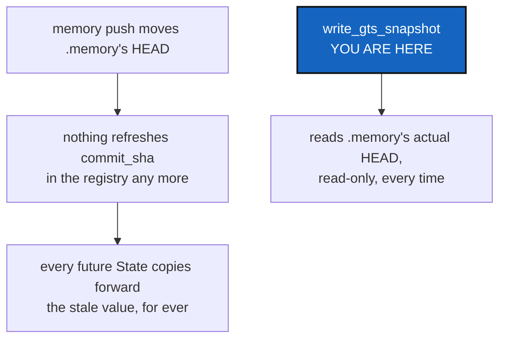

# MemoryRecordedRefresh — excluded from every write scope must not mean frozen

*Created: 2026-09-17*

*Branch: memory-dev*

> **Owner direction, in conversation, after `PullMemoryExclusion` landed:**
> *"but after push the status is still exhibiting a recorded mismatch
> between HEAD and RECORDED for .memory"*

## Abstract — read this first

**The one-line version.** Excluding the memory from every write scope
(`MemoryScopeExclusion`, `PullMemoryExclusion`) also excluded it from the
one thing that kept its *recorded* commit honest — so the moment
`memory push` first moved it, `status`'s `HEAD ending with *` marker
appeared and, unlike the ordinary dirty-note, had no way to ever go away
again.

**What this document is.** A regression from those two tickets, caught by
the owner testing the result, not anticipated by either ticket — recorded
as its own, honestly.

**Why it exists.** `status`'s `HEAD`/`RECORDED` columns must agree once
whatever moved them has finished being recorded, the same way the dirty
flag itself now explains and then clears. A mismatch with no way to clear
is a worse answer than the one it replaced.

**What you will find.** §1 why exclusion broke this. §2 the fix. §3
acceptance.



---

## 1. Why exclusion broke this

Every repository's recorded `commit_sha` in a `.gts` is whatever was last
written into the in-memory `WorkingRepo` — nothing re-reads git at
serialisation time. That value is kept fresh by the action that visits a
repository: `checkout`/`commit`/`push` each refresh the repos they act on,
right before a State is written.

`MemoryScopeExclusion` and `PullMemoryExclusion` stopped `add`/`commit`/
`push`/`pull` from visiting the memory mount at all — correctly, for the
reason both tickets give — but that also stopped anything from ever
refreshing its `commit_sha` again. `memory push` moves the memory's real
HEAD directly, through `git_runner`, and never touches the client's
registry or writes a State. So the *next* State written by any ordinary
command went on recording whatever `commit_sha` was loaded at the start of
the session — permanently, once `memory push` had moved the real one past
it.

Measured: `memory push`, then `push` (which does write a fresh State), then
`status` — the mismatch marker was still there. Unlike the dirty flag,
which explains itself and clears on the next `memory push`, this had no
mechanism to ever clear at all.

## 2. The fix

`write_gts_snapshot` now calls a new `_refresh_memory_mount_state`
immediately after resolving the registry, before building the document.
For every `is_memory_mount` entry whose mount is already a real repository
(`.git` present), it reads the current branch and `rev-parse HEAD` —
exactly the questions `status` already asks for display — and writes them
into the in-memory entry. Nothing here is a write: no checkout, no
fetch, no command that could touch the memory's own worktree or history.
Silently does nothing for a mount that does not exist yet or has no HEAD
to read (adopted but nothing committed).

This runs on every State write, for every command, not only the ones a
person happens to run after `memory push` — so the recorded commit is
never more than one ordinary command behind reality, the same latency the
dirty-note already carries.

## 3. Acceptance

Measured on this project's own tree:

```
$ cgitsync memory push          # moves .memory's real HEAD
$ cgitsync push                 # writes a fresh State
$ cgitsync status
.memory  …  clean  synced  b14045f1  b14045f1     # no *, HEAD == RECORDED
```

Plus `tests/integration/test_memory_onboarding.py::test_the_recorded_commit_catches_up_after_memory_push`:
`memory_push` moves the memory's real HEAD, a second `client.load` is the
first ordinary command to run afterward, and the registry's recorded
`commit_sha` for the memory entry matches the real HEAD once it returns.

`pixi run lint` and `pixi run test` pass — 1520 tests.
