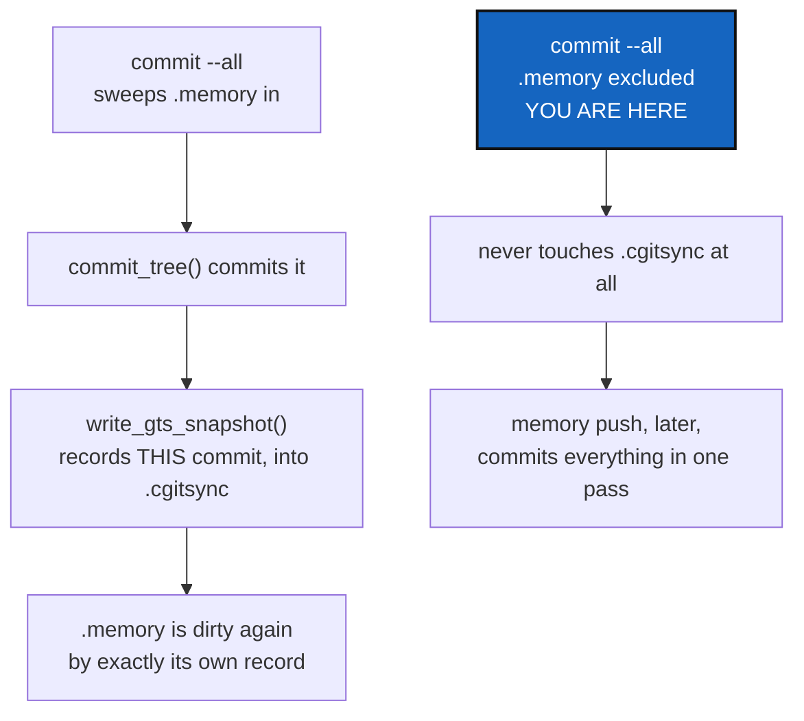

# MemoryScopeExclusion — the memory can never come out clean from a sweep that records itself into it

*Created: 2026-09-17*

*Branch: memory-dev*

> **Owner direction, in the short ticket
> (`.localSpec/DevTickets/archive/.closedUserTicket/20260917_memory-dirty.md`):**
> *"the memory repo remains in dirty state after add --all commit --all,
> push --all. add --private modifies status but commit and push go back to
> dirty."*

## Abstract — read this first

**The one-line version.** `.memory` was declared `private = true, writable
= true`, the same as `.localSpec`/`.claude` — so `add`/`commit`/`push`
swept it into their own scope. Every one of those commands also records
itself *into* `.cgitsync` after it runs, so the record of the very sweep
that just committed the memory is never part of what got committed. The
memory could never come out clean from an ordinary sweep, structurally,
no matter how many times you ran one.

**What this document is.** The measured cause, and the fix: the memory is
excluded from every write scope but `ALL`, so ordinary commands stop
touching it — `memory push` already writes it directly, bypassing scope
entirely, and loses nothing.

**Why it exists.** The owner's own words: three commands ran, in the
documented order, and the memory was dirty after every one. That reads as
a broken promise, because it is one.

**What you will find.** §1 why this cannot be fixed by reordering. §2 the
fix. §3 what changes and what does not. §4 acceptance, measured on this
project's own tree.

**Who it is for.** Whoever reads this later, wondering why the memory is
excluded from `--private`/`--all`.



---

## 1. Why reordering cannot fix this

A write command's own record — the State and ledger entry
`write_gts_snapshot` produces — needs facts that do not exist until *after*
the git operation ran: the resulting commit SHAs, whether anything moved,
what the tree looks like now. So the sequence inside `orchestre.commit()`
is necessarily commit-the-scope, *then* record-what-happened, and that
recording step is itself new content written into `.cgitsync` — which, if
`.cgitsync` was part of the scope that just committed, is now sitting there
uncommitted. `push` follows the same shape.

This is not an ordering bug to fix by moving a line. It is what happens
whenever the repository being swept is also the repository that receives
the sweep's own record. The only way out is to stop sweeping it in.

Measured before this ticket: `pixi run cgitsync commit --all "…"; pixi run
cgitsync push --all` left `.memory` reporting `dirty` afterward, every
time, on this project's own tree — matching the owner's report exactly.

## 2. The fix

**The memory mount is excluded from `RepoScope.PROJECT`, `PRIVATE` and
`WRITABLE` — every write scope but `ALL`.** `RepoScope.includes()`
(`git_repo.py`) now checks a new, derived field,
`WorkingRepo.is_memory_mount`, before anything else:

```python
if self is RepoScope.ALL:
    return True
if repo.is_memory_mount:
    return False
```

`is_memory_mount` is never declared in a `.cgs` and never read back from a
`.gts` — it is recognised the same way the tool already recognises the
memory everywhere else, by where it sits (`relative_path ==
memory.repository.MOUNT_PATH`), computed once when the registry is built
from either document (`registry.py`).

This costs `memory push`/`memory adopt` nothing: both already operate
directly on `memory_mount_path(workspace)` through `git_runner`, never
through `RepoScope`/`iter_tree_leaf_first` at all.

## 3. What changes, and what stays the same

- **`add`, `commit`, `push` — with no flag, `--private`, or `--all` — never
  touch `.cgitsync` again.** Only `memory push` (and, later,
  `memory reboot`) does.
- **`cgitsync status` still reports `.memory` honestly.** It reads every
  repository's real git status independent of scope, so a memory with
  unpushed content still shows `dirty` — correctly: that is what tells a
  reader `memory push` has something to do. What changed is that ordinary
  commands no longer *pretend* to have handled it.
- **The SCOPE column keeps saying `private/local`.** The memory did not
  become read-only or shared; it is still entirely the workspace's own to
  write, only through a different command. Making it declared
  `writable = false` instead would have "fixed" the scope leak too, but by
  mislabelling the memory `private/distant` — which is false, and a worse
  answer than the bug it would have replaced.
- **`tag`/`freeze-release`** (`RepoScope.WRITABLE`) also stop reaching the
  memory, for the identical reason `commit`/`push` do — nobody asked for
  this specifically, but leaving them touching it while `commit`/`push`
  do not would have been the inconsistent, half-fixed version of this.

## 4. Acceptance — measured, not asserted

On this project's own tree, 2026-09-17:

```
$ cgitsync add --all && cgitsync commit --all "…" && cgitsync push --all
# .memory's HEAD is unchanged throughout — never touched.

$ cgitsync memory push
committed=19 path(s)
$ cgitsync status
.memory   .cgitsync   private/local   …   clean   synced
```

Plus `tests/unit/test_repo_scope.py`'s
`test_each_scope_selects_what_the_documentation_promises`, updated on this
project's own developer spec: `.memory` is absent from `PRIVATE` and
`WRITABLE`, present in `ALL`.

`pixi run lint` and `pixi run test` pass — 1514 tests.
