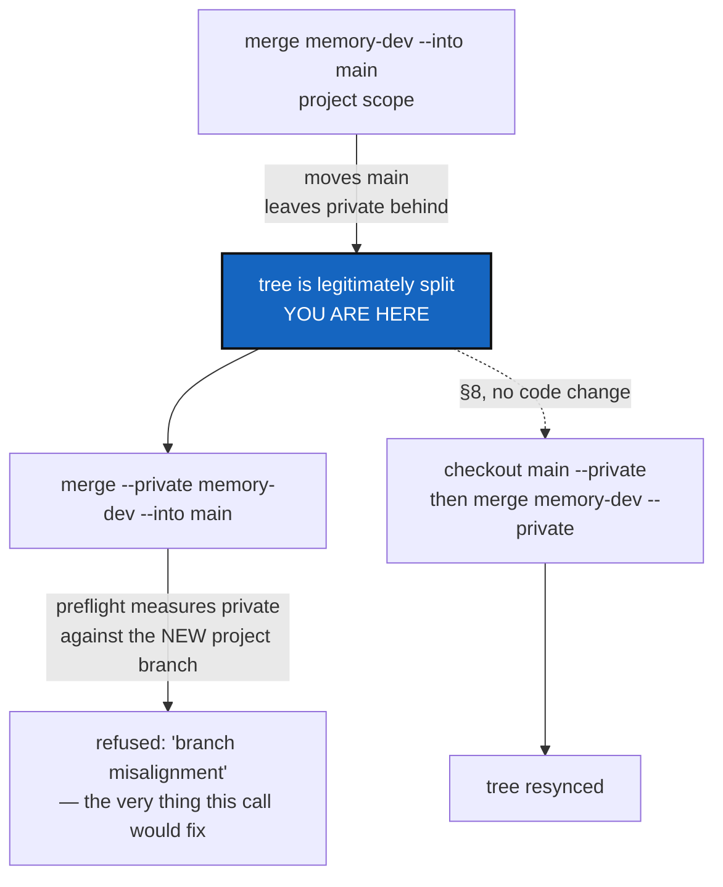

# MergeIntoScopeSync — a scoped `merge --into` must not lock itself out

*Created: 2026-09-17*

*Branch: main*

> **Owner direction — 2026-09-17, in conversation:** *"merge memory-dev
> --into main led to a desync between project and --private. merge
> --private memory-dev --into main is bugged when applied sequentially.
> Write a DevPlanTicket for maintaining the cgitsync sync between project
> and --private during the merge branch1 --into branch2 or allows the
> options --private and --all for this operation. The DevPlanTicket must
> start from the current state of the project with a desync project/private"*

## Abstract — read this first

**The one-line version.** `merge --into` already accepts `--private` and
`--all` — the bug is not that those options are missing, it is that running
`--into` scoped and then finishing the other scope in a second call is
refused, every time, by a check that was never written for this command.

**What this document is.** The measured state of this project's tree right
now — genuinely split, from exactly the sequence the owner described — the
confirmed cause, reproduced on a throwaway tree, and the fix.

**Why it exists.** `merge --into` (`memory-dev_1-2_SelfHostedMerge`, landed
2026-09-17) was built to run once, over the whole tree, in one command. It
was never tried as two separate scoped calls — the natural way to reach for
`--private` after already running the plain form. The second call fails,
and it fails leaving the tree exactly as split as it found it, which is
this ticket's own starting state.

**What you will find.** §1 the tree, as it stands, with evidence. §2 the
reproduction and the line of code responsible. §3 why it is only `--into`'s
problem. §4 the fix. §5 decisions. §6 work packages. §7 acceptance. §8 how
to unblock this project's own tree today, without waiting for the fix.

**Who it is for.** Whoever builds the fix. §8 is for the owner, now.

**What you need to do with it.** If you only want your tree fixed today,
read §8 and stop there — it needs no code change. The rest is for whoever
picks up the ticket.



---

## 1. The tree, as it stands, measured 2026-09-17

`cgitsync status` on this workspace right now:

```
summary cgitsync_branch=main ... ahead=2 ...
ComplexGitSync      .           project        main                        origin/main  ahead(+8)
DocComplexGitSync    docs       project        main                        origin/main  ahead(+8)
.localSpec           .localSpec private/local  ComplexGitSync_memory-dev   origin/…      synced
.claude               .claude   private/local  ComplexGitSync_memory-dev   origin/…      synced

warning: tree is split across branches — .localSpec is on
'ComplexGitSync_memory-dev', expected 'ComplexGitSync'; .claude is on
'ComplexGitSync_memory-dev', expected 'ComplexGitSync'. Run 'cgitsync
checkout <branch>' to put it back.
```

The ledger holds exactly one `merge-into` entry:

```toml
[entry]
seq = 17
command = "merge-into"
argv = ["merge", "memory-dev", "--into", "main"]
outcome = "ok"
```

No `--private` in that `argv`, and no second entry after it. That is not
because `--private` was never tried — it is because the attempt raised
before anything was written. `merge_into_tree` raises
`GitSyncError` *before* `write_gts_snapshot` runs, so a refused call leaves
no trace in the ledger at all, which is why the tree looks, from its own
memory, like the private half was simply never asked to move.

**This state is exactly this ticket's starting point.** §4's fix is
verified against reaching a clean tree from here, not from a fresh one.

## 2. Reproduced, and the line responsible

Built on a throwaway two-repository tree with the same shape — a project
repository and one private/local repository, both starting one branch
behind the target:

```bash
$ cgitsync merge feature --into main --gts demo.gts
fast-forwarded demo: main <- feature
# root moves to main. conf (private) is untouched, still on demo_feature —
# correct: scope was project, conf was never asked to move.

$ cgitsync merge feature --into main --private --search-dir .
cgitsync merge: merge preflight failed: conf: branch misalignment:
expected 'demo' (private to its own branch), found 'demo_feature'.
```

The second call is refused, and refused by exactly the thing it exists to
correct: `conf` **is not yet on `demo`** — that is the whole reason to run
it. The check that stops it is
[`operations.py`](../../../src/ComplexGitSync/operations.py)'s
`_collect_branch_diagnostics`, called from `merge_into_tree`'s shared
`_run_preflight_checks`:

```python
f"branch misalignment: expected {deviation.expected!r}"
f"{' (private to its own branch)' if deviation.repo.effective_private else ''}, "
f"found {deviation.observed!r}."
for deviation in GitTreeBranches(tree, git_runner).deviations(scope=scope)
```

`GitTreeBranches.deviations` computes "expected" from the tree's *current*
project branch — which the first call already moved to `main`. So a repo
this second call is *about to* check out onto `demo` is measured against
"is it already on `demo`" before it has run, and refused for not being
somewhere it is this command's whole job to put it.

**Confirmed further: `--all` does not route around this either**, once one
scope has already moved. Reproduced the same way — project merged alone
first, then `--all` attempted — fails identically, because `conf` is still
in the scope `--all` selects and still measured the same way:

```
$ cgitsync merge feature --into main --all --search-dir .
cgitsync merge: merge preflight failed: conf: branch misalignment:
expected 'demo' (private to its own branch), found 'demo_feature'.
```

So the owner's two named options are not alternatives here: neither
`--private` nor `--all` can finish a `--into` that was already begun
scoped. Only running everything the tree will ever need in the *first*
`--into` call succeeds — which is a real constraint to design around, not
a workaround to document and move on from.

## 3. Why this is `--into`'s problem alone

Every other command sharing this preflight — `commit`, `push`, ordinary
`merge` — never moves which branch a repository is *on*; they act on
whatever is already checked out. For them, "the repo's current branch
matches what the project's current branch implies" is a real precondition:
if it is false, `checkout`/`branch` was skipped or failed, and something
is genuinely wrong.

`merge --into` is the one command whose entire purpose is to take a
repository from wherever it currently sits to a branch named by the call —
named directly, by `merge_source_ref`, never read off what is checked out.
For the repositories `--into`'s own scope selects, "not yet on the target"
is not a symptom of a broken tree. It is the input.

## 4. The fix

**For a `merge --into` operation, skip the branch-alignment diagnostic for
repositories the requested scope selects; keep every other preflight
check.** Concretely: `merge_into_tree` calls a lighter preflight than
`merge_tree`'s — same dirty-worktree and tracking checks, `_collect_branch_diagnostics` left out
entirely, because this operation's own status computation
(`merge_into_status`, already written and already correct: `no-source`,
`no-target`, `already-merged`, `fast-forward`, `merge`, `conflicts`) is a
strictly more accurate answer to "is this repository in a state this
command can act on" than a check built for a different family of commands.

This is not "relax a safety check" — the safety this check exists for
(don't run `commit`/`push` against a repo nobody moved into place) does not
apply to a command whose entire job is doing the moving.

## 5. Decisions — your call

### D1. Skip the check for `--into`, or make it understand `--into`?

Recommendation: **skip it entirely for `merge --into`**, per §4. A version
of `_collect_branch_diagnostics` that special-cases one caller is a
function two commands can disagree about; not calling it at all for the one
command it was never written for is the smaller, clearer change.

### D2. Should the fix also make `--all` the only spelling `--into` accepts?

Recommendation: **no.** Forcing `--all` would answer the owner's *"or"* by
removing the choice rather than fixing it — and there is a legitimate
reason to want a project-only `--into` on its own (checking the project's
own merge before touching configuration repositories at all). §4 makes
that case safe to finish later instead of taking it away.

### D3. Does the fixed preflight still block a repository that is dirty?

Recommendation: **yes, unchanged.** A repository with uncommitted changes
must still refuse — that has nothing to do with which branch it is on, and
`merge_into_tree`'s own checkout-then-merge would otherwise carry local
edits onto the wrong branch.

## 6. Work packages

| # | Depends on | Touches | Delivers |
|---|---|---|---|
| **WP-1** | D1, D3 | `operations.py` | A preflight for `merge_into_tree` that omits branch-alignment diagnostics, keeping every other check |
| **WP-2** | WP-1 | `tests/integration/test_merge_into.py` | The exact two-call sequence of §2 (project scope, then `--private`) as a test, and the same for `--all` after a partial `--into` |
| **WP-3** | WP-1 | `README.md`, `docs/Text/user_guide.tex`, `.localSpec/AdditionalSpecs.md` | Say plainly that a scoped `--into` call may be finished later with another scoped call, which was false before this ticket |

## 7. Acceptance

- The exact sequence of §2 — project-scope `--into`, then `--private` —
  succeeds on the second call instead of refusing.
- `--all`, run after a project-only `--into` already moved half the tree,
  succeeds and finishes the other half.
- A repository with uncommitted changes is still refused, unchanged.
- `pixi run lint` and `pixi run test` pass.

## 8. Unblocking this project's own tree today

No code change needed. `.localSpec` and `.claude` hold no part of the
running `cgitsync` — only the project repository (`.`, already on `main`)
does — so the ordinary, pre-`--into` commands are safe to use on them
directly:

```bash
cgitsync checkout main --private
cgitsync merge memory-dev --private
cgitsync push --private
cgitsync push
```

Verified on the throwaway tree from exactly this ticket's split state: the
private repository reaches the target branch and the merge completes.
`cgitsync status` should then read `dirty=0` with no split-tree warning.
