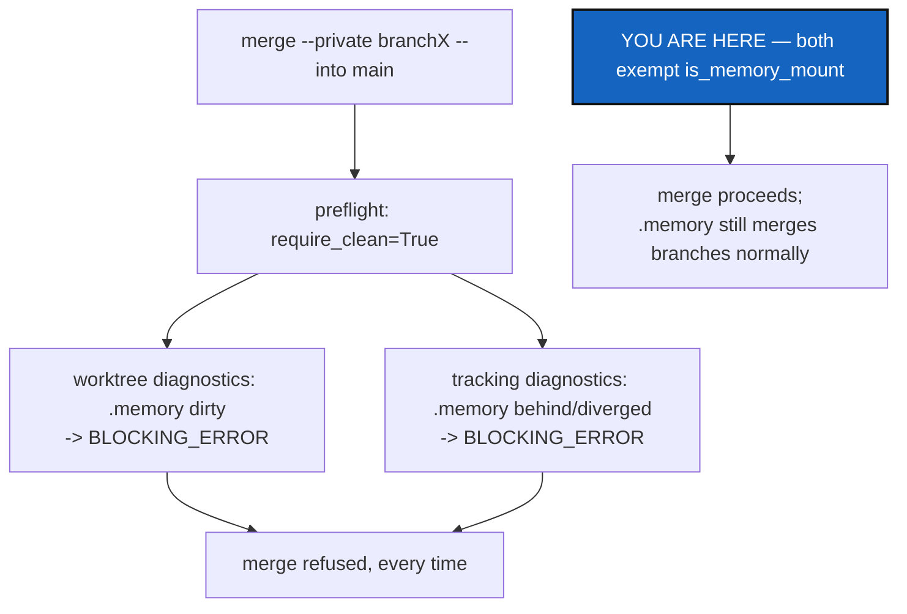

# MergeMemoryExclusion — merge's own preflight did not know either

*Created: 2026-09-17*

*Branch: memory-dev*

> **Owner direction, in the short ticket
> (`.localSpec/DevTickets/archive/.closedUserTicket/20260917_mergingIssue.md`):**
> *"Merging a branch into main is problematic. [...] The problem rises for
> private/local and memory for which status is either dirty so not ready
> for a merge or with desync local and origin. The command merge --private
> branchX --into main doesn't pass pre-flight. The problem is the .memory.
> The 3 or 4 previous request were about that and you said everything
> normal but not. We need to find a better way to sync .memory for status
> to be OK before flight. I think allowing memory to be either dirty may be
> OK."*

## Abstract — read this first

**The one-line version.** `add`/`commit`/`push`/`pull` stopped touching
`.memory` (`MemoryScopeExclusion`, `PullMemoryExclusion`), and `status`
stopped treating its dirtiness as a fault. `merge`'s own preflight never
got the same memo: it still refused every merge that reached `.memory`,
on the very dirtiness and tracking-lag those two tickets made permanent by
design. Fixing that preflight surfaced a second, unrelated gap it depended
on — `.memory` never reached `READY` through `restart`/`pull` at all,
because the same exclusion that stopped `pull` from touching it also
stopped anything from ever marking it ready.

**Why it exists.** Three earlier tickets each explained why `.memory`
looking dirty or tracking-behind was expected, not broken — and each time
the explanation was correct as far as it went. None of them asked what a
*later* command, reading that same state as a precondition, would do with
it. `merge` is that command.

**What you will find.** §1 the two preflight checks that were blocking.
§2 the fix. §3 the readiness gap the fix exposed, and its own fix. §4
acceptance.

**Who it is for.** Whoever next runs `merge --private`/`--all --into` on a
workspace with a mounted memory.

---

## 1. What was blocking

`merge_into_tree` already disables branch-alignment checking for the
memory's own reasons (`MergeIntoScopeSync`), but leaves
`require_clean=True` — right for every other repository a merge might
touch, since merging over uncommitted work would lose it. Two of
`_collect_preflight_diagnostics`'s checks (`operations.py`) then act on
that:

- `_collect_worktree_diagnostics` — `require_clean=True` makes any dirty
  repository in scope a `BLOCKING_ERROR`. `.memory` reads dirty at almost
  any moment an ordinary command runs (`PullMemoryExclusion` §3), so once
  a memory is mounted, this was every merge.
- `_collect_tracking_diagnostics` — `BEHIND`/`DIVERGED` are
  `BLOCKING_ERROR` regardless of `require_clean`. `.memory`'s sync with
  its own origin is `memory push`'s job, on its own schedule, decoupled
  from whatever tree-wide command happens to run in between — so it is
  routinely behind or diverged from a merge's point of view, for reasons
  that have nothing to do with whether the merge itself is safe.

Both checks walk every repository the operation's scope selects
(`RepoScope.PRIVATE`/`WRITABLE`/`ALL` all include `.memory` — that stayed
correct and general-purpose per `MemoryScopeExclusion` §1's reverted first
attempt), so neither one had ever excluded it.

## 2. The fix

Both functions now skip `repo.is_memory_mount` entries outright — not
downgraded to a warning, excluded from the diagnostic entirely, for the
same reason `status`'s note is a note and not a warning: the state being
read is expected, not a fault, and a warning on every single merge would
be exactly the noise that note was written to stop.
`_collect_worktree_diagnostics` still refreshes `repo.worktree_state` for
every repository including `.memory` — that field is written into the
`.gts` snapshot regardless of scope — only the diagnostic append is
skipped. `_collect_tracking_diagnostics` skips the memory mount before
even asking `git_runner` about it, since nothing downstream needs the
answer.

This is the same architectural shape as `iter_write_scope`
(`MemoryScopeExclusion`): a narrow, derived-field exclusion added one
level above the general-purpose primitive (`RepoScope`/
`iter_tree_leaf_first`), so `merge`'s own general behaviour — reconciling
`.memory` across branches, same as `.localSpec`/`.claude`
(`MergeIntoScopeSync`) — is untouched. Only the *preflight questions*
change; the merge itself still acts on `.memory` exactly as before.

## 3. The readiness gap this surfaced

Writing a regression test (build a workspace, onboard a memory, create a
branch, `merge --private ... --into main`) hit a second failure that had
nothing to do with preflight: `client.restart(config)` — the `.cgs`-based
path behind `pull`, and the ordinary way a freshly-changed `.cgs` gets
picked back up — raised `"restart did not produce a READY tree."` before
ever reaching `merge`.

`WorkingGitTree.is_ready()` requires every repository's
`repo_lifecycle_state` to be `READY`/`FALLBACK_READY`, with a resolved
`commit_sha` and ref. That field is normally set by
`_refresh_repo_after_checkout`, called once per repository inside
`_restart_tree`'s own pull loop — the loop `PullMemoryExclusion` made skip
`.memory` on purpose. Nothing else ever set it for the memory mount:
`memory_adopt`/`memory_push`/`memory_branch` are pure git operations on
the mount's filesystem and never touch `self.registry`, and
`build_registry_from_cgs_document` (parsing a fresh `.cgs`, `load_cgs`'s
job) does no live git inspection at all. The existing project's own `.gts`
carried a stale `READY` for `.memory` forward from before this session's
exclusion fixes landed — `build_registry_from_gts_document` trusts a
loaded snapshot's fields rather than re-deriving them — which is why this
had gone unnoticed: nothing in ordinary day-to-day use forced a genuine
from-scratch `restart` to re-earn that value for a newly-onboarded memory.

**Fix:** `_refresh_memory_mount_state` (`orchestre.py`,
`MemoryRecordedRefresh`) — already the one place that asks git what the
memory mount actually is, read-only, before every State write — now also
sets `repo_lifecycle_state = READY` once it has confirmed a real branch
and HEAD, the same read-only questions it already asks
(`git rev-parse`/`current branch`), no new write added. `restart()` calls
it, and `registry.recompute_tree_state()`, right after its pull loop and
before its own `is_ready()` check — the same order `_restart_tree`
already uses for every other repository, just one call later since the
memory mount's own refresh lives in the orchestration layer, not
`operations.py`.

## 4. Acceptance

- `merge --private`/`--all --into main`, run against this project's own
  live tree, completes and includes `.memory` in the merge plan — checked
  by dry run (`cgitsync merge memory-dev --private --into main --dry-run`
  and the `--all` equivalent) before and after the fix.
- A workspace whose `.memory` is dirty at the moment `merge --into` runs
  merges anyway, and the memory itself still moves to the target branch —
  `tests/integration/test_memory_onboarding.py::test_merging_is_not_blocked_by_the_memorys_own_dirtiness`.
- A workspace whose `.memory` is behind its own origin (a colleague pushed
  since the last `memory push`) merges anyway —
  `test_merging_is_not_blocked_by_the_memorys_tracking_state`.
- A freshly onboarded memory reaches `READY` through an ordinary
  `restart`/`pull`, not only through a `.gts` that happened to carry
  `READY` forward from before these exclusions existed — covered by both
  tests above, which onboard a memory from scratch and `restart` before
  merging.
- `pixi run lint` and `pixi run test` pass — 1522 tests. `operations.py`
  grew 1650 → 1652 LOC, `orchestre.py` 4761 → 4770; both baselines
  updated (`scripts/ceiling_baseline.json`) — the growth is the two
  preflight exemptions, the readiness fix, and their docstrings, not new
  responsibility for either module.
