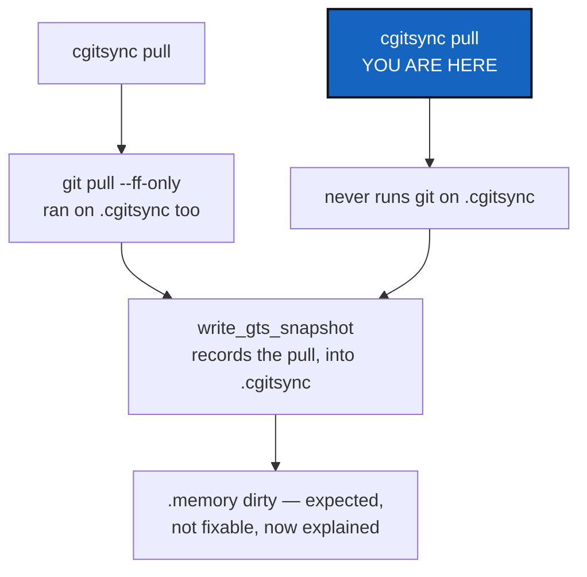

# PullMemoryExclusion — pull, and the dirtiness that was never fixable

*Created: 2026-09-17*

*Branch: memory-dev*

> **Owner direction, in the short ticket
> (`.localSpec/DevTickets/archive/.closedUserTicket/20260917_memory-sdirtyafterpull.md`):**
> *"after your treament status display a sync issue only for memory. I
> pulled and it became dirty. push did nothing more. I don't understand it
> should be ok after you add commit push. Investigate further and fix the
> bug."*

## Abstract — read this first

**The one-line version.** Two things were reported as one bug. One of
them — `pull` running `git pull` directly on `.cgitsync` — was a real bug
and is fixed. The other — the memory showing dirty after *any* command,
`pull` included — is not a bug at all; it is the ledger doing its job, and
what was missing was the tool saying so.

**What this document is.** What was measured, what was fixed, and what was
explained instead of "fixed" — because it cannot be fixed without turning
the memory into something that stops recording what happens.

**Why it exists.** `MemoryScopeExclusion` (archived the same day) excluded
the memory from `add`/`commit`/`push`. It never touched `pull`, and the
owner hit the same shape of confusion through it within the hour.

**What you will find.** §1 what `pull` was actually doing to the memory.
§2 the fix, and its limit. §3 the part that was never a bug, said plainly,
and put where the owner will see it next time. §4 acceptance.

**Who it is for.** Whoever next wonders why `.memory` is dirty again.



---

## 1. What `pull` was actually doing

`pull`'s scope is `RepoScope.ALL` — deliberately, so a read-only
configuration repository still gets fetched. `_restart_tree` ran
`git pull --ff-only` on every repository `ALL` selects, including the
memory, with no check for what state its worktree was in first.

Measured: a colleague pushes new content to the memory's own branch, this
workspace runs `cgitsync pull`, and — before this fix — the memory's own
`git pull --ff-only` ran alongside everything else's. That is not
inherently wrong (bringing in a colleague's pushed memory content is a
reasonable thing to want), but it is *exactly* the same self-recording
problem `MemoryScopeExclusion` already named: the pull that just ran gets
recorded into `.cgitsync` immediately afterward, so the memory can never
come out of a `pull` clean either, and — separately — a real divergence
between local and remote content could make the `--ff-only` outright fail,
which would abort the whole tree-wide pull over a repository nothing else
in the sweep needed.

## 2. The fix, and its limit

`iter_write_scope` (`operations.py`, from `MemoryScopeExclusion`) gained a
`leaf_first` flag and is now used by `_restart_tree` too — the shared body
behind both `pull` and `pull-force` — in `pull`'s own parent-first order.
Neither ever runs a git operation on `.cgitsync` again; `pull-force`
specifically must not, since it is `git clean -fd`, and the memory must
never be exposed to a discard-and-reclone from a command that is not one
of its own.

**This does not, and cannot, stop `.memory` from showing dirty after
`pull` runs.** `pull` still ends by calling `write_gts_snapshot`, which
still records that a pull happened — that record is new content in
`.cgitsync`, unconditionally, for the same reason every other command's
record is. Excluding the memory from the git-pull *action* removes a real
risk (a genuine `--ff-only` failure aborting the whole tree, and any
`pull-force` ever reaching a discard command near the memory); it does not
and never could remove the dirtiness, because the dirtiness is the record
working as designed.

## 3. What was never a bug

**A memory that never showed anything new after a command ran would not be
a memory.** Every one of `add`, `commit`, `push`, `pull`, `merge`,
`checkout` writes a new ledger entry describing itself, and that entry is
new content sitting in `.cgitsync` until someone runs `memory push`. This
is permanent and by design — there is no version of this tool where the
memory is "clean" for longer than the moment between one `memory push` and
the next command.

What was missing was the tool saying this instead of leaving a reader to
infer it. `cgitsync status` now does, whenever the memory is the one
thing showing dirty:

```
note: .memory is dirty because it just recorded the command that made this
report — that is expected after any command, not a fault. Run
'cgitsync memory push' to send it; add/commit/push do not touch it.
```

`_StatusView` gained `memory_dirty: bool`, computed in `_collect_status`
by zipping the registry entries it already walks against the rows it
already builds — checking `entry.is_memory_mount` for the ones whose
`LOCAL` column is not `clean`. No second pass over the tree, and no new
question `status` was not already answering for every other repository.

## 4. Acceptance

- `cgitsync pull`, on a workspace whose memory's remote branch a colleague
  has pushed new content to, completes without attempting `git pull` on
  `.cgitsync` — measured with a real bare remote and a real second clone
  standing in for the colleague (`tests/integration/test_memory_onboarding.py::test_pull_never_touches_the_memorys_own_git_content`).
- `cgitsync status` prints the note above whenever, and only whenever, the
  memory mount is the dirty one — absent right after `memory push`,
  present after the very next command
  (`test_status_explains_why_the_memory_is_dirty`).
- `pixi run lint` and `pixi run test` pass — 1519 tests.
