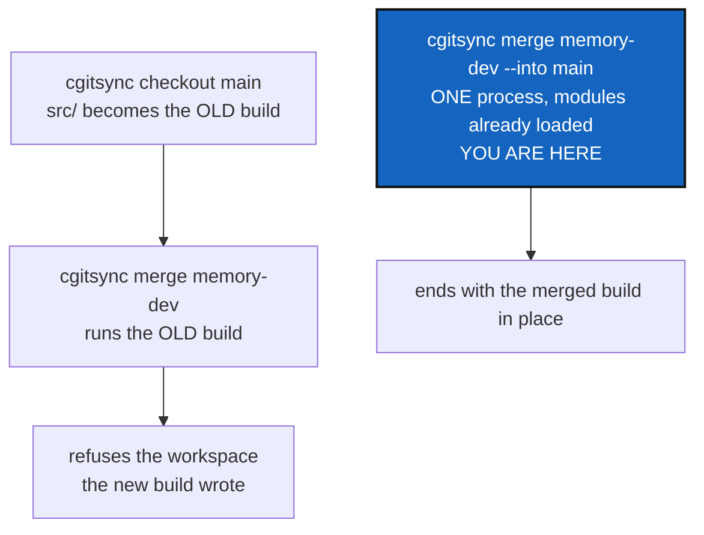

# SelfHostedMerge — merging a branch into another one, in one command

*Created: 2026-09-17*

*Branch: memory-dev*

> **Owner direction — 2026-09-17, in conversation:** *"I want to use cgitsync
> exclusively with its merge command. It is counterproductive to use git
> command. cgitsync was developped to avoid that exact strategy."*

## Abstract — read this first

**The one-line version.** `cgitsync` cannot merge one branch into another
without the user first running `checkout` — and when the tool manages its
own source tree, that first command replaces the code that runs the second
one.

**What this document is.** The plan for a single command that checks out a
target branch and merges a source into it, across the whole tree, inside one
process.

**Why it exists.** ComplexGitSync manages a tree that contains
ComplexGitSync, installed editable. `cgitsync checkout main` therefore
rewrites `src/`, and the next command runs whatever that checkout installed.
Merging a newer branch into an older one means the *older* build performs
the merge — against a workspace the newer one wrote. That is not a
hypothetical: it is the incident of 2026-09-16, and it is blocking
[MemoryOnboarding](memory-dev_1-3_MemoryOnboarding_DevPlanTicket.md), whose
own §2 is the `memory-dev` → `main` merge this workspace still owes.

**What you will find.** §1 the gap, measured. §2 why two commands cannot
fix it and one command can. §3 what the command does. §4 the decisions. §5
work packages. §6 acceptance. §7 what this is not.

**Who it is for.** The owner, for §4. Then whoever builds it — from
`memory-dev`, for the reason in §4's D3.

**Implementation order.** This is the first of two tickets and blocks the
second:
[MemoryOnboarding](memory-dev_1-3_MemoryOnboarding_DevPlanTicket.md) closes
the memory workstream's operational cycle, and its own §2 sequence opens
with the command this ticket builds. Nothing in MemoryOnboarding can be run
for real until this one lands.

**What you need to do with it.** Read §1 and §2. They are the whole
argument; the rest is construction.



---

## 1. The gap, measured on this workspace

2026-09-17, merging `memory-dev` (2.68) into `main` (2.59):

| What | `memory-dev` | `main` |
|---|---|---|
| `src/ComplexGitSync/memory/` | the package | **does not exist** — `ledger_entry.py`, `ledger_store.py`, `integrity.py` are still top-level |
| `hash_canonicalisation` | v2, portable | **not present at all** |
| Content-addressed States | since 2.63 | predates them |

`pixi.toml` installs this checkout editable, and this workspace *is*
`CGSHOME` — the `NESTED` use case `settings.py` already names. So:

```bash
pixi run cgitsync checkout main    # src/ is now 2.59
pixi run cgitsync merge memory-dev # 2.59 reads a memory 2.68 wrote → refused
```

The second command cannot run. The tree is left on `main`, mid-merge, with a
build that cannot read its own workspace — recoverable in 2026-09-16 only by
`git checkout memory-dev`, which is exactly the escape hatch this ticket
exists to remove.

**Every one of the four merges involved is a fast-forward.** Nothing
conflicts. The obstruction is entirely the two-command shape.

## 2. Why two commands cannot fix it, and one can

A tree-wide branch move rewrites `src/`. Any command that runs *after* it
runs the new contents of `src/`. So no ordering of `checkout` and `merge`
avoids the window: whichever runs second runs the code the first one put
there, and when merging newer into older that is the older code.

One command has no such window. **Python loads its modules at import time**,
so a process that has already started keeps running the build it started
with, whatever happens to the files underneath it. A single command can
therefore check out the older branch and merge the newer one into it from
beginning to end, and the code on disk when it finishes is the *merged*
code — the newer one. Nothing ever runs the older build.

That property is the whole ticket, and it must be written down as a contract
rather than left as an accident of implementation: **the checkout and the
merge of the project's own repository must happen within one process, and
nothing may be added between them that starts another.**

## 3. What the command does

```bash
cgitsync merge <source> --into <target> [--private|--all] [--dry-run]
```

For every repository the scope selects, leaf-first:

1. **Translate both branch names.** The project's repositories take
   `<source>` and `<target>` literally; a private/local repository takes the
   branches the rule derives — `git_branch.private_local_branch`, which
   already owns this and is not restated here.
2. **Check the whole tree before touching any of it.** Every repository must
   be clean, must have both branches, and must merge without conflict —
   asked with `can_merge_cleanly`, which touches no worktree. This is the
   promise `merge_tree` already makes, extended to cover the checkout: **a
   refusal leaves every repository exactly where it was**, still on the
   source branch.
3. **Then, per repository: check out the target, merge the source.** A
   fast-forward is recognised and reported as one, because that is the
   common case and it explains why nothing appeared to happen.
4. **Finish on the target branch**, with one State and one ledger entry
   recording a `merge --into`, not a `checkout` followed by a `merge`.

`--dry-run` prints the translation and the verdict per repository, and
touches nothing — the existing `merge --dry-run`, given a target.

**It does not push.** One command, one job; `push` follows and already
works.

### 3.1 The self-hosting check

When the resolved CGSHOME contains the running installation — `settings.py`
answers this today, `NESTED` — the command knows it is about to rewrite its
own source. Two consequences:

- It says so, once, before it starts: the build that finishes this command
  is not the build that started it.
- `checkout` gains a **warning** in that situation when the branch it is
  moving to holds an older `ComplexGitSync`: the next command will run that
  older build. It stays a warning, not a refusal — checking out an older
  branch to look at it is legitimate, and `main_1-4_SnapshotVersionGuard` is
  what makes the older build fail honestly when it is then used.

## 4. Decisions — your call

### D1. A flag on `merge`, or a new verb?

Recommendation: **`merge <source> --into <target>`**. `merge <source>`
already means "merge this into wherever I am"; naming the target is the
natural generalisation of the same verb, and it is how people say it out
loud. A new verb (`integrate`, `promote`, `land`) would make two commands
that differ only in whether the user had to type `checkout` first.

### D2. Does `--into` create a target branch that does not exist?

Recommendation: **no**, consistent with
[MemoryOnboarding](memory-dev_1-3_MemoryOnboarding_DevPlanTicket.md)'s D4.
It names the missing branch and stops. A command that creates its own
target cannot tell a new branch from a mistyped one.

### D3. Which branch is this implemented on?

Recommendation: **`memory-dev`**, and this is a deliberate exception to the
branch rule — the work is not memory work, so the rule would say `main`.

Two facts decide it:

- **It has to exist in the build that performs the merge**, which is the one
  running now: `memory-dev`, 2.68. A command that only exists on `main`
  cannot be used to merge anything *into* `main`.
- **`main` cannot currently be developed on at all.** Checking it out puts
  2.59 in `src/`, which is the very failure this ticket removes. The first
  merge has to come from the newer side.

It reaches `main` with the merge it performs, which is the ordinary
outcome — the exception costs nothing after this one use.

### D4. Does `checkout` refuse to strand the user on an older build?

Recommendation: **warn, never refuse.** §3.1. Refusing would make it
impossible to check out an older branch to read it, which is a legitimate
and common thing to do.

## 5. Work packages

| # | Depends on | Touches | Delivers |
|---|---|---|---|
| **WP-1** | D1, D2 | `operations.py` | `merge_into_tree`: translate, check the whole scope, then checkout-and-merge each repository leaf-first, reporting fast-forwards as such |
| **WP-2** | WP-1 | `orchestre.py` | `ComplexGitSyncClient.merge(..., into=...)`, one State and one ledger entry for the whole operation |
| **WP-3** | WP-1 | `cli/expert.py` | `merge <source> --into <target>`, and `--dry-run` showing both translated branches per repository |
| **WP-4** | D4 | `settings.py`, `cli/` | The self-hosting notice of §3.1, and `checkout`'s warning when it is about to install an older build |
| **WP-5** | all | `tests/` | A tree whose target branch is older, merged in one command; a refusal that leaves every repository on the source branch; a fast-forward reported as one; the private/local translation |
| **WP-6** | all | `README.md`, `docs/Text/user_guide.tex`, `docs/Text/api_python.tex`, `tutorials/04_private_repos.md` | Documented in both layers; Tutorial 4's "safe order for shipping a change" becomes one command |

## 6. Acceptance

- `cgitsync merge memory-dev --into main` merges this tree, from this
  workspace, with no `git` command typed by anybody.
- A conflict anywhere leaves every repository on its source branch, still
  checked out, with nothing merged.
- The four fast-forwards of §1 are reported as fast-forwards.
- `cgitsync merge X --into Y` where `Y` does not exist names `Y` and changes
  nothing.
- `cgitsync checkout <older branch>` warns that the next command will run an
  older build, and still performs the checkout.
- `pixi run lint` and `pixi run test` pass.

## 7. What this is not

- **A rebase, or any history rewrite.** It merges. What Git does with the
  two branches is Git's business.
- **A release command.** It does not push, tag or freeze. `freeze-release`
  is where those belong.
- **A way to run a newer workspace on an older build.** That stays
  impossible, and `main_1-4_SnapshotVersionGuard` is what makes it *say* so.
