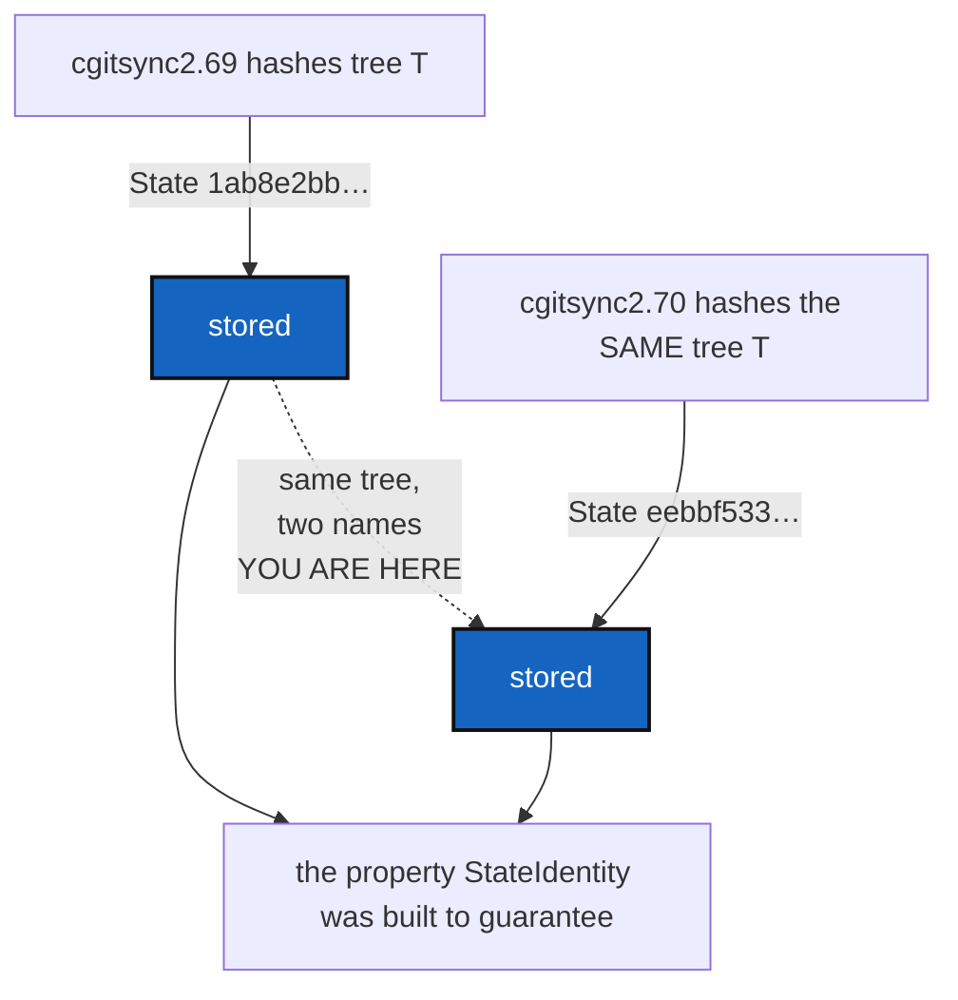

# StateVersionLeak — a State's hash embeds the tool that wrote it

*Created: 2026-09-17*

*Branch: memory-dev*

> **Found, not asked for.** While implementing
> [MergeIntoScopeSync](../archive/20260917_MergeIntoScopeSync_DevPlanTicket.md),
> `pixi run bump-version` flipped a pre-existing, order-dependent test from
> passing to failing. Bisecting it — see §1 — found that the same `.cgs`,
> loaded twice, once under `cgitsync2.69` and once under `cgitsync2.70`,
> produces two different State hashes for the identical tree. Nothing about
> the tree changed; only the version string did.

## Abstract — read this first

**The one-line version.** `GtsDocument.compute_snapshot_hash()` hashes a
field that falls back, silently and always, to the running package's own
`__version__` — the exact thing `.localSpec/AdditionalSpecs.md` names as
the reason a State's name must never depend on what observed the tree.

**What this document is.** The measured proof, the exact line responsible,
and a migration-aware fix — because the field in question sits inside the
hash, so fixing it in place would rewrite the name of every State this
project has ever written since `hash_canonicalisation` version 2 began
(2026-09-16, `StateIdentity`).

**Why it exists.** Two people who ran `cgitsync` at different versions
against the identical tree do not get the same State name today, which is
the one property the whole memory workstream — `StateIdentity`, `OneRegister`,
`MemoryRepoLocal`, `CommitMemory` — was built on. It has been latent since
`hash_canonicalisation` v2 landed; nothing tripped it until this session
happened to bump the version between two runs that mattered.

**What you will find.** §1 the measured proof. §2 the code responsible, and
why it is there. §3 what is at risk, and what is not, right now. §4 the fix
and the migration it needs. §5 decisions. §6 work packages. §7 acceptance.

**Who it is for.** The owner, for §5's D1 — it is the one decision that
changes what every future State is named. Then whoever builds it.

**What you need to do with it.** Read §1, then §5. The rest is the
reasoning behind both.



---

## 1. Measured

The same `.cgs` (`project = "demo"`, one repository), loaded once under
each version, nothing else different:

```
$ __version__ = "0002.69"; cgitsync load demo.cgs
.cgitsync/state/1ab8e2bbbd2b607163cd32e735172ce39c9796cced32129e9d78dbb2ace39dba.gts

$ __version__ = "0002.70"; cgitsync load demo.cgs   # identical .cgs, fresh workspace
.cgitsync/state/eebbf533298574b5686f4aa92ebf5b7659fdb13e41afbb3e71f5248107c5145c.gts
```

Two different names for the same tree, differing only in which build ran.
This is what surfaced it: `tests/integration/test_one_register.py`'s
`test_a_state_no_entry_recorded_is_reported_but_is_not_corruption` deletes
"the first state alphabetically" and expects it to be the real one, not an
orphan constant (`'b' * 64`). Whether the real hash sorts before or after
that constant turned out to depend on which `cgitsync` version wrote it —
the test was fixed as part of MergeIntoScopeSync (identify the real state
by capturing it before the orphan is added, not by sort position), but the
hash instability it exposed is this ticket.

## 2. The line responsible

`gts_document.py`'s canonical payload — the **explicit, curated field
list** every other entry in this file is deliberately chosen or excluded
from, each with a comment saying why — includes this:

```python
payload = {
    "document": {
        "CGS_VERSION": self.schema_version,
    },
    ...
}
```

`schema_version` is meant to be a fixed format discriminator, the same
role `hash_canonicalisation` already plays correctly:

```python
@property
def schema_version(self) -> str:
    value = self.read("document.schema_version")
    if isinstance(value, str) and value:
        return value
    value = self.read("document.CGS_VERSION")
    if isinstance(value, str) and value:
        return value
    return CGS_VERSION
```

Nothing, anywhere in this project, ever writes `document.schema_version`.
So the first branch never fires. The second branch reads
`document.CGS_VERSION` — which `registry.build_gts_document_from_registry`
sets, on every write, to `CGS_VERSION` (`from . import __version__`): the
running tool's own version, provenance recorded for the same reason
`generated_at` is. `ensure_snapshot_hash` stamps that field **before**
calling `compute_snapshot_hash()`, so by the time the payload is built,
`document.CGS_VERSION` already holds this run's `__version__` — which
`schema_version` then reads back and the payload hashes.

**`hash_canonicalisation` already does what this field was for.** It is a
plain, fixed integer (`CURRENT_HASH_CANONICALISATION = 2`,
`LEGACY_HASH_CANONICALISATION = 1`), read *before* the payload is built to
choose which shape of payload to build, and it is not itself inside the
payload. `schema_version`/`CGS_VERSION`-in-the-payload looks like an
earlier, uncleaned attempt at the same job, left behind when
`hash_canonicalisation` was introduced (`StateIdentity`, 2026-09-16) and
never removed.

`schema_version` the property has no other caller anywhere in this
codebase — the payload builder is the only place it is read. Nothing else
depends on it staying as it is.

## 3. What is at risk, and what is not, right now

**Not at risk today**: `verify` on this machine, right now. A stored
State is checked by recomputing its hash with whatever `cgitsync` build is
currently running — the same build, every time, within one process — so a
State written and verified in the same session is self-consistent even
with the leak. That is why this has gone unnoticed: the two events that
expose it (writing under one version, checking under another) have never
before landed in the same test run.

**At risk, and soon**: the exact scenario the memory workstream exists
for. `MemoryOnboarding`'s own live run — pushing this project's memory so
a second machine can pull it — is the first time a State this project
wrote will be read back by a `cgitsync` that might not be the exact build
that wrote it. If the two differ even by a patch version, `verify` reports
`STATE_DIGEST_MISMATCH` for a State nothing has actually touched. Every
State this workspace's `.cgitsync/state/` already holds, written across
this session's several version bumps, carries this risk today, silently.

## 4. The fix, and the migration it needs

**Drop `CGS_VERSION`/`schema_version` from the canonical payload.** It
duplicates `hash_canonicalisation`'s job and, unlike that field, its only
real value today is provenance — exactly what the architecture rule says
must never enter a State's hash.

**This cannot be applied to `hash_canonicalisation` version 2 in place.**
Every State ever written under v2 (since 2026-09-16) would stop matching
its own filename the moment the payload changes under it — a mass,
simultaneous `STATE_DIGEST_MISMATCH` across every workspace that has ever
run this tool, for content nobody touched. `gts_document.py`'s own rule
already covers this case and says what to do: *"an old snapshot gets
measured with an algorithm it was never written under"* is the failure
`compute_snapshot_hash`'s `canonicalisation` parameter exists to prevent.

So the fix is a new canonicalisation, not a patched one:
**`CURRENT_HASH_CANONICALISATION = 3`**, whose payload omits the
`document` block's version field entirely; version 2's payload builder is
kept byte-for-byte as it is today, leak included, for every document that
already declares it — the same discipline version 1 already receives.

## 5. Decisions — your call

### D1. A new canonicalisation, or accept the break?

Recommendation: **a new canonicalisation (v3), per §4.** The alternative —
fix v2 in place — invalidates every State this project has ever recorded
in one stroke, including the ones `CommitMemory`'s ledger entries already
point to. Nothing forces that cost; the same machinery that made v1 → v2
free of it is already built and proven.

### D2. Does `hash_canonicalisation` itself need to change shape?

Recommendation: **no.** It is already exactly the right kind of field —
fixed, small, read before the payload is built, never inside it. This
ticket adds a value it accepts, not a new mechanism.

### D3. What happens to States already on disk, written under v2 with the leak?

Recommendation: **nothing, ever.** They keep verifying against v2's
payload builder, leak included, for as long as v2 documents exist to read.
`verify` already treats a document by the canonicalisation it declares,
never by the one currently current. The leak is closed for new writing,
not retrofitted onto old ones — the same rule that makes v1 documents
still work today.

## 6. Work packages

| # | Depends on | Touches | Delivers |
|---|---|---|---|
| **WP-1** | D1, D2, D3 | `gts_document.py` | `CURRENT_HASH_CANONICALISATION = 3`; a v3 payload identical to v2's minus the `document` block; v2's own builder untouched |
| **WP-2** | WP-1 | `.localSpec/AdditionalSpecs.md` | *What a State's name is computed from* gains v3's rule, stated the way v1/v2 already are |
| **WP-3** | WP-1 | `tests/` | The proof of §1 as a permanent test: the same tree, hashed under two `__version__` values, produces the same v3 hash; a v2 document keeps its v2 hash unchanged |
| **WP-4** | all | README.md if the change is user-visible, this ticket | Archived under [TICKETLIFECYCLE.md](../../../.agentSpec/TICKETLIFECYCLE.md) |

## 7. Acceptance

- The exact case of §1 — the same `.cgs`, hashed under two different
  `__version__` values — now produces the same State hash both times.
- A `.gts` document already on disk, declaring `hash_canonicalisation = 2`,
  still verifies against its own recorded hash, unchanged.
- `pixi run lint` and `pixi run test` pass.
