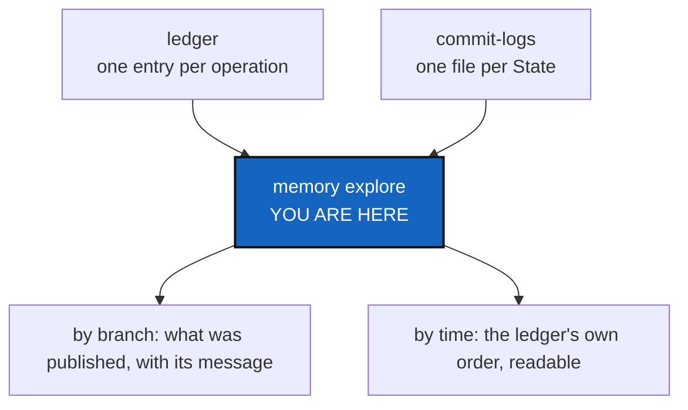

# MemoryExplore — a memory a person can actually read

*Created: 2026-09-17*

*Branch: memory-dev*

> **Owner direction, in the short ticket
> (`.localSpec/DevTickets/archive/.closedUserTicket/20260917_exploreMemory.md`):**
> *"cgitsync memory-explore must be developped cause it is impossible to
> navigate into the files of .memory for a human beings. The tree of the
> pushes with commit message should be accessible by branch (main default)
> as well as the tree of the branch ordered following the entries in
> lgr."*

## Abstract — read this first

**The one-line version.** `.memory` is a real Git repository full of
content-hashed filenames — `.gts` snapshots, ledger entries, commit-log
TOML — that says everything and reads as nothing. `memory explore` is the
render of it a person opens instead of `git log` and `cat`.

**What this document is.** The plan for a human-facing view over one
branch of a memory: what was published, with its messages, and the order
things actually happened in.

**Why it exists.** `memory show <hash>` already answers "what does this
one State say" and `memory list` already answers "which States exist" —
both aimed at a reader who already has a hash or is scanning for one. The
short ticket asks for the other direction: *"I don't have a hash. Show me
the branch."* Nothing today answers that.

**What you will find.** §1 what exists already and what is missing. §2 the
two views the short ticket names. §3 decisions. §4 work packages. §5
acceptance. §6 what this refuses.

**Who it is for.** The owner, for §3. Then whoever builds it.

**What you need to do with it.** §2 is the whole feature in two examples;
read that first.



---

## 1. What exists, and the gap

| Command | Answers | Needs |
|---|---|---|
| `memory show <hash>` | What one State recorded, and its commits | A hash — the exact thing a person browsing does not have |
| `memory list` | Every State, newest recording first | Reads as a wall of `.gts` filenames until you already know which one matters |
| `memory status` | How much is remembered, and does it verify | A health check, not a browse |

None of the three is organised **by branch**, and `.memory` is
one-repository-many-branches by design
(`../archive/20260917_MemoryOnboarding_DevPlanTicket.md`):
`ComplexGitSync` for this project on `main`, `ComplexGitSync_memory-dev`
for it on `memory-dev`, a different pair per project. Reading a memory
today means picking States out of a flat list and hoping they belong to
the branch you meant.

## 2. The two views the short ticket names

### 2.1 "The tree of the pushes with commit message, accessible by branch"

```
$ cgitsync memory explore
branch=ComplexGitSync (current)
2026-09-17  ComplexGitSync      main   9140e14  cgitsync2.70 merge --into no longer refuses...
2026-09-17  .localSpec          main   881d5b1  (private) same commit, folded in
2026-09-17  ComplexGitSync      main   bafaad3  a State's hash no longer depends on which...
…
```

One row per **published** commit (`commit_log.py`'s `[[published]]` rows —
already the record of what left this machine, per `CommitMemory`), for the
branch asked for. Unpushed commits are a different, already-answered
question (`memory show`'s `unpushed` marker); this view is specifically
"what a colleague pulling this branch would see."

`--branch NAME` selects a different one — `.memory` holds several, one per
project and project-branch, and a person maintaining more than one project
needs to look at any of them, not only the one checked out here.

### 2.2 "The tree of the branch, ordered following the entries in lgr"

```
$ cgitsync memory explore --timeline
seq=31  2026-09-17T10:11  commit    ComplexGitSync 71f3a9f  a State's hash no longer...
seq=32  2026-09-17T10:11  push      →origin/ComplexGitSync
seq=33  2026-09-17T10:12  merge-into main<-memory-dev
seq=34  2026-09-17T10:21  commit    ComplexGitSync bafaad3  cgitsync repo create, memory...
…
```

One row per ledger entry, in ledger order — not commit order, not filename
order. This is the difference from §2.1: §2.1 is *what was published*,
filtered to commits; this is *everything that happened*, including
`checkout`, `merge`, `push` — the operations a commit-only view drops.

## 3. Decisions — your call

### D1. Local read, or does it ever need a clone?

Recommendation: **local only, to start.** Read `.working/.memory/` (folded
history) and `.working/` (pending, not yet folded) already on this disk —
the same two sources every other `memory` command reads, since
[WorkingTransitionState](memory-dev_1-2_WorkingTransitionState_DevPlanTicket.md)
lands first (this ticket is now `1-3` for exactly that reason). Exploring
a branch nobody has cloned here yet is a real want (matches §2.1's "by
branch, main default" — implying other branches exist you have not
checked out) but is a second milestone: it needs the memory's own multi-
branch layout fetched, not just read, and that is `memory clone`'s job to
extend, not this one's to duplicate.

### D2. Where does `--branch` look, if it is not checked out here?

Recommendation: refuse cleanly, naming `memory clone --branch <name>`
first, until D1's second milestone exists. An explore that silently shows
nothing for a branch nobody has locally is worse than one that says so.

### D3. Text table, or does this want `--json` too?

Recommendation: **plain text now**, `--json` deferred. Every other
`memory` command started text-only and grew `--json` when a script
actually needed it (`status --json`, `verify --json`); this one has no
such caller yet.

## 4. Work packages

| # | Depends on | Touches | Delivers |
|---|---|---|---|
| **WP-1** | D1 | `memory/commit_log.py` | A helper reading every published row across every State's commit log, for one memory branch, in push order |
| **WP-2** | WP-1 | `memory/ledger_store.py` (read only) | A helper folding ledger entries and their commit-log rows into one ordered timeline |
| **WP-3** | WP-1, WP-2 | `orchestre.py` | `memory_explore(cgshome, *, branch=None, timeline=False)` |
| **WP-4** | WP-3 | `cli/expert.py` | `memory explore [--branch NAME] [--timeline]` |
| **WP-5** | all | `tests/`, `README.md`, `docs/Text/user_guide.tex`, `docs/Text/api_python.tex` | Both views tested against a real multi-commit memory; documented in both layers |

## 5. Acceptance

- `cgitsync memory explore` on this project prints the commits this
  project's memory has published, newest first, with their messages.
- `cgitsync memory explore --timeline` prints every ledger entry in
  sequence order, each naming its command and, where it has one, its
  commit message.
- `--branch <name>` for a branch not present locally names
  `memory clone --branch <name>` rather than printing nothing.
- `pixi run lint` and `pixi run test` pass.

## 6. What this refuses

- **To be a `git log` replacement while the repository is present.** This
  is for a memory read the way `memory show` already is: for when the
  repository that made a commit is gone, forked away, or was never yours
  to clone.
- **To write anything.** Every command here is a read.
