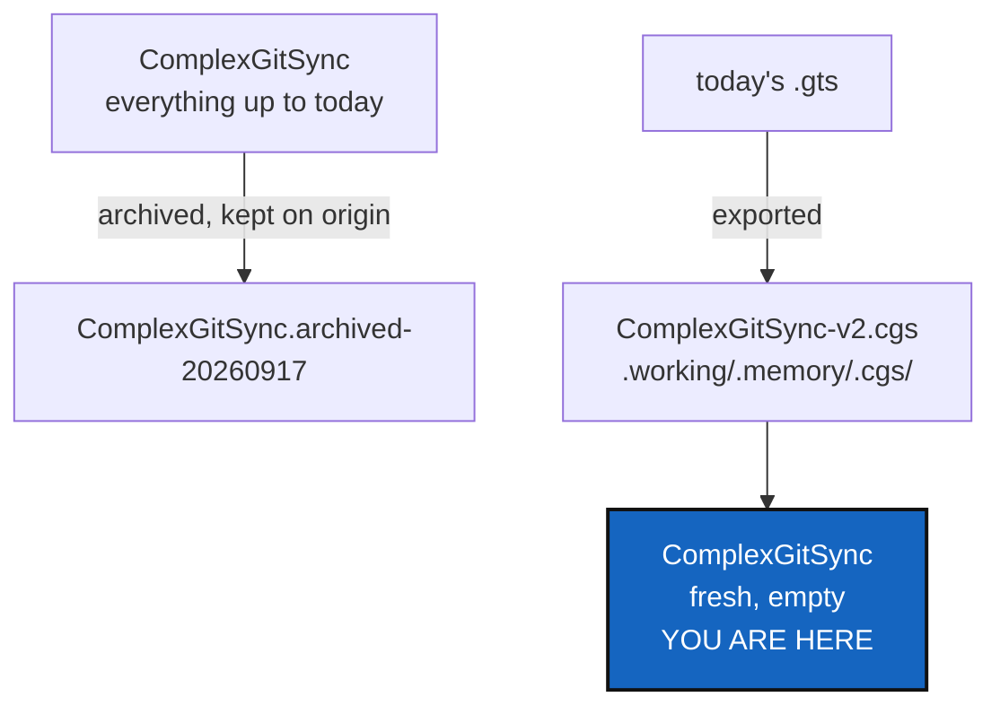

# MemoryReboot — starting a memory's history over, without losing the old one

*Created: 2026-09-17*

*Branch: memory-dev*

> **Owner direction — 2026-09-17, in conversation:** *"A function memory
> reboot must also be developped for rebooting the .memory to a fresh
> project and a maybe new .cgs. It may be an option when onBoarding either
> to reboot the memory by default when onboarding memory or to append it
> to the project."* Followed by, on the three questions this raised:
> **append stays the default onboarding behaviour, reboot is opt-in; the
> old branch is archived, never discarded; and reboot's source is not a
> named `.cgs` but the workspace's own current `.gts` — *"reboot should
> take the current .gts, export the corresponding .cgs and refresh only
> the memory part. finally a fresh project-name-v++i lands in
> .cgitsync/.cgs"*.**
>
> **Paths updated the same day** for
> [WorkingTransitionState](memory-dev_1-2_WorkingTransitionState_DevPlanTicket.md),
> which lands first: `.cgitsync` throughout this document means
> `.working/.memory`, its git-tracked mount — the quote above is kept
> verbatim.

## Abstract — read this first

**The one-line version.** `memory adopt` has one behaviour today: carry
forward whatever `.working/.memory` already holds, as one continuous
history. `memory reboot` is the other one — start the memory over, on
purpose, without losing what came before.

**What this document is.** The plan for a command that closes a memory's
current chapter and opens a new one: the old branch archived, not
deleted; a fresh, empty branch under the name the memory has always used;
and a permanent, versioned record of what the project looked like at that
exact moment, so the reboot itself is not a loss of information either.

**Why it exists.** A project's shape changes — repositories added,
removed, restructured — and a memory built for the old shape is not wrong,
exactly, but it stops being a clean answer to "what does this project look
like". Today there is no way to say "start over" without hand-editing
`.working/.memory` or force-pushing over real history. Neither belongs in
a tool whose whole design is that a register is never quietly rewritten.

**What you will find.** §1 what "fresh" means, precisely. §2 the exported
`.cgs` and its versioned name. §3 the command. §4 how it sits beside
`memory adopt`. §5 the six decisions, all now answered — D6 is new since
[WorkingTransitionState](memory-dev_1-2_WorkingTransitionState_DevPlanTicket.md)
gave the memory a pending area of its own. §6 work packages. §7
acceptance. §8 what this refuses.

**Who it is for.** Whoever builds it — every load-bearing decision is
made, D6 (the newest, on what a reboot does with unpushed work) included.

**What you need to do with it.** Read §1 and §3; between them they are the
whole command.



---

## 1. What "fresh" means

Four things happen, in this order, and none of them touches any
repository but the memory itself — **"refresh only the memory part"** was
explicit. The first is new since
[WorkingTransitionState](memory-dev_1-2_WorkingTransitionState_DevPlanTicket.md)
gave the memory a pending area of its own; the other three are the
original three, renumbered:

1. **Whatever `.working` is holding pending is folded in first** — the
   same fold `memory push` performs, run here so nothing recorded since
   the last push is silently lost to the reboot (D6 settles whether this
   is unconditional or asks first).
2. **The current branch is archived.** Renamed, locally and on origin, to
   `<branch>.archived-<YYYYMMDD>` — a real branch, still fetchable, still
   holding every State, ledger entry and commit message the memory ever
   recorded, the fold from step 1 included. Nothing is force-pushed and
   nothing is deleted.
3. **A fresh branch is created under the original name**, with no history
   before this point — the same name `memory adopt` would have used, so
   nothing about how the memory is mounted or referred to changes.
4. **`.working/.memory`'s tracked content is cleared** — States, ledger,
   commit logs, logs — so the new branch's first commit is a true
   beginning, not the old content re-committed under a new name.
   `.working`'s own pending area is already empty from step 1's fold, so
   there is nothing left over to carry into the fresh branch by accident.

The old branch stays reachable by name for as long as anyone wants it:
`git checkout <branch>.archived-<date>` in the memory, or
`memory clone --branch <branch>.archived-<date>` from a second machine.
Nothing about this ticket deletes anything, which is the same append-only
discipline `Omniscience` and the ledger itself already keep.

## 2. The exported `.cgs`, and why it is versioned

**Reboot's source of truth is the currently loaded `.gts`, not a `.cgs`
file on disk.** The workspace's own `to_cgs()` (`git_tree.py`, delegating
to `cgs_format.py`) already exports a `CgsDocument` from a
`WorkingGitTree` — the same translation `registry.py` already does in the
other direction. Reboot calls it, and writes the result to:

```
.working/.memory/.cgs/<project-name>-v<N>.cgs
```

**`-v<N>`, not the branch-slug name `write_gts_snapshot` already uses.**
The existing stable copy (`<name>-<branch-slug>.cgs`) is overwritten on
every write — one file, always the latest. A reboot's export is the
opposite on purpose: `N` increments once per reboot (the first reboot
writes `-v2`; the version before any reboot is implicitly `v1`, the
original topology, never renamed), so `.working/.memory/.cgs/` becomes a
permanent, ordered record of every shape this project's memory has ever
described — one file per epoch, none of them ever overwritten.

This is **not** `examples/complexgitsync4dev.cgs` or any other
hand-authored spec. It is generated, from what the tree currently *is*,
every time.

## 3. The command

```bash
cgitsync memory reboot [--search-dir DIR]
```

1. Loads the currently discovered `.gts` (same discovery every other
   `memory` command uses).
2. Folds `.working`'s pending content into `.working/.memory` (§1.1) —
   the same move `memory push` performs.
3. Exports the loaded `.gts` via `to_cgs()`, writes
   `.working/.memory/.cgs/<name>-v<N>.cgs`, `N` = one more than the
   highest version already there.
4. Commits and pushes what steps 2–3 gained, then archives the current
   memory branch, locally and on origin (§1.2) — so the archive holds the
   fold and the export, not a branch left one commit behind them.
5. Creates the fresh branch (§1.3), clears `.working/.memory`'s tracked
   content (§1.4).
6. Prints what it did — the archived branch's new name, the exported
   `.cgs`'s path — and stops. It does not commit or push the fresh,
   empty branch; the next ordinary write does that, the same way it
   always has.

```
$ cgitsync memory reboot
folded=12 pending record(s)
archived=ComplexGitSync -> ComplexGitSync.archived-20260917
exported=.working/.memory/.cgs/ComplexGitSync-v2.cgs
branch=ComplexGitSync (fresh, empty)
next: use the tool as normal — the next command writes this branch's first State
```

## 4. How this sits beside `memory adopt`

**Append stays the default; reboot is opt-in — settled.** `memory adopt`
is unchanged: it still carries forward whatever is already in
`.working/.memory` as one continuous history, exactly as built and run
today.

Reboot is reached two ways, both explicit:

- **`cgitsync memory reboot`**, on a memory that is already a repository —
  the ordinary case, closing one chapter and opening the next.
- **`cgitsync memory adopt --reboot`**, for a `.working/.memory` that is
  being adopted for the first time but should *not* carry forward whatever
  local history happens to be sitting in it — adopt the repository
  identity, but start the content fresh rather than committing what is on
  disk. `memory adopt`'s own default (append) is untouched; `--reboot`
  only changes what its *first* commit contains.

## 5. Decisions

### D1 (answered). Discard the old branch, or archive it?

**Archive, never discard** — the owner's own answer. Matches §1.

### D2 (answered). Does reboot default onboarding?

**No — append stays default; reboot is opt-in**, on both `memory reboot`
(a command of its own) and `memory adopt --reboot` (a flag on the
existing one). Matches §4.

### D3 (answered). Which `.cgs` does reboot use?

**Neither a named file nor an argument — the current `.gts`, exported.**
Matches §2.

### D4. Does the archived branch's own memory stay verifiable?

Recommendation: **yes, unchanged.** Archiving is a rename, not an edit —
every State, ledger entry and commit log on the old branch is untouched,
so `cgitsync verify` against a checkout of
`<branch>.archived-<date>` answers exactly as it did the day before the
reboot. Nothing about this ticket asks `verify` to learn anything new.

### D5. Does `memory explore` (this same pass) need to know about archived branches?

Recommendation: **not in its first milestone.** `MemoryExplore`'s D1
already defers reading a branch this workspace has not cloned; an archived
branch is exactly that case, and the same "clone it first" answer applies
without inventing a second exception this early.

### D6 (answered). Does reboot fold `.working`'s pending content unconditionally, or ask first?

**Fold it into the archived branch first, unconditionally — the owner's
own answer.** `.working` did not exist when this ticket was first
written — it exists because of
[WorkingTransitionState](memory-dev_1-2_WorkingTransitionState_DevPlanTicket.md),
and reboot is the first thing to interact with both a fold *and* an
archive in the same command. Whatever a person has run since their last
`memory push` — commits, checkouts, merges, `status` calls — sits in
`.working`, unfolded, the moment they run `memory reboot`; folding it into
the branch being archived means the archived branch is the complete,
honest record right up to the reboot moment, and nothing recorded is ever
silently dropped — the same "never quietly rewritten" reasoning §1
already states for the archive itself. Matches §1's step 1.

## 6. Work packages

| # | Depends on | Touches | Delivers |
|---|---|---|---|
| **WP-1** | D6 | `orchestre.py` | The fold step: move `.working`'s pending content into `.working/.memory`, the same move `memory push` performs (shared helper, not duplicated) |
| **WP-2** | D3 | `orchestre.py` | The export step: `to_cgs()` called against the loaded `.gts`, written to `.working/.memory/.cgs/<name>-v<N>.cgs`, `N` found by scanning what is already there |
| **WP-3** | D1 | `git_runner.py`, `orchestre.py` | The archive step: commit and push what WP-1/WP-2 gained, then rename the memory's current branch, locally and on origin, to `<branch>.archived-<date>` |
| **WP-4** | WP-1, WP-2, WP-3 | `orchestre.py` | `memory_reboot(cgshome)`, composing WP-1 through WP-3, then creating the fresh branch and clearing `.working/.memory`'s tracked content |
| **WP-5** | WP-4 | `orchestre.py`, `cli/expert.py` | `memory adopt --reboot`: adopt as today, then run WP-4's fresh-content step instead of committing what was found on disk |
| **WP-6** | WP-4, WP-5 | `cli/expert.py` | `memory reboot` as its own command |
| **WP-7** | all | `tests/`, `README.md`, `docs/Text/user_guide.tex`, `docs/Text/api_python.tex`, `.localSpec/AdditionalSpecs.md` | Both entry points tested against a real memory with real history and real pending `.working` content; documented; the versioned `.working/.memory/.cgs/` scheme added to the spec section that already describes what sits beside a State |

## 7. Acceptance

- `cgitsync memory reboot`, run with real pending content sitting in
  `.working` (a command or two since the last `memory push`), folds it
  into the branch being archived (D6) before archiving — reachable under
  the archived name afterward, never silently dropped.
- `cgitsync memory reboot` on a memory with real history: the old branch
  is reachable under its archived name with every State and message
  intact; the memory branch under the original name is empty; a new
  versioned `.cgs` sits in `.working/.memory/.cgs/`.
- `cgitsync verify`, run against a checkout of the archived branch,
  answers exactly as it did before the reboot.
- `memory adopt`, unqualified, behaves exactly as it does today — nothing
  about the default changed.
- `memory adopt --reboot` adopts the repository identity but commits an
  empty first history, not whatever was on disk.
- `pixi run lint` and `pixi run test` pass.

## 8. What this refuses

- **To ever force-push or delete.** The old branch is renamed and kept;
  nothing is ever the only copy of itself for less than the time it takes
  to archive it.
- **To reboot anything but the memory.** No project repository, no `.cgs`
  a person hand-authored, is touched.
- **To pick a version number for the person.** `-v<N>` always increments;
  it is never chosen, never reused, never skipped by request.
