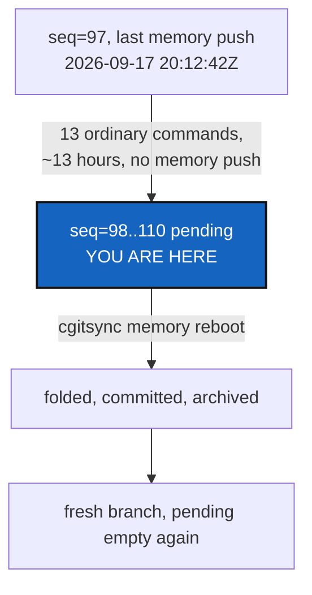

# PendingAccumulation — why `.cgitsync` was holding a dozen States, not one

*Created: 2026-09-18*

*Branch: memory-dev*

> **Owner observation — 2026-09-18**, looking at `.cgitsync/lgr` and
> `.cgitsync/.memory/lgr`: *"I have the feeling that the rule
> `.cgitsync/.memory` holds the state of the project and `.cgitsync` what
> will be the former state is not properly implemented — I see 12 .toml
> entries in `.cgitsync/lgr` and as many in `state`. To my opinion the
> working directory shouldn't hold much more than one state. Write a
> ticket for memory-dev branch with the current state, then reboot the
> memory with cgitsync and check if this anomaly was linked to the fact
> that `.memory` is still in a dev phase."*

## Abstract — read this first

**The one-line version.** The split is implemented correctly —
`.cgitsync` (pending) held thirteen entries because `cgitsync memory push`
had not run in the roughly thirteen hours since the last one, not because
the fold mechanism failed to move them. `memory reboot`, run as the
owner's own check, folded and pushed all thirteen and confirms it: the
pile is gone, and the mechanism that should have moved it earlier did,
the moment it was asked to.

**What this document is.** The evidence gathered before touching
anything, then the same tree's state read again after `cgitsync memory
reboot` ran, so the before/after answers the owner's actual question
rather than a general description of how the split is supposed to work.

**Why it exists.** The observation was sharp and specific — real counts,
a real intuition about what "a working directory" should hold — and
deserves a real answer with the numbers, not a reassurance.

**What you will find.** §1 the state before anything ran: what was
pending, what was folded, and when each pending entry was actually
written. §2 what running `memory reboot` did. §3 the answer: linked to
active development, or to `.memory` itself still being unfinished. §4 one
worthwhile follow-up, not a bug fix.

**Who it is for.** Whoever reads this to confirm the split works as
designed, and the owner, for §4.

**What you need to do with it.** Read §1's timestamps first — they are
the whole answer before §3 ever states it.



---

## 1. The state before anything ran

```console
$ ls .cgitsync/lgr | wc -l
14                                    # 13 numbered entries + HEAD
$ ls .cgitsync/state | wc -l
12
$ ls .cgitsync/.memory/lgr | wc -l
98                                    # 97 numbered entries + HEAD
$ ls .cgitsync/.memory/state | wc -l
124
```

The split itself was exactly as designed: 97 entries already folded and
pushed, 13 sitting in `.cgitsync` since the last fold. What the 13 pending
entries actually were, by `command` and `recorded_at`:

```
seq=98   2026-09-17T20:14:04Z  checkout
seq=99   2026-09-17T20:16:33Z  push
seq=100  2026-09-17T22:54:10Z  commit
seq=101  2026-09-17T22:58:57Z  checkout
seq=102  2026-09-17T22:59:20Z  checkout
seq=103  2026-09-18T07:38:43Z  commit
seq=104  2026-09-18T08:00:00Z  commit
seq=105  2026-09-18T08:29:18Z  commit
seq=106  2026-09-18T08:29:45Z  push
seq=107  2026-09-18T08:42:20Z  commit
seq=108  2026-09-18T08:42:31Z  push
seq=109  2026-09-18T08:44:37Z  checkout
seq=110  2026-09-18T09:46:24Z  push
```

The last folded entry, seq=97, is a `push` recorded at
`2026-09-17T20:12:42Z`. Every one of the 13 pending entries came *after*
that moment — the earliest 21 seconds later, the latest almost 13 hours
later — and not one of them is a `memory push`. `commit`/`checkout`/`push`
here are ordinary project-repository operations (`cgitsync commit`,
`cgitsync checkout`, `cgitsync push`), each of which correctly writes its
own State and ledger entry into the pending half, exactly as designed —
the memory's *own* push, the one command that empties the pile, is simply
the one command in this list that never ran.

## 2. What `memory reboot` did

```console
$ pixi run cgitsync memory reboot
folded=45 pending record(s)
archived=ComplexGitSync -> ComplexGitSync.archived-20260918
exported=/home/.../.cgitsync/.memory/.cgs/ComplexGitSync-v2.cgs
branch=ComplexGitSync (fresh, empty)
```

`folded` counts **files** moved across every subdirectory the fold
touches (`lgr/`, `state/`, `logs/`, `.cgs/`, `commit-logs/`), not ledger
entries alone — the 13 pending ledger entries from §1 are 13 of those 45
files; the rest are their matching State files (`.gts`/`.cgs` pairs, one
per State recorded since the last fold) and the run logs each command
wrote alongside them. Confirmed directly: the archived branch
(`ComplexGitSync.archived-20260918`) holds `lgr/` growing from 98 to 111
tracked files and `state/` from 124 to 136 — a clean +13 in each,
matching §1's count exactly. Nothing was left behind: `.cgitsync/lgr` and
`.cgitsync/state` are empty on disk afterward, and the fresh
`ComplexGitSync` branch has no commit yet, exactly as designed.

## 3. The answer: development pace, not an unfinished mechanism

**Not linked to `.memory` still being in a dev phase**, in the sense of an
incomplete or buggy fold. The fold moved exactly what it was supposed to
move, the moment it was asked to (§2). What *is* true is that this
project's own `memory-dev` workstream has been an unusually intensive
session — several hours of `checkout`/`commit`/`push` activity, a crash
investigation, a manual merge, several more commits — run entirely without
a single `memory push` in between. `cgitsync` never pushes a memory
automatically (`.localSpec/AdditionalSpecs.md`'s *"It must work offline"*
refusal, memory-dev_1-1_MemoryArchitecture_DevPlanTicket.md §5); thirteen
ordinary commands with no memory push in between produces exactly thirteen
pending entries, by design, on any workspace, `.memory`'s own development
status notwithstanding.

The owner's intuition — "the working directory shouldn't hold much more
than one state" — is correct as a description of the *common* case (a
`memory push` shortly after each real unit of work) and wrong only about
which side of the tool was responsible for this particular gap: nothing
in `.cgitsync/.memory` needed finishing for the pile to have stayed this
size. Running `memory push` at any point across those 13 hours would have
kept it at one or two.

## 4. One worthwhile follow-up — not a bug

`cgitsync status`/`memory status` report `states`/`entries` as one
combined, folded-plus-pending count today (`memory_status` in
`orchestre.py`) — there is nowhere a reader is told *how many of those are
still pending*, which is exactly the number that would have made this
thirteen-hour gap visible earlier rather than needing a manual count.
Recommendation: `memory status` prints a `pending=<n>` figure (entries
present in `.cgitsync/lgr` but not yet in `.cgitsync/.memory/lgr`)
alongside `states=`/`entries=`, so a long session surfaces its own memory
push cadence.  Not built here — a small, self-contained addition, worth
its own short ticket if the owner wants it.

## What this ticket does not cover

- **Changing when `memory push` runs.** It stays manual and opt-in,
  exactly as designed (`memory-dev_1-1_MemoryArchitecture_DevPlanTicket.md`
  §5, *"It is not a sync service"*). This ticket found no reason to
  reopen that.
- **The `pending=<n>` figure itself.** Named in §4 as worth doing, not
  done — it is a reporting addition, not a fix for anything broken.
