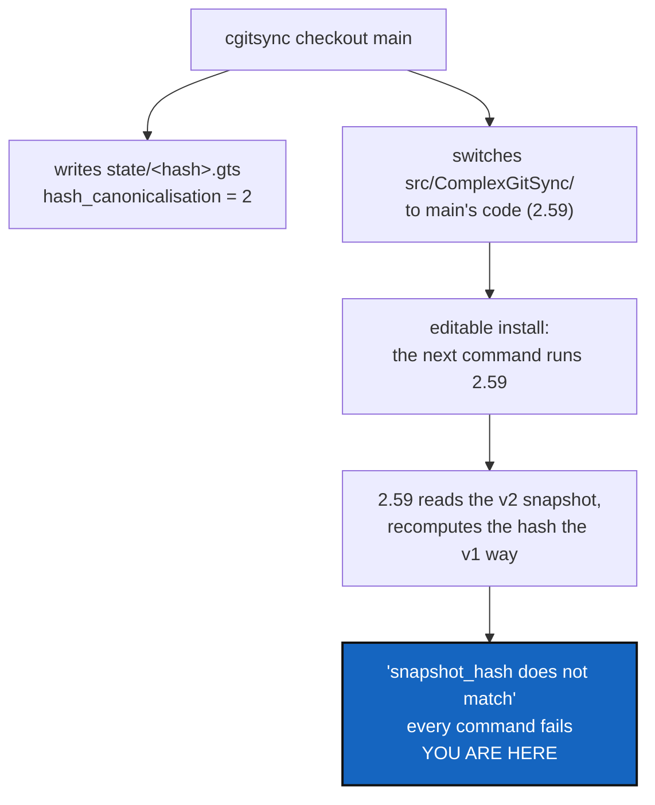

# SnapshotVersionGuard — an older build must say "newer snapshot", not "corrupt"

*Created: 2026-09-16*

*Branch: main*

> **Ticket review — 2026-09-18.** Moved from `1-1` to `1-2`: the original
> order reflected filing date, not severity, and
> [CheckoutForkGuard](../archive/20260918_CheckoutForkGuard_DevPlanTicket.md)
> — a live, repeat-offender bug versus this already-recovered-from incident
> — took the first slot instead. Back to `1-1` the same day, after
> CheckoutForkGuard's own implementation archived it and left this pile
> with a gap to compact, not because the severity comparison changed.

> **Incident ticket.** Written the day it happened, 2026-09-16, from a real
> breakage in the developer workspace: every `cgitsync` command failed with
> a hash-mismatch error after a branch switch. Cause found, workspace
> recovered, no data lost. This ticket is the durable fix.

## Abstract — read this first

**The one-line version.** `cgitsync checkout main` wrote a snapshot in the
new format and, in the same run, replaced the tool with a build that cannot
read it — which then reported the perfectly good snapshot as corrupt.

**What this document is.** An incident report with the cause chain proved,
and the three things worth building so it cannot bite the same way twice.

**Why it exists.** ComplexGitSync manages itself. That is its best feature
and its sharpest edge: a branch move swaps the code *and* leaves the
workspace behind, so the tool that reads a workspace after a checkout is
not the tool that wrote it. Everything that changes a stored format has to
survive that.

**What you will find.** §1 what the user saw. §2 the cause, step by step.
§3 why the message made it worse. §4 the decisions. §5 work packages. §6
acceptance. §7 what this is not about.

**Who it is for.** Whoever picks this up — and anybody who hits the same
wall before it lands: §2.4 is the recovery.

**What you need to do with it.** Answer §4, then §5. D1 is small and worth
doing on its own.



---

## 1. What the user saw

`checkout main` succeeded and printed a healthy tree. Every command after
it failed:

```text
$ pixi run cgitsync add --private .localSpec/DevTickets/shortTickets/addCommitMsgToMem.md
source=…/.cgitsync/state/2acdc98b….gts (from most recent snapshot)
cgitsync add: Invalid .gts document:
  • [document] snapshot_hash does not match canonical .gts content hash

$ pixi run cgitsync checkout memory-dev
cgitsync checkout: Invalid .gts document:
  • [document] snapshot_hash does not match canonical .gts content hash

$ pixi run cgitsync status
cgitsync status: Invalid .gts document:
  • [document] snapshot_hash does not match canonical .gts content hash
```

Including the command that would have undone it. The workspace was not
broken and the snapshot was not corrupt: both were fine, and the tool
reading them had gone backwards in time.

## 2. The cause

### 2.1 The sequence

1. The workspace was on `memory-dev`, running that branch's build, which
   names a State by its content and stamps
   `document.hash_canonicalisation = 2`.
2. `cgitsync checkout main` moved every repository to `main` — **including
   the ComplexGitSync repository itself**, which is the tool being run.
3. Like every lifecycle command, that checkout finished by writing a fresh
   snapshot: `state/2acdc98….gts`, stamped version 2.
4. `pixi.toml` installs this checkout editable (`path = "."`), so from the
   next command on, the running tool was `main`'s build — which predates
   version 2 by two commits.
5. That build computes a snapshot's hash the version-1 way, unconditionally.
   Against a version-2 document it gets a different digest, and
   `GtsDocument.validate` refuses the file.
6. Every command loads a snapshot, so every command failed.

### 2.2 Why it was not caught

The suite that shipped version 2 passes on version 2, and `main`'s suite
passes on version 1. Nothing runs *one* build against the *other's*
workspace, which is the only place this lives. The compatibility that was
designed and tested is the one that matters least here — old snapshots read
by a new build. The direction that bit is the opposite one.

### 2.3 What the design got right

Nothing was lost, and that is not luck: entries are never rewritten, the
old snapshot files were left alone, and the new format declares its own
version instead of changing meaning silently. Had version 2 simply changed
the hash without a field saying so, the same crash would have been
indistinguishable from real corruption.

### 2.4 The recovery, for anyone who hits this before the fix lands

Put the tool back on the branch that understands the workspace, with plain
Git — `cgitsync` itself cannot run:

```bash
git checkout memory-dev      # in the ComplexGitSync repository only
pixi run cgitsync status     # reads again
```

Do **not** delete the snapshot: it is valid, and a newer build reads it.

## 3. The message made it worse

`snapshot_hash does not match canonical .gts content hash` describes the
arithmetic and hides the cause. To the reader it says *this file is
corrupt*, which invites deleting it — the one action that would have turned
a recoverable afternoon into lost history. What it should say is *this
snapshot was written by a newer ComplexGitSync than the one you are
running*.

This is the same rule the tool already follows elsewhere: `verify`
distinguishes "corrupt" from "legacy" and from "no history" precisely
because one word for four situations teaches people to ignore it.

## 4. Decisions — your call

### D1. What does an unknown canonicalisation do?

Recommendation: **refuse, by name, before hashing anything.** When
`document.hash_canonicalisation` is higher than the running build
understands, say so and stop — never recompute a hash that cannot match and
report the mismatch. Suggested wording:

```text
cgitsync status: this snapshot was written by a newer ComplexGitSync
(snapshot format 2; this build reads up to 1). Upgrade, or pass --gts with
a snapshot this build wrote.
```

Exit `2` under [CliContract](../archive/20260916_CliContract_DevPlanTicket.md):
the command could not run. Cheap, and it turns a frightening message into
an instruction.

**It only helps forward.** A build released before the guard still says
"hash mismatch"; §2.4 is the answer for those, and it belongs in the
README.

### D2. Should a self-managing checkout warn before swapping its own code?

The tool already knows when it is managing itself: `status` prints
`use_case=nested` exactly when the running installation lives inside the
workspace. So the information is there.

| Option | What happens |
|---|---|
| **Warn after the move** (recommended) | `checkout` notices the root repository is the running installation and prints one line: the tool has just changed under you, and the next command runs a different build |
| Refuse without `--force` | Safer and wrong: switching branches in your own checkout is the normal way to develop this project |
| Nothing | The user finds out from the next failure, which is what happened |

### D3. Should a lifecycle command write a snapshot the running build could not read back?

The deeper version of the same question. `checkout` wrote a version-2
snapshot as its last act, then made version 2 unreadable. Options: write
the snapshot *before* moving the repository that carries the tool; or skip
the write when the root repository's own branch changed; or leave it and
rely on D1's message. Recommendation: **leave the ordering alone and rely
on D1** — reordering makes the snapshot describe a tree that no longer
exists, which is a worse lie than a clear refusal.

### D4. Does anything test one build against the other's workspace?

Recommendation: yes, and it is the only test that would have caught this.
Not two installs — a fixture: a version-2 snapshot on disk, read by code
forced to understand only version 1, asserting the refusal of D1 rather
than a hash mismatch. Cheap, no second environment, and it fails today.

## 5. Work packages

| WP | Depends on | Touches | Deliverable |
|---|---|---|---|
| **WP-G1** | D1 | `gts_document.py`, `errors.py` | A document declaring a canonicalisation this build does not know is refused by name, before any hash is computed |
| **WP-G2** | D1 | `cli/exit_codes.py`, `README.md` | The refusal maps to exit `2`, and the README says what to do about it — including §2.4's recovery for builds without the guard |
| **WP-G3** | D2 | `operations.py`, `cli/expert.py` | `checkout` says, in one line, when it has just replaced the running installation |
| **WP-G4** | D4 | `tests/` | A version-2 snapshot read by a version-1-only reader: refused by name, never "hash mismatch". Plus the reverse, which already works |
| **WP-G5** | all | `.localSpec/AdditionalSpecs.md` | The rule beside the format itself: every stored format declares its version, and a reader that meets a version it does not know refuses by name |

## 6. Acceptance

- A snapshot declaring a canonicalisation the build does not know produces
  a message naming both versions and telling the user what to do, exit `2`,
  no hash arithmetic in the output.
- The word "corrupt" appears nowhere in that path.
- A snapshot this build *can* read is unaffected, including every
  version-1 snapshot on disk today.
- `cgitsync checkout <branch>` in a nested workspace says when it has
  changed the tool itself.
- A test reads a version-2 fixture with a version-1-only reader and asserts
  the refusal.
- `README.md` documents the recovery for a workspace already in this state.
- `pixi run lint` and `pixi run test` pass.

## 7. What this is not about

* **The hash change itself.** Naming a State by its content is right and
  stays; see the archived StateIdentity ticket.
* **Migrating old snapshots.** They are read as they are, for ever. Nothing
  here rewrites one.
* **Two-way compatibility in general.** This ticket buys a clear message in
  one direction, not the ability to run an old build against a new
  workspace.
