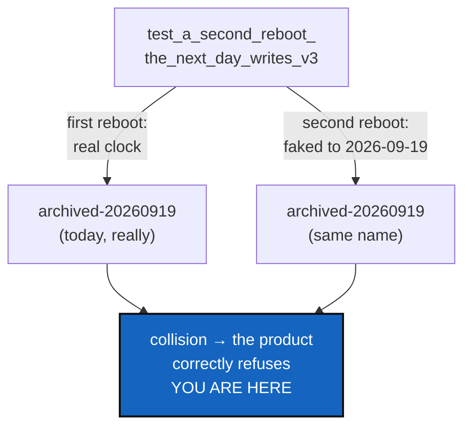

# ClockSeam — a test that reads the real calendar, and the seam that stops it

*Created: 2026-09-19*

*Branch: main*

> **This blocks every commit in the repository, including
> [TreeEnvironment](main_1-2_TreeEnvironment_DevPlanTicket.md).**
> CLAUDE.md's before-committing checklist requires `pixi run test` to
> pass, and it does not. Filed at rank 1-2 because TICKETLIFECYCLE §2.1
> appends a new ticket to the end of its pile and re-ranking is the
> owner's call — but §1 is roughly an hour's work and unblocks the rest,
> so in practice it goes first. Promote it to 1-1 at the next Ticket
> review, or simply fix §1 and leave the ranking alone.

## Abstract — read this first

**The one-line version.** One integration test asked the real calendar
what day it was, and stopped passing on 2026-09-19. It is not flaky — it
is red from that date onward, for ever.

**What this document is.** The fix for that test, and for the reason it
was writable in the first place: `orchestre.py` reads the clock directly,
eleven times across seven modules, while the injectable clock that would
have prevented this already exists in Ring 0 and has exactly one user.

**Why it exists.** A red suite blocks every commit this project's own
rules allow. And a test that passes on one calendar day is worse than a
failing one, because it was green in the commit that introduced it.

**What you will find.** §1 the broken test and its one-line fix. §2 the
seam. §3 what is *not* broken — the product code is correct. §4 work
packages. §5 acceptance.

**Who it is for.** Whoever picks it up. No owner decision is needed for
§1; §2's scope is worth a glance.

**What you need to do with it.** Do §1 today. §2 can follow.



---

## 1. The broken test

`tests/integration/test_memory_reboot.py::test_a_second_reboot_the_next_day_writes_v3`.

It performs two reboots. The second is monkeypatched to believe the date
is 2026-09-19. **The first is not patched at all** and uses the real
clock. The test was written on 2026-09-18, when "the real clock" and "the
next day" were genuinely different days, and it passed. From 2026-09-19
both reboots land on one date, the second collides with the first, and
the product does exactly what it should:

```
GitSyncError: demo_x.archived-20260919 already exists — this memory was
already rebooted today. Archive it under another name yourself first, or
wait for tomorrow.
```

**The fix is to patch both reboots**, to two fixed dates that are not
today and never will be. A test about "the next day" must own both days;
borrowing one from the machine means the machine gets a vote.

It is the only test in the suite that does this. `tests/unit/`'s dated
tests (`test_ledger_entry.py`, `test_ledger_store.py`) all inject a
`FakeClock` and are unaffected — which is the whole point of §2.

## 2. The seam that already exists, and is not used

`memory/ledger_entry.py` defines `ClockProtocol` — `now`, `time_ns`,
`pid`, `token_hex` — precisely so that entry creation is deterministic
under test. Its docstring says so outright. **It has one user.**

Everywhere else reads the clock directly: five times in `orchestre.py`
(the reboot archive name among them), and once each in `paths.py`,
`settings.py`, `registry.py`, `memory/store.py` (twice) and
`memory/repository.py`. Every one of those is a place a test must reach
for `monkeypatch` and a place a future test can make the same mistake.

This is not a call to inject a clock into eleven call sites at once. Most
of them stamp a workspace directory name or a `generated_at` field that
no test asserts on. The two worth doing are the ones a test already has
an opinion about:

| Site | Why it matters |
|---|---|
| `orchestre.py`'s reboot archive name | The one that broke. A test asserts on the exact string it produces |
| `memory/repository.py:237`'s commit moment | A memory commit message carries it; `test_memory_repository.py` reads it back |

The rest are recorded here so that the next person adding a dated
assertion knows the seam exists and reaches for it rather than for
`monkeypatch`.

## 3. What is not broken

**The product code is correct and the refusal is the right behaviour.**
Two reboots on one day would produce two branches with one name; refusing
by name, and saying how to proceed, is better than either overwriting or
inventing a suffix. `test_rebooting_twice_the_same_day_refuses_rather_than_collide`
asserts that on purpose and passes.

Nothing in this ticket changes what `memory reboot` does. It changes what
a test is allowed to assume.

## 4. Work packages

| WP | Does |
|---|---|
| **WP1** | Patch both reboots in the failing test to fixed dates. Suite green. **Do this first** — it unblocks every other commit |
| **WP2** | Give the reboot archive name and the memory commit moment an injectable clock, reusing `ledger_entry.ClockProtocol` rather than defining a second one. Drop the `monkeypatch` from the tests that reach for it |
| **WP3** | A one-line note in `AdditionalSpecs.md`'s *Testing* section: a test that asserts on a date injects the date. Cheap, and it is the rule that would have prevented this |

## 5. Acceptance

- `pixi run test` is green, and stays green when the system clock is set
  to any date. Check it by running the suite with the clock moved, not by
  reasoning about it.
- No test in `tests/` compares a value derived from `datetime.now()`
  against a literal date.
- `cgitsync status` on this tree still shows `errors=0`.
