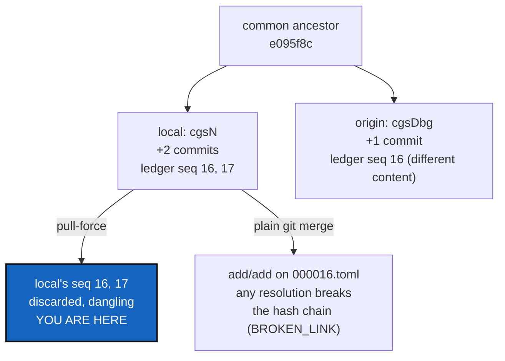

# DivergedPrivateRepo — when two machines both write to the same private repo, the CLI's only suggestion loses data

*Created: 2026-09-22*

*Branch: memory-dev*

> **Superseded — 2026-09-22.** Merged into
> [Autofix](../openTickets/main_1-1_Autofix_DevPlanTicket.md) (`main`,
> queued first), on the owner's explicit instruction: *"merge the two
> memory-dev priority 1 tickets into an autofix one in main, and queue it
> first."* Every finding here (§1-§4) and WP1's completed hand-fix carried
> over verbatim; nothing here was wrong, this document just stopped being
> the one place the design lives. Archived, not deleted, the same day it
> was written.

> **Owner incident — 2026-09-22, in conversation.** Two agent sessions
> ("cgsN", this one, and "cgsDbg", a parallel debugging session) both
> committed to the owner's private `.memory` repository from the same
> ancestor. `cgitsync status` showed `.memory` as `ahead(+1)`; `push
> --private` was rejected by the remote (`fetch first`); `pull` then
> refused with *"Diverging branches can't be fast-forwarded"* and printed
> exactly one piece of advice: *"You can try cgitsync pull-force
> command."* The owner's own words: *"I am continuing to have problem.
> Even after you intervene."* — a near-identical divergence in `.localSpec`
> minutes earlier needed a hand-run `git merge` to fix, because `cgitsync`
> itself offers nothing between "fast-forward or fail" and "force". This
> ticket was requested as "a detailed user guide that covers tricky git
> operations translated as cgitsync ones"; §2 explains why the guide
> cannot honestly be written yet for this specific case, and why that is
> the more important half of the work.

## Abstract — read this first

**The one-line version.** `cgitsync`'s only answer to a diverged private
repository is `pull-force`, which is a hard reset to the remote's tip — for
a repository whose local commits are prose (`.localSpec`) that merges away
the divergence for free; for `.memory`, whose commits are a hash-chained,
sequence-numbered ledger, it is `git checkout -B <branch> FETCH_HEAD`,
silently discarding every local-only ledger entry.

**What this document is.** A diagnosis of one real incident, why the same
"diverged" status means two very different things depending on which
private repository it is naming, and a plan for the one thing genuinely
missing: a reconciliation path for a repository whose git history has an
invariant a plain merge does not know about. The user guide the owner
asked for is real work (§6, WP3) but is downstream of §5's decision — a
guide can only describe what is actually safe to do.

**Why it exists.** `cgitsync status`'s `SYNC` column already distinguishes
`ahead`/`behind`/`diverged`, and the tool already has both a safe path
(`merge`/`merge --resolve`, built for the tree's Git repositories) and a
destructive one (`pull-force`, built for exactly this "give up and reset"
case). Neither one is chain-aware, and nothing routes a `.memory` (or any
future content-addressed private repository — `omniscience`'s register is
the next one, and is explicitly append-only-forever) away from the
destructive path when the safe one would corrupt it just the same.

**What you will find.** §1 the incident, reproduced against this tree's
own remotes. §2 why `.localSpec` and `.memory` needed opposite answers to
the same symptom. §3 what `pull-force` actually does, read from the code,
and why its own CLI hint is the wrong next step here. §4 what a
chain-aware reconciliation would need to do instead. §5 the decisions. §6
work packages, including the user guide. §7 acceptance.

**Who it is for.** The owner, for §5 — in particular whether a real
`memory merge`/rebase-style command gets built now or the guide ships
first with an honest "not yet safe, do this by hand under supervision"
section. Then whoever picks up §6.

**What you need to do with it.** Read §2 and §3 before touching the
owner's currently-diverged `.memory` — it is still sitting diverged as of
this writing, and `pull-force` run against it right now would discard two
real ledger entries.

---

## 1. The incident, reproduced

Confirmed against this tree's own `.localSpec` and `.memory` remotes,
2026-09-22:

- `.localSpec` diverged +1/-1 from a genuine parallel edit (the owner's
  `PrivateLocalBranchAtClone` diagnosis, committed to origin while this
  session closed `ProjectSpecSplit` locally). `git merge
  origin/ComplexGitSync` resolved it with **zero conflicts** — git's rename
  detection and a normal three-way text merge were enough, because both
  sides edited independent prose.
- `.memory` diverged +2/-1 the same way, minutes later, from a second
  parallel session ("cgsDbg") folding its own pending memory. `cgitsync
  status` reported it as `ahead(+1)` (undercounting — the real number was
  2 local-only commits once `push` actually ran and re-measured). `push
  --private` was rejected by the remote for the same reason any diverged
  push is. `pull` (plain, no `--private`) then refused outright:
  `fatal: Not possible to fast-forward, aborting`, followed by the CLI's
  only suggestion: `cgitsync pull-force`.

Nothing in the session between the failed `push` and the failed `pull`
told the owner that the `.localSpec` fix (`git merge`) would not be the
right move here too, or that the tool's own suggested command would not
attempt one.

## 2. Why the two repositories needed opposite answers

**`.localSpec` is safe to merge because its history has no invariant
beyond "these are files".** Two branches editing different Markdown
prose merge the way any two feature branches do; `git`'s three-way merge
is the correct tool, and it worked here without help.

**`.memory` cannot be merged the same way, because its history is not a
set of independent edits — it is a chain.** `memory/ledger_entry.py`'s
`LedgerEntry` carries `seq` and `prev`: `build_next_entry`
(`ledger_entry.py:205-264`) sets each new entry's `seq = prev.seq + 1` and
`prev = prev.entry_hash`, and `memory/ledger_store.py` writes one file per
entry named `<seq:06d>.toml` (`entry_path`, `ledger_store.py:106-108`).
Two sessions that both fold pending memory after the same ancestor both
compute the **same** next `seq` and write to the **same** filename with
**different** content — a plain `git merge` does not see two independent
changes, it sees an add/add conflict on `000016.toml` (using the numbers
from this incident). Resolving that conflict by picking either side, or by
concatenating both, drops the other session's entry silently, and
`memory/integrity.py`'s `verify_chain` (`integrity.py:204-249`,
`_check_seq_integrity` at `integrity.py:252+`) will flag everything
downstream of the drop as `BROKEN_LINK` the next time anyone checks — the
ledger does not fail loudly at merge time, it fails later, for whoever
runs `memory verify` next.

**The `SYNC` column cannot see this difference.** `ahead`/`behind`/
`diverged` is computed from commit topology alone (`git_runner.py`'s
tracking-state query), the same way for every private/local repository —
it has no notion that this particular repository's commits are not
independent.

## 3. What `pull-force` actually does, and why its hint is dangerous here

`cli/expert.py`'s help text for `pull-force` already calls it
"Destructively resynchronise..." (`cli/expert.py:49`) — the danger is
documented, once, in `--help`. What it does, read from the code: default
scope is the **whole tree** (`orchestre.py:3048-3050`, `RepoScope.ALL`
unless `--private` narrows it), and for each repository in scope with a
remote tracking branch, `git_runner.force_pull`
(`git_runner.py:775-792`) runs `git fetch`, then **`git checkout -B
<branch> FETCH_HEAD`** — rewriting the local branch tip to the remote's,
not merging — then `git clean -fd`. For this incident, that is a hard
reset of `.memory` to `cgsDbg`'s tip: `cgsN`'s two local-only commits
(17 and then 19 states) become dangling and are gone the moment nothing
else references them, which for a leaf-only, single-workspace repository
is immediately.

**The hint the CLI prints on a failed `pull` does not carry that warning
forward.** `git_runner.py`'s failure path for a non-fast-forward `pull`
prints only `"You can try cgitsync pull-force command"` — accurate advice
for a repository like `.claude` or `.localSpec` where the owner has
decided the remote's version should simply win, and the wrong first
suggestion for a repository where the local commits are the only copy of
work nobody has pushed anywhere else yet.

**Preflight does not catch this either.** `operations.py:1785`'s
`_run_preflight_checks` treats `SyncState.AHEAD` as `WARNING`
(advisory-only — `warnings.warn`, execution proceeds,
`operations.py:1981-1988`) and `DIVERGED` as `BLOCKING_ERROR`
(`operations.py:1989-2004`), but only `push_tree`/`commit_tree` call it.
Plain `pull` (`restart_tree`, `operations.py:356-382`) runs **no**
tracking-state preflight at all — confirmed by grep, none of
`_run_preflight_checks`'s seven call sites is inside `_restart_tree`. So
a diverged `pull` fails on the `git` command itself, with no cgitsync-level
check having looked at the situation first.

## 4. What is missing

Nothing in this codebase reconciles two branches whose *content* has a
sequencing invariant beyond what git's own DAG already encodes.
`memory_reboot` (`orchestre.py:4730-4765`) archives an existing branch
into a fresh one — a different operation, for a different problem (a
memory that has grown unwieldy, not one that has diverged). The generic
`merge_tree`/`merge --resolve` machinery (`operations.py:1231` and
`git_runner.py:794-813`) is Git-repository-generic and has no seq/prev
awareness; running it against `.memory` would hit the same add/add
conflict §2 describes, with no guidance about what "resolved" needs to
mean here.

**What a real fix would need to do**, sketched, not designed:
renumber the losing side's new entries to continue *after* the winning
side's tip — recomputing each replayed entry's `prev` to point at the
new predecessor and its `seq` accordingly, the same shape as `git
rebase --onto`, but operating on the ledger's own chain field, not on git
commit order. `Omniscience`'s append-only register (`memory-dev_2-1`) will
need the identical operation the day two people's local memories both try
to announce into it at once — this is not `.memory`-specific, it is
"what does append-only mean when two writers append at the same time,"
which that ticket's own §3/§4 already names as its hardest open question
without yet answering it for this case.

## 5. Decisions

| D | Question | Recommendation | Whose call |
|---|---|---|---|
| **D1** | Build a chain-aware reconciliation command now, or ship the guide first with an honest "not safe yet, ask a human" section? | **Guide first.** A wrong reconciliation tool shipped under time pressure is worse than an honest gap; the guide can point at this ticket by name until D2 is answered | **Owner** |
| **D2** | Does the eventual command live in `memory/` (repository-specific) or does `git_runner`/`operations.py` grow a generic "sequenced-content merge" primitive that `memory/` and later `omniscience` both use? | **Generic primitive**, per §4's note that `Omniscience` needs the identical operation — building it twice is the six-private-copies mistake `git_branch.py`'s own docstring already warns against, one abstraction level up | Owner |
| **D3** | What happens to the owner's actual, currently-diverged `.memory` while D1/D2 are still open? | Resolve it by hand, once, under supervision: `git merge --no-commit` to inspect the conflict, then hand-splice the two ledger entries into two consecutive `seq` numbers (whichever order actually happened), recompute the second one's `prev`, and run `memory verify`/`verify_chain` before trusting the result. Document the exact steps taken as this ticket's own worked example once done, since nothing this concrete exists yet | Whoever the owner asks — this ticket's §7 tracks it |

## 6. Work packages

| WP | Does | Depends on |
|---|---|---|
| **WP1 — DONE, 2026-09-22** | Resolved the owner's live `.memory` divergence. `git merge origin/ComplexGitSync --no-commit` surfaced exactly the predicted add/add on `lgr/000016.toml`/`000017.toml` plus a `HEAD` cache conflict — nothing else (`state/`/`env/`/`logs/` are content-addressed and merged as a clean union on their own). Rather than "pick a side, splice the loser after," the six colliding/orphaned entries (local's old seq 16-19, origin's old seq 16-17) were re-sequenced in **`recorded_at` order** — the two sessions interleave in real time, so a pure "ours-then-theirs" splice would have reported `TIME_REGRESSION`. Every entry kept its original `command`/`argv`/`state_id`/`recorded_at`; only `seq`/`prev`/`entry_hash` were recomputed, using `ledger_entry.compute_entry_hash` — the same function a real write uses — via a saved, reusable script: [scripts/rescue_20260922_memory_ledger_splice.py](../../scripts/rescue_20260922_memory_ledger_splice.py). Result, checked before committing: `integrity.verify_chain` over all 21 entries returned `HistoryState.VERIFIED`, `is_clean=True`, zero findings; every entry's `state_id` resolves to a file that exists on disk. `cgitsync status` now shows `.memory` as `clean ahead(+3)`, `errors=0` | D3 |
| **WP2 — SUPERSEDED, 2026-09-22** | The generic reconciliation primitive per D2. Split out into its own ticket, LedgerAutofix (now merged into Autofix), on the owner's request, the same day WP1 shipped and proved the algorithm by hand — that ticket holds the design (`autofix.py`, detection, safety properties) this row used to hold | D1, D2 |
| **WP3** | **The user guide the owner asked for**: one document, tricky git states on the left, the safe `cgitsync` command on the right, and — this is the part that makes it honest rather than a wish list — an explicit column for "this repository's content has no ordering invariant, plain merge is fine" versus "it does, do not merge or force without WP2." Covers at minimum: ahead-only (push), behind-only (pull), diverged-mergeable (`.localSpec`-shape: `git merge`), diverged-chained (`.memory`/`omniscience`-shape: LedgerAutofix (now merged into Autofix)'s `cgitsync autofix` once it ships, or WP1's hand-run steps until then), and what `pull-force`'s hint should have said instead of a bare command name | WP1 (for the worked example), LedgerAutofix (for what the chained-diverged row actually recommends once it exists) |
| **WP4** | Fix `pull-force`'s failed-`pull` hint (`git_runner.py`) to name the risk when the repository has local-only commits — at minimum, print `cgitsync status`'s own `ahead(+N)` count for that repository next to the suggestion, so "you are about to discard N commits" is visible before it happens, not only in `--help` | — |

## 7. Acceptance

- ✅ **The owner's live `.memory` divergence is resolved** (WP1,
  2026-09-22): `integrity.verify_chain` over the merged, 21-entry chain
  returns `HistoryState.VERIFIED`, `is_clean=True`, no findings;
  `cgitsync status` shows `.memory` `clean ahead(+3)`, `errors=0`. Not yet
  pushed — that is the owner's call, same as any other commit this
  project makes.
- **Still open**: `pull-force`'s hint (WP4) names what it would discard,
  for any repository where that count is nonzero.
- **Still open**: the guide (WP3) exists, is linked from `README.md`'s
  command table or `docs/Text/user_guide.tex` per this project's own
  documentation rule, and every row names the actual `cgitsync` command —
  not raw `git`.
- **Superseded**: WP2, the generic chain-aware reconciliation primitive —
  WP1's fix was done by hand, once, precisely because it did not exist
  yet. Its design now lives in
  LedgerAutofix (now merged into Autofix).
- `pixi run lint` and `pixi run test` pass; `cgitsync status` shows
  `errors=0`.
