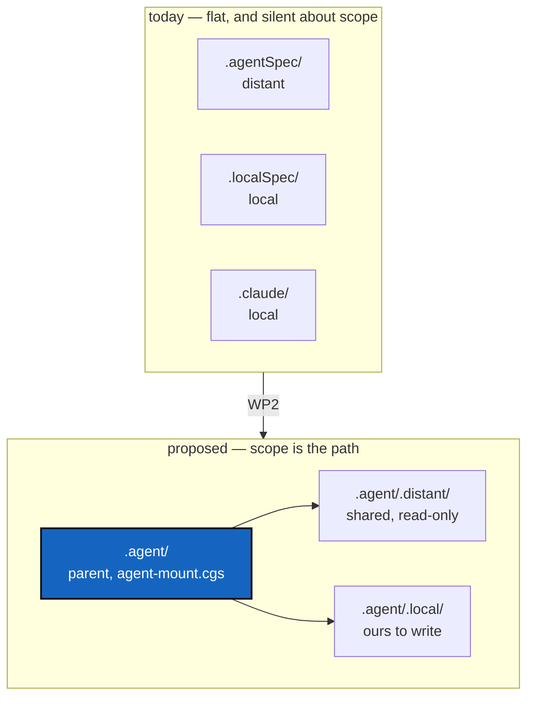

# ProjectSpecSplit — `.agent`, and separating the general spec from this project's own

*Created: 2026-09-20*

*Branch: main*

> **Closing this ticket — 2026-09-22.** WP2 (landed 2026-09-22, verified by
> a fresh `bootstrap` producing a `READY` tree with `errors=0`) and WP3
> (the path sweep, completed in this same pass across every spec, ticket,
> test and doc file — see §5/§6) are both now DONE, alongside the
> already-DONE WP1 and WP4. All six acceptance items in §6 are ✅. One
> adjacent, undocumented finding surfaced and was fixed in passing:
> `bump_version.py` had moved a second time, to
> `.agent/.local/release/scripts/`, under an initiative
> (`AgentSkillsSplit`) with no ticket on file; the orphaned `.localSpec`
> copy is removed and the specs corrected. `pixi run lint`/`test` pass
> unchanged (1632/4). This ticket is archived in the same change.
>
> **Ticket review — 2026-09-22.** Re-ranked from `main_2-6` to `main_1-1` —
> first in the priority-1 pile — on the owner's request to reorganise the
> backlog as: finalize the agentic, then what's important before
> data-repo, then data-repo, then Omniscience. This ticket **is** "finalize
> the agentic," so it leads. The re-rank is also overdue on the merits:
> commits `03ad181` and `a1bbea7` (2026-09-22) show WP2 landed — the four
> agentic repositories now sit under `.agent/.local/` and `.agent/.distant/`
> exactly as this ticket proposed, `CLAUDE.md`/`AGENT.md` still resolve as
> root symlinks (D4), and `src/` docstrings were swept to the new paths —
> without this ticket having been reopened to record it. **WP3 is only
> partly done, and this is not just a formality:** `CLAUDE.md`'s own body —
> the *Layout* section and most of its cross-references — still reads
> `.agentSpec/DevSpec/...` and `.localSpec/...` as if the tree were still
> flat (verified 2026-09-22 by reading the live file), which are now wrong,
> broken relative links from the one document every agent reads first. The
> same sweep has not been checked yet against `AdditionalSpecs.md`,
> `audit.md`, `docs/`, or the other open tickets. Priority 1 is right
> because this is exactly "pick up now, not standby": a checked-in agentic
> spec pointing at paths that no longer exist. **Not archived** — real
> acceptance-criteria work remains (WP3, the path sweep, and re-running §6
> against it) and the ticket's own rule is that closing early is "exactly
> the wrong answer."
>
> **Ticket review — 2026-09-21.** Re-ranked from priority 1 to priority
> 2. WP1 and WP4 — the whole of the active, un-deferred scope — are
> verified done: `AgentConduct.md` exists and reads as designed,
> `.localSpec/scripts/bump_version.py` and every path that points at it
> (`pixi.toml`, `tests/unit/test_bump_version.py`) agree, and
> `DevSpecs.md`'s *Versioning* section carries the fix. `pixi run lint`
> and `pixi run test` pass (1632 passed, 4 skipped, all four
> environment-only); `cgitsync status` shows `errors=0`. What is left —
> WP2/WP3, the `.agent` layout move — is exactly what D2 already called
> "not now": real, analysed work that nothing is waiting on, which is
> priority 2's own definition. This ticket stays open rather than moving
> to `archive/` because D2 says so explicitly ("stays open, to revisit");
> archiving it would have discarded that decision, not honoured it.

> **Owner ticket — `shortTickets/project-spec.md`, 2026-09-20:** *"From
> claude.md separated what are general projectSpec for a cgitsync further
> project and what is ComplexGitSync. It will be a private-distant repo.
> More generally, the agentic may be better organised as a parent-repo
> `.agent` that auto-discover itself with an appropriate
> `agent-mount.cgs`. It will be easier to clearely separate Private
> distant and private-local that way with `.agent/.local` and
> `.agent/.distant`."*

## Abstract — read this first

**The one-line version.** `CLAUDE.md` holds two documents in one — rules
any cgitsync project would want, and rules that are only about
ComplexGitSync — and the four agentic repositories sit loose at the tree
root with nothing saying which are shared and which are ours.

**What this document is.** A reorganisation in two halves that can land
independently: **the layout** (`.agent` as a parent repository, with
`.local` and `.distant` under it) and **the content split** (pulling the
general spec out of `CLAUDE.md`).

**Why it exists.** Today you cannot tell, from where a file sits, whether
editing it changes this project or every project that mounts the same
repository. `.agentSpec` is read-only and shared; `.localSpec` and
`.claude` are ours to write. That distinction is real, load-bearing, and
invisible in the directory listing.

**What you will find.** §1 the layout today and proposed. §2 the content
split and what makes a rule general. §3 the order, which matters more
than usual here. §4 decisions. §5 work packages. §6 acceptance.

**Who it is for.** The owner, for §4, and whoever does the move.

**What you need to do with it.** Read §3 before scheduling any of it —
the two halves have different risk, and one of them can break `bootstrap`
for everybody.

---

## 1. The layout

Four agentic repositories are mounted today, and their scope is visible
only by reading the `.cgs`:

| Mount | Scope today | Under `.agent` |
|---|---|---|
| `.agentSpec` (+ `DevSpec` nested inside it) | private/distant — shared, read-only | `.agent/.distant/.agentSpec` |
| `.localSpec` | private/local — ours | `.agent/.local/.localSpec` |
| `.claude` | private/local — ours | `.agent/.local/.claude` |
| *the new general spec* (§2) | private/distant | `.agent/.distant/` |

`.agent` itself is a repository holding `agent-mount.cgs`, discovered the
same way `.memory` will discover `config-memory.cgs` — an explicit
`nested_config = "agent-mount.cgs"` rather than `"auto"`, for the reason
the AgentReport ticket gives: `auto` globs `*.cgs` and fails on the second
one.

**What the layout buys.** `propagate_privacy` already pushes a parent's
privacy onto everything nested inside it, so `.agent/.distant` could
declare read-only once and have it hold for everything under it, instead
of each entry restating it. The path becomes the answer to "may I edit
this?", which today requires opening the spec.

**What it costs, and this is not small:**

- `CLAUDE.md` and `AGENT.md` at the tree root are **symbolic links into
  `.claude/`**. Moving `.claude` moves what they point at.
- Every path in every spec, ticket and docstring that reads `.localSpec/`
  or `.agentSpec/` changes. That is a large, mechanical, error-prone
  sweep, and `CitationRot` is the ticket that exists because this project
  already has stale paths from a much smaller rename.
- `examples/complexgitsync4dev.cgs` is what CI dogfoods. A tree shape that
  does not clone is a red build for everyone.

## 2. The content split

`CLAUDE.md` currently mixes two kinds of rule. The test for which is
which: **would another project, with different modules and a different
language, want this sentence?**

| General — belongs in the shared spec | ComplexGitSync's own |
|---|---|
| The before-committing checklist as a *shape* (lint, test, the tool's own status, version bump) | `pixi run lint` / `pixi run test`, and the `errors=0` rule for this tree |
| The commit-message rule: `<project><version>`, one message, plain English, three lines | That the project name is `cgitsync` |
| Attribution: the publication rule and the accounting rule | — |
| The two-agent rule (worker and orchestrator) — see [AgentContract](main_1-2_AgentContract_DevPlanTicket.md) | — |
| Document conventions, the `*Created:*` line, the finishing-report bar | Which files this project keeps them in |
| Ticket lifecycle pointers | The branch table: `main` / `memory-dev` / `data-repo` |
| — | The whole module responsibility table and the ring rules |
| — | File formats `.cgs` / `.gts` / `.lgr`, the layout section |

**The general half is roughly: conduct, documents, commits, tickets. The
specific half is: this codebase.** That is a clean cut, and it is worth
noticing that the general half is almost exactly the part that has been
edited most in the last week — which is an argument for getting it into a
repository other projects can pull from.

`.agentSpec/DevSpec/DevSpecs.md` already occupies this space: it is the
project-agnostic philosophy `AdditionalSpecs.md` and `CLAUDE.md` conform
to. **So the general spec may not need a new repository at all** — it may
be a new file in `DevSpec`, which is already private/distant and already
shared. D1.

## 3. The order, which matters here

**The content split (§2) is safe. The layout move (§1) is not.** They are
independent, and doing the safe one first is free.

A mount whose repository or branch does not exist **breaks `bootstrap`
for everyone using the spec, CI included**. MemoryArchitecture records
this exact lesson from `.memory`: the order was push first, declare the
mount second, because an empty repository with no refs broke the clone.
`.agent` is the same situation with three repositories instead of one.

So: create and populate `.agent` before any spec mentions it, move one
repository at a time, and keep the tree bootstrapping after each step.

## 4. Decisions

| D | Question | Recommendation | Whose call |
|---|---|---|---|
| **D1** | Does the general spec need a new repository, or a new file in `DevSpec`? | **A file in `DevSpec`.** It is already private/distant, already shared across projects, and already holds the project-agnostic philosophy this would sit beside. A new repository is a new thing to create, mount, brand and keep in sync, for content that has a natural home | **Owner** |
| **D2** | Is the `.agent` layout move worth its cost? | **Superseded, 2026-09-22.** Answered "not now" on 2026-09-21; the owner went ahead with it the next day anyway (`03ad181`, `a1bbea7`) without this ticket being reopened first — the decision changed, but the record of it did not, until this review | **Owner** |
| **D3** | If the move happens: one `.agent` repository holding mounts, or a plain directory? | A repository, per the owner's words, so `agent-mount.cgs` travels with it and a project mounts one thing instead of four | Owner |
| **D4** | What happens to `CLAUDE.md`'s name and location? | Keep the root symlink working, whatever it points at. It is what every agent reads first, and a project whose entry point moved is a project agents stop reading | Implementer |

## 5. Work packages

| WP | Does | Depends on |
|---|---|---|
| **WP1 — DONE, 2026-09-21** | The content split (§2): general rules moved to [AgentConduct.md](../../../../.distant/dev-sync/AgentConduct.md) (a new DevSpec file, per D1), `CLAUDE.md` trimmed to point at it and keep only ComplexGitSync's own fill-ins. `DevSpecs.md`'s own stale *Versioning* section (CI-auto-increment claim, `YYYY.XX`-only) fixed in the same pass — it was blocking on exactly this ticket, per Versioning §5.3. No directory moves | D1 |
| **WP2 — DONE, 2026-09-22** | `.agent` created and populated: `.agentSpec`→`.agent/.distant/{dev-sync,documentation,ticket}`, `.localSpec`→`.agent/.local/.localSpec`, `.claude`→`.agent/.local/.claude`, plus `.agent/.local/{cgitsync-dev,dogfooding,release}`. Landed in `03ad181`/`a1bbea7`, without this ticket being reopened first — see the 2026-09-22 review note above | D2, D3, WP1 |
| **WP3 — DONE, 2026-09-22** | The path sweep: every `.localSpec/`, `.agentSpec/`, `.claude/` reference in specs, tickets and docstrings. `src/` docstrings and a handful of top-level config files were swept with WP2; everything else — `CLAUDE.md`, `AGENT.md` (both symlinked mounts), `AdditionalSpecs.md`, `audit.md`, `DevTickets/README.md`, `tests/`, `docs/DevGuide/`, `.gitignore` (including two patterns broken outright, not just stale), and the two dead cross-ticket links — swept in this pass. See §6 for the full account. Left alone on purpose: the two test fixtures in `test_git_branch.py`/`test_walk_git_repositories.py` that use `.agentSpec` as an example dot-name, not a path reference, and this ticket's own §1 table/mermaid, which describe the pre-move layout *as history* and would misdescribe it if rewritten. Pairs naturally with [CitationRot](main_1-5_CitationRot_DevPlanTicket.md), which is building the check that would catch a recurrence | WP2 |
| **WP4 — DONE, 2026-09-21** | Moved `scripts/bump_version.py` to **`.localSpec/scripts/`**, not `.agentSpec`/`DevSpec` as first drafted here — every path it touches (`pyproject.toml`, `src/ComplexGitSync/__init__.py`, `docs/Setup/`, ...) is specific to this one project, so it fails the general/specific test (§2) for the *shared* spec repository just as much as it needs to be out of the *public* one. `.agent/.distant` was never going to be right either, since that would still be shared. `pixi.toml`'s `bump-version` task, `REPO_ROOT` inside the script (now three levels up, not two), and `tests/unit/test_bump_version.py` (module-level `pytest.skip` when `.localSpec` isn't mounted, mirroring the existing docs-absent skip) all moved or updated with it. Versioning's other half of this item — the false "CI auto-increments" claim — was already fixed as of Versioning's own implementation | — |

## 6. Acceptance

- ✅ `CLAUDE.md` at the tree root still resolves and still reads as the
  first thing an agent should open.
- ✅ A rule in the general spec names no ComplexGitSync module, command or
  branch. If it does, it was not general. (Checked by hand across
  `AgentConduct.md` and the `DevSpecs.md` edit; no CI check for this yet.)
- ✅ No path in `src/`, `tests/`, `scripts/`, `docs/`, `.gitignore`, or any
  spec or open ticket points at a directory that moved — swept 2026-09-22:
  `CLAUDE.md` and `AGENT.md` (both the *Layout* section and every
  Markdown link — verified each href resolves on disk), `AdditionalSpecs.md`,
  `audit.md`, `DevTickets/README.md`, `.localSpec/AGENT.md`,
  `docs/DevGuide/{README,architecture}.md`, `tests/{unit,integration}/*.py`
  (41 docstring citations), and the two dead links inside
  `MemoryArchitecture` and this ticket's own WP1 row. `.gitignore` also had
  two genuinely broken (not just stale-prefixed) ignore patterns from the
  WP2 commit itself — missing the `.agent/` prefix entirely, so they
  matched nothing — removed rather than fixed, since `/.agent/` alone
  already covers what they were trying to say.
- ✅ A rule in the general spec names no ComplexGitSync module, command or
  branch. If it does, it was not general. (Checked by hand across
  `AgentConduct.md` and the `DevSpecs.md` edit; no CI check for this yet.)
- ✅ A checkout of the public `ComplexGitSync` repository alone has no
  `.agent/.local/release/scripts/bump_version.py`; `pixi run bump-version`
  fails with Python's own file-not-found error rather than silently doing
  nothing (WP4). The path itself moved a second time, undocumented, after
  WP4 shipped this bullet: `AgentSkillsSplit` (no ticket on file) relocated
  the script again, from `.agent/.local/.localSpec/scripts/` to
  `.agent/.local/release/scripts/`, alongside the rest of the `release`
  skill. `pixi.toml` and `tests/unit/test_bump_version.py` already pointed
  at the new location; the orphaned `.localSpec` copy — dead code, tracked,
  committed, and nothing importing it — has been removed (2026-09-22), and
  `AdditionalSpecs.md`'s two citations of it corrected.
- ✅ `pixi run lint` and `pixi run test` pass (1632 passed, 4 skipped —
  same counts as the 2026-09-21 review, confirming the sweep changed no
  behaviour); `cgitsync status` shows `errors=0` (2026-09-22, re-verified
  after the sweep).
- ✅ `pixi run cgitsync bootstrap examples/complexgitsync4dev.cgs
  BootstrapTest --cgs-path <scratch>` produces a working, `READY` tree
  (2026-09-22): all 11 repositories clone into `.agent/.distant/{dev-sync,
  documentation,ticket}` and `.agent/.local/{.auto,.claude,.dev,.localSpec,
  .versioning}` exactly as declared, `CLAUDE.md`/`AGENT.md` resolve as root
  symlinks in the fresh clone, and `cgitsync status` against it shows
  `errors=0`. This exercises what is on the remotes today (the WP3 doc
  sweep above is local and unpushed), so it verifies WP2's layout, not
  WP3's prose — the two were always independent per §3.
