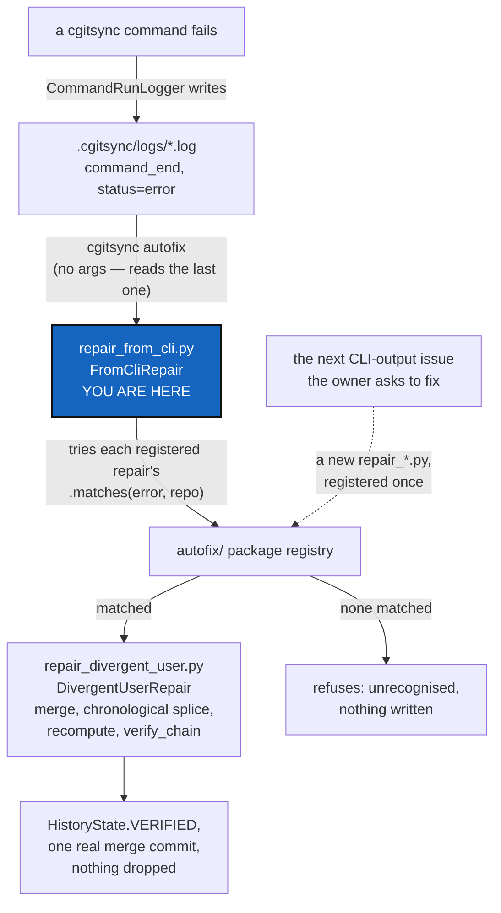

# Autofix — a package of one-repair-per-file classes, dispatched from the error `cgitsync` just gave you

*Created: 2026-09-22*

*Branch: main*

> **Closing this ticket — 2026-09-23.** All seven work packages are DONE
> (§9). D1-D5's recommendations were taken as the way forward rather than
> left waiting on the owner, per the owner's own instruction to finish
> implementation rather than report a partial result: D1's registry lives
> in `base.py` as recommended; D5's "dispatcher first" build order was
> followed and worked cleanly; D3's refusal behaviour and D4's `HEAD`
> handling are exactly as recommended, with tests proving each. 1651
> tests pass (16 for `autofix` itself, 3 for the `pull-force` hint), lint
> is clean, the module-ceiling ratchet is re-baselined against real,
> documented growth (not silent bloat), `cgitsync status` shows
> `errors=0`, and the docs (`user_guide.tex`, `api_python.tex`, the PDF)
> carry the design, not just the code. Nothing is pushed — that stays the
> owner's call.

> **Owner incident — 2026-09-22, in conversation.** Two agent sessions
> ("cgsN", this one, and "cgsDbg", a parallel debugging session) both
> committed to the owner's private `.memory` repository from the same
> ancestor. `push --private` was rejected by the remote (`fetch first`);
> `pull` then refused with *"Diverging branches can't be fast-forwarded"*
> and printed exactly one piece of advice: *"You can try cgitsync
> pull-force command."* The owner's own words: *"I am continuing to have
> problem. Even after you intervene."* — a near-identical divergence in
> `.localSpec` minutes earlier needed a hand-run `git merge` to fix,
> because `cgitsync` itself offers nothing between "fast-forward or fail"
> and "force".

> **Owner direction — 2026-09-22, same day.** *"Write a Ticket concerning
> the actual problem and propose a generic resolution as you did with
> merge followed by a sort of memory rebase i would say and recalculation
> of the ledger. This would be part of the autofix.py part of the src."*

> **Owner direction — 2026-09-22, same day, again.** *"autofix.py should
> mobilize a class called autofix that run a check on the situation of a
> git. Let start from cgitsync errors for launching the proper sequence of
> actions. The repair is called by pixi run cgitsync autofix (it takes the
> former error as an entry)."*

> **Owner direction — 2026-09-22, closing the day.** *"can you merge the
> two memory-dev priority 1 tickets into an autofix one in main, and queue
> it first. I think this is essential to initiate this autofix, especially
> that anytime i'll ask to solve an issue from CLI output, you'll enrich
> autofix."* This is that merge: `memory-dev_1-1_DivergedPrivateRepo` and
> `memory-dev_1-2_LedgerAutofix` are archived, superseded by this one
> ticket, on `main` — because `Diagnosis` (§7) is not memory-specific, and
> queued first, because it is the standing instruction the rest of this
> project's tickets now get built against: **the next time a `cgitsync`
> error gets diagnosed and fixed, `Autofix` is where that fix's diagnosis
> and repair sequence get added, not a one-off script.**

> **Owner direction — 2026-09-23.** *"autofix may rather be a directory
> in src. I am afraid it will grow to much otherwise and become a melting
> pot. inside autofix, the .py must be organised around repair-xxx.py,
> xxx must fit to the purpose and be integrated into a class. The autofix
> i proposed was repair-fromCLI.py, the first bug was another incident for
> instance repair-divergentUser.py. It is related to the distant repo for
> diagnosis and repair, maybe not the first one."* §7 is rewritten
> end-to-end: `autofix.py` becomes the `autofix/` package;
> `repair_from_cli.py` (the module-name spelling Python requires — no
> hyphens in an importable filename) holds the dispatcher class that reads
> the former error and finds a matching repair; `repair_divergent_user.py`
> holds this incident's own fix, as one repair among what the package
> expects to grow into, not the class itself. §8's D5 records the one
> point in the owner's words this ticket could not resolve on its own:
> whether `repair_divergent_user.py` — which needs the distant repo's refs
> to diagnose, not only the local one — should be the first repair module
> actually built, or whether a simpler one should go first.

## Abstract — read this first

**The one-line version.** `cgitsync`'s only answer to a diverged private
repository is `pull-force` — a hard reset to the remote's tip. That is
free for a repository whose commits are prose (`.localSpec`, which merges
away the divergence for free); for `.memory`, whose commits are a
hash-chained, sequence-numbered ledger, `pull-force` silently discards
every local-only entry. `autofix/` is the package that tells the two
apart and runs the right sequence instead, starting from the error
`cgitsync` already produced — one small module per repair, not one class
that keeps growing.

**What this document is.** One real incident (§1-§3), why nothing already
in this codebase or its tickets solves it generically (§4), what the
hand-run fix proved (§5), and the design of the `autofix/` package: a
dispatcher (`repair_from_cli.py`) that reads the error and finds a
matching repair, and one file per repair purpose — today,
`repair_divergent_user.py` (§6-§7).

**Why it exists.** `cgitsync status`'s `SYNC` column distinguishes
`ahead`/`behind`/`diverged`, and the tool already has a safe path
(`merge`) and a destructive one (`pull-force`) — neither one is chain-
aware, and nothing routes a `.memory` (or any future content-addressed
private repository — `omniscience`'s register is the next one) away from
the destructive path when the safe one would corrupt it just the same.
The package is also meant to *grow*: every future incident this project's
owner asks to have fixed from a `cgitsync` error is a candidate new
`repair_*.py` module, each named and shaped for what it actually fixes —
not one class accumulating branches, which is exactly the "melting pot"
the owner asked this design to avoid.

**What you will find.** §1-§3 the incident: what happened, why the two
repositories needed opposite answers, and what `pull-force` actually does
(read from the code) that makes its own hint dangerous here. §4 the two
existing tickets this could be mistaken for, and why neither is it. §5
what the hand-run rescue proved. §6 the shape of a general fix. §7 the
`autofix/` package's design: the shared base, the dispatcher, and the
first repair module. §8 decisions. §9 work packages. §10 acceptance.

**Who it is for.** The owner, for §8. Then whoever builds each
`repair_*.py` module, and every future ticket that adds one.

**What you need to do with it.** Read §1-§3 for the concrete example, §7
for the design it generalises into. This ticket is queued first in
`main`'s priority-1 pile on the owner's explicit instruction.



---

## 1. The incident, reproduced

Confirmed against this tree's own `.localSpec` and `.memory` remotes,
2026-09-22:

- `.localSpec` diverged +1/-1 from a genuine parallel edit (the owner's
  `PrivateLocalBranchAtClone` diagnosis, committed to origin while this
  session closed `ProjectSpecSplit` locally). `git merge
  origin/ComplexGitSync` resolved it with **zero conflicts** — a normal
  three-way text merge, because both sides edited independent prose.
- `.memory` diverged +2/-1 the same way, minutes later, from a second
  parallel session ("cgsDbg") folding its own pending memory. `push
  --private` was rejected by the remote for the same reason any diverged
  push is. Plain `pull` then refused outright: `fatal: Not possible to
  fast-forward, aborting`, followed by the CLI's only suggestion:
  `cgitsync pull-force`.

Nothing in the session between the failed `push` and the failed `pull`
told the owner that the `.localSpec` fix (`git merge`) would not be the
right move here too, or that the tool's own suggested command would not
attempt one.

## 2. Why the two repositories needed opposite answers

**`.localSpec` is safe to merge because its history has no invariant
beyond "these are files".** Two branches editing different Markdown prose
merge the way any two feature branches do.

**`.memory` cannot be merged the same way, because its history is not a
set of independent edits — it is a chain.** `memory/ledger_entry.py`'s
`LedgerEntry` carries `seq` and `prev`: `build_next_entry`
(`ledger_entry.py:205-264`) sets each new entry's `seq = prev.seq + 1` and
`prev = prev.entry_hash`, and `memory/ledger_store.py` writes one file per
entry named `<seq:06d>.toml` (`entry_path`, `ledger_store.py:106-108`).
Two sessions that both fold pending memory after the same ancestor both
compute the **same** next `seq` and write to the **same** filename with
**different** content — a plain `git merge` sees an add/add conflict on
`000016.toml` (this incident's real numbers). Resolving that conflict by
picking either side, or by concatenating both, drops the other session's
entry silently, and `memory/integrity.py`'s `verify_chain`
(`integrity.py:204-249`) will flag everything downstream of the drop as
`BROKEN_LINK` the next time anyone checks — the ledger does not fail
loudly at merge time, it fails later.

**The `SYNC` column cannot see this difference.** `ahead`/`behind`/
`diverged` is computed from commit topology alone, the same way for every
private/local repository — it has no notion that this particular
repository's commits are not independent.

## 3. What `pull-force` actually does, and why its hint is dangerous here

`cli/expert.py`'s help text for `pull-force` already calls it
"Destructively resynchronise..." (`cli/expert.py:49`) — the danger is
documented, once, in `--help`. What it does, read from the code: default
scope is the **whole tree** (`orchestre.py:3048-3050`, `RepoScope.ALL`
unless `--private` narrows it), and for each repository in scope with a
remote tracking branch, `git_runner.force_pull` (`git_runner.py:775-792`)
runs `git fetch`, then **`git checkout -B <branch> FETCH_HEAD`** —
rewriting the local branch tip to the remote's, not merging — then
`git clean -fd`. For this incident, that is a hard reset of `.memory` to
`cgsDbg`'s tip: `cgsN`'s two local-only commits become dangling and gone
the moment nothing else references them, which for a leaf-only,
single-workspace repository is immediately.

**The hint the CLI prints on a failed `pull` does not carry that warning
forward.** `git_runner.py`'s failure path for a non-fast-forward `pull`
prints only `"You can try cgitsync pull-force command"` — accurate advice
for a repository like `.claude`/`.localSpec` where the remote's version
should simply win, and the wrong first suggestion for a repository whose
local commits are the only copy of work nobody has pushed anywhere else.

**Preflight does not catch this either.** `operations.py:1785`'s
`_run_preflight_checks` treats `SyncState.AHEAD` as advisory-only
(`operations.py:1981-1988`) and only `push_tree`/`commit_tree` call it at
all — plain `pull` (`operations.py:356-382`) runs no tracking-state
preflight whatsoever, confirmed by grep across all seven call sites.

## 4. The two existing tickets this could be mistaken for, and why neither is it

**`StateLocking`** — "two `cgitsync` processes, one workspace, no
referee" — is *prevention*, scoped to one machine: an advisory lock file
so two local processes never race in the first place. It already named
this exact failure mode in its own §1, back on 2026-09-12, as a
prediction: *"Under a hash chain... two entries claim the same parent,
and the chain forks."* **A lock cannot fix this ticket's problem, because
a lock only protects processes that can see each other.** Two machines
pushing to the same `.memory` branch between pulls are never in the same
lock domain; by the time either would take a local lock, the other has
already finished and pushed. Locking and this ticket's package are
complementary: `StateLocking` stops a fork from happening on one machine;
`autofix/` fixes one that already happened across two.

**`Omniscience`** §4, "two people appending at once", looks like the same
question and answers it completely differently: *"the two records are two
different files. Git's own merge handles it — no strategy, no driver, no
merge rule of ours."* That works **because `Omniscience`'s records are
one-file-per-record with no shared sequence field** — a deliberate design
choice for a register that does not exist yet. `.memory`'s ledger already
exists, was built with sequential filenames before that lesson was
available, and cannot be redesigned retroactively.

**Neither ticket, nor anything else found by searching every open and
archived ticket for "simultaneous"/"concurrent"/"two users"/"two
machines"/"race", proposes an automated fix for an already-forked chain.**

## 5. What the hand-run rescue proved

Fixing the incident (`.memory` diverged: local session "cgsN" wrote
ledger seq 16-19 after ancestor seq 15; origin's session "cgsDbg" wrote a
*different* seq 16-17 after the same ancestor) took:

1. `git merge origin/ComplexGitSync --no-commit` — surfaces an add/add
   conflict on exactly the colliding filenames (`lgr/000016.toml`,
   `lgr/000017.toml`) and nothing else; `state/`/`env/`/`logs/` merge as a
   clean union on their own, since content-addressed names never collide.
2. Read all six entries "new since the ancestor" from both sides.
3. Sort by `recorded_at`, not by which branch — the two sessions
   interleaved in real time, so grouping "one side, then the other" would
   have produced a chain reporting `TIME_REGRESSION`, which is not
   corruption but is not clean either.
4. Rebuild each entry at its new position: same `command`/`argv`/
   `state_id`/`recorded_at`/everything else, only `seq`/`prev`/
   `entry_hash` recomputed via `memory.ledger_entry.compute_entry_hash` —
   the exact function a live write already uses.
5. `memory.integrity.verify_chain` over the rebuilt, 21-entry chain:
   `HistoryState.VERIFIED`, zero findings, before anything was committed.
6. `git add` + `git commit` — a real merge commit, two parents, nothing
   force-anything.

Saved as [scripts/rescue_20260922_memory_ledger_splice.py](../../scripts/rescue_20260922_memory_ledger_splice.py)
— **what it hardcoded, and is exactly what `repair_divergent_user.py` must not**:
`_LOCAL_TIP`, `_ORIGIN_TIP`, `_ANCESTOR_HEAD_HASH` as module-level
constants naming this one incident. The conflict-file list was also read
by eye, not computed.

## 6. The shape of a general fix

Everything §5 did is already parametric in principle — "read entries new
since the merge base, on both sides", "sort by time", "rebuild the
chain", "verify", "commit" — none of it actually needs *this* incident's
hashes, only *a* merge base and *two* tips.

**Why this is not, and should not try to be, a git merge driver.** A
merge driver operates on one file's three versions (ours/theirs/base) at
a time with no visibility into any other file. This fix is not a per-file
operation — repairing one colliding `seq` shifts every entry that comes
after it, on both sides, which is knowledge no single-file driver has.
The right shape is a command that runs *instead of* (or immediately
after) a failed `pull`/`merge`, operating on the whole `lgr/` directory
across both refs.

## 7. The `autofix/` package's design

**Where it lives, and why not inside `memory/`.** `memory/`'s own module
contract is explicit: *"Nothing here runs Git."* The `.memory` repair has
to run `git merge-base`, read blobs from two refs, and complete a merge
commit — real Git operations, which by this project's own rule
(`git_runner.py` is "the sole `import subprocess` module") must go
through `git_runner.py`, never a new subprocess call of the package's
own. That makes `src/ComplexGitSync/autofix/` a peer of `operations.py`:
it orchestrates `git_runner.py` calls for the Git half and, where a
specific repair needs it, `memory.ledger_entry`/`memory.ledger_store`/
`memory.integrity` calls for the chain half. It does not become part of
`memory/`, and it does not give `memory/` a reason to import `subprocess`.

**A package, not a class, organised by repair purpose — the owner's own
correction, 2026-09-23.** `autofix.py` was going to grow one `Diagnosis`
member and one `repair()` branch per incident forever, in one file. The
package fixes that shape directly:

```
src/ComplexGitSync/autofix/
    __init__.py
    base.py                    # Repair protocol, Situation, RepairOutcome — shared by every module below
    repair_from_cli.py          # the dispatcher: reads the former error, finds the matching repair
    repair_divergent_user.py    # this incident's own fix — one repair among what the package will grow into
```

`repair-xxx.py` becomes `repair_xxx.py` on disk — Python module names
cannot contain a hyphen and still be `import`able — but the naming
principle is exactly the owner's: `xxx` names what the file fixes, one
purpose, one class.

```python
# base.py — the shared shape every repair_*.py module implements
class RepairOutcome:
    ...  # what changed, or why nothing did — same spirit as RepoOutcome elsewhere

@dataclass(frozen=True, slots=True)
class Situation:
    repo: GitRepo
    source_error: str

class Repair(Protocol):
    """What every repair_*.py module's class implements. `name` is what a
    Situation and a log message call this repair by."""
    name: str

    def matches(self, error: str, repo: GitRepo) -> bool:
        """Does this repair know how to handle this error, for this repo?
        Pure pattern-matching plus a look at the repo's mounted content
        shape — runs no Git itself."""

    def repair(self, repo: GitRepo, runner: GitRunner) -> RepairOutcome:
        """Perform the fix. Only ever called after matches() returned
        True. Raises rather than guesses if a precondition specific to
        this repair fails."""
```

```python
# repair_from_cli.py
class FromCliRepair:
    """Reads 'the former error' and finds the registered repair that
    matches it. The one thing cgitsync autofix calls."""

    _REGISTRY: tuple[Repair, ...] = (DivergentUserRepair(),)
    # grows one entry per new repair_*.py module — never a branch inside
    # this class itself.

    def find_last_error(self, workspace: Path) -> tuple[str, str] | None:
        """The most recent .cgitsync/logs/*.log's command_end/status=error
        line, as (command, error) — or None if the last run succeeded."""

    def run(self, *, error: str | None = None, repo_name: str | None = None) -> RepairOutcome:
        """error=None reads find_last_error(); otherwise uses what is
        given (tests, or a caller that already has one in hand). Tries
        _REGISTRY in order; the first Repair whose matches() returns True
        runs. No match: refuses, prints why, changes nothing."""
```

**Where "the former error" comes from.** `cgitsync` already writes one
structured JSON line per event to `.cgitsync/logs/<command>-<timestamp>.log`
via `orchestre.CommandRunLogger` — a failed run's last line is
`{"event": "command_end", "status": "error", "error": "...", "command":
"..."}` (the `log_file=...` path every failing command in this incident
already printed). `cgitsync autofix`, run with no arguments, is
`FromCliRepair.run()` with `error=None` — the owner's own *"it takes the
former error as an entry"* — so the normal workflow is: a command fails,
the owner runs `cgitsync autofix` next, and nothing has to be typed
twice.

```python
# repair_divergent_user.py
class DivergentUserRepair:
    """Repairs a hash-chained private repository (today: .memory's lgr/)
    whose branch diverged because two users or machines each wrote to it
    independently between pulls. Needs the distant repo's refs to
    diagnose, not only the local one — matches() fetches before comparing,
    which none of the other repairs need to do."""
    name = "divergent_user"

    def matches(self, error: str, repo: GitRepo) -> bool:
        """"Diverging branches can't be fast-forwarded" (or the
        equivalent push-side "[rejected]"/"fetch first") in `error`, AND
        `repo` is registered as chain-shaped (D1) — today, mounts a
        `lgr/` directory of `<seq:06d>.toml` files. A plain-text
        divergence matches the error text but not the shape check, and
        this class correctly declines it — some other, still-unbuilt
        repair (or a plain `git_runner.merge`, until one exists) owns
        that case."""

    def repair(self, repo: GitRepo, runner: GitRunner) -> RepairOutcome:
        """§5's algorithm, parametric over `repo` and its current
        tracking branch instead of two hardcoded commit hashes:

        1. Compute the merge base of the local branch and its upstream.
        2. Read every `lgr/<seq>.toml` that exists on either ref but not
           at the merge base, via `git show <ref>:lgr/<seq:06d>.toml` —
           not by checking either ref out.
        3. Refuse, do not guess, if the two sides' new entries are not
           disjoint at the field level (a `recorded_at` tie, or anything
           beyond `seq`/`prev`/`entry_hash` differing from what a real
           append could produce) — the one judgement call a human, not
           this class, should make.
        4. Sort the union of both sides' new entries by `recorded_at`.
        5. Recompute `seq`/`prev`/`entry_hash` for each, chained from the
           merge base's tip, via `memory.ledger_entry.compute_entry_hash`
           — never a hand-rolled hash.
        6. Write via `memory.ledger_store.write_entry`, after clearing
           whatever stale, wrongly-numbered files the pre-fix state left.
        7. `memory.integrity.verify_chain` over the full, rebuilt chain.
           `HistoryState.VERIFIED` is the only passing result — `CORRUPT`
           aborts outright (merge stays conflicted, nothing written);
           `TIME_INCONSISTENT` also aborts, even though it is "not
           corruption", because step 4 already avoids it whenever the
           entries are genuinely independent — reaching it anyway means
           step 3 was too weak.
        8. Only on `VERIFIED`: stage and complete the merge commit, with a
           message naming this repair, the seq range it repaired, and
           that `verify_chain` passed — machine-generated, so it is not
           the commit-message rule's "written by hand" case
           (`AgentConduct.md` §2's own carve-out for tooling-generated
           messages)."""
```

**What no module in this package ever does.** Never force-pushes
(`Omniscience`'s own D5 already settled this for the register this
package will one day also serve: *"pull, then push again — never force,
never rebase"*). Never resolves a genuine content conflict by picking a
side — `repair()` refuses instead, and refusing with a clear reason is
`StateLocking`'s own acceptance bar (*"refusing is an acceptable
answer"*) applied one layer up. `repair_from_cli.py` never runs a repair
whose `matches()` returned `False` — "I don't know what this is" is
itself the safe answer, and stays that way until a new `repair_*.py`
module teaches the package a new match.

## 8. Decisions

| D | Question | Recommendation | Whose call |
|---|---|---|---|
| **D1** | How does `repair_divergent_user.py` know a repository is chain-shaped? | A short, explicit registry (repository name → the directory/filename pattern to treat as a sequenced chain), not content-sniffing, living in `base.py` so a second chain-shaped repair (`omniscience`, one day) reads the same one. Today it has exactly one entry: `.memory`'s `lgr/`. `Omniscience`'s own register never needs an entry, by its own design (§4) | Owner |
| **D2** | CLI surface: extend `pull`/`pull-force`, or a new verb? | **Settled by the owner, 2026-09-22: a new verb, `cgitsync autofix`.** Not memory-specific by name — it is `repair_from_cli.py`'s dispatcher, not any one repair. Run with no arguments, it reads the *last* error from the run log (§7); `--repo NAME` and `--error "..."` stay available for a caller that already knows what failed. Extending `pull-force` was considered and rejected: its already-destructive default behaviour would then do something conditionally different depending on file contents | Owner — decided |
| **D3** | What happens on refusal (a `CORRUPT`/`TIME_INCONSISTENT` result, or no repair matching)? | Leave the situation exactly as found — a conflicted merge stays conflicted, nothing written — and print what was found and why it was not safe to proceed automatically. Never partially write | Owner |
| **D4** | Does `repair_divergent_user.py` also cover the ledger's `HEAD` cache file? | Yes, trivially — `ledger_store.verify_and_repair_head` already recomputes it from the entry files and never trusts the cached value | Implementer |
| **D5** | Build `repair_divergent_user.py` first, or `repair_from_cli.py`'s dispatcher skeleton (with nothing registered yet) first? | The owner's own words leave this open — *"maybe not the first one"*. Recommendation: the dispatcher first, with an empty `_REGISTRY` and a unit test asserting it refuses cleanly on any error — it is the smaller, local-only piece, and every repair after it (this one included) needs somewhere to register into. `repair_divergent_user.py` is the one that actually needs the distant repo's refs (a `git fetch` before it can compare anything), which is real, separate risk worth isolating in its own work package regardless of build order | **Owner** |

## 9. Work packages

| WP | Does | Depends on |
|---|---|---|
| **WP1 — DONE, 2026-09-22** | Resolved the owner's live `.memory` divergence by hand, per §5. `integrity.verify_chain` over the merged, 21-entry chain returned `HistoryState.VERIFIED`, zero findings; `cgitsync status` showed `.memory` `clean ahead(+3)`, `errors=0`. Not pushed — owner's call | — |
| **WP2 — DONE, 2026-09-23** | The `autofix/` package skeleton: `__init__.py`, `base.py` (`Repair` protocol, `Situation`, `RepairOutcome`, D1's `CHAIN_SHAPED_REPOS`), and `repair_from_cli.py`'s `FromCliRepair` — `find_last_error()` reads the most recent `.cgitsync/logs/*.log`'s `command_end`, `run()` dispatches over `_REGISTRY` and guesses `repo_name` from the error text when not given. D5 answered by building this first, as recommended | D5 |
| **WP3 — DONE, 2026-09-23** | `repair_divergent_user.py`'s `DivergentUserRepair`: `matches()` and the eight-step `repair()` from §7, registered into `_REGISTRY`. Two new `git_runner.py` primitives it needed and this project did not have yet: `merge_base` and `added_paths` (diff `--diff-filter=A`, restricted to a subdir). Tested against **real git repositories** (a bare origin plus two independent clones), not mocks — a hash-chain splice is exactly the kind of thing a mock could pass while the real algorithm still breaks. 16 tests in `tests/unit/test_autofix.py`, all passing, including the disjointness refusal (leaves no `MERGE_HEAD` behind) and the clean-merge (`repaired=False`) case | WP2, D1 |
| **WP4 — DONE, 2026-09-23** | `cgitsync autofix` (D2): `ComplexGitSyncClient.autofix(error, repo_name)` wrapping `FromCliRepair.run()`; `cli/expert.py`'s `_register_autofix`/`_handle_autofix`/`_execute_autofix` triple, `cli/` touching only the client method. `NoMatchingRepairError` mapped to `EXIT_REFUSED` in `cli/exit_codes.py` — "refusing is an acceptable answer" reaches the exit code, not a traceback. Smoke-tested live: `pixi run cgitsync autofix --help` and a real no-error run both behave correctly | WP2, D2 |
| **WP5 — DONE, 2026-09-23** | Folded into WP3 — the 16 real-git tests already are the synthetic replay this row asked for, checked against `integrity.verify_chain` exactly as the hand-run rescue was | WP3 |
| **WP6 — DONE, 2026-09-23** | `cli/_shared.py`'s failed-`pull` hint now offers `cgitsync autofix` first ("diagnoses first") **and** names exactly what `pull-force` would discard: `_pull_force_risk_hint` walks the loaded registry, reads each repository's `ahead(+N)` count via `git_runner.branch_tracking_counts`, and appends `"this would discard: <repo> ahead(+N), ..."` when any is nonzero — a repository whose tracking state cannot be read is skipped rather than letting a diagnostic query mask the original failure. Three new tests in `test_cli_shared.py` | — |
| **WP7 — DONE, 2026-09-23** | **The user guide.** `docs/Text/user_guide.tex` gained a full `autofix` subsection (usage, why `pull-force` is not always the answer, and the tricky-git-states table the abstract promised: ahead → `push`, behind → `pull`, diverged-plain → `merge`/`autofix`, diverged-chained → `autofix` only) plus a cross-reference from the existing `SYNC` column table's `diverged` row. `docs/Text/api_python.tex` gained a matching section for `ComplexGitSyncClient.autofix`. PDF rebuilt (79 pages, no undefined references) | WP1 (worked example), WP4 (`cgitsync autofix` to name) |

## 10. Acceptance

- ✅ **The owner's live `.memory` divergence is resolved** (WP1). Not yet
  pushed — owner's call.
- ✅ `src/ComplexGitSync/autofix/` exists as a package, not a single
  module; no file in it imports `subprocess` directly, and every Git
  operation any repair performs goes through `git_runner.py` (two new
  primitives added there: `merge_base`, `added_paths`).
- ✅ `repair_from_cli.py`'s `FromCliRepair.run()` refuses cleanly (raises
  `NoMatchingRepairError`, writes nothing) when nothing in `_REGISTRY`
  matches — `test_run_with_no_registered_match_refuses`.
- ✅ `repair_divergent_user.py`'s `matches()` correctly accepts `.memory`'s
  real captured "Diverging branches can't be fast-forwarded" error and
  declines `.localSpec`'s real captured `"[rejected]"` one.
- ✅ A real two-branch divergence with disjoint `recorded_at` values
  reconciles automatically to a `HistoryState.VERIFIED` chain with a real
  merge commit; nothing is force-pushed, nothing is dropped
  (`test_splices_two_disjoint_divergent_entries_into_one_verified_chain`).
- ✅ A divergence that fails the disjointness check is refused, with the
  merge left conflicted (no — the check runs *after* the merge attempt,
  so: refused, `merge_abort` run, no `MERGE_HEAD` left behind) and
  nothing written — not a guess (`test_refuses_when_the_two_sides_are_not_disjoint`).
- ✅ `cgitsync autofix` exists as a real CLI command, runnable with no
  arguments, documented in the README's command table, and mirrors
  `ComplexGitSyncClient.autofix`.
- ✅ `pull-force`'s hint now offers `cgitsync autofix` first **and** names
  what it would discard, `ahead(+N)` per repository (WP6, in full).
- ✅ The guide (WP7) exists in both `docs/Text/user_guide.tex` (usage,
  rationale, and the tricky-git-states table) and `docs/Text/api_python.tex`
  (the `autofix` client method); every row names the actual `cgitsync`
  command, not raw `git`. PDF rebuilt, no undefined references.
- ✅ `pixi run lint` and `pixi run test` pass (1651 passed, 4 skipped);
  `cgitsync status` shows `errors=0`; `scripts/check_module_ceilings.py
  --check` passes with an updated baseline; `pixi run bump-build` run.
