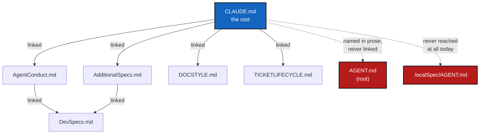

# SpecTree — verifying every spec is reachable from CLAUDE.md, not just present on disk

*Created: 2026-09-25*

*Branch: main*

> **Implementation — 2026-09-25 — all six work packages land in one
> change; archiving.** `scripts/spec_tree.py` (WP-1/WP-3): the link
> graph, `--check` (broken links, orphans), bare-filename-in-prose
> detection via the same-directory-sibling rule D2 settled on. `pixi run
> check-spectree` (WP-2, D4) plus `tests/unit/test_spec_tree.py`, wired
> into `pixi run test` the same way `test_module_ceilings.py` already
> wires in the ceiling ratchet — 14 fixture tests (broken link, orphan,
> bare filename resolved/not-resolved, cross-link cycle, upstream vs.
> writable broken links, three digest-citation failure shapes) plus two
> tests against this repo's own real tree. `--flatten` and `digest.md`
> (WP-4, D3/D5): the digest is hand-written, 15 rules, `--check-digest`
> verifies every citation resolves inside the reachable graph. `CLAUDE.md`
> now links and instructs loading `digest.md` in full (WP-5). §6 tracks
> which work package delivered what; §7's acceptance criteria all hold —
> `pixi run check-spectree`/`pixi run test`/`pixi run lint` all pass,
> `cgitsync status` shows `errors=0`. One real, pre-existing gap the tool
> found along the way and fixed: `audit.md` cited a since-renumbered
> ticket by its old rank (`main_1-6` → `main_1-5`); one it found and
> correctly did **not** try to fix: `TICKETLIFECYCLE.md`
> (`.agent/.distant/ticket/`, shared and read-only) has a broken
> `DOCSTYLE.md` link of its own — reported by `--check`, not failed,
> exactly as D-none-of-the-above intended for a mount this project cannot
> edit; belongs to `flipoyo/.ticketing`'s own maintainer.

> **Owner direction — 2026-09-25, in conversation, following a live
> incident (§1):** *"Write a ticket on the specs loading issue. We must
> optimise the access to specs for you. Maybe we can think about a python
> script that will interprete a specs that is defined as a link and
> discover the file during the reading. Therefore you will load everything
> that is pointed out by claude as if it would be claude itself. We must
> checked that every specs files is then accessible over pointers that
> originates from claude. It is a sort of SpecTree."*

## Abstract — read this first

**What this document is.** A checker, `scripts/spec_tree.py`, that walks
the markdown-link graph rooted at `CLAUDE.md` the way an agent actually
discovers specs — one link at a time — and verifies two things a human
skimming the tree cannot easily verify by eye: that every link it follows
resolves to a real file, and that every spec file meant to be found this
way is actually reachable from the root by *some* chain of links. It is
the same "ratchet, checked in CI" shape `scripts/check_module_ceilings.py`
already gives the source tree, applied to the spec tree instead.

**Why it exists.** §1 traces a real incident, from the same day this
ticket was written: an agent kept reintroducing a commit trailer
`AgentConduct.md` §3 forbids outright, not because the rule was missing,
but because reaching it from `CLAUDE.md` takes two hops through a
document the agent had read once, hours of tool calls earlier, while a
much shorter, freshly-repeated instruction sat one token away from where
the mistake happened. `SpecTree` cannot fix *that* half — §4 says so
plainly — but it can fix the half underneath it: making sure nothing in
`.agent/` is one broken or missing link away from being unreachable at
all, and making the graph itself something a script can check rather than
something only a careful re-reading catches.

**What you will find.** §1 the incident this ticket is grounded in. §2
what "reachable from `CLAUDE.md`" means today, checked by hand while
drafting this ticket — including one real gap found in the process. §3
the tool. §4 what this does *not* fix, and why that is a second, separate
concern rather than a step of this one. §5 the decisions this needs
before WP1 starts. §6 work packages. §7 acceptance. §8 what this refuses.

**Who it is for.** Whoever builds `scripts/spec_tree.py` — D1/D2/D3
below are the load-bearing calls; nothing else here should surprise them.

**What you need to do with it.** Read §1 for why, §3 for what gets built,
§5 before writing any code — three of its four decisions change what
"reachable" means.

---

## 1. The incident this is grounded in

On 2026-09-25, an agent working this repository added a
`Co-Authored-By: Claude ...` trailer to a delivered commit message, for
the third or fourth time across sessions by the owner's account, despite
`CLAUDE.md`'s own *Attribution* section stating "an agent is never
credited on a commit" and pointing at `AgentConduct.md` §3 for the rule
in full: *"An agent is not credited on commits. No co-authorship trailer
and no 'generated with' line on any commit, merge, or pull request, in
any repository of a project's tree."*

Asked to explain the recurrence, the agent's own diagnosis (this
conversation, same day) was: the rule is not *missing* from the spec
tree — `AgentConduct.md` §3 states it unambiguously — but reaching it
from the point where a commit message is actually drafted
(`CLAUDE.md` §*Before committing*, item 8) takes a pointer through a
*different* section (*Attribution*) into a *second file*
(`AgentConduct.md`), read once, early, and never re-surfaced at the
moment it matters. Meanwhile a runtime attribution reminder — generic,
not project-aware — recurs mechanically, in second person, immediately
before every response, and wins the competition for what actually gets
written. A first attempt at a fix (writing the rule into this session's
own memory file) was called out, correctly, as solving nothing: a memory
file is loaded once, at the same point in the pipeline as `CLAUDE.md`
itself, so it is exactly as exposed to the same recency problem as the
document that already stated the rule and still lost.

This ticket is the first of two responses that incident produced. This
one — the owner's own framing — is about **spec *access***: making sure
nothing an agent is supposed to find is one broken or unlinked hop away
from invisible. The second, not part of this ticket (§4), is about
**spec *enforcement at the moment of action***: a mechanical check (a
git `commit-msg` hook, or a Claude Code tool-use hook) that rejects the
trailer regardless of what any agent currently believes, proposed in the
same conversation and not yet built.

## 2. What "reachable from `CLAUDE.md`" means today

A quick hand-check while drafting this ticket, over every `[text](path)`
link in `CLAUDE.md` and its own targets:

- `CLAUDE.md` links directly to `AgentConduct.md`, `AgentDataContract.md`,
  `DOCSTYLE.md`, `TICKETLIFECYCLE.md`, `AdditionalSpecs.md`, `audit.md`,
  `legalTerms/anthropic.md`, `DevTickets/README.md`, and the repository's
  own `README.md`.
- `DevSpecs.md` is **not** linked directly from `CLAUDE.md` at all, but
  *is* reachable — twice over — through `AgentConduct.md` and through
  `AdditionalSpecs.md`. The graph already relies on multi-hop reachability
  for a document every conforming project needs; that already works
  today, which is why `SpecTree`'s job is to keep checking it, not to
  invent it.
- Every `AGENT.md` in the tree (the root one, and one per mount under
  `.agent/.local/` and `.agent/.distant/`) is **never reached by a
  markdown link at all**. The root `AGENT.md` is described in
  `CLAUDE.md`'s own *Layout* section only in prose — *"`AGENT.md` is a
  minimal pointer stating the reading order"* — a bare filename, not
  `[AGENT.md](AGENT.md)`. A crawler that only follows `[text](path)`
  syntax would walk right past the one file whose entire job is to be
  the second thing an agent reads. This is a real, found-today gap, not
  a hypothetical one, and it is exactly the class of failure §1's
  incident came from: a rule (here, "read `AGENT.md` next") that exists,
  correctly stated, and is not mechanically reachable from where an agent
  actually starts.

## 3. The tool

`scripts/spec_tree.py`, matching the shape `scripts/check_module_ceilings.py`
already established for the source tree — same repository, same
"read-only check, wired into CI, reusable ad hoc" contract:

1. **Root:** `CLAUDE.md`.
2. **Edges:** every relative link `[text](path)` whose target resolves to
   a `.md` file inside the project (external `http(s)://` links are not
   edges; a link to a non-`.md` file, e.g. `README.md`'s own links to
   source files, is not an edge either — see D1).
3. **Universe:** every `.md` file under the directories `CLAUDE.md`
   itself declares as spec-bearing (`.agent/.local/.localSpec/`,
   `.agent/.distant/dev-sync/`, `.agent/.distant/documentation/`,
   `.agent/.distant/ticket/`, plus each mount's own root — see D1 for
   what to exclude).
4. **`--check`:** exits non-zero and names every broken link (points at a
   file that does not exist) and every universe member the root cannot
   reach by any chain of edges — an *orphan*.
5. **`--flatten`**: walks the graph depth-first from the root, emitting
   one document that inlines each target the first time it is reached,
   skipping a target already emitted (so `AgentConduct.md` linking back
   toward `CLAUDE.md`-adjacent files does not loop). A report, read on
   demand — not what gets eager-loaded (D3); that is `digest.md`, below.
6. **`--check-digest`** (D5): reads `digest.md` (hand-curated, one line
   per rule, each citing a source), fails if any citation no longer
   resolves inside the SpecTree the rest of `--check` already built.

## 4. What this does not fix

`SpecTree` proves a rule is *findable*: some chain of real links leads
from `CLAUDE.md` to the file that states it. It says nothing about
whether an agent *re-applies* that rule at the one token where it
matters, months into a long session, with a differently-sourced
instruction sitting immediately adjacent in context. That is what
actually broke in §1 — the rule was already findable, and still lost.
Confusing the two would make `SpecTree` a false reassurance: "the graph
is fully connected" is not "the agent behaved correctly," the same way a
green `pixi run lint` is not a claim that the code is bug-free.

The complementary fix — a `commit-msg` git hook, or a Claude Code
`PreToolUse` hook on `Bash` matching `git commit`, that mechanically
strips or rejects a `Co-Authored-By`/`Generated with` line regardless of
which agent or session produced it — was proposed in the same
conversation and is deliberately **not** part of this ticket's work
packages. It belongs to a decision the owner has not yet made (which
mechanism, git-level or harness-level, or both) and does not depend on
anything here landing first.

## 5. Decisions

### D1. Scope: which files are "the spec tree"?

Recommendation: rule/spec documents only — `CLAUDE.md`, `AGENT.md`
(every copy), `AdditionalSpecs.md`, `audit.md`, `AgentConduct.md`,
`AgentDataContract.md`, `DevSpecs.md`, `DOCSTYLE.md`,
`TICKETLIFECYCLE.md`, `legalTerms/*.md`, and each mount's own `README.md`
where `CLAUDE.md`'s *Layout* section names it as documentation rather
than a ticket. **Not** `DevTickets/openTickets/`, `archive/`, or
`shortTickets/` — those are planning records with their own lifecycle
and naming rules (`TICKETLIFECYCLE.md`), already churning by design; a
`.md` file leaving `openTickets/` for `archive/` is not the same event as
a spec becoming orphaned, and treating it that way would make
`--check` fail on every ordinary ticket close.

### D2. Link detection: markdown links only, or also bare filenames in prose?

§2 found a real case — `AGENT.md` — that a pure `[text](path)` crawler
misses because `CLAUDE.md` names it in prose, not as a link.
Recommendation: **support both**, since the gap is real, not
hypothetical — but bare-filename detection needs its own rule (a
backtick-quoted name matching a known spec filename, resolved relative to
each mount's declared root) so it does not start matching every
incidental mention of "the CLAUDE.md file" in running prose. Getting this
wrong either direction is real: too strict, and the exact gap that
motivated this ticket keeps slipping through; too loose, and `--check`
drowns in false positives the first time someone writes a sentence like
"see the audit.md file above."

### D3 (answered). Does `--flatten`'s output change what gets loaded at session start?

**Yes — the owner's own direction, 2026-09-25, a follow-up in the same
conversation this ticket was opened in: `CLAUDE.md` must instruct an
agent to load every file the SpecTree reaches, not merely leave it
reachable.** But the same follow-up asked the second, load-bearing
question: whether the specs are "too verbose" for that to be affordable —
and checking that against `DOCSTYLE.md` §4/§5 confirms it is a real
constraint, not a style complaint to wave off. §5 already exempts
`CLAUDE.md` and `AdditionalSpecs.md` from the strictest plain-English
rule *because* their reader is assumed to have "software engineering
background" — but that assumption was written for a human developer with
unlimited time, not an agent whose context is a shared, finite budget.
Eager-loading the full discursive tree — every `Abstract`, every mermaid
graph, every "Why it exists" paragraph, across `CLAUDE.md`,
`AdditionalSpecs.md`, `AgentConduct.md`, `DOCSTYLE.md`,
`TICKETLIFECYCLE.md`, `DevSpecs.md` — is exactly the cost D3 originally
flagged, at its most expensive.

**Resolution: two tiers, not one eager load of the raw tree.**

1. **A rules digest — short, mandatory, loaded in full every session.**
   Every `MUST`/`NEVER`-shaped sentence in the SpecTree (D2's
   bare-filename/link-detected universe), extracted into one compact
   file — one line per rule, no rationale, no abstract, no mermaid graph.
   "An agent is not credited on commits" earns one line here; the two
   paragraphs of *why* in `AgentConduct.md` §3 stay in `AgentConduct.md`.
   This is what actually answers "CLAUDE.md must load every spec in the
   SpecTree" at a cost a session can afford, and it is also the direct
   fix for §1's incident: the rule sits in a short, flat list instead of
   two hops behind a pointer, so it is competing on equal, adjacent
   footing with anything the harness re-injects, rather than losing by
   being buried in prose read once, hours earlier.
2. **The full prose specs stay exactly as they are, read on demand.**
   The rationale, the audience-facing abstracts, the "why" DOCSTYLE.md
   and this whole project clearly value — for judgment calls, for writing
   a new ticket in the house style, for a human auditing a decision — is
   not disposable, and rewriting it wholesale to be shorter risks losing
   exactly the context a future reader (human or agent) needs to apply a
   rule correctly rather than mechanically. `DOCSTYLE.md` §4 ("if a
   section cannot be skimmed in under a minute, split it or cut it")
   already licenses trimming *specific* sections that fail that test —
   that stays available as ordinary editing, file by file, not as a
   ticket-wide rewrite mandated here.

This turns "shrink the specs" from an open-ended editorial risk across
every authoritative file into one new, small, mechanically-generated
artifact — see WP-4.

### D4. Where does the script live, and how is it run?

Recommendation: `scripts/spec_tree.py`, invoked via a new
`pixi run check-spectree` task, listed in `CLAUDE.md`'s *Before
committing* checklist next to `pixi run check-ceilings` — the same
placement, the same "ratchet checked in CI" contract
`check_module_ceilings.py` already set a precedent for in this repo.

### D5. Is the rules digest generated by parsing prose, or hand-curated and machine-verified?

Recommendation: **hand-curated, not auto-extracted.** A heuristic scan
for "MUST"/"NEVER"-shaped sentences across freeform prose is exactly the
kind of fragile classifier this codebase's own style would reject
elsewhere — false negatives (a real rule phrased as "an agent is never
credited," not "must not") and false positives (a rationale sentence that
merely *mentions* an obligation) are both likely, and either failure mode
quietly reintroduces §1's problem instead of fixing it. Instead:
`digest.md` is a short, hand-written file — one line per rule, each
citing its source (`AgentConduct.md §3`, `git_branch.py`'s docstring,
etc.) — and `spec_tree.py --check-digest` is the mechanical half: it
verifies every citation still resolves to a real file the SpecTree
reaches (D1/D2), failing loudly if a rule's source was renamed, moved, or
deleted out from under it. The digest can drift stale in *content*
(a rule changes and the one-line summary is not updated) the same way any
hand-written doc can; `--check-digest` only guarantees it never drifts
stale in *reference*.

## 6. Work packages

| # | Depends on | Delivers |
|---|---|---|
| **WP-1** | D1 | `scripts/spec_tree.py`: link-graph builder over markdown links, `--check` reporting broken links and orphaned universe members |
| **WP-2** | D4 | `pixi run check-spectree` task; wired into CI (`.github/workflows/ci.yml`) alongside `lint`/`test`/`check-ceilings` |
| **WP-3** | D2 | Bare-filename-in-prose detection, scoped to known spec filenames |
| **WP-4** | D3, D5 | `--flatten`; `.agent/.local/.localSpec/digest.md`, hand-written, one line per rule with a source citation; `--check-digest` |
| **WP-5** | WP-4 | `CLAUDE.md`/`AGENT.md` change instructing every session to load `digest.md` in full before acting — the literal answer to "CLAUDE.md must load every spec in the SpecTree," scoped to the digest rather than the full prose tree (D3) |
| **WP-6** | WP-1 through WP-5 | Tests over a fixture spec tree (a broken link, an orphan, a bare-filename pointer, a cross-link cycle, a digest citation pointed at a deleted section); `AdditionalSpecs.md` entry documenting `scripts/spec_tree.py` and `digest.md` alongside `check_module_ceilings.py`; `CLAUDE.md`'s checklist updated |

## 7. Acceptance

- `pixi run check-spectree`, run against this tree as it stands once
  WP-1–WP-3 land, either passes clean or names exactly the gaps §2 found
  by hand (the `AGENT.md` files) — whichever D2 decided bare-filename
  detection should do with them.
- Deleting a link from `CLAUDE.md` to a spec file that nothing else
  reaches makes `--check` fail, naming that file as an orphan.
- Renaming a linked file without updating the link makes `--check` fail,
  naming the broken link.
- Closing a ticket (`openTickets/` → `archive/`) never trips `--check` —
  confirms D1's scope boundary holds.
- `digest.md` exists, is short enough to read in full in well under a
  minute (DOCSTYLE.md §4's own bar), and `--check-digest` passes against
  it; deleting or renaming a section a digest line cites makes
  `--check-digest` fail, naming the stale citation.
- `pixi run lint` and `pixi run test` pass.

## 8. What this refuses

- **To claim this fixes the incident in §1 by itself.** `digest.md`
  (D3/D5) gives the rule equal, adjacent footing with whatever the
  harness re-injects, which is most of the fix — but §4 is still explicit
  that point-of-action enforcement (a hook that mechanically rejects a
  violation regardless of what any agent currently believes) is a
  separate, still-open decision this ticket does not include.
- **To eager-load the full discursive tree.** D3 answered "load
  everything," not "load it as prose" — `digest.md` is what gets loaded
  in full every session; `CLAUDE.md`, `AdditionalSpecs.md`,
  `AgentConduct.md` and the rest stay behind the lazy, pointer-based
  reading model, for the rationale a digest line deliberately leaves out.
- **To rewrite the existing specs to be shorter.** `DOCSTYLE.md` §4
  already licenses trimming a section that fails its "skim in under a
  minute" test, file by file, as ordinary editing — this ticket does not
  mandate a rewrite pass across `CLAUDE.md`/`AdditionalSpecs.md`/
  `AgentConduct.md` to make eager-loading them affordable, because
  `digest.md` removes the need to eager-load them at all.
- **To treat `DevTickets/` as spec surface.** D1: tickets have their own
  lifecycle; `SpecTree` checks the rules, not the planning records that
  cite them.
