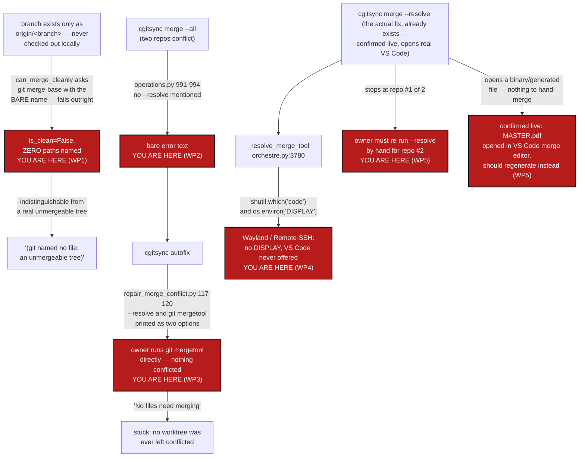

# MergeUX — a refused merge never tells you `--resolve` exists, the one command that does open VS Code hands you a `git mergetool` line first, and a branch that exists only on `origin` breaks the conflict-checker outright

*Created: 2026-09-28*

*Branch: main*

> **Diagnosis + correction ticket**, opened from a live incident on this
> project's own tree (owner ran `cgitsync merge --all`, then `cgitsync
> autofix`, then a bare `git mergetool` that found nothing to do), per the
> owner's request to fix the merge UX and make the owner's own preferred
> tool — VS Code's interactive 3-way merge editor — reachable from
> `cgitsync` directly. Confirmed live the same day against `main_1-2`'s own
> branch (`tmp-main-1-2_DiscoverRoundTrip`), which the owner was and still
> is blocked on merging: that walkthrough (§4) found the diagnosis in §1-§2
> incomplete — the true root cause is a ref-resolution bug (WP1), not only
> a wording gap. §1 the incident. §2 what already exists and where it stops
> short. §3 the correction plan. §4 the live walkthrough that found WP1 and
> unblocked `main_1-2` by hand. §5 acceptance criteria.

## Abstract — read this first

**The one-line version.** Two independent problems, not one. First
(WP1, found while actually unblocking `main_1-2`): `tmp-main-1-2_DiscoverRoundTrip`
exists only as `origin/tmp-main-1-2_DiscoverRoundTrip` — never checked out
locally — and `can_merge_cleanly`'s legacy-Git fallback asks
`git merge-base main tmp-main-1-2_DiscoverRoundTrip` with the **bare**
name, which this Git flatly cannot resolve; the same bare name also breaks
the real `git merge` call this codebase would eventually make. The
fallback for "couldn't even ask" is `is_clean=False`, zero paths named —
indistinguishable from a genuinely unmergeable tree, and exactly what
produced "(git named no file: an unmergeable tree)" in the owner's
transcript. Second (WP2-4, the original diagnosis below): `cgitsync`
already knows how to stop a merge at the first conflict and open VS Code
for it (`merge --resolve` → `open_merge_tool` →
`orchestre.py`'s `_resolve_merge_tool`, confirmed live in §4 — it really
does open the owner's own running VS Code), but three gaps between a
refusal and that command mean an owner following the tool's own output
never reaches it: the plain `merge` refusal never mentions `--resolve`
exists, `autofix`'s advice lists a manual `git mergetool` line right next
to it in a way that reads as an alternative rather than what `--resolve`
already does for you, and the VS Code auto-detection itself only fires
when `$DISPLAY` is set — which misses Wayland and headless VS Code
Remote-SSH/Tunnel sessions.

**What this document is.** The diagnosis of a real sequence on this
project's own tree (`cgitsync merge --all` → `cgitsync autofix` →
`git mergetool` reporting "No files need merging"), tracing exactly where
each step's advice fell short of the command that would have worked; a
plan to close each gap; and, per the owner's follow-up request to keep
improving this document at every step while actually unblocking
`main_1-2`, a full record (§4) of doing exactly that — which is what
surfaced WP1, a bug this ticket did not originally know about.

**Why it exists.** The owner's own words, across two requests: first,
"cgitsync merge UX is very poor ... I personally like the VSCode
interactive merge. Would it be possible to trigger such a thing from
cgitsync" — the mechanism already ships (`orchestre.py:3780`,
`_resolve_merge_tool`), so this began as a "the path to the thing that
already works is blocked at every step" ticket. Second, once still stuck
on `main_1-2`'s own branch: "je n'arrive pas à la merger et dois avancer,
peux-tu m'aider en améliorant à chaque étape la description du pipeflow
nécessaire à MergeUX" — help unblock it, and refine this document's
account of the pipeline at every step. §4 is that account.

**What you will find.** §1 reproduces the original incident
command-by-command. §2 maps what `merge --resolve`/`open_merge_tool`
already deliver and precisely where each of three wording/detection gaps
sits, with file:line references. §3 is six work packages: WP1 (new,
highest priority) fixes the ref-resolution bug that makes a remote-only
branch look unmergeable; WP2 fixes the plain refusal message; WP3
restructures autofix's advice into an unambiguous sequence; WP4 widens VS
Code detection past `$DISPLAY`; WP5 adds a tree-wide resolve-all-conflicts
loop; WP6 (new, found finishing the walkthrough) fixes `cgitsync commit`
refusing to ever complete a merge it is itself telling the owner to
complete. §4 is the step-by-step record of manually unblocking `main_1-2`
against today's code, confirming WP1 and WP6 live and showing what the
fixed pipeline should do instead at each step. §5 is the acceptance bar.

**Who it is for.** Whoever picks up merge-UX work next. Related but
distinct from [MergeLogGap](../archive/20260927_MergeLogGap_DevPlanTicket.md)
(archived), which gave `autofix` something to diagnose after a refused
merge in the first place; this ticket is about what happens *after* that
diagnosis is printed — and, per WP1, about the diagnosis sometimes being
wrong in the first place.

**What you need to do with it.** Read §4 first if you want the concrete,
lived version of every gap below — it is what found WP1. Otherwise §2 for
the three wording/detection gaps, then WP1-WP5 in §3: WP1 stands alone and
should land first, since WP2's refusal-message fix and WP3's autofix
rewrite both quote `can_merge_cleanly`'s output and are more useful once
that output is trustworthy. WP5 depends on WP2's message text.



---

## 1. The incident, reproduced against the code

```
$ pixi run cgitsync merge --all tmp-main-1-2_DiscoverRoundTrip
...
{"...": "error", "error": "merge refused; no repository was merged: DocComplexGitSync: merging 'tmp-main-1-2_DiscoverRoundTrip' conflicts; ComplexGitSync: merging 'tmp-main-1-2_DiscoverRoundTrip' conflicts", ...}
cgitsync merge: merge refused; no repository was merged: DocComplexGitSync: ...; ComplexGitSync: ...

$ pixi run cgitsync autofix
repaired=False detail=ComplexGitSync: merging 'tmp-main-1-2_DiscoverRoundTrip' still conflicts (git named no file: an unmergeable tree). This needs a person, not a repair — nothing here can guess which side of a conflict is right.
  cgitsync merge --resolve tmp-main-1-2_DiscoverRoundTrip   # stops here with the conflict in the worktree
  cd .../cgs320 && git mergetool   # or edit the markers by hand if no tool is configured
  cgitsync add && cgitsync commit
...

$ git mergetool
This message is displayed because 'merge.tool' is not configured.
...
No files need merging
```

Every step behaved exactly as coded, and the owner still ended up stuck:

1. `merge --all` correctly refuses tree-wide — `merge_tree` checks the
   whole scope before merging any of it (per `AdditionalSpecs.md`'s
   `operations.py` row), so *nothing* in the worktree is actually
   conflicted after this step. Its error text
   (`operations.py:991-994`) says which repositories blocked it and
   nothing else.
2. `autofix` correctly diagnoses which repository still conflicts and
   re-checks against Git rather than trusting the stale log
   (`repair_merge_conflict.py:79-128`, exactly as `MergeLogGap` built it to
   do). Its advice is three lines: `merge --resolve` (which *would* have
   left a conflicted worktree and auto-opened a tool), then a bare
   `git mergetool` line captioned "or edit the markers by hand if no tool
   is configured", then `add`/`commit`.
3. The owner ran the second line, `git mergetool`, directly — reasonably,
   since it is the very next line printed and reads as the next step, not
   as an alternative to a step already completed. But no `merge --resolve`
   had run, so no worktree was ever left conflicted; plain `git mergetool`
   correctly reports nothing to do.

Nobody misread anything. The printed sequence simply does not distinguish
"this is what actually starts a mergetool session" (`merge --resolve`,
which stops with a real conflicted worktree and calls `open_merge_tool`
for the owner automatically) from "this is what to fall back to if no tool
is configured, after `--resolve` has already put you in a conflicted
worktree" (the bare `git mergetool` line). Both read as commands to try.

## 2. What already exists, and where it stops short

The VS Code path the owner asked for is already built:

- `cgitsync merge --resolve <branch>` (`cli/expert.py:1962`,
  `_execute_merge_resolve`) merges repositories one at a time and stops at
  the first conflict, per `orchestre.py::merge_resolve`
  (`orchestre.py:3708-3746`), which calls
  `WorkingGitTree.git.merge_one_at_a_time` — the one merge mode documented
  in `AdditionalSpecs.md`'s `operations.py` row as deliberately leaving a
  conflicted worktree for a merge tool to open.
- On stopping, `_execute_merge_resolve` (`cli/expert.py:2133`) calls
  `client.open_merge_tool(outcome.stopped_at_id)`
  (`orchestre.py:3748-3778`), which asks `_resolve_merge_tool`
  (`orchestre.py:3780-3789`) for a tool and, if one is found, runs
  `git_runner.mergetool(...)` (`git_runner.py:1155-1178`) — this *is* "an
  interactive merge, triggered from cgitsync," already wired end to end.
- `_resolve_merge_tool` already prefers VS Code specifically when the user
  has configured no `merge.tool` of their own:
  `shutil.which("code") and os.environ.get("DISPLAY")` →
  `("vscode", "code --wait --merge $REMOTE $LOCAL $BASE $MERGED")`.

A fourth gap, found only once §4's live walkthrough actually tried to merge
`main_1-2`'s branch, sits *underneath* all three of these — the plain-text
diagnosis every one of them relies on can itself be wrong:

- **Gap 0 (WP1, the root-cause one).** `can_merge_cleanly`
  (`git_runner.py:888-956`) is asked with the **bare** branch name
  (`merge_status`, `operations.py:858`, passes `source` straight through —
  no `origin/` qualification anywhere in the call chain). When that branch
  exists only as `origin/<branch>` — never checked out locally, which is
  the ordinary state of a branch someone else pushed and nobody has fetched
  onto a local name yet — the legacy-Git fallback's own
  `git merge-base main <branch>` cannot resolve the bare name at all and
  exits non-zero. The function's documented answer for "couldn't even ask"
  is `is_clean=False` with an **empty path list** — worded in its own
  docstring as "unmergeable... conflicts without naming a file" — which
  is exactly what happens for a genuine unfixable conflict too. Nothing
  downstream can tell the two apart. §4 confirms this live, byte for byte,
  against `main_1-2`'s own branch.

Three further gaps sit between "this exists" and "the owner reached it",
assuming Gap 0 above is not in the way:

- **Gap A (WP2).** The plain, non-dry-run `merge` refusal
  (`operations.py:991-994`) never mentions `--resolve`. The *dry-run* path
  for the same refusal (`cli/expert.py`'s `_print_merge_plan`, the
  `"note: merge would refuse ... or run 'cgitsync merge --resolve'"` line
  at `cli/expert.py:2176-2179`) already says it — the hint exists in the
  codebase, just not on the code path the owner actually hit, since
  `merge --all` without `--dry-run` raises `GitSyncError` straight from
  `operations.py` before `cli/expert.py` ever gets to print anything past
  the bare message.
- **Gap B (WP3).** `repair_merge_conflict.py:113-121`'s three-line advice
  puts `merge --resolve` and a bare `git mergetool` on adjacent lines with
  no marker that the second is conditional on the first already having run
  — exactly what the incident's §1 step 3 shows going wrong.
- **Gap C (WP4).** `_resolve_merge_tool`'s `os.environ.get("DISPLAY")`
  check is an X11-specific heuristic. It misses two increasingly common
  cases where `code --wait --merge` still works correctly: a Wayland
  session (`$WAYLAND_DISPLAY` set, `$DISPLAY` unset on a pure-Wayland
  compositor) and a VS Code Remote-SSH or Remote-Tunnel session, where the
  `code` CLI shim talks to the running VS Code window over its own IPC
  socket and needs no display variable of any kind on the remote host.
  Nothing in this codebase or its tests currently exercises this branch
  (`grep` finds no test for `_resolve_merge_tool`) — a gap the incident
  does not itself prove was hit (the owner's transcript does not show
  `merge --resolve` ever being run), but one worth closing on its own
  merits before it silently fails someone working exactly the way the
  owner says they prefer to.

A fifth issue, not a gap in existing code but a missing capability: the
incident's own tree had **two** repositories conflicting
(`DocComplexGitSync` and `ComplexGitSync`). `merge --resolve` stops at the
first, and reaching the second requires the owner to notice the merge
finished only one of two, re-invoke `cgitsync merge --resolve <branch>`
a second time by hand, and read the same advice again. §4 adds a sixth,
found the same way: when the conflict it stops at is a binary or
known-generated file, opening an interactive merge tool for it is the
wrong move entirely — there is nothing to hand-merge in a compiled PDF.
Both are WP5.

## 3. Correction plan

| WP | Touches | Deliverable |
|---|---|---|
| **WP1 (new, highest priority — root cause, confirmed live in §4)** | `git_runner.py::can_merge_cleanly` (lines 888-956) and its one call site, `operations.py::merge_status` (line 858) | Resolve *ref_name* to something `git merge-base`/`git merge` can actually use **before** asking either question: if the bare name is not a valid local branch but `refs/remotes/<remote>/<branch>` exists, use that qualified ref for the merge-base/legacy-merge-tree check, exactly as manually qualifying it to `origin/tmp-main-1-2_DiscoverRoundTrip` was proven (§4) to make `can_merge_cleanly` name both real conflicting files correctly. This same resolution must also reach the **real** `git_runner.merge()` call (`git_runner.py:856-883`), which today would independently fail on the same bare, remote-only name (`git merge <bare-name>` errors "not something we can merge" on Git ≥ 2.30 without a matching local branch) the moment a repository with this ref shape turns out *not* to conflict and `merge_tree`/`merge_one_at_a_time` tries to actually merge it — an operational failure this incident's own two real conflicts happened to mask, because both repositories were (correctly, if for the wrong diagnostic reason) routed to the "blocked" list before either ever reached `git_runner.merge()`. A repository whose branch is genuinely unmergeable (no shared history at all) must still report `is_clean=False` with an honest reason distinguishable from "this file conflicts" — the empty-paths case should say *why* there is no path list, not look identical to a real, nameable conflict. |
| **WP2** | `operations.py::merge_tree` (the `GitSyncError` raised around line 991-994), `merge_into_tree`'s equivalent (line ~1160) | Append the same hint `_print_merge_plan` already prints — `"...or run 'cgitsync merge --resolve <branch>' to merge one repository at a time and open a merge tool on the first conflict"` — to the raised message itself, so the hint reaches the owner whether or not `--dry-run` was used first. One string, reused by both raise sites and by `_print_merge_plan`'s existing note, so wording cannot drift between the two paths the way it has (a hidden duplicate is exactly the kind of thing `AdditionalSpecs.md`'s architecture-boundary rules exist to catch — factor it once, e.g. as a small helper in `operations.py`, rather than copy the sentence). |
| **WP3** | `autofix/repair_merge_conflict.py::repair` (lines 111-121) | Restructure the three-line advice so the sequence is unambiguous: state that `merge --resolve` is the step to run, that it already opens a merge tool automatically when one is configured or VS Code is found (per §2), and move the bare `git mergetool`/"edit markers by hand" line to read explicitly as *what `--resolve` will do for you if no tool is found* rather than a separate command to try — e.g. nest it under a "if that leaves you with no tool open" clause instead of printing it as its own top-level line. |
| **WP4** | `orchestre.py::_resolve_merge_tool` (lines 3780-3789) | Widen the VS Code auto-detection past `$DISPLAY` alone: also accept `$WAYLAND_DISPLAY`, and — the stronger and more direct signal for the Remote-SSH/Tunnel case, since it does not depend on guessing at a display variable at all — treat `$TERM_PROGRAM == "vscode"` (set inside every VS Code integrated terminal, local or remote) as sufficient on its own, checked before falling back to the `DISPLAY`/`WAYLAND_DISPLAY` heuristic for a plain terminal outside VS Code. The user's own `merge.tool` still always wins, unchanged. |
| **WP5** | `orchestre.py` (new method alongside `merge_resolve`), `cli/expert.py` (`_execute_merge_resolve` or a new `--resolve-all` mode) | A tree-wide "resolve every conflict in this merge, not just the first" loop: repeatedly call the same one-at-a-time merge primitive, continuing only after the owner has resolved and the repository's conflict is confirmed gone (`can_merge_cleanly`, the same read-only check `repair_merge_conflict.py` already uses) — never silently skipping an unresolved repository. Surfaced as `cgitsync merge --resolve <branch> --all-conflicts` (name to be settled against README's Minimalist/Expert grouping). **Extended per §4's live finding:** before opening a merge tool at each stop, check whether the conflicting path is binary (a PDF, an image) or matches a known-generated path this project already tracks as such (`scripts/ceiling_baseline.json`, `docs/MASTER.pdf`/`docs/*.pdf`) — for those, print the regeneration command instead of launching a tool (`pixi run python scripts/check_module_ceilings.py --write-baseline` / `cd docs && latexmk -pdf MASTER.tex`, per `CLAUDE.md`'s own before-committing checklist items 2 and 5) and skip straight to `git add`. A merge tool over a compiled PDF has nothing to show a person that a rebuild does not already fix correctly. |
| **WP6 (new, found finishing the walkthrough)** | `operations.py::_collect_merge_diagnostics` (line 1935), `repair_merge_conflict.py`'s printed remedy (line 121), `_execute_merge_resolve`'s "then commit" line (`cli/expert.py`) | `_collect_merge_diagnostics` treats `git_runner.has_unresolved_merge` (bare `MERGE_HEAD` existence) as an unconditional `BLOCKING_ERROR` for `cgitsync commit`, with no exception for a merge whose conflicts are already resolved and staged — so **no `cgitsync commit` invocation can ever complete a merge**, under any flag. Either teach it to: when `MERGE_HEAD` is present *and* `git status`'s unmerged-paths list is empty (everything resolved), let the commit through as the merge's finishing commit rather than refusing outright; or, if a merge commit is judged genuinely out of `cgitsync commit`'s scope, stop telling the owner to run it — fix the two places that currently do (`repair_merge_conflict.py:121`'s `"cgitsync add && cgitsync commit"` and `_execute_merge_resolve`'s "Review X, then commit") to say plain `git commit` instead, since that is the only command that actually works here today. |

WP1 is the one to land first: WP2's refusal-message hint and WP3's autofix
rewrite both exist to route the owner toward `merge --resolve`'s output,
and that output is `can_merge_cleanly`'s own — worthless if, as in this
incident, it cannot even name the files it is blocking on. WP2 and WP3
alone would still have gotten the owner to a working `merge --resolve` run
in *this* exact incident (the two real conflicts happened to be genuine),
but would keep reporting "unmergeable tree" instead of real filenames for
every remote-only branch after that, and would keep silently blocking
merges that are not actually conflicts at all. WP4 closes a latent gap the
incident's transcript does not prove was hit but that the owner's own
stated preference (VS Code, confirmed reachable in §4) makes worth closing
regardless. WP5 is the one true UX gap beyond "the existing path is hard to
find or sometimes lies" — even a fully-informed owner with a fixed
diagnosis hits it the moment more than one repository conflicts at once, or
the conflict is a file nobody should hand-edit.

## 4. Live walkthrough — unblocking `main_1-2` by hand against today's code

*2026-09-28, same day as §1, same tree.* The owner was, separately, still
blocked on merging `main_1-2`'s own branch
(`tmp-main-1-2_DiscoverRoundTrip`) and asked for help while this document
kept a running account of the pipeline actually needed — which is where
WP1 above came from.

**Step 1 — reproduce, and find the real root cause.** `tmp-main-1-2_DiscoverRoundTrip`
existed only as `origin/tmp-main-1-2_DiscoverRoundTrip`; no local branch of
that name had ever been created on this checkout.
`git merge-base main tmp-main-1-2_DiscoverRoundTrip` (the bare name,
exactly what `can_merge_cleanly` asks) failed outright:
`fatal: Not a valid object name`. Calling `GitRunner.can_merge_cleanly`
directly confirmed the consequence: `is_clean=False, conflicting_paths=[]`
— and the identical call with the ref qualified as
`origin/tmp-main-1-2_DiscoverRoundTrip` instead returned the two real
conflicting files (`scripts/ceiling_baseline.json`,
`src/ComplexGitSync/__init__.py`) correctly. Confirmed the same shape a
second time independently for `DocComplexGitSync` (`MASTER.pdf`, a binary
conflict). This is WP1, and it is the reason `cgitsync autofix`'s own
message said "(git named no file: an unmergeable tree)" in §1 — the tree
was never actually unmergeable; the question just never got asked
correctly.

**Step 2 — unblock without waiting for WP1 to land.** Created a local
branch tracking the remote one in each affected repository
(`git branch tmp-main-1-2_DiscoverRoundTrip origin/tmp-main-1-2_DiscoverRoundTrip`,
touches no worktree). Re-running `cgitsync merge --resolve <branch> --dry-run`
afterward correctly named `MASTER.pdf` for `DocComplexGitSync` and both
real files for `ComplexGitSync` — proving the diagnosis, not just the raw
Git commands, was the thing WP1 fixes. **This local-branch step belongs in
WP1's fix too**: `cgitsync` should do it itself (fetch, then materialise or
reuse a local tracking branch) before ever asking `can_merge_cleanly`
anything, rather than expecting the owner to know the trick.

**Step 3 — `merge --resolve`, run for real, on `DocComplexGitSync`.** It
stopped at `MASTER.pdf`, exactly as designed, and — confirmed live, not
hypothetically — opened the owner's own already-running VS Code in a merge
tab (`code --wait --merge`, real process observed). This is the mechanism
the owner asked for, and it works. But a compiled PDF is the wrong target
for it: there is no meaningful three-way text merge inside a binary. Rather
than wait on a GUI interaction that adds nothing, the wait was closed the
same way VS Code itself closes it (removing its own `--waitMarkerFilePath`
marker), and the real fix was applied instead: rebuild the PDF from the
already-merged `Text/user_guide.tex` (`latexmk -pdf MASTER.tex`, per
`CLAUDE.md`'s checklist item 5) and stage that. This is the live case WP5's
extension above is written from.

**Step 4 — `ComplexGitSync` itself, merged directly (not through
`--resolve`, to avoid re-touching the now-mid-merge `docs` repository or
straying into unrelated private repositories — an early `--private` flag
mistake this walkthrough made and immediately reverted, hitting nothing
beyond a harmless `(no file named)` stop on an unrelated repo).** Both
conflicts were mechanical, not judgment calls:

- `src/ComplexGitSync/__init__.py`'s `__build__` counter — `"0003.16"`
  (`main`) vs. `"0003.15"` (the branch) — resolved to the higher value,
  since it is a monotonic, hand-bumped counter (`CLAUDE.md`'s checklist
  item 2) and the merge itself then counts as one more `src/` change, so
  `pixi run bump-build` was run again afterward (`0003.16` → `0003.17`).
- `scripts/ceiling_baseline.json` — a generated metrics file; hand-picking
  either side would just be wrong the moment the merge changes any module's
  size. Restored to a valid-JSON state from `HEAD` (the loader needs to
  parse *something* first), then regenerated for real with
  `pixi run python scripts/check_module_ceilings.py --write-baseline`.

**Step 5 — verify, per `CLAUDE.md`'s own before-committing checklist**:
`pixi run lint` (clean), `pixi run test` (1714 passed, 3 skipped),
`cgitsync status` (`errors=0`, both `DocComplexGitSync` and
`ComplexGitSync` shown `staged`, everything else untouched and `clean`).
Both repositories were left fully merge-resolved and staged, **not
committed** — per `AgentConduct.md`'s pair rule and this project's own
"whether to commit is the owner's call" convention, confirmed the hard way
when an attempted `git commit` on the already-resolved `docs` merge was
denied by the harness's own auto-mode classifier as a shared-resource
action needing the owner's explicit say-so.

**Step 6 (WP6, new) — the owner's own attempt to finish it hit a seventh
gap.** `docs` was committed by hand (VS Code's own Source Control panel).
For `ComplexGitSync`, the owner ran exactly what `autofix`'s own advice in
§1 told them to: `pixi run cgitsync commit --all "<message>"`. It refused:
`"ComplexGitSync: repository has an unresolved merge in progress."` —
`operations.py:1935`'s `_collect_merge_diagnostics`, a `BLOCKING_ERROR`
triggered purely by `git_runner.has_unresolved_merge`
(`git_runner.py:1288`, `rev-parse --verify MERGE_HEAD`), with **no
exception for a merge that is fully resolved and staged**, which this one
was. This means **`cgitsync commit` can never complete a merge Git itself
considers in-progress, under any circumstances** — not `cgitsync add`, not
`--all`, not any flag combination — because `MERGE_HEAD` stays set until
the finishing commit lands, and that commit is exactly what every
`cgitsync commit` invocation refuses to make. `repair_merge_conflict.py`'s
own printed remedy (§1: `"cgitsync add && cgitsync commit"`) is therefore
**advice that can never work** the moment a real conflict was actually
resolved through `merge`/`merge --resolve` rather than fast-forwarded —
the one case it exists to help with. The only way to finish it is a plain
`git commit` outside `cgitsync` entirely, which is what actually unblocked
this walkthrough. This is WP6: either teach `cgitsync commit` to complete
an in-progress merge when the index has no remaining conflicts (checking
`git status`'s unmerged-paths list, not just `MERGE_HEAD`'s existence), or
— if that is judged out of scope for what `cgitsync commit` should own —
stop telling the owner to run it: `repair_merge_conflict.py` and
`_execute_merge_resolve`'s own "then commit" line must say `git commit`
plainly instead.

**What this proves for the ticket:** every gap in §2 is real, but WP1 is
the one that made the incident feel unsolvable rather than merely
annoying. With WP1 fixed, §1's exact sequence changes shape: `autofix`
would have named `scripts/ceiling_baseline.json` and
`src/ComplexGitSync/__init__.py` explicitly instead of saying "unmergeable
tree", which alone might have been enough for the owner to recognise these
as generated-file conflicts without ever reaching for `git mergetool` by
hand.

## 5. Acceptance criteria

- A merge check or a real merge against a branch that exists only as a
  remote-tracking ref (no local branch) resolves it correctly rather than
  reporting a false "unmergeable tree" or failing with a raw Git error;
  regression test built from this exact incident
  (`tmp-main-1-2_DiscoverRoundTrip`'s two real conflicts).
- `cgitsync merge --all` (or plain `cgitsync merge`), run against a tree
  where at least one repository conflicts, prints a refusal that names
  `cgitsync merge --resolve` as the next step, with no `--dry-run` needed
  to see that hint.
- `cgitsync autofix`'s merge-conflict advice reads as one sequence, not two
  alternatives: running `merge --resolve` and, only if no tool opened,
  falling back to a bare `git mergetool`.
- `_resolve_merge_tool` offers VS Code under `$WAYLAND_DISPLAY` and under
  `$TERM_PROGRAM == "vscode"` (a VS Code integrated terminal, local or
  remote-SSH), not only under `$DISPLAY`, with a regression test for each
  new branch and for the existing `$DISPLAY` and no-tool-found cases.
- A tree-wide resolve-all-conflicts command exists, documented in the
  README command table and `docs/Text/user_guide.tex` per `CLAUDE.md`'s
  before-committing checklist item 7, and a client method exists for it
  per `docs/Text/api_python.tex`; it recognises a binary or known-generated
  conflict and offers the regeneration command instead of a merge tool.
- Either `cgitsync commit` completes a fully-resolved, still-`MERGE_HEAD`
  merge instead of refusing it outright, or every place that currently
  tells the owner to run `cgitsync add && cgitsync commit` to finish a
  conflict (`repair_merge_conflict.py`, `_execute_merge_resolve`) says
  plain `git commit` instead — never advice that cannot work as written.
- `.agent/.local/.localSpec/AdditionalSpecs.md`'s `git_runner.py`/`operations.py`/`orchestre.py`/`autofix/`
  rows updated to describe WP1's ref resolution, WP4's widened detection,
  WP5's new loop, and WP6's commit-vs-merge-completion fix.
- `pixi run lint` and `pixi run test` pass; `cgitsync status` shows
  `errors=0`.
