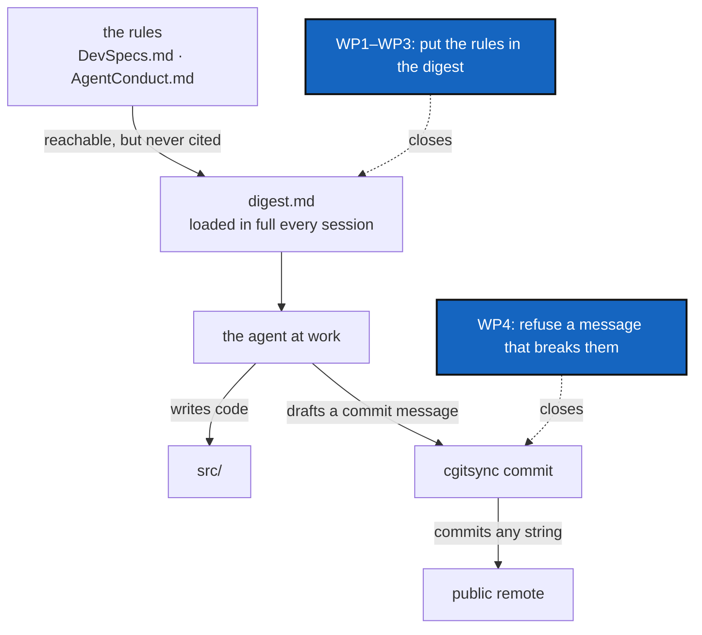

# AgentGuardrails — write the rules where a session reads them, and refuse the output that breaks them

*Created: 2026-09-30*

*Branch: main*

> **Formed in the priority-1 reorganisation of 2026-09-30**, from the digest
> half of `DevSpecsInDigest`/`DevSpecsConformance` (opened from
> `shortTickets/DevSpecs-in-digest.md`) and WP1 of `AutofixCommitHygiene`
> (opened from the `701a98f` incident). The two were separate tickets about
> the same failure: an agent produced something that broke a written rule,
> and nothing was in a position to stop it. The code corrections those
> tickets also carried now live in
> [ClassFirstPackage](main_1-2_ClassFirstPackage_DevPlanTicket.md) and
> [AutofixBlindSpot](main_1-6_AutofixBlindSpot_DevPlanTicket.md).
>
> This ticket serves the owner's second structural goal: *well constrained
> agentic behaviour, to avoid week-long failures in dev implementation.*

## Abstract — read this first

**The one-line version.** Two guardrails, both cheap, both missing. A rule
an agent never reads cannot bind it — `digest.md` holds 25 rules and **not
one comes from `DevSpecs.md`** — and a rule nothing checks at the moment of
output does not bind it either: `cgitsync commit` will commit any string it
is handed, which is how a mangled message reached `main` and was pushed.

**What this document is.** The two gaps (§1, §2), the rules to write down
(§3), five work packages (§4), three decisions (§5), acceptance (§6).

**Why it exists.** Both gaps cost weeks. `DevSpecs.md`'s architectural rules
were correctly written, correctly stored, reachable from `CLAUDE.md`, and
still broken across 13 modules and 3676 lines of `src/`, because nothing put
them where a working session reads them
([ClassFirstPackage](main_1-2_ClassFirstPackage_DevPlanTicket.md) §3 is the
bill). Commit `701a98f` reached the public remote with every backtick-quoted
phrase replaced by whatever the shell substituted — including the live
output of `git rev-parse --abbrev-ref HEAD` — because the one command that
could have refused it does not look. The owner's own reading: *"The agent
broke the unreadable rules hidden in DevSpecs. This is a large cost for
correcting that. It highlights the importance of `digest.md`."*

**What you will find.** §1 the digest gap, measured. §2 the commit gap, from
the real incident. §3 the rules to write down, drafted. §4 work packages.
§5 decisions. §6 acceptance.

**Who it is for.** Whoever picks it up first — and it should be first. It is
the smallest ticket in the priority-1 pile and the only one that makes the
others land more reliably.

**What you need to do with it.** Read §3, then D1–D3 in §5.



---

## 1. The digest gap

`digest.md` is 61 lines and holds 25 rules under four headings. Their
citations resolve to `AgentConduct.md`, `CLAUDE.md`, `AdditionalSpecs.md`
and `TICKETLIFECYCLE.md`.

```bash
grep -c "DevSpecs" .agent/.local/.localSpec/digest.md    # → 0
```

Nothing caught it. `scripts/spec_tree.py --check-digest` verifies that every
citation *resolves*; a spec cited zero times has no citation to check.
`DevSpecs.md` is in `DECLARED_SPEC_FILES` and reachable from `CLAUDE.md`, so
`--check` is green too — run today, the whole tree reports *intact*.

Absent from the digest, therefore: one self-contained deliverable; domain
concepts as classes owning their validation, serialisation and lifecycle; no
free-standing function that mutates shared state; the CLI mirroring the
Python API one-to-one. The last has a project-specific twin in `CLAUDE.md`
that is *also* absent — so the one rule stated twice in the spec tree is
stated zero times where it is read.

## 2. The commit gap

Commit `701a98f`, on this project's own `main` and already pushed to
`git@github.com:flipoyo/ComplexGitSync.git`, lost every backtick-quoted
phrase and collapsed from several paragraphs to one line. An agent drafted
the message with inline code spans the way technical prose ordinarily marks
up a command name; the owner pasted it into a shell; backticks are command
substitution there, quoted or not. `` `git rev-parse --abbrev-ref HEAD` ``
really ran, in that repository, and really printed `main`, which is what took
its place. The rest named programs that do not exist standalone and
substituted to nothing.

`AgentConduct.md` §2 states the shape a message must have —
`<project-name><version>`, plain English, three lines. `orchestre.py::commit`
does not check it. The rule existed, the violation was mechanical, and the
only thing between the two was a human reading carefully at the end of a long
session.

## 3. The rules to write down

### 3.1 `AdditionalSpecs.md` gains a *Module shape* section

The owner's structural rules, stated in conversation 2026-09-30, have no home
in the spec tree yet. They must be written somewhere authoritative **before**
a digest line can cite them, or this ticket repeats the failure it exists to
fix:

- Every `.py` has one clear major class that gives the module its name, and
  at most two or three classes in all.
- Enums, exception types and method-less value objects ride with the class
  they belong to and do not count against that cap.
- A source file that passes 2000 lines becomes a directory of that name,
  split so each file keeps one major class.
- `memory/` and the ledger are class-based: no domain concept there lives in
  module-level functions.
- `cli/` is the one exemption, being derived from client methods implemented
  elsewhere.

### 3.2 `digest.md` gains *What this package is*, first

Placed **before *Attribution and commits***, per the owner: DevSpecs are the
first rules to state.

```markdown
## What this package is

- The project is one self-contained deliverable: no plugins, adapters, or loosely coupled extension points unless the project's purpose is to be a framework. — `DevSpecs.md` §Monolithic Canonical API
- Domain concepts are classes that own their own validation, serialisation and lifecycle; no free-standing function mutates shared state. — `DevSpecs.md` §Object-Oriented Design
- Every `.py` has one clear major class that gives the module its name, and at most two or three classes in all. — `AdditionalSpecs.md` §Module shape
- A source file that passes 2000 lines becomes a directory of that name, split so each file keeps one major class. — `AdditionalSpecs.md` §Module shape
- `memory/` and the ledger are class-based: no domain concept there lives in module-level functions. — `AdditionalSpecs.md` §Module shape
- `cli/` is the one exemption from the class rules: it is derived from client methods implemented elsewhere, and it collects arguments and prints. — `AdditionalSpecs.md` §Module shape
- Every entry point shares one implementation — no hidden forks — and CLI behaviour mirrors the Python API one-to-one. — `DevSpecs.md` §Monolithic Canonical API
- A capability exists in both layers or in neither: a `ComplexGitSyncClient` method carries the semantics, `cli/` only collects arguments and prints. — `CLAUDE.md` §Architecture boundary
- Every exported symbol appears in its module's `__all__` and is documented. — `DevSpecs.md` §Object-Oriented Design
- Configuration and state are exchanged as structured data, never raw string manipulation; every document class carries `to_*`/`from_*` helpers. — `DevSpecs.md` §Interface Conventions
- Python work goes through `pixi` — never bare `pip`, `python -m pip`, or `venv`, in code, docs, or CI. — `DevSpecs.md` §Python Environment and Package Management
- A commit message is validated before it is committed: `cgitsync commit` refuses one that breaks `AgentConduct.md` §2. — `CLAUDE.md` §Before committing
```

## 4. Work packages

| WP | Touches | Deliverable |
|---|---|---|
| **WP1** | `AdditionalSpecs.md`, `CLAUDE.md` | Write §3.1's *Module shape* section. First, because everything else cites it. |
| **WP2** | `digest.md` | Add §3.2 as the **first** section. Update the file's own abstract, which claims to hold "every `MUST`/`NEVER` rule this spec tree states" — a claim §1 disproves. |
| **WP3** | `scripts/spec_tree.py` | `--check-digest` also checks that every file in `DECLARED_SPEC_FILES` is cited by at least one digest line (failure per D1). It still cannot verify a line says what its source says — that stays editorial — but "this spec contributes no rule at all" is a graph property, and it is the one that was violated. |
| **WP4** | `orchestre.py::commit` (or `orchestre/tree_commands.py`, after [ModulePackagisation](main_1-3_ModulePackagisation_DevPlanTicket.md)) | **Refuse a bad message before committing.** Validate against `AgentConduct.md` §2: starts with `<project-name><version>` read from `pyproject.toml`, at most three lines, and contains none of `` ` ``, `$(`, or a trailing `Co-Authored-By:`/`Generated with` line. Raise `GitSyncError` naming exactly which rule failed — the same "refuse rather than guess" stance `NoMatchingRepairError` already takes. This closes the loophole at the one place `cgitsync` controls; a bare `git commit` outside it is [AutofixBlindSpot](main_1-6_AutofixBlindSpot_DevPlanTicket.md)'s problem. |
| **WP5** | `tests/` | A unit test per AgentConduct §2 rule, each violated individually and rejected, and a conforming message passing. The `701a98f` message itself is the fixture for the backtick case. |

**Order.** WP1 → WP2 → WP3, then WP4 → WP5. WP4 touches `src/`, so it
carries `pixi run bump-build`; WP1–WP3 do not.

**Sequencing against the rest of the pile.** This ticket goes first and
lands whole. WP1's *Module shape* section is what
[ClassFirstPackage](main_1-2_ClassFirstPackage_DevPlanTicket.md) and
[ModulePackagisation](main_1-3_ModulePackagisation_DevPlanTicket.md) are
measured against; starting either before the rule is written down repeats the
mistake this ticket is about.

## 5. Decisions

| D | Question | Recommendation | Whose call |
|---|---|---|---|
| **D1** | Is *every declared spec contributes at least one digest line* a failure or a warning in `--check-digest`? | **Failure.** A warning in a script nobody runs interactively is exactly how this gap survived. | **Owner** |
| **D2** | Does WP4's validator reject a message, or repair it? | **Reject, naming the rule.** A validator that rewrites is a second author, and the whole incident is about output nobody checked. Repair belongs to `autofix`, which asks first. | **Owner** |
| **D3** | Does `commit --private` get the same validation? | **Yes.** `CLAUDE.md` says the same message is written for `commit` and `commit --private`, so the same check applies. `--commit-gitignore` and other messages ComplexGitSync generates for itself are exempt — they are not governed by AgentConduct §2. | **Owner** |

## 6. Acceptance

- `AdditionalSpecs.md` has a *Module shape* section stating the five rules of
  §3.1, and every digest line citing it resolves.
- `digest.md` opens with *What this package is*, DevSpecs first.
- `spec_tree.py --check-digest` and `--check` exit 0, and `--check-digest`
  now fails when a declared spec contributes no digest line — verified by
  temporarily removing one.
- `cgitsync commit` refuses a message that breaks AgentConduct §2 — wrong
  prefix, more than three lines, a backtick, a `$(`, a forbidden trailer —
  before committing anything, and names which rule failed. `commit
  --private` behaves identically.
- `pixi run lint` and `pixi run test` pass; `cgitsync status` shows
  `errors=0`; `pixi run bump-build` for WP4. Version: a new refusal is
  user-visible, so **`minor`** — the orchestrator's call.
