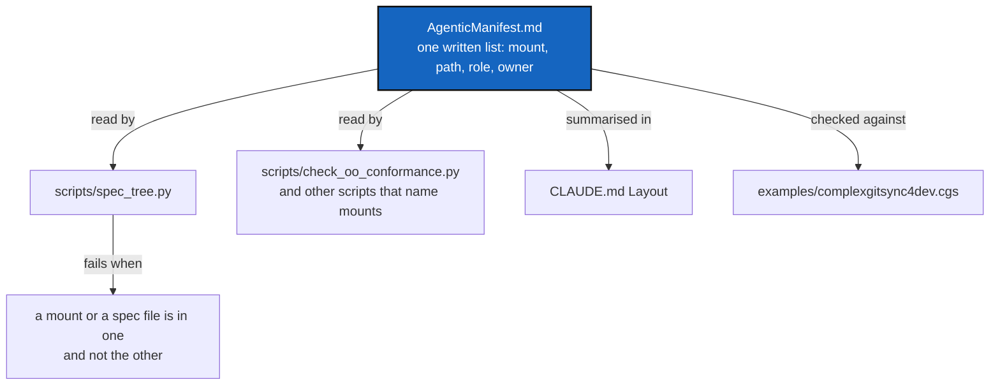

# SpecTreeManifest — the spec tree and its checks still describe the mounts we had last month

*Created: 2026-09-30*

*Branch: main*

> **Implemented 2026-09-30.** Archived with the work done; where it differs
> from the plan below, stated plainly:
>
> - **Two tables, not one.** The plan in §2 asked for one six-column table.
>   `AgenticManifest.md` holds two: *Mounts* (mount, repository, side, role)
>   and *Spec files* (file, mount, digest: `cited` or `exempt: <reason>`).
>   One row per mount with a list of files and exemptions in a cell would
>   not have parsed without guessing; the `specs` and `exempt` columns
>   became the second table.
> - **D1 to D4 were taken at this ticket's own recommendations** (manifest in
>   `.localSpec`, a Markdown table, not loaded at session start, roles left
>   to `AGENT.md`), because the owner did not answer them. They stand until
>   the owner says otherwise.
> - **WP4 found no other script holding a mount list.** `bump_build.py`,
>   `check_module_ceilings.py`, `check_oo_conformance.py` and the `pixi.toml`
>   tasks name no mount as a list; `pixi.toml` points `bump-version` at one
>   path, `.versioning/scripts/bump_version.py`, which is a path to a script
>   and not a list. Nothing was changed there.
> - **Left behind, found on review, then fixed by the worker in the same change:** the comments in
>   `examples/complexgitsync4dev.cgs`, three stale lines in `.gitignore`, a
>   docstring in `tests/unit/test_documents.py`, and the "release skill"
>   wording in `tests/unit/test_bump_version.py` still use the old mount
>   names, so the "no file names them as a mount" bullet in §5 was not yet met
>   for every file. All of them, plus the misaligned table in tutorial 04 and a
>   doubled exemption message in the script, were then fixed. `DevTickets/TicketSummary.md` was already
>   out of date and was not touched.
> - Version: patch, `3.7.2`, since only scripts, specs and docs changed.

> Opened from a conversation with the owner (2026-09-30), after the
> DefaultUserMemory change: *"write a DevPlanTicket for updating the
> specTree and the subsequent scripts/.py and agentic control manifest.md"*.
> Nothing stood behind that request in `shortTickets/`; this ticket is its
> written record. Ranked `1-2`, behind
> [AutofixBlindSpot](../openTickets/main_1-1_AutofixBlindSpot_DevPlanTicket.md); the owner
> may re-rank it (`shortTickets/ReorderPriority-mem-multiUser.md` is open).

## Abstract — read this first

**The one-line version.** The agentic mounts changed — `cgitsync-dev`,
`release` and `dogfooding` became `.dev`, `.versioning` and `.auto` — and the
spec tree did not follow: `scripts/spec_tree.py` still lists a hand-written
set of fourteen files that leaves out every document in the three new
mounts, and `CLAUDE.md` still names the old ones. The check passes because it
only checks what it was told about. Replace the hand-written list with one
written manifest that names every agentic mount and what it is for, and make
the scripts read it.

**What this document is.** The gap as it is today (§1), the manifest that
closes it (§2), work packages (§3), decisions (§4), acceptance (§5).

**Why it exists.** A rule in a file the check does not know about is as
unreachable as a rule never written. `pixi run check-spectree` says "Spec tree
intact" while six Markdown files sit outside it.

**Who it is for.** Whoever picks it up; the owner for §4.

**What you need to do with it.** Read §1 and §2, then decide D1–D4.

---

## 1. What is out of step today

Checked on 2026-09-30:

| What | Says | Reality |
|---|---|---|
| `examples/complexgitsync4dev.cgs` | mounts `.dev`, `.versioning`, `.auto`, `.localSpec`, `.claude` under `.agent/.local/`, and three shared mounts under `.agent/.distant/` | — this is the truth |
| `scripts/spec_tree.py` `DECLARED_SPEC_FILES` | 14 files, none under `.dev`, `.versioning` or `.auto` | `.dev/cgitsync-dev.md`, `.versioning/Versioning.md`, `.auto/dogfooding.md` and the three mounts' `README.md` exist and state rules or pointers |
| `CLAUDE.md` *Layout* and the bootstrap paragraph | "`cgitsync-dev`/`release`/`dogfooding`" | those names are gone |
| `DIGEST_EXEMPT` | hand-written exemptions | will need one per new file, written by hand again |
| `pixi run check-spectree` | "Spec tree intact", `reachable: 14/14` | true of 14 files, silent about the rest |

The cause is the one [SpecTree](20260925_SpecTree_DevPlanTicket.md)
D1 chose on purpose: a hand-maintained list, because a glob would pull in
files that are not specs. That reasoning still holds. What it lacked is a
single place where a person says *which mounts exist and what each is for*,
so the list could not drift away from the `.cgs` unnoticed.

## 2. The manifest

One Markdown file, `AgenticManifest.md`, in `.agent/.local/.localSpec/`
(D1), following `DOCSTYLE.md`. Its body holds one table, read by scripts
and by people:

| Column | Holds |
|---|---|
| mount | the path, e.g. `.agent/.local/.versioning` |
| repository | the `.cgs` repository id it is cloned from |
| side | `local` (ours to write) or `distant` (shared, read-only) |
| role | one plain sentence: what an agent goes there for |
| specs | the Markdown files in it that the spec tree must reach |
| exempt | which of those state no rule, each with its reason |

Two consequences:

- `scripts/spec_tree.py` builds `DECLARED_SPEC_FILES` and `DIGEST_EXEMPT` from
  the table instead of holding them, and adds one new failure: a mount in
  `examples/complexgitsync4dev.cgs` under `.agent/` that the manifest does not
  name, or the reverse.
- `CLAUDE.md`'s *Layout* section stops listing mounts one by one and points at
  the manifest, so a new mount is one table row plus one line in the `.cgs`,
  not edits in four places.

## 3. Work packages

| WP | Touches | Deliverable |
|---|---|---|
| **WP1** | `.agent/.local/.localSpec/AgenticManifest.md` | Write the manifest for today's eleven mounts (`.dev`, `.versioning`, `.auto`, `.localSpec`, `.claude`, `.ticketing`, `DevSpec`, `DocSpec`, plus the project's own `docs` and `.memory` marked as not spec mounts). Read each mount's `README.md` first so the role sentence is true. |
| **WP2** | `scripts/spec_tree.py` | Read the manifest instead of the two hand-written tables. Keep `--check`, `--check-digest`, `--flatten` and their exit codes. Add the mount-versus-`.cgs` check. |
| **WP3** | `tests/unit/test_spec_tree.py` | Fixture tests for: a mount in the `.cgs` and not the manifest, the reverse, a spec file listed that does not exist, an exemption with no reason. Keep the two tests against the real tree. |
| **WP4** | other scripts | Search `scripts/` for any other place that names a mount or a spec path (`check_oo_conformance.py`, `bump_build.py`, `pixi.toml` tasks) and make each read the manifest or state why not. List what was found in the finishing report. |
| **WP5** | `CLAUDE.md` (in `.claude`), `AdditionalSpecs.md`, `digest.md`, `AGENT.md` files | Replace the stale mount names; point *Layout* at the manifest; add the digest line for the new rule (*a mount appears in the manifest and the `.cgs`, or the check fails*); add `.dev`/`.versioning`/`.auto` documents to the digest or to the manifest's exemptions, one or the other. Check `AdditionalSpecs.md`'s *Versioning* section against `.versioning/Versioning.md`: one authoritative file per purpose (`DOCSTYLE.md` §7). |
| **WP6** | `DevTickets/README.md`, `TICKETLIFECYCLE` pointers | If either names the old mounts, update what this project owns; report, do not edit, what lives in a shared mount. |

**Order.** WP1 → WP2 → WP3 → WP4 → WP5 → WP6. WP1 is the only one that needs a
person's knowledge of what each mount is for; do not generate its role
column from the README headings.

## 4. Decisions

| D | Question | Recommendation | Whose call |
|---|---|---|---|
| **D1** | Where does the manifest live? | `.agent/.local/.localSpec/`, beside `digest.md` — it is ours to write, and the digest is the nearest relative. The shared `DevSpec` mount could hold a generic template later. | Owner |
| **D2** | Markdown table or TOML? | Markdown table, parsed by the script. A `.cgs`-style TOML is easier to parse, but the file is also read by agents at session start, and `DOCSTYLE.md` wants documents. | Owner |
| **D3** | Is the manifest loaded at session start like the digest? | No: `CLAUDE.md` links it, the digest stays the only file loaded in full. It is a map, not a rule set. | Owner |
| **D4** | Does the manifest also say which agent role may write which mount? | Not here. `.localSpec/AGENT.md` owns roles; the manifest names `side` only, and links there. | Owner |

## 5. Acceptance

- `AgenticManifest.md` exists and names every mount under `.agent/` in
  `examples/complexgitsync4dev.cgs`.
- `scripts/spec_tree.py` holds no hand-written list of spec files or
  exemptions; `pixi run check-spectree` reports the files in `.dev`,
  `.versioning` and `.auto` as reachable, and fails on each shape in WP3.
- No file in this project's own tree names `cgitsync-dev`, `release` or
  `dogfooding` as a mount.
- `CLAUDE.md`'s *Layout* points at the manifest; `digest.md` carries the new
  rule, and `pixi run check-spectree` passes.
- `pixi run lint`, `pixi run test`, `cgitsync status` with `errors=0`. No
  `src/` change is expected, so no `bump-build`; version is the
  orchestrator's call (`patch` if only scripts and specs change).
