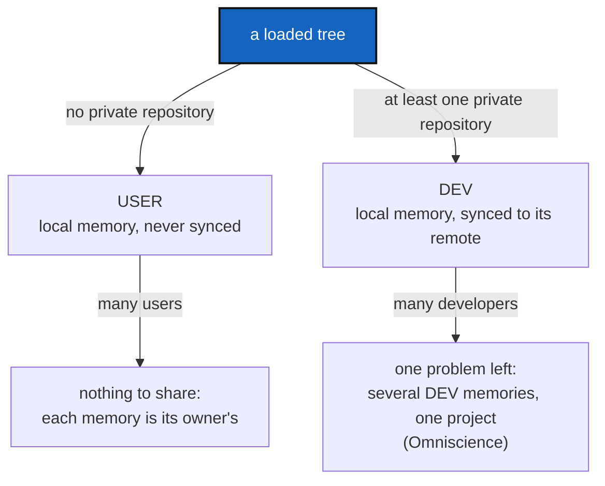

# UserDevProfile — a memory is always local; a tree holding private repositories is a developer's, and only a developer's memory is synced

*Created: 2026-09-30*

*Branch: main*

> **Implemented — 2026-09-30, archived.** WP1–WP5 landed in `cgitsync3.9.0`: `WorkingGitTree.profile` in `git_tree.py`; `profile=` in `status` and `status --json`; `orchestre/memory_setup.py` (`MemorySetup`, `MemorySetupWarning`) behind the client methods `memory_setup_proposal`, `memory_setup`, `memory_setup_decline`; `cli/memory_prompt.py` for `cgitsync memory setup` and the terminal-only offer after a recording command; the rule stated once in `AdditionalSpecs.md`, *The tree profile*; `tests/integration/test_user_dev_profile.py`. Quoted by an independent orchestrator at 94/100. Owner decisions taken while closing: the import-ceiling raises are kept, and `memory setup` edits the `.cgs` the tree was built from even when it sits outside the workspace. Answers that leave nothing to create count as a decline, so the question is still asked only once.

> **Ticket review — 2026-09-30, MemoryArchitecture closed.** Renumbered `main_1-2` → `main_1-1`: [MemoryArchitecture](../archive/20260930_MemoryArchitecture_DevPlanTicket.md) was archived, so the priority-1 ranks were compacted.

> Opened from the owner's short ticket `ReorderPriority-mem-multiUser.md`
> (closed 2026-09-30, `archive/.closedUserTicket/20260930_ReorderPriority-mem-multiUser.md`):
> *"One idea for unifying the strategy for answering would be 1. treat always
> the .memory as local for user and DEV. 2 Identified DEV from User, a USER
> holds no private at all. DEV does, so the local memory is synced. 3. This
> way it may be easier to treat the multi-user and multi-Dev case."*
>
> The idea makes sense, and most of its first half is already true:
> [DefaultUserMemory](../archive/20260930_DefaultUserMemory_DevPlanTicket.md)
> gave every user install a local memory that is never published. What is
> missing is the rule the owner names in point 2 — a stated, checked
> difference between a USER tree and a DEV tree — and what follows from it
> for syncing and for the multi-person case. This ticket builds that;
> `AdditionalSpecs.md`'s *Memory architecture* section (formerly the MemoryArchitecture ticket) carries
> the strategy as architecture.

> **Decisions answered by the owner — 2026-09-30. Ready to implement.**
> D1 `git_tree.py`; D3 one shared branch; D4 any private repository makes a
> tree DEV — all as recommended. **D2 was answered differently and is the
> largest part of the work:** a DEV tree with no declared memory is *offered a
> fix*, not only warned — cgitsync asks for the provider, the owner and the
> repository name, proposes creating the repository with the provider's own
> tool, and adds the entry to the `.cgs`; only if all of that fails or is
> declined does it warn that the work has no memory back-up and no global
> ledger record. §5 holds the answers verbatim; WP3 is rewritten to match.

## Abstract — read this first

**The one-line version.** Every workspace's memory is a local repository
first, for everyone. A tree whose `.cgs` holds no private repository is a
**USER** tree, and its memory stays on that disk. A tree that holds at least
one private repository is a **DEV** tree, and its memory is synced to a
remote. The tool says which one it is looking at.

**What this document is.** The rule (§1), what it changes (§2), how it
narrows the multi-user problem (§3), work packages (§4), decisions (§5),
acceptance (§6).

**Why it exists.** Today "is this memory published?" is answered by one
fact — whether the `.cgs` declares a memory entry — and "is this a
developer?" is answered nowhere. The two questions are really one, and
answering it once, from what the tree already declares, makes every later
memory question (who syncs, who shares, what conflicts) smaller.

**Who it is for.** Whoever implements it; the owner for §5.

**What you need to do with it.** Read §1 and §3, decide D1–D4, then §4 in
order.

---

## 1. The rule

1. **A memory is always local first.** Every command records into
   `.cgitsync` on the machine it runs on and folds into a local repository
   at `.cgitsync/.memory`. That is true for both profiles; syncing is an
   extra step on top, never a replacement.
2. **USER or DEV is read off the tree, not configured.** A tree is **DEV**
   when at least one of its repositories is effectively private
   (`WorkingRepo.effective_private`, after `propagate_privacy`), and **USER**
   otherwise. `install.cgs` mounts no private repository, so a user install
   is USER by construction; `examples/complexgitsync4dev.cgs` mounts nine (the `.memory` entry included),
   so this project's own tree is DEV.
3. **Only a DEV memory is synced.** A USER memory is never pushed — the rule
   DefaultUserMemory already enforces. A DEV memory is pushed by `memory
   push` and by the fold `push`/`tag`/`freeze` already run.
4. **The `.cgs` still names the remote.** Being DEV says the memory *should*
   be synced; the declared `.memory` entry says *where*. A DEV tree with no
   memory entry has nowhere to sync to, so cgitsync offers to set one up and,
   failing that, warns (D2).

This is a second axis, independent of the install frontier. `UseCase`
(`STANDALONE`/`NESTED`, `settings.py`) says where the running ComplexGitSync
sits relative to the workspace; the profile says what the workspace holds.
A standalone install can be DEV and a nested one USER.

## 2. What changes

| Today | After |
|---|---|
| "Published" means "the `.cgs` declares a memory" (`DefaultMemory.declared`) | Unchanged as the *where*; the profile adds the *whether* |
| Nothing says whether a tree is a user's or a developer's | `status` prints `profile=user` or `profile=dev` in its summary line, and `status --json` carries it (additive field) |
| A DEV tree without a memory entry silently gets a local-only default | It still gets one (the record is never lost). The first recording command offers, in a terminal, to create and declare a memory repository; without a terminal, or once declined, it warns instead (D2) |
| A USER tree that declares a memory entry is impossible to tell apart | Impossible by construction: a memory entry is itself private, so declaring one makes the tree DEV |

## 3. Why this makes the multi-person case easier

The open design in [MemoryArchitecture](../archive/20260930_MemoryArchitecture_DevPlanTicket.md)
§2.3 and [Omniscience](memory-dev_2-1_Omniscience_DevPlanTicket.md) is
*several people's memories of one project meeting in one journal*. The rule
removes half of it:

- **Many users** share nothing. Each user's memory is theirs, local, and
  never leaves the disk, so no two user memories ever meet. There is no
  multi-user problem left to design.
- **Many developers** is the whole of what remains: several DEV memories,
  each local first, each syncing to the same project's memory. Two
  developers on the same project branch push to the same `.memory` branch
  today, and a divergence is repaired by `autofix`'s
  `repair_divergent_user`, which re-sequences the two chains. Whether that
  stays the model, or each developer gets a branch of their own and
  Omniscience's journal merges them, is D3.

## 4. Work packages

| WP | Touches | Deliverable |
|---|---|---|
| **WP1** | `git_tree.py` (D1) | One place that answers USER or DEV for a loaded tree, from `effective_private`. No second copy of the rule anywhere. |
| **WP2** | `status_render.py`, `json_render.py`, `orchestre/` | `profile=user|dev` in the `status` summary line and an additive `profile` field in `status --json`. |
| **WP3a** | `orchestre/memory_commands.py` (or a small new collaborator if the size ratchet requires it) | **The proposal, as data.** A client method, say `memory_setup_proposal()`, returning for a DEV tree with no declared memory: provider (default `github`), owner (guessed — see D2), repository name (default `.memory`), the `.cgs` entry `MemoryRepository.mount_entry` would add, and the creation command `provider.py` would run (`gh` for GitHub, `glab` for GitLab, `tea` for Codeberg — the mapping `cgitsync repo create` already uses). Pure answer, no side effect, no prompt. |
| **WP3b** | `orchestre/`, reusing `repo_create`, `add_memory_repo_cgs`, `memory_adopt` | **The fix, as one call.** A client method, say `memory_setup(provider, owner, name)`, that runs the three existing steps in order — create the repository with the provider's tool, add the entry to the `.cgs` (edited as text, comments kept), adopt the local default memory (`memory adopt` already does this: it discards only the default's `.git` and recommits the folded files as found, so every record is kept though the local commits are not) — and stops at the first failure, reporting which step failed and what was left done. No new transport, no credential read by cgitsync. |
| **WP3c** | `cli/` | **The questions, in a terminal only.** On the first recording command in a DEV tree with no declared memory, if stdin and stdout are a terminal and neither `--json` nor a non-interactive mode is in force: ask provider, owner and name with the WP3a defaults pre-filled, show the creation command, ask for confirmation, then call WP3b. The same call is also a command of its own, `cgitsync memory setup [--provider] [--owner] [--name]`, so the warning in WP3d can name it and a user can run it later; it goes in the README command table, `docs/Text/user_guide.tex` and, as a client method, `docs/Text/api_python.tex`. The answer "no" is remembered in `.cgitsync/` so the question is asked once; later runs only warn. |
| **WP3d** | `orchestre/default_memory.py`, `memory status`, `status` | **The warning, everywhere else.** Without a terminal (CI, `--json`, a Python caller), after a declined proposal, or after WP3b failed: warn, in plain words, that *this work has no memory back-up and no global ledger record of the contribution*, and print the exact commands that fix it. `memory status` always says so on such a tree. A USER tree's notice is unchanged. |
| **WP4** | `AdditionalSpecs.md`, `CLAUDE.md`, README, `tutorials/05_memory.md`, `docs/Text/user_guide.tex` | State the rule once in `AdditionalSpecs.md` (a section beside *The install frontier*), point at it from the others. |
| **WP5** | `tests/` | A tree from `install.cgs` is USER; this project's developer tree is DEV; a tree whose only private repository is read-only is DEV; `--json` carries the field; a USER memory is never pushed and a DEV memory with an entry is. |

**Order.** WP1 → WP2 → WP3a → WP3b → WP3c → WP3d → WP4 → WP5. WP1 is the
whole rule; WP3a–d are D2's answer; the CLI (WP3c) only collects answers and
calls WP3b, per the CLI-mirrors-the-API rule.

## 5. Decisions — answered by the owner, 2026-09-30

| D | Question | Owner's answer |
|---|---|---|
| **D1** | Where does the rule live? | **`git_tree.py`**, beside `propagate_privacy` (as recommended). |
| **D2** | A DEV tree with no memory entry: warn, or refuse? | **Propose a fix.** In the owner's words: *"a DEV tree without memory declared in .cgs must propose a fix, by adding a memory repo in cgs. cgitsync should ask who is the GitProvider (default github), the owner (can be guessed by the cgs and the other repo, ie the main owner of private repos, or the owner of the project repos if no more info), and the repo name (.memory by default) — cgitsync propose the automatic creation of the repo with the appropriate gh or glab command (for github and gitlab, check if there is one for codeberg). If everything fails, warn the DEV that there is no memory back-up for his work, and therefore no global ledger records of the contribution."* Codeberg: `tea`, which `provider.py` already maps it to. |
| **D2a** | …and when it cannot ask (no terminal, CI, `--json`, a Python caller)? | **Warn only**, with the exact commands that fix it. No prompt, no silent creation. |
| **D2b** | …and when is the proposal made? | **On the first recording command** in such a tree. A declined proposal is remembered in `.cgitsync/`; afterwards only the warning is shown. |
| **D3** | Two developers on one project branch? | **One shared `.memory` branch** (as recommended); divergence stays `autofix`'s job, the per-developer question stays Omniscience's. |
| **D4** | Does a read-only private repository alone make a tree DEV? | **Yes, any private repository** (as recommended). |

**Owner guess, precisely (D2).** The most frequent owner among the tree's
private repositories (by `effective_private`); if there is none or a tie
cannot be broken, the owner of the project's root repository; if that is
unknown too, no default is offered and the question must be answered.

## 6. Acceptance

- `cgitsync status` on a tree installed from `install.cgs` prints
  `profile=user`; on this project's developer tree, `profile=dev`, with
  `errors=0`.
- `status --json` carries `profile`, and no existing field changed.
- A USER memory is never pushed; a DEV memory with a declared entry is
  pushed exactly as today; a DEV tree without one is offered the fix in a
  terminal and warned everywhere else, never refused.
- In a terminal, accepting the proposal on a fresh DEV tree ends with the
  repository created by the provider's tool, the entry in the `.cgs` with
  its comments intact, and the local default memory adopted with every record;
  the test fakes the provider tool, no network call is made.
- Declining is asked once; the next recording command only warns. Without a
  terminal, no question is ever asked.
- The owner guess follows D2's rule, with a test for each of its three cases.
- The rule is stated once, in `AdditionalSpecs.md`, and the digest carries
  one line for it.
- `pixi run lint`, `pixi run test`, `pixi run bump-build` per `src/` change;
  version is the orchestrator's call (new user-visible field: `minor`).
