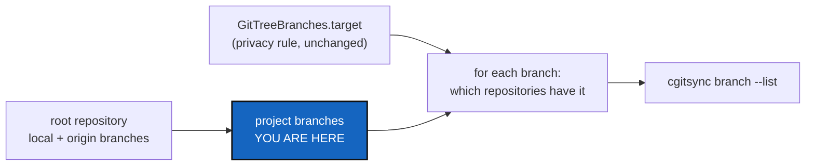

# ProjectBranchList — which branches does the project have?

*Created: 2026-10-02*

*Branch: main*

> **Implemented — 2026-10-02, archived.** Landed in the next release: `branch --list` now prints the project's own branches with their coverage, `branch --list --per-repo` keeps the 3.12.0 view (the §3 recommendation, taken); client method `project_branches`, `GitTreeBranches.project_branches`, `ProjectBranch`, `git_runner.remote_tracking_branches`, `git_branch.closed_branch_origin`; `tests/integration/test_project_branches.py`; README, user guide, API guide, `CLAUDE.md` and `AdditionalSpecs.md`. The owner approved the ceiling raise. Not yet quoted by an independent orchestrator, and `bump-version` is the orchestrator's step.

> **From the owner's short ticket `archive/.closedUserTicket/20261002_branch-list.md`.**
> The owner asked whether any command lists the branches of the ComplexGitSync
> project itself, not of each repository. None does — checked on 2026-10-02
> against `cgitsync help --all` and the client. `status` prints the one
> branch the project is on (`cgitsync_branch`). `branch --list` (3.12.0)
> prints the local branches of each repository, which on a freshly
> installed tree is one branch per repository: the same thing `status`
> already shows. Filed at priority 1 because the owner asked for it.

## Abstract — read this first

**The one-line version.** `cgitsync branch --list` should answer "which
branches does my project have, which one am I on, and which repositories
are missing from each?" It should not print one line per repository.

**What this document is.** The plan for a project-level branch listing:
what counts as a project branch, what the answer shows, where each piece of
code goes, and how we will know it is done.

**Why it exists.** A project branch is a ComplexGitSync idea. The project
is on a branch when its root repository is, every project repository
follows that branch, and every private/local repository follows it under
the project's name (`ComplexGitSync_memory-dev`). Today nothing lists those
branches. On this project's own tree, the root's `origin` holds
`memory-dev`, `tmpPyPi`, `alpha-tech` and six more, but `branch --list`
shows only `main`, because none of them was ever checked out locally. To
find out what exists, the owner has to leave cgitsync and run
`git branch -a` in the root.

**What you will find.** §1 what a project branch is. §2 what the answer
shows. §3 the one decision for the owner. §4 where the code goes. §5
acceptance.

**Who it is for.** The worker who implements it and the orchestrator who
reviews it. The owner only needs §3.

**What you need to do with it.** Owner: answer §3, or accept the
recommendation. Worker: build §4 against §5.



---

## 1. What a project branch is

**A project branch is a branch of the root repository**, the project entry,
as `status` already defines `cgitsync_branch`. Both kinds count:

- **local** — `refs/heads/*` in the root;
- **on origin** — `refs/remotes/origin/*` in the root, as of the last
  fetch. Reading these refs needs no network. The answer says "as of the
  last fetch" rather than contacting the remote. `origin/HEAD` is not a
  branch and is left out.

**A closed branch** (`closed/<name>`, from `close-branch`) is still a
branch, but it is listed apart, under its original name, so that a closed
branch never looks like live work.

**Each branch has a coverage**: for every repository in scope that follows
the project, does the branch it would be on under this project branch
exist there, locally or on origin? "The branch it would be on" is
`GitTreeBranches.target(repo, name)`: the same name for a project
repository, `<project>_<name>` (or `<project>` for `main`) for a
private/local one. A private/distant repository stays on its own branch
whatever the project does, so it is not counted. A repository not cloned
yet is reported as such, not as missing.

Coverage is what makes this a ComplexGitSync answer rather than
`git branch -a` in the root. It tells you, before you run `checkout`,
which repositories will join an existing branch and which will get a new
one.

## 2. What the answer shows

```
cgitsync_branch=main  (branches on origin as of the last fetch)
* main          local, origin   all 11 repositories
  memory-dev    origin          missing in: .auto, .dev, .versioning
  tmpPyPi       origin          missing in: .auto, .dev
closed:
  feature-x     origin          closed/feature-x
```

- One line per project branch, sorted by name. The one the project is on
  is marked `*`. A detached root marks none and says
  `cgitsync_branch=detached`, as `status` does.
- Where the branch exists in the root: `local`, `origin`, or both.
- Coverage: `all N repositories`, or `missing in:` followed by the names.
  Repositories that are not cloned yet are named separately.
- `--private` limits coverage to the writable configuration repositories,
  as it does for every other branch command. The branches listed are
  still the root's.
- Read-only: it writes no State and runs no `fetch`.

## 3. The one decision for the owner

**Recommended: `branch --list` gives the project answer above, and the
per-repository view moves to `branch --list --per-repo`.** In Git,
`git branch --list` lists the branches of the repository you are in, and
in ComplexGitSync that repository is the project. The per-repository view
from 3.12.0 is still useful when one repository has a local branch the
others lack, so it is kept under a flag rather than removed.
`ComplexGitSyncClient.list_branches` stays as it is.

The alternative leaves `branch --list` as it is and adds a new flag
(`branch --list --project`) or a new verb (`cgitsync branches`). Nothing
existing changes, but the shortest command keeps giving the answer the
owner called "not interesting".

Either way, changing what an existing command prints is a judgement for
the version bump (minor), made by the orchestrator under `pixi run
bump-version`.

## 4. Where the code goes

Each piece goes in the module that already owns its rule. No new module.

| Module | Change |
|---|---|
| `git_runner.py` | One read-only question, `remote_tracking_branches(path, remote="origin") -> list[str]`: `for-each-ref refs/remotes/<remote>`, prefix removed, `HEAD` left out. It is the remote-side twin of `local_branches`. |
| `git_branch.py` | The inverse of `closed_branch_name`: `closed_branch_origin(name) -> str \| None`, the name a closed branch was closed from, or `None`. Pure. The `closed/` prefix stays inside this module. |
| `git_tree_branch.py` | `GitTreeBranches.project_branches(scope) -> tuple[ProjectBranch, ...]`, plus the `ProjectBranch` value (name, local, on origin, closed, current, missing repositories, uncloned repositories). This module is the only place that reads the root's branch to speak for the tree, and `target` already holds the privacy pairing, so coverage restates no rule. |
| `orchestre/tree_commands.py`, `orchestre/client.py` | `ComplexGitSyncClient.project_branches(*, private=False)`, scoped through `GitProbes.scope_for` like `list_branches`. |
| `cli/branch_command.py` | `--list` prints §2. `--per-repo` prints the 3.12.0 view, and is refused without `--list`. Help sentence and examples go in `help_text.py`. |

**Docs, in the same change:** the `branch` row in the README command table
and the `cgitsync_branch` paragraph of *What `status` tells you*, pointing
to `branch --list` for the other branches; `docs/Text/user_guide.tex`
§`branch --list`; `docs/Text/api_python.tex` for `project_branches`; the
`git_tree_branch.py` row in `CLAUDE.md`'s responsibility table and in
`AdditionalSpecs.md`'s architecture section (the module now also *lists*
the tree's branches).

**Ceilings.** `git_tree_branch.py` gains one public value and one method,
and `git_runner.py` gains a few lines. If `pixi run check-ceilings` needs a
baseline raise, ask the owner for it by name, as BranchList did, and
record the approval in `AdditionalSpecs.md`. Never just raise it.

## 5. Acceptance

- An integration test over a fixture tree with a project repository and a
  private/local one shows that:
  - a branch that exists only on the root's origin is listed as `origin`;
  - a branch present in the root and, as `<project>_<name>`, in the
    private/local repository is reported `all N repositories`;
  - a branch missing from the private/local repository names that
    repository under `missing in:`;
  - a `closed/<name>` branch is listed under `closed:`, not with the live
    ones;
  - the current branch carries `*`, and a detached root marks none;
  - the command leaves every repository's refs and `HEAD` unchanged and
    writes no State.
- `--per-repo` prints exactly what 3.12.0's `branch --list` printed. The
  existing `tests/integration/test_list_branches.py` still passes against
  `list_branches`.
- Run on this project's own tree, it lists `memory-dev`, `tmpPyPi` and the
  other origin branches that `branch --list` cannot show today.
- README row, `user_guide.tex`, `api_python.tex`, `CLAUDE.md` and
  `AdditionalSpecs.md` are updated as listed in §4;
  `test_readme_documents_every_cli_command` passes.
- `pixi run lint` and `pixi run test` pass, `pixi run bump-build` has run,
  and `cgitsync status` shows `errors=0`.
