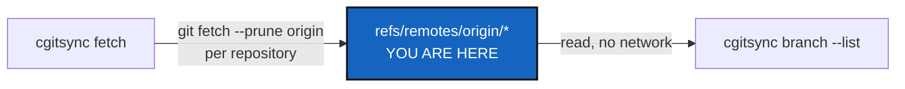

# TreeFetch — a public `cgitsync fetch`

*Created: 2026-10-02*

*Branch: main*

> **Implemented — 2026-10-02, archived.** `cgitsync fetch` and client method `fetch`; `operations/fetch.py` (`FetchOperation`), `cli/fetch_command.py`, a `prune` flag on `git_runner.fetch`, and the `branch --list` header now names `cgitsync fetch`; `tests/integration/test_fetch.py`; README (command table, the `--private` lists, the status paragraph), user guide, API guide, `CLAUDE.md` and `AdditionalSpecs.md`. The owner approved the ceiling raise.

> **From the owner's short ticket `archive/.closedUserTicket/20261002_fetch.md`.**
> ProjectBranchList made `branch --list` read origin's branches "as of the
> last fetch", but no command lets a user run that fetch. `pull`,
> `checkout`, `branch` and the memory commands each fetch silently, as part
> of their own work. Kept short on purpose: the owner doubted a full plan
> was worth it, and the design below has no open decision.

## Abstract — read this first

**The one-line version.** `cgitsync fetch` updates every repository's view
of its origin, and changes nothing else, so `branch --list` can be made
current on demand.

**What this document is.** The plan for that one command: what it does,
where the code goes, and how we know it is done.

**Who it is for.** The worker and the orchestrator.

**What you need to do with it.** Build §2 against §3.

---

## 1. What it does

- In every cloned repository in scope, parent-first, it runs
  `git fetch --prune origin`. Pruning removes the remote-tracking refs of
  branches deleted on origin, so `branch --list` stops listing them. It
  never touches a local branch, `HEAD` or a worktree.
- It reports one line per repository: `fetched`, or `skipped` with the
  reason (not cloned, no `origin` remote, or the fetch failed). A failure
  in one repository does not stop the others, and the command exits
  non-zero if any fetch failed.
- `--private` narrows it to the writable configuration repositories, as
  for every other tree-wide command.
- It writes no State, because it moves no `HEAD` (the rule is that every
  command that moves `HEAD` writes one). It does log the run like any
  other command.

## 2. Where the code goes

| Module | Change |
|---|---|
| `git_runner.py` | `fetch` gains `prune: bool = False`. |
| `operations/fetch.py` (new) | `FetchOperation.fetch_tree(tree, runner, scope) -> tuple[RepoOutcome, ...]`, re-exported as `fetch_tree` from `operations/__init__.py`. |
| `orchestre/tree_commands.py`, `orchestre/client.py` | `ComplexGitSyncClient.fetch(*, private=False)`, which sets `last_write_outcomes`. |
| `cli/fetch_command.py` (new) | Registers and handles `cgitsync fetch`. `cli/expert.py` only lists it. |
| `cli/branch_command.py` | The `branch --list` header says `cgitsync fetch` refreshes origin. |

**Docs, in the same change:** the README command table,
`docs/Text/user_guide.tex`, `docs/Text/api_python.tex`, help examples in
`cli/help_text.py`, and the `operations/` and `cli/` rows of `CLAUDE.md`
and `AdditionalSpecs.md`.

## 3. Acceptance

- An integration test shows that:
  - a branch pushed to origin after the clone appears in
    `project_branches()` only after `fetch()`;
  - a branch deleted on origin disappears after `fetch()`;
  - a repository with no origin, or not cloned, is skipped with its
    reason;
  - local branches and `HEAD` are unchanged, and no State is written.
- `cgitsync fetch` prints one line per repository and a summary;
  `test_readme_documents_every_cli_command` passes.
- `pixi run lint`, `pixi run test` and `pixi run check-ceilings` pass,
  `bump-build` and `bump-version` have run, and `cgitsync status` shows
  `errors=0`.
