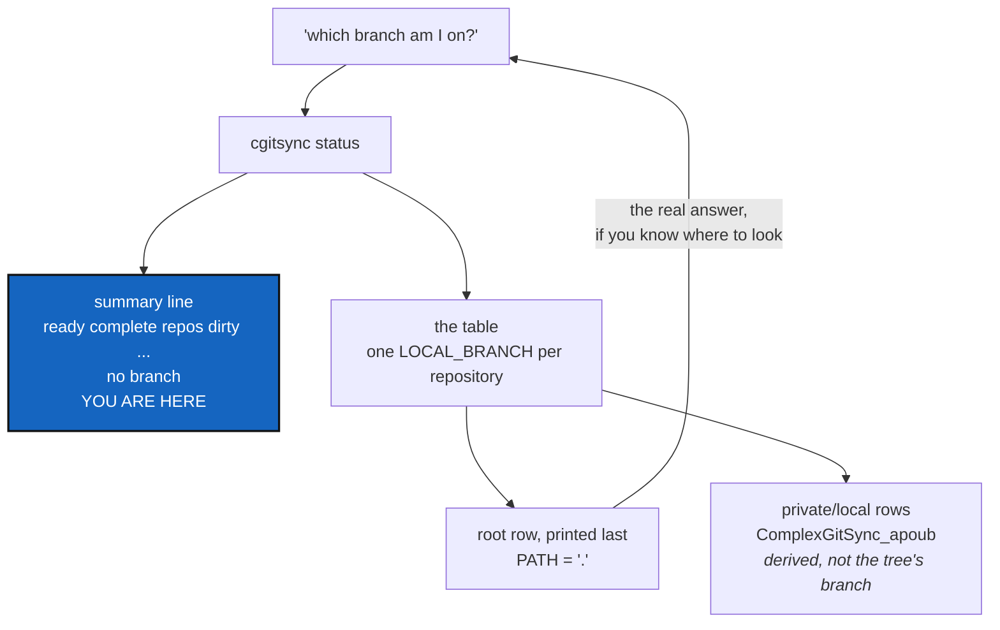

# StatusCurrentBranch — say which branch the tree is on

*Created: 2026-09-16*

*Branch: main*

## Abstract — read this first

**The one-line version.** `cgitsync status` never says which branch the
workspace is on; the reader has to find the root repository's row in the
table and know that it is the one that counts.

**What this document is.** A planning ticket, from the short ticket
`display_branch_for_status.md`: *"Update the command cgitsync status, to
display the current branch"*.

**Why it exists.** "Which branch am I on?" is the first question anyone
asks before committing, and `status` is the command they ask it with.
Today the answer is in the table, but only if you already know three
things: that the row with `PATH` `.` is the project itself, that the table
is printed leaf first so that row is last, and that a `private/local` row
saying `ComplexGitSync_apoub` is a derived name, not the branch you are
on. Somebody who knows all three did not need to ask. The `summary` line
is the place that answers questions in one line, and it does not carry the
branch.

**What you will find.** §1 what `status` prints today. §2 what is missing
and why the table alone does not answer it. §3 the decisions the owner
must make. §4 work packages. §5 acceptance. §6 what this does not cover.

**Who it is for.** Whoever picks this up, and the owner, who answers §3.

**What you need to do with it.** Answer §3, then work §4 in order.



---

## 1. What `status` prints today

```text
summary ready=true complete=true repos=7 dirty=1 staged=0 ahead=0 behind=0 unmeasured=0 recorded_mismatch=0 errors=0
REPOSITORY         PATH                SCOPE            LOCAL_BRANCH    UPSTREAM_BRANCH        LOCAL  SYNC    HEAD      RECORDED
--------------------------------------------------------------------------------------------------------------------------------
DocSpec            docs/DocSpec        private/distant  main            origin/main            clean  synced  e6f1b0bf  e6f1b0bf
DocComplexGitSync  docs                project          main            origin/main            clean  synced  dd76ac42  dd76ac42
.localSpec         .localSpec          private/local    ComplexGitSync  origin/ComplexGitSync  dirty  synced  ddb132a6  ddb132a6
.claude            .claude             private/local    ComplexGitSync  origin/ComplexGitSync  clean  synced  1783baf5  1783baf5
DevSpec            .agentSpec/DevSpec  private/distant  main            origin/main            clean  synced  a5d34329  a5d34329
.agentSpec         .agentSpec          private/distant  main            origin/main            clean  synced  8a74f4f7  8a74f4f7
ComplexGitSync     .                   project          main            origin/main            clean  synced  3efd27e4  3efd27e4
legend: SCOPE — ...
READY ready=true complete=true gittree_created=true gittree_active=true
```

| Piece | State |
|---|---|
| Per-repository branch | `LOCAL_BRANCH`, one column, correct — added by `UpstreamBranchDisplay` |
| The tree's own branch | **Nowhere.** Not in the `summary` line, not in the trailing `READY` line |
| The value itself | Already read: `_branch_incoherence` in `orchestre.py` calls `git_runner.current_branch(root.absolute_path)` on the root and measures every other repository against it |
| The rule that derives the others | `resolve_propagated_ref` in `git_branch.py` — `private_local_branch` turns the tree's branch into `<project>` or `<project>_<branch>` |
| A warning when the tree is split | Present: `warning: tree is split across branches — ...` |

## 2. What is missing

The tree has one branch — the root repository's. Everything else follows
from it: `checkout` propagates it, and a `private/local` repository's name
is derived from it by `private_local_branch`. That single value is the one
thing `status` does not print.

Three things make the table a poor substitute for it.

**The root row is not marked as the root.** It is `PATH` `.`, which is
correct and quiet. Rows are printed leaf first, so it is the last line of
the table, furthest from the `summary` line the reader started at.

**Half the rows carry a different branch on purpose.** `ComplexGitSync`
in the `.localSpec` row above is a derived private/local name, not a
branch anybody typed. A reader scanning `LOCAL_BRANCH` sees three
plausible answers and no rule saying which is the tree's.

**A split tree makes the column ambiguous exactly when it matters.** The
warning line already reports a split, but it reports it as deviations —
"`X` is on `foo`, expected `bar`" — and "expected" is measured against a
branch the output never names.

The `summary` line is where a one-line answer belongs. It is already the
line that reports the whole tree in fields a script can read, and it is
printed first.

## 3. Decisions — your call

### D1. Where does the branch go?

Recommendation: **a `branch=` field in the `summary` line**, directly
after `complete=`:

```text
summary ready=true complete=true branch=main repos=7 dirty=1 ...
```

The alternative is a separate line above the table. It reads well for a
person and costs a second line to parse for a script, while the `summary`
line already exists for exactly this. Adding a field changes the exact
field set pinned by
`tests/integration/test_golden_release_gaps.py::TestStatusGoldenOutput` —
that test is doing its job, and updating it is part of the work, not a
sign the change is wrong.

### D2. Which branch is "the current branch"?

Recommendation: **the root repository's**, read with the call
`_branch_incoherence` already makes, and made once per `status` rather
than twice. It is the branch `checkout` sets, the one the private/local
names are derived from, and the one the split warning already measures
against. No new notion of a tree branch is invented.

### D3. What is printed when there is no single answer?

Three cases, and the field must be present in all of them — a field that
sometimes vanishes is worse to parse than one that says it does not know:

| Case | Recommended value |
|---|---|
| Root is on a branch | the branch name |
| Root is on a detached `HEAD` | `detached` — the word `LOCAL_BRANCH` already uses for the same state |
| Root unreadable, or the tree has no root at all | `unknown` |

The third case is the one `CgshomeDefault` creates on purpose: an empty
default workspace has no root repository, and its `status` must answer
without a `KeyError`. Agree the value here so both tickets print the same
word.

### D4. Should a split tree mark the value?

Recommendation: **no.** `branch=main(split)` would make a script strip a
suffix to read a branch name, and the warning line already says it in
words. Keep the field one token. If the split deserves more weight in the
summary, that is a count (`off_branch=2`), not a decoration on the branch
name — and it is not asked for here.

### D5. Does the trailing `READY ...` line carry it too?

Recommendation: **no.** `_format_tree_state_line` in `cli/_shared.py`
reports lifecycle, not Git position, and is printed by five other
commands. Printing the branch twice in one output invites the two copies
to disagree.

## 4. Work packages

| WP | Depends on | Touches | Deliverable |
|---|---|---|---|
| **WP-B1** | D2, D3 | `status_render.py` | The pure part: a `_status_branch_label(branch, *, readable)` helper and the `detached`/`unknown` constants beside the existing `SYNC_*` ones. No Git call here — this module is Ring 0 |
| **WP-B2** | D1, WP-B1 | `orchestre.py` | `status()` reads the root branch once, passes it to the label helper, and puts `branch=` in the `summary` line. Share the read with `_branch_incoherence` so `status` does not run `git` twice for the same answer |
| **WP-B3** | WP-B2 | `tests/integration/test_golden_release_gaps.py`, `tests/unit/test_registry_client.py` | Update the pinned field set. New cases: a named branch, a detached root, a rootless tree, and a split tree where `branch=` names the root's branch while the warning names the deviations |
| **WP-B4** | WP-B2 | `README.md` §*What `status` tells you*, `docs/Text/user_guide.tex` §`status` | Document the field and its three values, and say plainly that the tree's branch is the root's and that private/local names are derived from it |
| **WP-B5** | all | `pixi`, this ticket | `pixi run lint` and `pixi run test`; `pixi run bump-version`; rebuild the docs PDFs if §WP-B4 touched `.tex`; archive this ticket and close the short ticket in the implementing commit |

## 5. Acceptance

- `cgitsync status` prints a `branch=` field in its `summary` line, and a
  test asserts the whole field set, in order.
- After `cgitsync branch apoub`, `status` reports `branch=apoub` while the
  `.localSpec` and `.claude` rows still show their derived
  `ComplexGitSync_apoub` — and a test covers exactly that pairing.
- A detached root reports `branch=detached`; a tree with no root reports
  `branch=unknown`. Neither raises.
- On a split tree, `branch=` names the root's branch and the existing
  warning still names each deviation.
- The field is never absent, whatever the tree's state.
- `README.md` and `docs/Text/user_guide.tex` say what the field means.
- `pixi run lint` and `pixi run test` pass.

## 6. What this does not cover

* **`--json`.** `status --json` is [CliContract](2-1_CliContract_DevPlanTicket.md)'s
  WP-C2. Its object carries the branch as a field of its own; this ticket
  only settles what the value is and what it is called, so both renderings
  answer the same way.
* **The empty-workspace answer.** [CgshomeDefault](2-3_CgshomeDefault_DevPlanTicket.md)'s
  WP-C5 owns what `status` prints for a workspace with no repositories.
  D3's third row is the branch half of that answer, agreed here so the two
  tickets do not invent two words for it.
* **The per-repository columns.** `LOCAL_BRANCH`, `UPSTREAM_BRANCH` and
  `SYNC` are correct and stay as they are.
* **The split-branch warning's wording**, and any new count for it (D4).
* **`checkout`, `branch`, and the propagation rule.** This ticket reports
  the branch; it never changes one.
