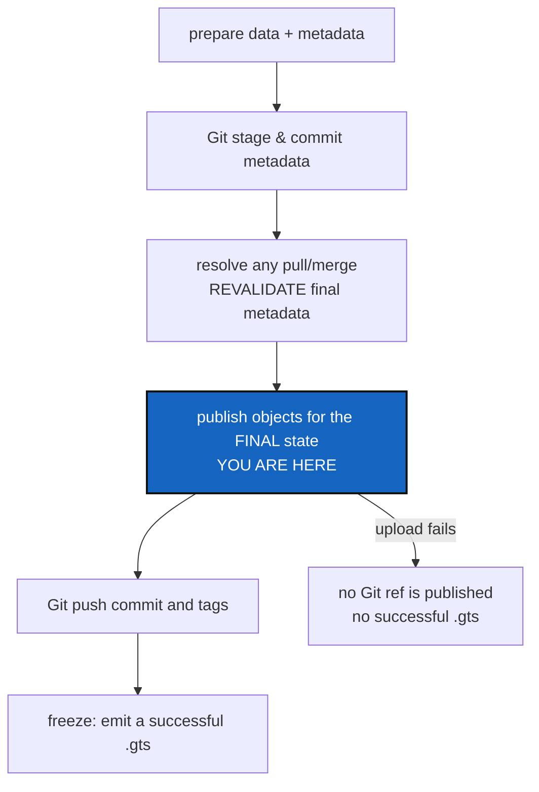

# DataPublication — a release must not advertise data nobody can fetch

*Created: 2026-09-16*

*Branch: data-repo*

> **Milestone M5** of [DataArchitecture](data-repo_2-5_DataArchitecture_DevPlanTicket.md).
> Needs [DataAuthoring](data-repo_2-8_DataAuthoring_DevPlanTicket.md) and
> [DataMaterialisation](data-repo_2-9_DataMaterialisation_DevPlanTicket.md).
> Analysed from §6 and §9/P5 of the owner's short ticket,
> `.localSpec/DevTickets/archive/.closedUserTicket/20260916_DevPlanTicket_DataManager_DVC.md`.

## Abstract — read this first

**The one-line version.** Objects go up before the Git refs that point at
them, the final revision is what gets published — not the one the workspace
had when you started — and a partial release is reported as partial rather
than frozen as a success.

**What this document is.** The fifth milestone: `push`, `tag`, `freeze`,
`freeze-release` and `freeze-release-force`.

**Why it exists.** A tag is a promise that the state it names can be
reconstituted. With data in the tree that promise has a second half nobody
can see: the Git commit records a pointer, and the pointer is worthless
until the object is in the remote store. Publishing the ref first means the
promise is broken for however long the upload takes — and forever, if the
upload fails. Worse, a Git merge between your upload and your push changes
the metadata, so the objects you uploaded are no longer the ones the ref
names.

**What you will find.** §1 the publication order. §2 why the *final*
revision is the only one that counts. §3 multi-repository releases and the
atomicity CGS must not claim. §4 decisions. §5 work packages. §6
acceptance.

**Who it is for.** Whoever takes M5.

**What you need to do with it.** §2 is the subtle one. §3 is the one that
needs honest error reporting more than clever recovery.



---

## 1. The order, and why each step is where it is

A data-aware commit is two records: the backend updates its cache and
pointers, and Git commits the metadata. Uploading objects publishes
neither — it only makes the bytes fetchable. So:

```text
prepare data and metadata
  -> Git stage and commit the metadata
  -> resolve any Git pull or merge, and revalidate the FINAL metadata
  -> publish the objects the FINAL Git state references
  -> Git push the commit and the tags
  -> freeze and emit a successful .gts
```

**If publication fails for a repository, that repository's Git refs are not
pushed.** A ref that names unfetchable data is worse than no ref: it looks
like a working release to everyone who finds it later.

`tag` and `freeze` verify, rather than upload: before advertising a
reference, check that the data the reference needs is available. A tag must
never advertise missing data.

## 2. The final revision is the only one that counts

Two ways to get this wrong, both easy:

**Assuming an earlier upload still covers you.** You publish objects, then
pull, then a merge brings in someone else's metadata change. The objects
your final commit references are now a different set. **Revalidate after
the merge, always** — never carry forward the earlier answer.

**Assuming the workspace covers history.** Publishing the current workspace
does not guarantee that every tag and branch is fetchable. A release must
explicitly cover the reference set it freezes, targeting those revisions;
a blanket "publish everything" is justified only when someone can say why.

And one promise CGS must not make: that a remote's retention policy will
keep objects forever. Record it as a reproducibility prerequisite, verify
what can be verified now, and do not imply the rest.

## 3. A multi-repository release is not atomic

Independent Git remotes and object stores offer no cross-repository
transaction, and pretending otherwise is the failure mode that turns a bad
day into an unrecoverable one.

- Preflight **every** affected repository before publishing **any** Git
  ref — the same all-or-nothing discipline `merge_tree` already applies.
- Finish the required uploads before the first release ref is published,
  wherever the ordering allows it.
- On partial failure: the operation is failed, **no successful `.gts` is
  written**, and the report names exactly which repositories, which refs
  and which objects did go out.
- The retry must be idempotent and safe to run against the half-published
  state.

A successful `.gts` captures Git revisions, topology, backend identity and
routing — enough to rebuild the workspace. It does not duplicate content
hashes, bytes, or credentials.

## 4. Decisions — your call

### D1. Does `push` publish data by default?

Recommendation: **yes.** `cgitsync push` on a data-backed repository
publishes its objects and then its refs. A flag to skip the data would
exist only to create broken releases. If a user wants the Git half alone,
that is `git push`, and they are outside CGS's promises.

### D2. How much history does `freeze-release` cover?

Recommendation: the frozen reference set, explicitly targeted — not the
workspace, and not everything. Settle whether `--all-tags`-style publication
is ever offered, and if so, what justifies it.

### D3. What does the partial-failure report look like?

Recommendation: reuse `RepoOutcome`. `add_tree`/`commit_tree`/`push_tree`
already return one outcome per repository visited, precisely so that
"nothing happened" is reportable, and a partial publication is the same
shape of answer. One new result type here would be a second vocabulary for
the same idea.

### D4. Can a release be resumed, or only retried?

Recommendation: retried, idempotently — re-running skips what is already
published and completes the rest. A resume protocol needs state about a
half-finished release, and that state is a new thing to get wrong.

## 5. Work packages

| WP | Depends on | Touches | Deliverable |
|---|---|---|---|
| **WP-P1** | D1 | `operations.py` | `push_tree`: publish objects for the final state, then refs; a failed upload blocks that repository's push |
| **WP-P2** | — | `operations.py` | `tag_tree` and `freeze`: verify availability for the refs being advertised; refuse otherwise |
| **WP-P3** | D2, D3 | `operations.py`, `orchestre.py` | `freeze_release_tree`: whole-tree preflight, ordered phases, no successful `.gts` on partial failure |
| **WP-P4** | WP-P1 | `operations.py` | Revalidation after any pull or merge inside a publication sequence |
| **WP-P5** | D3, D4 | `orchestre.py`, `cli/expert.py` | The partial-failure report and the idempotent retry path |
| **WP-P6** | all | `tests/` | §6, against the fake backend and against DVC with a temporary filesystem remote |
| **WP-P7** | all | `README.md`, `docs/Text/user_guide.tex` | What a release promises, what it refuses, and what to do after a partial failure |

## 6. Acceptance

- Objects are uploaded before the Git refs that reference them; a test
  asserts the order.
- An upload failure blocks that repository's ref publication, and the
  command exits non-zero.
- A Git merge that introduces new metadata forces a fresh upload before the
  push — the earlier upload is not trusted.
- A tag naming a prior revision has that revision's data covered.
- A cross-repository partial failure names every repository, ref and object
  that was published, and **no successful `.gts` is written**.
- Re-running the release after a partial failure completes it without
  duplicating work or corrupting the published state.
- A Git-only release behaves exactly as it does today — a regression test
  pins it.
- Private repository permissions are unchanged: nothing publishes from a
  `private/distant` repository.
- No credential, token, signed URL or content hash appears in `.cgs`,
  `.gts`, `.cgitsync` or any log.
- `pixi run lint`, `pixi run test` and `pixi run check-ceilings` pass.

## 7. What this milestone does not cover

* **The end-to-end scientific round trip.** That is M6's acceptance test.
* **Remote configuration.** Backends own their remotes and credentials.
* **Retention.** CGS records the prerequisite; it does not enforce it.
