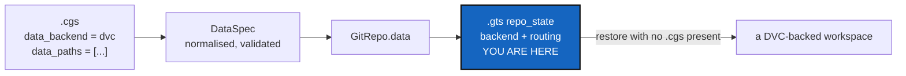

# DataSchema — a snapshot must remember that a repository holds data

*Created: 2026-09-16*

*Branch: data-repo*

> **Milestone M1** of [DataArchitecture](data-repo_2-1_DataArchitecture_DevPlanTicket.md).
> Analysed from §2 and §9/P1 of the owner's short ticket,
> `.localSpec/DevTickets/archive/.closedUserTicket/20260916_DevPlanTicket_DataManager_DVC.md`.

## Abstract — read this first

**The one-line version.** Two new declarations — `data_backend` on a
repository and an optional `data_paths` — parsed, validated, normalised,
round-tripped through `.cgs`, and carried in `.gts` so a snapshot restores
a data-backed workspace on its own.

**What this document is.** The first milestone of the data workstream. It
writes no Git and runs no DVC; it is grammar, validation and persistence.

**Why it exists.** Everything after it needs to know which repositories
hold data and which paths CGS may enroll. Getting that wrong in the file
format is the one mistake the later milestones cannot work around: a
snapshot that forgets a repository was DVC-backed restores a workspace full
of dangling pointers and calls it ready.

**What you will find.** §1 the two declarations. §2 what validation must
refuse. §3 the `.gts` half, which is the one that must not be got wrong.
§4 decisions. §5 work packages. §6 acceptance.

**Who it is for.** Whoever takes M1. You will spend your time in
`cgs_format.py`, `gts_document.py`, `git_repo.py` and `registry.py`.

**What you need to do with it.** Answer §4's D1 with the owner before
writing the key name into anything. Read
[DataArchitecture](data-repo_2-1_DataArchitecture_DevPlanTicket.md) §4 D5
first — the memory workstream is changing `.gts` too.



---

## 1. The two declarations

```toml
repos = [
  { repository = "github:org/HydrologicalTwin", fallback_branch = "main" },
  { repository = "github:org/SeineForcing", relative_path = "data/forcing",
    data_backend = "dvc", data_paths = ["SAFRAN/", "climate/"] },
  { repository = "github:org/PrivateParameters", relative_path = "data/private",
    private = true, writable = true, data_backend = "dvc",
    data_paths = ["grids/"] },
]
```

**`data_backend`** is absent for an ordinary Git repository. `"dvc"` is the
only accepted value. `"git-lfs"` exists in the type contract and is
**rejected at validation with a "not implemented" message** — never
silently treated as Git or as DVC.

**`data_paths`** is optional and repository-relative. It says which *newly
added, untracked* paths CGS may enroll in the backend, and nothing more. A
DVC-backed repository normally also holds Git-owned source, scripts, small
TOML/YAML parameters and `.dvc` metadata; without this rule CGS would have
to guess which of those a new file is. Already-tracked targets are
identified from the backend's own metadata, so `data_paths` is not needed
to find them.

The runtime shape, architectural rather than literal:

```python
@dataclass(frozen=True)
class DataSpec:
    backend: str                    # only "dvc" is accepted
    paths: tuple[str, ...] = ()     # ownership routing, never hashes
```

`GitRepo` gains `data: DataSpec | None`. Existing fields do not move, and
the on-disk spelling follows the conventions the rest of the `.cgs` already
uses.

## 2. What validation must refuse

Offline, deterministic, with no Git and no DVC process — `validate` keeps
working on a machine that has neither.

| Case | Answer |
|---|---|
| `data_backend = "git-lfs"` | Refuse: reserved, not implemented |
| Any other unknown backend | Refuse, naming the accepted values |
| `data_paths` without `data_backend` | Refuse: routing with nothing to route to |
| Empty string, absolute path, or `..` escape | Refuse |
| A path escaping the repository through a symlink | Refuse |
| A path overlapping a nested repository in the tree | Refuse, naming both repositories |
| `.git`, `.dvc` internals, or a CGS state directory | Refuse |
| One declared path nested inside another | Settle the ownership rule and state it in the message |

`parse_repo_id()` stays the only repository-identifier parser, and this
work adds no second one.

## 3. The `.gts` half

**A `.gts` must restore a data-backed workspace without a `.cgs` present.**
That is the milestone's real deliverable and the easiest to under-build:
the snapshot is the attested state, the register hash-chains it, and
`registry.py`'s rule is that the `.gts` prevails. If the backend identity
lives only in the `.cgs`, then restoring from a snapshot quietly produces a
Git-only tree.

So every `repo_state` carries the backend and whatever routing a
standalone restoration needs. It does **not** carry `.dvc` hashes, data
bytes, credentials, or a CGS-invented `state(hash)_i` for data. Git commit
identifiers stay authoritative for revisions.

Backward compatibility is mandatory in both directions that matter: an
existing `.gts` with no data fields loads unchanged, and a new one is
refused politely by an older CGS rather than misread.

## 4. Decisions — your call

### D1. The key names

`data_backend` and `data_paths`, as the short ticket writes them.
Recommendation: take them as proposed. They read well beside
`fallback_branch` and `nested_config`, and the alternative — a nested
`[repos.data]` table — costs a grammar shape the parser does not use
anywhere else.

### D2. What happens when one declared path contains another?

`data_paths = ["SAFRAN/", "SAFRAN/2024/"]`. Recommendation: refuse it at
validation. The outer path already routes everything under it, so the inner
one either says nothing or contradicts it, and a rule nobody can state in
one sentence will be got wrong by the backend later.

### D3. How does `.gts` carry the capability?

Recommendation: fields on `repo_state`, beside `private`/`writable`, which
are the existing precedent for a per-repository capability flag. Use the
document's existing extensibility rather than a new section, and bump the
schema version if the loader needs to tell old from new.

### D4. Does the content hash change?

The `.gts` content hash is built in `gts_document.py` and names the state
directory. Adding fields changes what it hashes. Recommendation: decide
this *with* the memory workstream's StateIdentity milestone rather than
independently, and say in the code which ticket settled it.

## 5. Work packages

| WP | Depends on | Touches | Deliverable |
|---|---|---|---|
| **WP-S1** | D1 | `git_repo.py` | `DataSpec` and `GitRepo.data`. Pure, offline, Ring 0 |
| **WP-S2** | WP-S1, D2 | `cgs_format.py` | Parsing, normalisation, authoring grammar and the refusals in §2, each with its own message |
| **WP-S3** | WP-S1, D3, D4 | `gts_document.py`, `registry.py` | Snapshot round trip, both directions, and the standalone-restore guarantee |
| **WP-S4** | WP-S2 | `cli/configuration.py` | `configure`/`create-cgs` preserve the declarations they read and can write them |
| **WP-S5** | all | `tests/unit/`, `tests/integration/` | §6's cases |
| **WP-S6** | all | `README.md`, `docs/Text/user_guide.tex`, `.localSpec/AdditionalSpecs.md` | The two declarations documented for users, and the responsibility table updated if any module's job moved |

## 6. Acceptance

- A Git-only `.cgs` parses, validates and round-trips exactly as it does
  today, byte for byte.
- A project repository with `data_backend = "dvc"` and a private writable
  one both parse, and the private one keeps its scope unchanged.
- `data_backend = "git-lfs"` is refused with a message saying *not
  implemented*, not with a traceback.
- Every refusal in §2 has a test and a message naming the path.
- A `.cgs` round-trips through `to_cgs()` with the declarations intact.
- **Restoring from a `.gts` with no `.cgs` anywhere still yields a
  DVC-backed repository**, and a test proves it by deleting the `.cgs`
  first.
- `cgitsync validate` works on a machine with no DVC installed and no
  network.
- An existing snapshot from before this change still loads.
- `pixi run lint`, `pixi run test` and `pixi run check-ceilings` pass.

## 7. What this milestone does not cover

* **Running DVC.** No process is started here. That is M2.
* **Path routing at `add` time.** M1 validates the rule; M3 applies it.
* **Any command's behaviour.** Nothing in the dispatch matrix changes yet.
