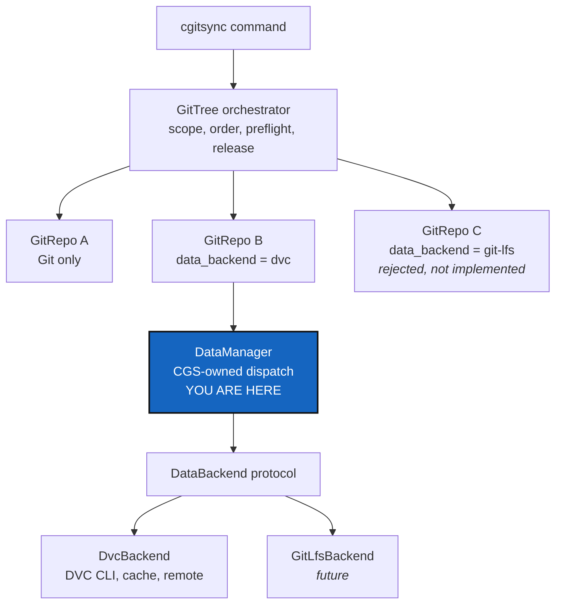

# DataArchitecture — data is a capability of a repository, not a kind of repository

*Created: 2026-09-16*

*Branch: data-repo*

> **The umbrella ticket of the data workstream.** Analysed from the owner's
> short ticket
> `.localSpec/DevTickets/archive/.closedUserTicket/20260916_DevPlanTicket_DataManager_DVC.md`,
> which is the authoritative statement of what was asked for. This ticket
> holds the decision and the shape; six milestones hold the work.

## Abstract — read this first

**The one-line version.** ComplexGitSync learns to synchronise an
application's *data* across its tree the way it already synchronises its
code — through one CGS-owned `DataManager` that dispatches per repository,
with DVC as the first backend and Git LFS as a backend it must not block.

**What this document is.** The architecture and the milestone map for the
data workstream. Nothing here has been built.

**Why it exists.** A scientific project is code plus datasets, and CGS
today only knows about the code half. The owner's example is a
hydrological twin: a model repository, a forcing repository holding
hundreds of megabytes of SAFRAN and climate data, and a private parameter
repository. Cloning that tree gives you the code and a set of dangling
pointers. Freezing a release records commits that cannot be reconstituted.
The data is the part the science depends on, and it is the part CGS drops.

**What you will find.** §1 the decision. §2 the boundary — what CGS owns
and what a backend owns. §3 the six milestones and the order they land in.
§4 the decisions the owner must make. §5 what this architecture refuses to
do. §6 acceptance for the workstream as a whole.

**Who it is for.** Whoever picks up any milestone, and the owner, who
answers §4.

**What you need to do with it.** Read this before any milestone ticket.
Answer §4 before the first one starts, because D1 and D2 change what the
first milestone writes to disk.

---

## 1. The decision

**CGS gains a native data-management layer.** The orchestrator dispatches
each relevant command per Git repository to its Git operation *and* to the
data-backend operations that repository needs. DVC is the first concrete
backend; the interface is backend-neutral from the start.

**`data` is a capability of a `GitRepo`, not a third kind of repository.**
The existing `project` / `private` classification and its write permissions
are untouched. A repository can be private *and* data-backed — the owner's
example has exactly that — and nothing about data changes who may write
where.

**Data authoring is part of CGS orchestration.** A user who runs
`cgitsync add`, `rm` or `commit` does not run DVC by hand for the supported
lifecycle. This is not the same as putting DVC's CLI under `cgitsync`:
pipelines, `repro`, experiments, remotes and garbage collection stay
outside.

## 2. The boundary

| CGS owns | The backend owns |
|---|---|
| Which repositories a command touches, and in what order | Content hashes |
| Path ownership: Git-owned source versus backend-owned data | Its cache and its metadata format |
| Preflight, refusal, and what a failure means | Remote transfers and credentials |
| Reporting, and what a release may advertise | Its own CLI semantics |

Two rules keep that line from eroding:

**One subprocess boundary.** Data backends run processes; the project
already has exactly one module allowed to (`git_runner.py`). Whatever the
milestones decide, they must not scatter `subprocess` calls into `cli/`,
the `.cgs` parser, or the domain model. Argument arrays, explicit
`cwd=repo.root`, no shell interpolation.

**No backend verbs in the CLI.** The existing commands are extended. There
is no `cgitsync data-add`. A capability that needs a new verb is a sign the
capability was modelled wrong.

One thing crosses into the memory workstream: **a backend must be able to
say which version of itself it is.** The memory system records the
toolchain of every entry it writes — cgitsync, git, pixi, and dvc or
git-lfs where they were used — so `DataBackend` grows a `version()` that
answers cheaply and says `none` when the tool is not installed.
[DataBackendContract](data-repo_2-5_DataBackendContract_DevPlanTicket.md) D6
owns the mechanism;
[OneRegister](memory-dev_1-3_OneRegister_DevPlanTicket.md) §3.1 owns what is
recorded.

## 3. The six milestones

They land in this order. Each is a ticket of its own on `data-repo`.

| # | Ticket | What lands | Needs |
|---|---|---|---|
| **M1** | [DataSchema](data-repo_2-4_DataSchema_DevPlanTicket.md) | `data_backend` and `data_paths` in `.cgs`, the normalised `DataSpec`, and `.gts` carrying the capability so a snapshot restores without a `.cgs` | — |
| **M2** | [DataBackendContract](data-repo_2-5_DataBackendContract_DevPlanTicket.md) | `DataManager`, the `DataBackend` protocol, `DvcBackend`, the fake backend the tests use, and the optional `dvc` Pixi feature | M1 |
| **M3** | [DataAuthoring](data-repo_2-6_DataAuthoring_DevPlanTicket.md) | Backend-aware `add`, `rm`, `commit`, `status`, `view-tree` | M2 |
| **M4** | [DataMaterialisation](data-repo_2-7_DataMaterialisation_DevPlanTicket.md) | `clone`/`bootstrap`/`initialise`, `pull`, offline `checkout`, `merge`, `launch-release`, and the destructive-command preflight | M2 |
| **M5** | [DataPublication](data-repo_2-8_DataPublication_DevPlanTicket.md) | `push`, `tag`, `freeze`, `freeze-release`: data published before the Git refs that advertise it | M3, M4 |
| **M6** | [DataAcceptance](data-repo_2-9_DataAcceptance_DevPlanTicket.md) | One real local-only DVC integration test over the whole round trip, plus the user documentation | M5 |

M3 and M4 both depend on M2 and not on each other, so they can be taken in
either order or in parallel. Nothing else in this list can move.

**The branch.** Every milestone lands on `data-repo`, not `main`. Six
milestones that each change path routing, staging, or release ordering
would otherwise interleave on `main` with unrelated releases, and a
half-built data layer that stages a two-gigabyte NetCDF file into Git is
not something to ship by accident. `data-repo` merges back when a milestone
is finished and `pixi run lint` and `pixi run test` both pass.

## 4. Decisions — your call

### D1. Is `data_backend` the key, and is `"dvc"` its only value now?

The short ticket proposes `data_backend = "dvc"` on a repository entry,
with `"git-lfs"` reserved in the type contract but **rejected at parse
time** as not implemented. Recommendation: yes to both. Reserving the name
while refusing the value is what stops a user's `.cgs` from silently
behaving like plain Git. M1 cannot start until this is settled — it is the
key that goes into every `.cgs` and every `.gts` from then on.

### D2. Does `data_paths` stay a routing rule rather than a manifest?

`data_paths` says which *new, untracked* paths CGS may enroll in the
backend. It is not a list of datasets and it holds no hashes — DVC's own
metadata stays authoritative for what is tracked. Recommendation: keep it
exactly that narrow. The moment CGS keeps its own idea of which files are
data, it owns a second source of truth that will disagree with DVC's.

### D3. Is DVC optional at runtime?

**Settled by the short ticket (§3.1):** `DvcBackend` requires the `dvc`
executable; the CGS Pixi workspace SHOULD provide an optional `dvc` feature
carrying a tested version; DVC MUST NOT be in the mandatory runtime. A
Git-only project installs no DVC. Confirm the version pin (`>=3.67,<4`)
when M2 starts, since it will be months old by then.

### D4. Is a seven-ticket workstream the right size?

This is the second-largest thing in the pile after the memory workstream,
and the two now sit side by side at priority 2 with eleven tickets between
them. Two honest alternatives: cut M6 down to the round-trip test and drop
the documentation into M5, or defer M4's `merge` handling into a ticket of
its own. Recommendation: keep the six and re-rank the pile at the next
Ticket review rather than shrinking the analysis.

### D5. Where does the data workstream sit against memory?

Both are large, both are on their own branch, and both change what a `.gts`
must carry. M1 writes a new field into the snapshot; the memory
workstream's StateIdentity renames the state directory and redefines the
snapshot's content hash. **They must not be in flight at the same time
without one knowing about the other.** Recommendation: memory first, as
ranked today, and M1 reads StateIdentity before it touches `.gts`.

## 5. What this architecture refuses to do

* **Own a second repository hierarchy.** No `DataRepo`, no separate
  discovery, no second dispatcher.
* **Compute its own content hashes.** No CGS-owned DVC hashes, no
  object-level manifests in `.gts`, no `state(hash)_i` for data.
* **Store credentials.** Never in `.cgs`, `.gts`, `.cgitsync` or a log.
  Backend-native credential configuration only.
* **Install anything silently.** A selected DVC repository with no `dvc`
  executable is a precise per-repository error, never an auto-install.
* **Claim atomicity it cannot deliver.** Independent Git and object-store
  remotes give no cross-repository transaction. A partial publication is
  reported as one, in detail, with an idempotent retry.
* **Run pipelines.** No `dvc repro`, no experiments, no garbage collection,
  no data transformation.
* **Implement Git LFS.** The contract must accommodate it; this workstream
  must not enable it.

## 6. Acceptance for the workstream

The milestones carry their own criteria. The workstream is done when:

- A tree mixing Git-only, DVC-backed and private DVC-backed repositories is
  cloned, authored, published, frozen and restored by `cgitsync` alone,
  with no hand-run DVC command in the supported lifecycle.
- A Git-only project's behaviour is byte-for-byte what it is today, and its
  environment holds no `dvc`.
- The orchestration tests pass against a fake backend that never imports
  DVC — the proof that the orchestrator is not DVC-shaped.
- A release that cannot produce its data fails as not-ready rather than
  reporting success.
- `pixi run lint`, `pixi run test` and `pixi run check-ceilings` pass, and
  `data-repo` merges into `main`.
