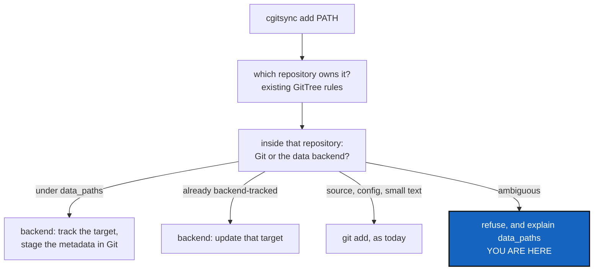

# DataAuthoring — a dataset must never become a raw Git blob by accident

*Created: 2026-09-16*

*Branch: data-repo*

> **Milestone M3** of [DataArchitecture](data-repo_2-1_DataArchitecture_DevPlanTicket.md).
> Needs [DataBackendContract](data-repo_2-3_DataBackendContract_DevPlanTicket.md);
> independent of [DataMaterialisation](data-repo_2-5_DataMaterialisation_DevPlanTicket.md).
> Analysed from §4 and §9/P3 of the owner's short ticket,
> `.localSpec/DevTickets/archive/.closedUserTicket/20260916_DevPlanTicket_DataManager_DVC.md`.

## Abstract — read this first

**The one-line version.** `add`, `rm`, `commit`, `status` and `view-tree`
learn to tell a dataset from a source file, and to refuse rather than guess
when they cannot.

**What this document is.** The third milestone: the commands a user types
every day.

**Why it exists.** This is where the expensive mistake lives. `cgitsync
add` on a repository holding a new two-gigabyte NetCDF file either routes
it to the data backend or writes it into Git's object store forever, and
the second is not recoverable by anything short of rewriting history. The
rule has to be explicit, and the ambiguous case has to be a refusal.

**What you will find.** §1 the five routing cases for `add`. §2 `rm`, where
deleting bytes and stopping tracking are different requests. §3 `status`,
which must not report a clean Git tree as data-ready. §4 decisions. §5 work
packages. §6 acceptance.

**Who it is for.** Whoever takes M3.

**What you need to do with it.** §1 case 4 is the one to build first: the
refusal. Everything else is safe once guessing is impossible.

---

## 1. `add`: five cases, one of them a refusal

Resolve the **owning repository** first, with the existing GitTree path
rules — `resolve_repo_for_path` — and never dispatch across a nested
repository boundary. Then resolve ownership *within* that repository:

| # | The path is | CGS does |
|---|---|---|
| 1 | A new path under `data_paths` | Tracks it in the backend, and stages only the metadata that changed and belongs to that target (`.dvc`, `dvc.yaml`, `dvc.lock`, `.gitignore`) |
| 2 | Already tracked by the backend | Updates the owning target with a validated, target-aware call; stages the resulting metadata. A file *inside* a tracked directory is handled by that directory's target, not turned into a new standalone pointer |
| 3 | Source, a script, a small TOML/YAML parameter | The existing `git add` path, unchanged |
| 4 | New, and matched by no rule | **Refuses**, with a message explaining `data_paths` and naming the path |
| 5 | No argument at all | Inspects known tracked outputs for changes and updates their metadata; stages eligible Git changes. Never enrolls an unknown file on either side |

**A path owned by the backend is never also staged as raw bytes in Git.**
That invariant is worth a test of its own.

**Pipeline outputs are not fair game.** If the target is a DVC pipeline
output, `dvc add` is not universally valid: respect the stage semantics, do
not rerun `dvc repro`, and do not issue a blanket `dvc commit` that blesses
changed dependencies and misrepresents what was reproduced. Handle the
supported case or refuse with an instruction. Keep source-data tracking and
computed outputs distinguishable in whatever CGS reports.

## 2. `rm`: deleting bytes is not untracking

Two different requests, and the backend's own vocabulary blurs them: DVC's
`remove` without `--outs` stops tracking and can leave the bytes in the
workspace, which is not what `cgitsync rm` means.

- A standalone target: use the supported removal workflow, stage the
  resulting metadata, and delete the requested workspace path under CGS's
  existing remove semantics.
- A path inside a tracked directory: update the owning target safely.
  Removing the whole dataset pointer because one file inside it was named
  is a data-loss bug.
- Pipeline stages, shared outputs, ambiguous selectors: refuse safely
  unless fully specified and tested.
- **Never** delete remote objects, and never run garbage collection.

`rm` is already the one scoped operation handed its paths rather than
sweeping for them, and its scope is a filter that refuses a path owned by a
repository outside it. That behaviour stays exactly as it is; data
ownership is resolved *after* it, inside the repository the path belongs
to. `--dry-run` and the writable/private guardrails apply unchanged.

## 3. `status` and `view-tree`

`status` gains a local, offline assessment: does the data workspace differ
from what the metadata records, and is the cache materialised? It must not
be folded into the existing `LOCAL` and `SYNC` columns, which answer a Git
question, and it must not claim anything about the remote — offline, remote
availability is `UNKNOWN`, and saying so is the point.

**A clean Git tree is not evidence that data is ready.** A repository whose
metadata is committed and whose cache is empty is `NOT_MATERIALIZED`, and
reporting it as clean is exactly the lie this milestone exists to prevent.

`view-tree` annotates a data-backed repository — `[DVC]` — and never walks
individual data files to do it.

## 4. Decisions — your call

### D1. How does the data state reach the status table?

A column of its own, a suffix on `LOCAL`, or a second line? Recommendation:
**a column**, printed only when the tree holds at least one data-backed
repository, with a legend the way `SCOPE` has one. `status_render.py` owns
the wording, as it already does for every other column, and the `--json`
shape that [CliContract](../archive/20260916_CliContract_DevPlanTicket.md) defines
gains a field rather than a reinterpretation of an existing one.

### D2. Does `commit --no-stage` ever touch the backend?

Recommendation: **no writes, but a refusal is allowed.** It commits
pre-staged Git state only; it must not stage metadata or update the cache.
It may still refuse when the staged metadata refers to data that is not
prepared, because committing a pointer to bytes nobody has is how an
unrecoverable release is built.

### D3. What does a no-argument `add` do in a mixed repository?

Recommendation: update known tracked outputs and stage eligible Git
changes, and enroll nothing new on either side. A bare `add` that silently
enrolls a new dataset is the same accident as case 4, arrived at by a
different route.

### D4. Is `add` allowed to be slow?

Hashing a large dataset takes minutes. Recommendation: visible progress,
cancellation that leaves a consistent state, and no silent background work.
Decide whether a preflight warns before starting something long.

## 5. Work packages

| WP | Depends on | Touches | Deliverable |
|---|---|---|---|
| **WP-A1** | M2 | the path-ownership resolver | §1's five cases as one function, with case 4 as its first test |
| **WP-A2** | WP-A1 | `operations.py`, `orchestre.py` | `add_tree` routes through it; metadata staging is per target, never blanket |
| **WP-A3** | WP-A1, D2 | `operations.py` | `commit_tree` verifies prepared data before committing metadata; `--no-stage` stays read-only |
| **WP-A4** | WP-A1 | `operations.py` | `remove_paths` gains §2, including the refusals |
| **WP-A5** | D1 | `status_render.py`, `orchestre.py` | The data column and its legend; `view-tree`'s annotation |
| **WP-A6** | all | `tests/` | §6, against the fake backend, plus DVC-marked tests in the `dvc` environment |
| **WP-A7** | all | `README.md`, `docs/Text/user_guide.tex` | What a user must know: `data_paths`, why a path can be refused, and what the new column means |

## 6. Acceptance

- A new NetCDF file under a configured data path becomes a backend pointer.
  **A test asserts the bytes are not in Git's object store.**
- An edit to an already-tracked dataset updates its metadata, and does not
  create a second pointer.
- A Git-owned YAML file in the same repository goes through `git add`
  unchanged.
- An ambiguous new path is refused, and the message names the path and
  explains `data_paths`.
- A no-argument `add` enrolls nothing new.
- `rm` of a tracked target removes the intended workspace bytes and the
  metadata, and touches no remote object; `rm` of a file inside a tracked
  directory does not remove the directory's pointer.
- `commit --no-stage` mutates no backend state, proven by comparing the
  cache before and after.
- Data modified with Git clean is reported as dirty data, not as a clean
  repository.
- A pipeline output is never silently blessed.
- Every case above passes against the fake backend as well as against DVC.
- `pixi run lint`, `pixi run test` and `pixi run check-ceilings` pass.

## 7. What this milestone does not cover

* **Fetching or publishing anything.** `pull`, `checkout` and `push` are
  M4 and M5.
* **Release readiness.** M5 decides what a tag may advertise.
* **DVC pipelines.** Detected and respected; never run.
