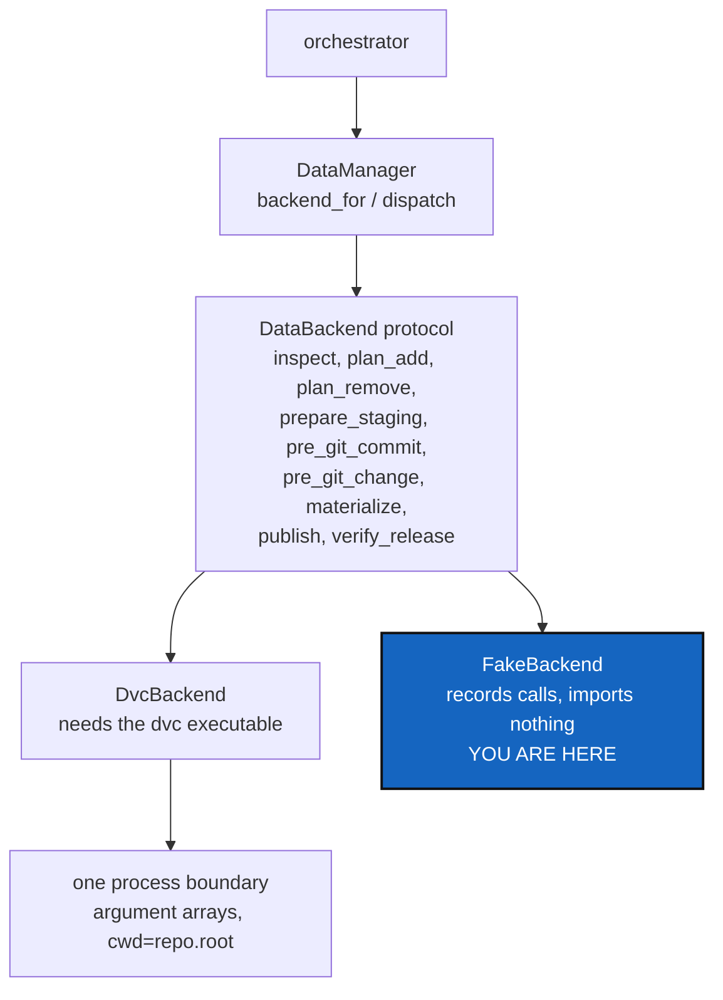

# DataBackendContract — one dispatcher, one process boundary, no DVC in the core

*Created: 2026-09-16*

*Branch: data-repo*

> **Milestone M2** of [DataArchitecture](data-repo_2-3_DataArchitecture_DevPlanTicket.md),
> and the milestone every later one depends on. Analysed from §3, §3.1, §8
> and §9/P2 of the owner's short ticket,
> `.localSpec/DevTickets/archive/.closedUserTicket/20260916_DevPlanTicket_DataManager_DVC.md`.

## Abstract — read this first

**The one-line version.** `DataManager` dispatches per repository,
`DataBackend` says what a backend must answer, `DvcBackend` answers it by
running DVC, a fake backend answers it in tests without importing
anything — and DVC itself stays out of the mandatory environment.

**What this document is.** The second milestone: the layer everything else
calls. No command changes behaviour yet.

**Why it exists.** The moment a `dvc add` appears inside a CLI handler or
the tree model, the "generic data architecture" is a DVC integration with
extra words. This milestone is what makes the claim true rather than
aspirational: semantic phases in the interface, one place that starts a
process, and an orchestration test suite that passes with DVC absent.

**What you will find.** §1 the interface and why it is phase-shaped. §2 the
process boundary. §3 the fake backend, which is the proof. §4 DVC as an
optional Pixi feature. §5 decisions. §6 work packages. §7 acceptance.

**Who it is for.** Whoever takes M2. This is the design-heavy one; the
milestones after it are mostly wiring.

**What you need to do with it.** §2 first. Where the subprocess lives
decides what the rest of the workstream is allowed to look like.



---

## 1. The interface, and why it is phase-shaped

```python
class DataBackend(Protocol):
    def inspect(self, repo, *, offline: bool) -> DataStatus: ...
    def plan_add(self, repo, paths) -> DataPlan: ...
    def plan_remove(self, repo, paths) -> DataPlan: ...
    def prepare_staging(self, repo, plan) -> DataResult: ...
    def pre_git_commit(self, repo, *, no_stage: bool) -> DataResult: ...
    def pre_git_change(self, repo, *, destructive: bool) -> DataResult: ...
    def materialize(self, repo, *, allow_network: bool) -> DataResult: ...
    def publish(self, repo, *, revisions) -> DataResult: ...
    def verify_release(self, repo, *, revision) -> DataResult: ...

class DataManager:
    def backend_for(self, repo) -> DataBackend | None: ...
    def dispatch(self, command, repo, context) -> DataResult: ...
```

Signatures are a sketch to fit to the project's conventions; the *shape* is
the requirement. The methods are **semantic phases, not CLI verbs**,
because the two backends in view do the same job at different moments: DVC
needs explicit `add`/`commit`/`push` calls, while Git LFS rides on Git's
own filters and push. A method called `dvc_add` would have to be a no-op in
half the implementations, which is how an interface stops being one.

**`DataResult` must not flatter.** Its states are `READY`, `DIRTY`,
`NOT_MATERIALIZED`, `MISSING_CACHE`, `REMOTE_UNAVAILABLE`, `UNSUPPORTED`,
`FAILED` and `UNKNOWN`, and a clean Git tree is never evidence for any of
the good ones. It records the backend, the repository, the operation, the
step attempted, whether a retry is safe, and diagnostics with secrets
scrubbed. `UNKNOWN` is a real answer: for remote availability, offline,
it is the only honest one.

## 2. The process boundary

`git_runner.py` is the project's only `import subprocess`, and it owns the
decoding and environment policy that makes Git's output readable. A data
backend runs processes too, and this milestone decides where.

Whatever the answer, these hold:

- Argument arrays, never a shell string; no interpolation.
- Explicit `cwd=repo.root` on every call.
- Bounded and cancellable where an operation can take minutes, which for a
  dataset transfer is most of them.
- Failures carry the repository and the phase, not just an exit code.
- Nothing in `cli/`, `cgs_format.py`, or `git_tree.py` starts a process.
- `--dry-run` reaches the filesystem, Git, the cache, the remote and the
  registry not at all.

## 3. The fake backend is the proof

A test backend that records the semantic calls it receives and imports
nothing. **The orchestration tests must pass against it**, which is the
only real evidence that the orchestrator is backend-neutral rather than
DVC-shaped with a protocol drawn around it.

It is also what M3 and M4 test against, so it is part of this milestone's
deliverable and not an afterthought in the last one.

## 4. DVC is an optional Pixi feature

Settled by the owner in the short ticket's §3.1:

> `DvcManager` requires the `dvc` executable. The official CGS Pixi
> workspace SHOULD provide an optional `dvc` feature containing a tested
> DVC version. DVC MUST NOT be part of the mandatory CGS runtime
> environment.

DVC is on `conda-forge` as a `noarch` package, so Pixi resolves it natively
and locks it:

```toml
[feature.dvc.dependencies]
dvc = ">=3.67,<4"

[environments]
default = []
dvc = ["dvc"]
```

The default environment installs no DVC and runs the full suite. A
selected DVC repository on a machine without the executable gives a precise
per-repository error naming the environment to use — never an install,
never a silent skip. If no DVC repository is selected, CGS does not probe
for DVC at all.

## 5. Decisions — your call

### D1. Where does the data subprocess live?

Three options: a `data_runner.py` beside `git_runner.py` (Ring 2) that
owns the boundary for every backend; the same policy inside `DvcBackend`;
or extending `git_runner.py`. Recommendation: **a module of its own.** It
inherits `git_runner.py`'s hard-won policies — argument arrays, decoding,
a non-interactive environment — without making the Git wrapper responsible
for a second tool, and it keeps the single-`subprocess`-importer rule a
statement about two named modules rather than an ideal.

### D2. Where does `DataManager` sit in the rings?

It holds the tree and drives processes, which puts it in Ring 2 beside
`operations.py` and the new `git_tree_branch.py`. Recommendation: Ring 2,
called from `orchestre.py`, never importing it. Adding a module means the
responsibility tables in `.localSpec/AdditionalSpecs.md` and `CLAUDE.md`
change in the same commit.

### D3. Does `DataManager` know DVC exists?

Recommendation: no. It maps `repo.data.backend` to a backend through a
registry, the way `git_repo.py` already maps a provider name to a provider.
`import DvcBackend` inside `DataManager` is the shape to avoid.

### D4. What does `dispatch` take?

The short ticket sketches `dispatch(command, repo, context)`.
Recommendation: settle whether `command` is a string or an enum before
writing it — a string spreads unchecked literals through five modules, and
this interface is called from every command in the matrix.

### D5. Confirm the DVC version pin when the work starts.

`>=3.67,<4` is right as the short ticket was written. Check it against
conda-forge on the day, and record the version the tests actually ran
against.

### D6. How does a backend report its own version, and what does asking cost?

The memory workstream records the toolchain in every ledger entry — the
owner's
`.localSpec/DevTickets/archive/.closedUserTicket/20260916_memory-dependencies.md`
asks for cgitsync, git, pixi, dvc and git-lfs — so `DataBackend` needs a
way to say which version it is.

Two things make this more than a getter. `dvc --version` starts a Python
interpreter and takes about a second, so it must be read **once per
process** and never per entry or per repository. And a backend that is
configured but not installed has no version: the answer is `none`, the
owner's word, settled on 2026-09-16 — which is what
[OneRegister](../archive/20260916_OneRegister_DevPlanTicket.md) §3.1 records.

Settled by the owner on 2026-09-16: a `version()` on the protocol, asked
at most once per command and the answer reused, returning `none` when the
tool is not installed. A backend is asked only when the command actually
touched a repository that uses it — a Git-only tree must not pay a second
to record that it has no DVC.

## 6. Work packages

| WP | Depends on | Touches | Deliverable |
|---|---|---|---|
| **WP-B1** | D1 | `data_runner.py` (new) or `git_runner.py` | The process boundary and its policies, with unit tests that never run DVC |
| **WP-B2** | D2, D3, D4 | `data_manager.py` (new), `git_repo.py` | `DataManager`, the `DataBackend` protocol, `DataStatus`/`DataPlan`/`DataResult`, and the backend registry |
| **WP-B3** | WP-B1, WP-B2 | `dvc_backend.py` (new) | `DvcBackend`: the nine phases against the DVC CLI, each failure named |
| **WP-B4** | WP-B2 | `tests/unit/` | The fake backend, and the orchestration tests that prove neutrality |
| **WP-B5** | D5 | `pixi.toml`, `.github/workflows/ci.yml` | The optional `dvc` feature and environment; CI runs the default environment and, separately, the `dvc` one |
| **WP-B6** | WP-B2, WP-B3 | `orchestre.py` | The client-side seam the later milestones call. No command behaviour changes here |
| **WP-B7** | all | `.localSpec/AdditionalSpecs.md`, `CLAUDE.md`, `scripts/ceiling_baseline.json` | New modules in both responsibility tables, the ring table and the dependency diagram; baselines recorded |

## 7. Acceptance

- A Git-only tree never constructs a backend and never probes for `dvc`; a
  test asserts the DVC module is not even imported.
- `pixi run test` passes in the **default** environment, which contains no
  `dvc`, and CI proves it.
- The orchestration tests pass against the fake backend.
- A selected DVC repository with no executable produces one per-repository
  error naming the repository and the `dvc` environment — no traceback, no
  install attempt.
- Every process call uses an argument array and `cwd=repo.root`; a test
  inspects the constructed command.
- `--dry-run` through the dispatcher writes nothing anywhere, proven by a
  filesystem snapshot before and after.
- A failure in one repository names that repository and that phase.
- `DataBackend.version()` is asked at most once per process, proven by
  counting calls, and reports `none` rather than raising when the
  executable is missing.
- `pixi run lint`, `pixi run test` and `pixi run check-ceilings` pass.

## 8. What this milestone does not cover

* **Any command behaving differently.** `add`, `pull` and `push` are
  untouched until M3 and M4.
* **Path ownership rules.** M3 decides which path belongs to which side;
  M2 only provides `plan_add`/`plan_remove` for it to fill.
* **Git LFS.** The protocol must fit it; nothing implements it.
