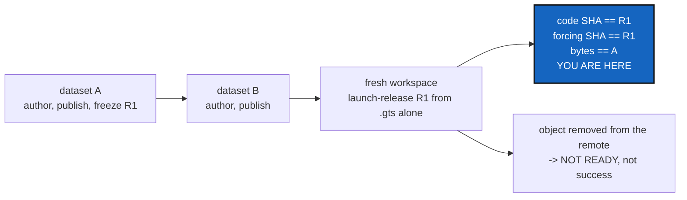

# DataAcceptance — prove the round trip with real DVC, on one machine, offline

*Created: 2026-09-16*

*Branch: data-repo*

> **Milestone M6** of [DataArchitecture](data-repo_2-3_DataArchitecture_DevPlanTicket.md),
> and the gate the workstream merges through. Needs
> [DataPublication](data-repo_2-8_DataPublication_DevPlanTicket.md).
> Analysed from §9/P6 and §11 of the owner's short ticket,
> `.localSpec/DevTickets/archive/.closedUserTicket/20260916_DevPlanTicket_DataManager_DVC.md`.

## Abstract — read this first

**The one-line version.** One integration test drives a two-repository
scientific workspace through author, publish, freeze, change, and restore
with real DVC and a temporary filesystem remote — then proves the restored
bytes are the released bytes, and that a missing object fails loudly.

**What this document is.** The last milestone: the acceptance evidence, and
the user documentation that goes with it.

**Why it exists.** Every milestone before this tests its own layer, mostly
against a fake backend. None of them proves the claim the workstream is
for: *a release recorded by CGS can be reconstituted exactly, data
included.* That claim can only be tested end to end, and it is the claim a
scientist relies on when they cite a release in a paper.

**What you will find.** §1 the ten-step scenario. §2 the two negative
tests, which matter more than the happy path. §3 what the test may not use.
§4 the documentation. §5 decisions. §6 work packages. §7 acceptance.

**Who it is for.** Whoever takes M6, and whoever reviews the merge of
`data-repo` into `main`.

**What you need to do with it.** Build §2 before §1's happy path is
polished. A round-trip test that cannot fail proves nothing.

---

## 1. The scenario

Two repositories, made locally, standing in for the owner's hydrological
twin: a code repository and a forcing repository declared with
`data_backend = "dvc"` and `data_paths`.

1. Create the code repository and the forcing repository.
2. Declare both in a `.cgs`; the forcing one carries the data declarations.
3. `cgitsync initialise` or `bootstrap` — dataset **A** is materialised.
4. Modify the forcing dataset through CGS: `add`, then `commit`, then
   `push`.
5. `cgitsync freeze-release R1` — the `.gts` captures the exact Git SHA and
   the backend identity.
6. Modify the forcing dataset to **B**; `add`, `commit`, `push`.
7. From a **fresh** workspace, `launch-release R1` using its `.gts` alone.
8. Assert the code SHA is R1's, the forcing SHA is R1's, and the bytes are
   A's.

Steps 9 and 10 are §2.

## 2. The two tests that matter

**9. Remove a needed object from the test remote and the cache, then
restore.** The restore must **fail**, and leave the release state
`NOT_READY`. Reporting success with a dataset that is not there is the
precise failure this whole workstream exists to prevent, and this is the
only test that catches it.

**10. Assert no content hashes and no credentials are in the CGS
snapshots.** Read the `.gts`, the `.cgitsync` state and the register, and
assert that no backend object hash, token, signed URL or remote credential
appears in any of them. The prohibition is easy to state and easy to
violate by accident — a debug field, a diagnostic that was not scrubbed.

## 3. What the test may not use

- **No cloud credentials and no external network.** A temporary filesystem
  DVC remote, and local Git repositories.
- **No large dataset.** A small stand-in file exercises the same code path;
  a real NetCDF file makes the suite unusable and proves nothing extra.
- **No hand-run backend command in the supported lifecycle.** If the test
  has to call `dvc` directly to make a step work, the step is not
  implemented yet — that is the point of the test.
- **Not in the default environment.** It needs the `dvc` feature, so it is
  marked and runs in that environment. `pixi run test` in the default
  environment must stay green without it.

## 4. The documentation this milestone owes

A short guide, written for a scientist rather than for a contributor:
declaring data in a `.cgs`, authoring a dataset through CGS, publishing,
working offline, restoring a release, and reading the diagnostics when data
is missing. The straightforward-English bar is strictest here — this
reader has no other context to lean on.

The README command table and `docs/Text/user_guide.tex` must already be
correct from M3 to M5; this milestone checks that they are, rather than
writing them late.

## 5. Decisions — your call

### D1. Does this test run in CI, or only on demand?

Recommendation: **in CI, in the `dvc` environment, on every push.** It is
slower than the unit suite and it is the only evidence for the workstream's
central claim; a test that only runs when someone remembers is a test that
will be broken when it matters. If the runtime becomes a problem, mark it
and run it on merges to `main` rather than deleting the coverage.

### D2. Is one scenario enough?

Recommendation: one scenario, plus the two negatives. A second scenario
duplicating the first with different file names would cost minutes per run
and prove nothing new. A private DVC-backed repository in the same tree,
however, is worth adding to the *same* scenario — the owner's example has
one, and its permissions must survive the round trip.

### D3. What is the merge gate for `data-repo` into `main`?

Recommendation: this test green in CI, `pixi run lint`, `pixi run test` and
`pixi run check-ceilings` green in the default environment, and the
documentation written. Say so explicitly, so the branch does not merge on
"the unit tests pass".

## 6. Work packages

| WP | Depends on | Touches | Deliverable |
|---|---|---|---|
| **WP-E1** | M5 | `tests/integration/` | The fixture: two local repositories, a temporary filesystem remote, a small stand-in dataset, and a `.cgs` that declares them |
| **WP-E2** | WP-E1 | `tests/integration/` | §1's steps 1–8, asserting SHAs and bytes |
| **WP-E3** | WP-E1 | `tests/integration/` | §2's two negative tests |
| **WP-E4** | D2 | `tests/integration/` | A private, writable, DVC-backed repository inside the same scenario, with its permissions asserted |
| **WP-E5** | D1 | `.github/workflows/ci.yml` | The `dvc` environment job |
| **WP-E6** | — | `docs/tutorials/`, `README.md`, `docs/Text/user_guide.tex` | §4's guide, and a check that the command documentation from M3–M5 is complete |
| **WP-E7** | all | `.localSpec/AdditionalSpecs.md`, this ticket and its five siblings | Architecture sections updated; the six milestone tickets archived as they land |

## 7. Acceptance

- The scenario in §1 passes, end to end, with real DVC, no network and no
  credentials.
- The restored workspace's bytes equal dataset A's, and both SHAs are R1's.
- With a required object removed, the restore fails and reports
  `NOT_READY`; it never reports success.
- No content hash and no credential appears anywhere in the CGS snapshots,
  proven by reading them.
- A private DVC-backed repository survives the round trip with its
  permissions intact.
- `pixi run test` in the **default** environment passes without DVC
  installed.
- The guide exists and a reader who has never used DVC can follow it.
- `pixi run lint`, `pixi run test` and `pixi run check-ceilings` pass, and
  `data-repo` is ready to merge into `main`.

## 8. What this milestone does not cover

* **Performance.** No benchmark of a real multi-gigabyte transfer.
* **Cloud remotes.** S3, GCS and the rest are configuration, and the test
  deliberately avoids them.
* **Git LFS.** Still unimplemented, still unblocked.
