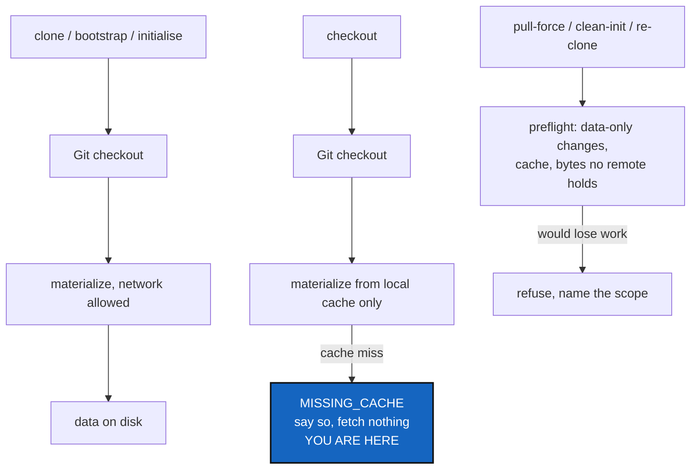

# DataMaterialisation — cloning a tree must bring the data, and checkout must stay offline

*Created: 2026-09-16*

*Branch: data-repo*

> **Milestone M4** of [DataArchitecture](data-repo_2-5_DataArchitecture_DevPlanTicket.md).
> Needs [DataBackendContract](data-repo_2-7_DataBackendContract_DevPlanTicket.md);
> independent of [DataAuthoring](data-repo_2-8_DataAuthoring_DevPlanTicket.md).
> Analysed from §5, §7 and §9/P4 of the owner's short ticket,
> `.localSpec/DevTickets/archive/.closedUserTicket/20260916_DevPlanTicket_DataManager_DVC.md`.

## Abstract — read this first

**The one-line version.** The commands that move a workspace between
revisions — clone, pull, checkout, merge, restore, and the destructive
ones — learn to bring the data with them, and to refuse when they would
destroy data that exists nowhere else.

**What this document is.** The fourth milestone: getting bytes onto disk,
and knowing when they are not there.

**Why it exists.** Two guarantees are in tension and both must survive.
`checkout` is offline today, and users rely on that — it reads what the
last `pull` brought and works on a train. Data materialisation wants the
network. The answer is not to compromise either: `checkout` stays offline
and reports `MISSING_CACHE` honestly, and the network-enabled commands do
the fetching. Alongside that, `clone_guard.py` currently asks whether a
directory holds work no remote has, and it asks that question about Git
only — so a destructive re-clone can today delete a dataset that was never
pushed, and report success.

**What you will find.** §1 the ordering rule. §2 offline `checkout` and
what it must say. §3 the destructive commands. §4 decisions. §5 work
packages. §6 acceptance.

**Who it is for.** Whoever takes M4.

**What you need to do with it.** §3 first. It is the one where being wrong
loses a user's work.

---

## 1. Git first, then data — every time

| Command | What happens |
|---|---|
| `clone`, `bootstrap`, `initialise` | Git clone or checkout; validate the data repository; materialise the selected data with the network allowed. Preflight data **before** deleting or re-cloning an existing workspace |
| `pull` | Preflight local data changes; Git sync; materialise for the **final** selected revision — never for the revision the workspace held on the way through |
| `merge` | Preflight per repository; Git merges the metadata with the existing conflict handling; then reconcile and materialise. A metadata conflict stays an explicit conflict — it is never auto-resolved |
| `launch-release`, `.gts` restoration | Restore the exact recorded Git revision, then fetch what that revision needs, then verify materialisation before reporting success |
| `branch` | No data transfer at all. Creating a branch moves no bytes |

The ordering is not stylistic. Materialising before the Git revision is
final fetches the wrong objects, and after a merge changes the metadata,
whatever was fetched earlier is stale.

**Private repositories keep their rules.** A `private/distant` repository
is read-only: it may be materialised where existing read semantics allow,
and no data operation on it may write Git, metadata, cache or remote.

## 2. `checkout` stays offline

`checkout` is offline today and stays offline. It materialises from the
local cache and nothing else. When the cache does not hold what the
revision needs, it says `MISSING_CACHE`, names the repository, and tells
the user which network-enabled command would fetch it.

The temptation is a "small" fetch when the cache misses. That would turn
the one command users trust on a plane into one that hangs, and it would
do it exactly when they are least able to wait for it.

## 3. The destructive commands

`pull-force`, `clean-init`, and `initialise --force-reclone` delete and
rebuild. Today `clone_guard.py` answers one question — does this directory
hold commits no remote has, or a dirty worktree? — and it answers it about
Git.

This milestone extends the same question to data, and the extension is not
optional: a dataset added but never published, or a cache holding the only
copy of an object, is work that exists nowhere else, and clean Git is no
evidence at all. So:

- Preflight tracked and untracked data, data-only changes, the cache, and
  bytes no remote holds — **before** deleting anything, for every pending
  repository, so a refusal leaves the whole tree on disk.
- Report the exact data-loss scope. A `--force` uses the existing CGS force
  semantics and discloses what more it will destroy; it never silently
  passes a backend `--force`.
- Keep a repository's data directory and cache outside unsafe deletion
  scope unless the removal is explicit and safe.
- Generated backend ignore files must not let a repository slip past the
  existing unpushed-work guard.

## 4. Decisions — your call

### D1. Does `clone_guard.py` grow, or does a second guard appear beside it?

Recommendation: **grow it.** Its value is that it is read-only and
worktree-free, so the orchestrator can ask about every pending repository
before deleting any. A second guard asked at a different moment loses that
all-or-nothing property, which is the whole point of the module.

### D2. What does `pull` do when materialisation fails after a successful Git sync?

Recommendation: report partial readiness explicitly — the Git side moved,
the data did not, and the repository is `NOT_MATERIALIZED`. Do not roll
back the Git sync, and do not report success. An interrupted transfer must
say which repositories are ready and which are not.

### D3. Does `merge` ever resolve a metadata conflict?

Recommendation: **never.** A conflict in backend metadata is a conflict
between two datasets; the existing merge behaviour — refuse the whole tree,
or stop at the first conflict under `--resolve` — applies unchanged, and
the user resolves it with the tooling they already use.

### D4. Which command does the user get told to run on a cache miss?

`pull` is the obvious answer; `launch-release` is the answer during a
restore. Recommendation: name the command that fits the situation, not a
generic "run pull" — the message is the only help the user gets at that
moment.

## 5. Work packages

| WP | Depends on | Touches | Deliverable |
|---|---|---|---|
| **WP-M1** | M2 | `operations.py`, `orchestre.py` | The ordering rule of §1 for `clone`/`bootstrap`/`initialise` and `pull` |
| **WP-M2** | M2 | `operations.py` | Offline `checkout`: local cache only, `MISSING_CACHE` reported, no network call — a test asserts the runner is never asked to fetch |
| **WP-M3** | D1 | `clone_guard.py`, `orchestre.py` | The destructive preflight extended to data, still read-only and worktree-free |
| **WP-M4** | D3 | `operations.py` | `merge`: preflight, Git metadata merge, then reconcile; conflicts stay explicit |
| **WP-M5** | M2 | `orchestre.py` | `launch-release` and `.gts` restoration, ending in a verification that the data is actually there |
| **WP-M6** | all | `tests/` | §6, against the fake backend and, marked, against real DVC in the `dvc` environment |
| **WP-M7** | all | `README.md`, `docs/Text/user_guide.tex` | The offline guarantee, what `MISSING_CACHE` means, and what a destructive command now refuses |

## 6. Acceptance

- Git checkout always precedes materialisation, proven by call order in a
  test.
- Offline `checkout` with a warm cache succeeds; with a cold cache it
  reports `MISSING_CACHE` and **makes no network call**.
- A network-enabled restore fetches the missing objects and verifies them.
- Round trip: release A, move to B, restore A from its `.gts` alone, and
  the bytes are A's.
- A repository holding altered or unpublished data blocks every destructive
  command, and the refusal names what would have been lost.
- An interrupted `pull` reports exactly which repositories are ready.
- A `private/distant` repository is never pushed to, and never has its
  metadata or cache written.
- A metadata conflict during `merge` is reported as a conflict.
- `pixi run lint`, `pixi run test` and `pixi run check-ceilings` pass.

## 7. What this milestone does not cover

* **Publishing.** Uploading objects and the ordering against Git refs is
  M5.
* **Authoring.** `add`, `rm` and `commit` are M3.
* **Cache management.** No garbage collection, no retention policy, no
  cache sharing between workspaces.
