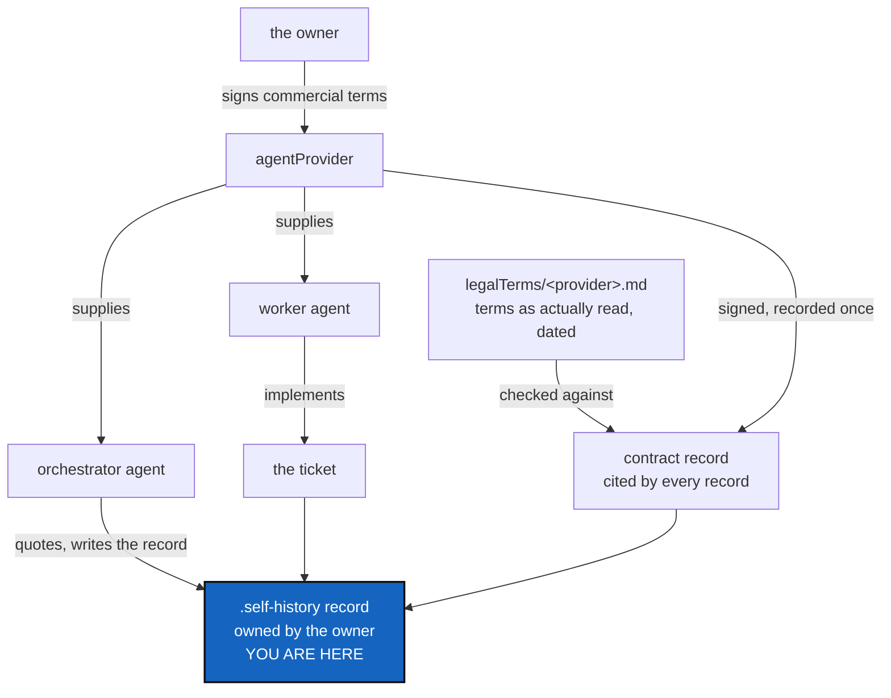

# AgentContract — two agents per task, and whose data this is

*Created: 2026-09-20*

*Branch: main*

> **Implementation — 2026-09-23, part 2.** WP3 and WP5 are now done. The
> owner supplied the missing fact from the *Implementation — 2026-09-23*
> note below — which provider, which access path, and the actual terms —
> together with a rewrite of §2 that stopped asserting compliance and
> started stating it as a conditional intent, checked against evidence
> (new §2.3, the `legalTerms` record) rather than assumed. That evidence
> was then verified live (`https://www.anthropic.com/legal/consumer-terms`,
> read 2026-09-23, not transcribed from memory) before being signed into
> anything: [legalTerms/anthropic.md](../../../../.distant/dev-sync/legalTerms/anthropic.md)
> holds the reading, and its finding is `partial` — the consumer-subscription
> access path this project runs under permits §2.1's intent only with
> training opt-out enabled and outside the Feedback/safety-review
> carve-outs. The signed record citing that reading is
> `.agent/.distant/dev-sync/agent-contracts/96ab29ae5d1e49e5fc074842d6133e82d56e44d4afb93f653f0d19713914e8cf.toml`,
> written by the new `ComplexGitSync.memory.agent_contract` module, and
> `freeze_release()` now reads it (WP5). WP4 is still blocked — it needs
> [AgentReport](main_1-2_AgentReport_DevPlanTicket.md)'s record to exist —
> so this ticket stays open. D6, added below, answers what a `.self-history`
> record will owe a `legalTerms` entry once WP4 exists to owe it to.

> **Implementation — 2026-09-23.** WP1 and WP2 are done: the pair rule is
> now [AgentConduct.md](../../../../.distant/dev-sync/AgentConduct.md) §4, with
> `CLAUDE.md`'s own scoping fill-in; the contract text is
> [AgentDataContract.md](../../../../.distant/dev-sync/AgentDataContract.md),
> §2 stating its own limits per §2.2 below. WP3–WP5 are **not** done this
> pass: asked which provider and terms reference to pin (D3), the owner
> chose to defer the content-addressed record rather than have an agent
> guess at commercial terms it has no visibility into — see §2.2 and §3,
> which already say a document like this cannot responsibly invent that
> fact for itself. This ticket stays open, still ranked here, until the
> owner supplies that reference; WP4 remains additionally blocked on
> AgentReport (unimplemented) regardless. `CLAUDE.md`'s new *Whose data
> this is* section states this same status for a reader who starts there.
> **Superseded by the note above** — the owner supplied that reference.

> **Ticket review — 2026-09-22, part 3.** Renumbered again, `main_1-1` →
> `main_1-2`: [Autofix](../archive/20260923_Autofix_DevPlanTicket.md) — merged from
> two memory-dev tickets into one, on `main` — is queued first, on the
> owner's explicit instruction. Everything below is otherwise unchanged.

> **Ticket review — 2026-09-22, part 2.** Renumbered again, `main_1-2` →
> `main_1-1`: [ProjectSpecSplit](../archive/20260922_ProjectSpecSplit_DevPlanTicket.md)
> finished and archived in the same pass (WP2/WP3 both verified done), so
> this ticket is now first in the pile it always led on merit — agentic
> conduct rules, right behind the layout work that just closed.

> **Ticket review — 2026-09-22.** Renumbered from `main_1-4` to `main_1-2`
> — still priority 1, moved up two places — on the owner's request to
> reorganise the backlog with "finalize the agentic" leading the queue.
> This ticket is agentic-conduct rules, so it sits second, right behind
> ProjectSpecSplit (the layout half of the same theme) and ahead of
> [AgentReport](main_1-2_AgentReport_DevPlanTicket.md), which depends on
> it settling who writes and owns a self-history record.

> **Owner direction — 2026-09-20, two requests in one.**
>
> **The pair rule:** *"If a ticket is implemented by one agent it must
> call an independent orchestrator to quote the work. The orchestrator
> writes the report. The logical conclusion is that a task always involves
> at least two agents: orchestrator and worker."*
>
> **The data contract:** *"implement a contract between agentProviders and
> private/local and distant that every records and data linked to the
> project are private data that belongs to the human agent orchestrator,
> ie the owner of the agentProvider contract. It locks the content of a
> .self-history record of a state mutation private with respect to the
> owner. The agent must sign a contract that is also recorded in the
> agentProvider memory that specifies that the agentProvider cannot use
> the material for any other purpose than developping the project. It is a
> conformity with the contract the owner signed with the agentProvider
> that stipulates he can lock his material from being used by the
> agentProvider."*

## Abstract — read this first

**The one-line version.** Two rules about how agents work here: a task
takes two of them, and everything they touch is intended to belong to the
person who commissioned it — checked against a provider's actual terms,
not assumed.

**What this document is.** The conduct half of the agent work, split out
of [AgentReport](main_1-2_AgentReport_DevPlanTicket.md) so that one ticket
builds a mechanism and this one states rules. Mostly documents and one
signed record.

**Why it exists.** AgentReport designs a record of what an agent did and
how well it followed the specs. That record is only worth writing if two
things are settled first: who writes it (not the agent being scored), and
who owns what it contains (the person paying, not the provider supplying
the agent) — and, since the rewrite below, whether that ownership intent
is even realizable under the terms actually in force.

**What you will find.** §1 the pair rule. §2 the data contract: 2.1 the
claim, now stated as intent rather than asserted fact; 2.2 honestly what
it can and cannot do; 2.3 the `legalTerms` record, the evidence the intent
was actually checked. §3 where the signature lives, and what citing it
transitively cites. §4 decisions, including D6. §5 work packages. §6
acceptance. §7 what this refuses.

**Who it is for.** The owner, for §4 — and §2.2/§2.3 in particular, which
are the parts that should be checked against the actual commercial terms,
not against this ticket's paraphrase of them.

**What you need to do with it.** §2.2 first, then §2.3. Together they say
where the strength of this really comes from, and it is not from this
repository — it is from whether `legalTerms/<provider>.md`'s reading is
still current.



---

## 1. The pair rule

**A task involves at least two agents.** One implements; a second,
independent one quotes the work and writes the report. The worker never
scores itself.

| Role | Does |
|---|---|
| **Worker** | Implements the ticket |
| **Orchestrator** | Quotes the work against the three criteria, writes the record, and **cuts the release** — see below |

**The orchestrator also owns the version bump.**
[Versioning](../archive/20260921_Versioning_DevPlanTicket.md) §5.2 settles that CI
never bumps and the local orchestrator agent does. That is the same role
for a good reason rather than by accident: choosing MAJOR over MINOR means
judging what a change did to the public contract, which *is* a conformity
judgement — the same kind this ticket already asks the orchestrator to
make. A machine cannot do it, because no diff distinguishes a renamed flag
from a new one.

**What "independent" must mean, minimally:** the orchestrator is not the
process that did the work. It reads the diff, the ticket and the checks
and forms its own view. It does not accept the worker's account of what
happened as fact — that account is a claim, and testing it is the whole
job.

**What it is not.** Not a third-party audit. The orchestrator is another
agent, commissioned by the same owner, often from the same provider and
the same model family. What the split removes is the *direct* conflict of
interest, which is the one that would have made a conformity score
worthless. It does not remove correlated blind spots, and this ticket
should not pretend otherwise.

**Scope.** The rule governs *implementing a ticket*. Drafting, ranking and
closing tickets is orchestration work already and does not call for a
second orchestrator to quote the first. Whoever writes the rule into the
spec must say so, or it reads as requiring two agents to file a one-line
short ticket.

**Where it lands.** The general project spec, since it is a rule for any
cgitsync project — see [ProjectSpecSplit](../archive/20260922_ProjectSpecSplit_DevPlanTicket.md).
Landed: [AgentConduct.md](../../../../.distant/dev-sync/AgentConduct.md) §4, with
`CLAUDE.md`'s own scoping fill-in.

## 2. The data contract

### 2.1 What it says

**This is a statement of intent, not an achieved state.** The owner's
intent: everything an agent touches here — every record and every piece of
data linked to the project, private/local and private/distant alike — is
to be treated as the private data of the human who commissioned the work,
including a `.self-history` record of a state mutation, and the provider
is to use that material for developing this project and for nothing else.

**Whether that intent is realizable is conditional, not asserted.** It
depends entirely on the terms of the agentProvider contract actually in
force for the access path in use — a subscription plan and an API key are
not the same contract and do not carry the same rights. Where the
applicable terms permit what this intends, the intent is fulfilled. Where
they don't, nothing in this repository, this ticket, or the contract
record in §3 changes that. A `.self-history` record and a signed statement
are a record of intent and of the terms consulted — not a substitute for
the terms actually granting it.

**Assessing that compatibility is the owner's responsibility.** It is not
something this document, the contract record, or an agent reading either
can settle on the owner's behalf. An agent may flag an apparent mismatch
(§2.3's `conformityNote`), but the determination of whether a given
provider's terms actually permit this project's intent belongs to the
owner, made against the terms as they stand, not against this ticket's
paraphrase of them.

### 2.2 What it can and cannot do — read this before building it

**This repository cannot prevent an agentProvider from using data.** No
file written here constrains what happens on someone else's
infrastructure. The actual obligation comes from the commercial contract
the owner signed and from the provider's own systems and settings. A
record in a git repository is not a control.

Saying so plainly is not a reason to drop it. It is the difference
between a record that is honest about its weight and one that invites
someone to rely on it for something it cannot do — and this project has
been careful about exactly that distinction twice already: the ledger is
"tamper-evident, not tamper-proof", and a conformity score says
`asserted` where it is not measured.

**What it genuinely delivers, and this is worth having:**

| It does | It does not |
|---|---|
| State the intent explicitly, in a place that travels with the project | Enforce it |
| Record **which terms were in force** for each piece of work — provider, contract reference, version, date | Verify the provider honoured them |
| Give that record something to be checked against (§2.3), read on a specific date, for a specific access path | Decide, on the owner's behalf, whether those terms are good enough |
| Make a later question answerable: "under what terms was this written, and did they actually permit it?" | Detect a breach |
| Put the obligation in front of every agent that reads the spec | Bind an agent that does not read it |

That is provenance of the legal basis, standing beside the provenance of
the toolchain the ledger already records. It is the same kind of evidence,
and it is useful for the same reason: when terms change, the record says
which work was done under which.

**One consequence worth stating.** If the terms in force are what matters,
then a terms *change* is an event this project should be able to notice.
A contract record with a version and a date makes that possible; a
contract record with neither does not. D3.

### 2.3 The `legalTerms` record

Distinct from the contract record in §3. The contract record is the
owner's signed statement of intent (§2.1), hash-anchored, cited by every
`.self-history` entry. A `legalTerms` record is the **evidence the owner
assessed intent against**: the provider's terms as they actually stand,
for a specific access path, captured at a point in time, plus a short
conformity note. Without it, D6 has no answer to "did the owner actually
check."

**Location.** Beside the contract text, in the same shared, private/distant
repository — `AgentDataContract.md` §3 explains why: no repository exists
yet to mount at the originally-proposed `.agent/.distant/legalTerms/`
sibling path, so entries live at `legalTerms/<provider>.md` inside
`dev-sync` instead, same sharing property, until that changes.

**Fields, per provider:**

| Field | Holds |
|---|---|
| `provider` | e.g. `anthropic` |
| `accessPath` | which terms apply — e.g. `consumer-subscription` vs. `commercial-api-key`. This field decides everything else; the two paths are different contracts |
| `termsDocument` | which named terms govern (e.g. "Consumer Terms of Service"), with URL |
| `termsEffectiveDate` | as published by the provider |
| `capturedDate` | when the owner (or an agent, on the owner's behalf) last read them |
| `summary` | a few lines, in the owner's language, of what those terms say about data/training use for that access path — a paraphrase, not a substitute for the terms themselves |
| `conformityNote` | does this access path, under these terms, permit the intent in §2.1? `permits` / `does not permit` / `partial`, with the specific clause cited |

**The entry filled in for the case actually in front of this owner today**
(Claude Pro, subscription, no API key) —
[legalTerms/anthropic.md](../../../../.distant/dev-sync/legalTerms/anthropic.md),
read live against `https://www.anthropic.com/legal/consumer-terms` on
2026-09-23, not transcribed from a prior summary:

```yaml
provider: anthropic
accessPath: consumer-subscription
termsDocument: "Consumer Terms of Service"
termsUrl: https://www.anthropic.com/legal/consumer-terms
termsEffectiveDate: 2025-10-08
capturedDate: 2026-09-23
summary: >
  Materials (Inputs+Outputs) may be used for training unless the owner
  opts out via account settings (Consumer Terms §4). The opt-out does
  not apply when Feedback is given on a Material, or when a Material is
  flagged for safety review — those two carve-outs override the opt-out
  regardless of owner intent. Automated/bot access (§3) is separately
  restricted under this access path unless via an API key or explicit
  permission.
conformityNote: >
  partial — permits the intent in §2.1 ONLY if training opt-out is
  enabled in account settings, AND only outside the two carve-outs
  (Feedback, safety-review flagging), which no account setting can
  waive. Does not by itself authorize scripted/bot access under §3;
  confirm the worker/orchestrator invocation path separately.
```

**What this buys, and what it doesn't.** It makes "did we check" and "what
did we find" answerable and dated — the same provenance move §2.2 already
makes for the contract record, applied to the terms themselves rather than
to the owner's statement about them. It does not make the intent in §2.1
true; it records whether the owner's own check found it true. A
`legalTerms` entry going stale (terms change, `capturedDate` doesn't move)
is the event D3 already asks this project to be able to notice — this is
the record D3 is about.

## 3. Where the signature lives

The owner's words: *"recorded in the agentProvider memory"* — not the
project's. That is the right separation, and it falls out cleanly:

| Record | Scope | Why there |
|---|---|---|
| The signed contract, once per provider | **private/distant** — shared across every project this owner runs with that provider | The terms are not per-project. Signing them once per ticket would be noise, and would let two projects disagree about what was signed |
| A `legalTerms` entry (§2.3), once per provider and access path | **private/distant**, beside the contract record | The evidence a contract cites is shared the same way the contract itself is |
| Each `.self-history` record | **private/local** — this project | It is about this project's work, and it *cites* the contract rather than restating it |

So a `.self-history` record carries a reference — the contract record's
hash — and the contract record carries the terms, plus a hash of the
`legalTerms` entry it was checked against (`legal_terms_sha256`). Citing
the contract by hash therefore transitively cites the `legalTerms` entry
active when that intent was signed — a `legalTerms` staleness event is
also a signal that a contract record citing it may need re-review, not
just a signal in isolation. One statement, many citations, and a citation
that cannot drift from what it cites because a hash names content.

`.agent/.distant` (ProjectSpecSplit §1) is the natural home for the
contract record; `memory/agent_contract.py` writes one `AgentContractRecord`
per hash under `.agent/.distant/dev-sync/agent-contracts/`, plus a plain
`current` pointer naming the record in force.

**Tamper-evidence comes free.** A contract record named by its own content
hash, cited by hash from every `.self-history` record, cannot be quietly
edited afterwards: changing the terms changes the name, and every record
citing the old name still names the old terms. The same holds one level
down: editing a `legalTerms` entry changes its own hash, so a contract
record's `legal_terms_sha256` stops matching — itself the signal that the
entry moved out from under a record that cited it. That is the same
property the State and the ledger already have, applied to a document
instead of a tree.

## 4. Decisions

| D | Question | Recommendation | Whose call |
|---|---|---|---|
| **D1** | Does the signature attest, or actually sign? | **Attest, hash-anchored.** A cryptographic signature needs a key an agent would have to hold, and an agent holding a signing key is a worse problem than the one it solves. A statement named by its content hash and cited by hash is tamper-evident, which is what this needs | Implementer |
| **D2** | Signed once per provider, or once per ticket? | **Once per provider** (§3), cited per record. Per-ticket signing is ceremony that adds no information | Owner |
| **D3** | Does the record pin the provider's terms *version*? | **Yes.** Without it the record says "terms were agreed" and cannot say which — and §2.2's whole value is answering that later | **Owner** |
| **D4** | Does an unsigned provider block work? | **No, but it is visible.** A record whose contract reference is missing says so, and `freeze_release()` logs `freeze_release_agent_contract_missing`. A gate here would be bypassed the first time it fired at an inconvenient moment | **Owner** |
| **D5** | Who is "the owner" in a project with several people? | Undefined today, and [Omniscience](memory-dev_2-1_Omniscience_DevPlanTicket.md) is where several people meet one project. **Recommend: this ticket assumes one owner and says so**, rather than inventing a multi-party answer that Omniscience will have to redo | **Owner** |
| **D6** | Does a `.self-history` record require a `legalTerms` entry to exist and be current, or just the contract record? | **Require it exist; warn, don't block, if it is stale** — `capturedDate` older than some threshold, or the terms document's own effective date has moved past it — consistent with D4. Decided when WP4 is implemented (AgentReport); recorded here now so AgentReport does not have to re-derive it | **Owner** |

## 5. Work packages

| WP | Does | Depends on | Status |
|---|---|---|---|
| **WP1** | The pair rule written into `CLAUDE.md` (§1), with the scoping note. Conduct, not a feature — it is in force the moment it is written, so it can land before anything else here | — | **Done** — `AgentConduct.md` §4, with `CLAUDE.md`'s own fill-in |
| **WP2** | The contract text itself (§2.1), with §2.2's limits stated *in* it rather than only in this ticket. A contract that overstates its own reach is the failure mode | D1, D3, D5 | **Done** — `AgentDataContract.md`, private/distant beside `AgentConduct.md`; rewritten 2026-09-23 to state §2.1 as intent, not fact, and to add §2.3's `legalTerms` mechanism |
| **WP3** | The contract record: content-addressed, stored private/distant, with provider, terms version and date | WP2, D2 | **Done** — `memory/agent_contract.py` (`AgentContractRecord`, content-addressed under `.agent/.distant/dev-sync/agent-contracts/`, plus a `current` pointer); the signed record cites [legalTerms/anthropic.md](../../../../.distant/dev-sync/legalTerms/anthropic.md), read live before signing |
| **WP4** | `.self-history` records cite the contract by hash; a missing citation is reported rather than fatal (D4). **This is the one piece that needs AgentReport's record to exist first** | WP3, AgentReport WP1 | **Deferred** — blocked on AgentReport, which does not exist yet. D6 (above) is answered in advance so this WP has nothing left to decide when AgentReport lands |
| **WP5** | The contract record's terms version joins a release row as `artefact:agent_contract`, the same way `artefact:src` already does — [Versioning](../archive/20260921_Versioning_DevPlanTicket.md) §3 designed the `release` field on the ledger entry with exactly this artefact in mind (`.localSpec/AdditionalSpecs.md`'s entry-schema table already reserves the key) but left it unfilled pending this ticket's contract record. `ComplexGitSyncClient.freeze_release()` gains the pair once WP3 exists to read a terms version from | WP3, Versioning (done) | **Done** — `freeze_release()` reads `agent-contracts/current` and adds `artefact:agent_contract` when one is signed; absent, not fatal, otherwise (`freeze_release_agent_contract_missing`) |

## 6. Acceptance

- [x] `CLAUDE.md` states the pair rule, and states which work it governs.
- [x] The contract text says what it cannot do (§2.2), and now also states
  §2.1 as a conditional intent rather than an asserted fact, checked
  against §2.3's `legalTerms` evidence.
- [x] A `legalTerms` record exists for the provider actually in use, names
  the access path, and its conformity note is stated as the owner's own
  dated assessment — `partial`, with the specific carve-outs — not as
  fact. Verified against the live document, not transcribed.
- [x] The contract record exists once, names the provider and the terms
  version, and is reachable from a project that mounts the distant spec.
- [ ] A `.self-history` record names the contract that was in force when the
  work was done, by hash. **Not yet — needs AgentReport (WP4); D6 answers
  what it will also owe a `legalTerms` entry once it exists.**
- [x] Editing the contract after the fact produces a different hash, and every
  record written earlier still cites the earlier terms (`test_agent_contract.py`).
- [x] A `freeze_release()` release row carries `artefact:agent_contract`
  alongside `artefact:src`, naming the terms version in force for that
  release (`test_client_freeze_release_names_the_signed_agent_contract`).
- [x] `pixi run lint` and `pixi run test` pass; `cgitsync status` shows
  `errors=0`; `pixi run bump-build` run for the `src/` change
  (`memory/agent_contract.py`, `orchestre.py`).

## 7. What this refuses to do

- **It does not claim to enforce anything** about a provider's conduct. It
  records terms and citations; the obligation lives in the commercial
  contract.
- **It does not assert conformity as settled fact.** §2.1 states an
  intent; §2.3's `conformityNote` is a dated assessment the owner makes,
  not a guarantee this project can stand behind on the owner's behalf.
- **It does not put contract text in a public repository.** The record is
  private, and privacy propagates to everything nested inside a private
  parent.
- **It does not hold a signing key**, and no agent is given one (D1).
- **It does not block work** on a missing or unsigned contract, or a stale
  `legalTerms` entry (D4, D6).
- **It does not settle multi-party ownership** (D5). One owner, said out
  loud, until Omniscience answers the general case.
