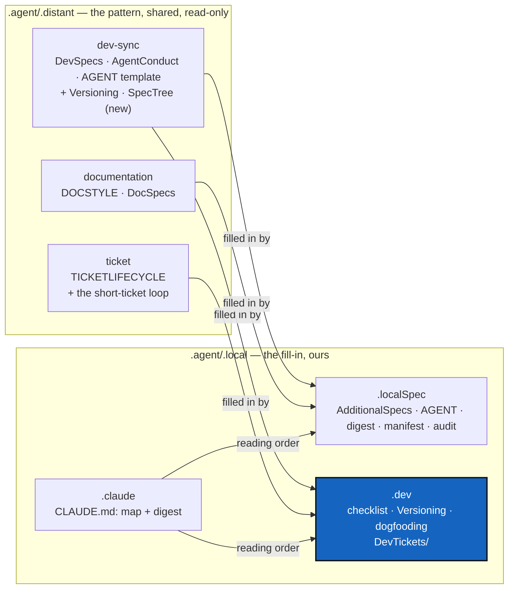

# AgenticTwoLevels — every agentic rule at two levels: the pattern in `.distant`, the fill-in in `.local`

*Created: 2026-10-08*

*Branch: main*

> **From the owner's short ticket**
> [reorg-distant-local](../shortTickets/reorg-distant-local.md) (2026-10-08):
> rationalise the agentic control, which is spread over too many files; move
> what is general and reusable to `.distant` and keep only what is strictly
> needed in `.local`, which "implements the additionalSpec for local";
> SemVer versioning is the example; DevTickets belong in `.dev`, not
> `.localSpec`, because tickets are process, not specs; and the number of
> repositories is open to question.

## Abstract — read this first

**The one-line version.** Each agentic topic gets exactly two documents:
the shared *pattern* in `.agent/.distant/`, and a short local *fill-in* in
`.agent/.local/` that states only what the pattern leaves open. The local
side shrinks from five repositories to three, and `DevTickets/` moves into
`.dev`.

**What this document is.** The analysis of today's agentic tree, the target
structure, the content moves file by file, the work packages in order, and
the decisions only the owner can make.

**Why it exists.** Today the same rule is often written two or three times
(versioning, the commands, the before-committing checklist, the module
table). Some generic rules sit in local files, so other projects cannot
reuse them. Several documents still describe the `.agentSpec` layout that
was retired on 2026-09-22. An agent cannot tell which copy is the real one,
and DOCSTYLE §7 (one authoritative file per purpose) is broken in many
places.

**What you will find.** §1 what is there today. §2 the two-level rule.
§3 the target structure and the repository count. §4 what moves where.
§5 the work packages, in order. §6 the decisions. §7 effect on other
tickets. §8 acceptance.

**Who it is for.** The owner, who has six decisions to make in §6, and the
worker and orchestrator who implement it.

**What you need to do with it.** Owner: answer §6. Implementer: follow §5
in order. WP1's link check comes before any file moves, so every link the
moves break is printed in a list instead of being found one at a time.



---

## 1. What is there today

### 1.1 Inventory

Eight agentic repositories, all declared in `examples/complexgitsync4dev.cgs`:

| Side | Mount | Repository | Holds | Lines of spec |
|---|---|---|---|---|
| distant | `ticket` | `.ticketing` | `TICKETLIFECYCLE.md` | 320 |
| distant | `dev-sync` | `DevSpec` | `DevSpecs.md`, `AgentConduct.md`, `AGENT.md` template, `AgentDataContract.md`, `legalTerms/`, `agent-contracts/` | 1 000 |
| distant | `documentation` | `DocSpec` | `DOCSTYLE.md`, `DocSpecs.md`, a Slidev theme | 350 |
| local | `.claude` | `.claude` | `CLAUDE.md`, `AGENT.md` pointer, `settings.json` | 510 |
| local | `.localSpec` | `.localSpec` | `AdditionalSpecs.md`, `AGENT.md`, `audit.md`, `digest.md`, `AgenticManifest.md`, **`DevTickets/`**, a one-off rescue script | 2 500 + tickets |
| local | `.dev` | `.dev` | `cgitsync-dev.md` | 100 |
| local | `.versioning` | `.versioning` | `Versioning.md`, `scripts/bump_version.py` | 215 + script |
| local | `.auto` | `.auto` | `dogfooding.md` | 58 |

### 1.2 The same rule written more than once

| Rule | Copies | Notes |
|---|---|---|
| Versioning (SemVer, two numbers, who bumps what, `bump-version`, release register) | `.versioning/Versioning.md` **and** `AdditionalSpecs.md` §Versioning (lines 1972–2155) | Near-verbatim; the two already differ in three paragraphs. The generic third is also partly in `DevSpecs.md` §Versioning and `AgentConduct.md` §1.3. |
| Commands and bootstrapping | `CLAUDE.md` §Commands **and** `.dev/cgitsync-dev.md` §Commands | The `.dev` copy is stale: wrong `bootstrap` arguments, `bump-build` "alone". |
| Before-committing checklist, filled in | `CLAUDE.md` §Before committing **and** `.dev/cgitsync-dev.md` | The `.dev` copy still says to add new commands to the README command table, which the owner banned on 2026-10-06. |
| Module responsibility table | `CLAUDE.md` §Architecture boundary **and** `AdditionalSpecs.md` §Responsibility boundaries | Two tables in different shapes (with and without the Ring column). |
| Testing layout | `AdditionalSpecs.md` §Testing **and** `.dev/cgitsync-dev.md` §Testing | Already different. |
| Tree layout and mounts | `CLAUDE.md` §Layout, `AgenticManifest.md`, `.auto/dogfooding.md`, the comment block in `complexgitsync4dev.cgs` | `dogfooding.md` says itself it is stale and still describes `.agentSpec`. |
| The short-ticket loop | `DevTickets/README.md` §2–§3a **and** `TICKETLIFECYCLE.md` §6 | Nothing in the loop is specific to this project. |
| Reading order | `.claude/AGENT.md` **and** `CLAUDE.md` abstract and graph | |

### 1.3 Generic rules sitting on the local side

These hold for any project that follows DevSpec, so other projects cannot
reuse them while they stay local:

- **Versioning pattern.** It is a judgement, never CI. It uses two numbers
  with two rhythms (a release version and a build counter). The worker bumps
  the build and the orchestrator chooses the level. Every build is released,
  `patch` at least. A follow-up fix gets its own patch. "Patch" from the
  owner means this rule. Today all of this sits in `.versioning/Versioning.md`.
- **The short-ticket loop.** The owner writes a short ticket. One pass
  brings every open ticket and spec into line with it. The short ticket is
  then stamped and closed, and never edited again. Today this sits in
  `DevTickets/README.md`.
- **The spec-tree pattern.** `digest.md` is loaded in full every session.
  It has one line per MUST/NEVER rule, each with a citation. A manifest
  lists the mounts and their spec files, and a check keeps both honest.
  Today this sits in `AdditionalSpecs.md` §Spec tree. The pattern answers an
  incident that any agent-driven project can have (SpecTree §1).
- **Workstream branches.** A workstream gets its own branch when it
  migrates a stored format, not because of its subject matter. Only the
  general idea is distant; the list of branches stays local.

### 1.4 Stale or misplaced on either side

| Where | Problem |
|---|---|
| `DevSpecs.md` preface and §Planning (distant) | Still describes tickets in an `AgentSpec/` directory inside the project's own repository, and the `.agentSpec` bundle. This contradicts `TICKETLIFECYCLE.md` §1.1, which keeps tickets private. |
| `TICKETLIFECYCLE.md` §4, §7 (distant) | Links to `DevSpec/DOCSTYLE.md`, a path that no longer exists. Uses `.localSpec/DevTickets/` as its example. |
| `DevSpec/README.md` (distant) | Still describes mounting inside `.agentSpec`. |
| `DocSpec/slidev/themes/piren-seine` (distant) | One project's theme in a shared repository. Out of scope here; noted for a later ticket. |
| `.localSpec/README.md` | Describes the `.agentSpec` split, and a `scripts/` folder that moved to `.versioning`. |
| `DevTickets/TicketSummary.md` | Lists tickets that no longer exist (`UserDevProfile`, `LocalRunLogs`). Breaks `DevTickets/README.md` §1 ("`DevTickets/` holds nothing else"). |
| `.localSpec/scripts/rescue_20260922_memory_ledger_splice.py` | A one-off repair from 2026-09-22, kept beside the specs. |
| `.claude/settings.local.json.tmp.15108.*` | A stray temporary file. |
| `AdditionalSpecs.md` §Branches | Says `.agentSpec` sits on `main`. |

### 1.5 What is *not* a problem

- **`AgentConduct.md`** is already split correctly: the shape is distant,
  and each project's fill-ins are in `CLAUDE.md`. It is the model to copy.
- **`agent-contracts/`** sits in the distant `DevSpec` repository on
  purpose (the AgentContract ticket, archived). The attestation is per
  provider and per owner, not per project. It stays where it is.
- **`.agent/` is a plain directory and not a repository** (AgentMountSplit).
  That rule stays: every mount is declared directly.

## 2. The two-level rule

Every agentic topic has **one pattern and at most one fill-in**:

- **The pattern** (in `.agent/.distant/`, on `main`) states the rule, why it
  exists, and the choices it leaves open. It names no project, no path
  inside a project, and no command of a specific tool.
- **The fill-in** (in `.agent/.local/`, on the project's branch) opens with
  a line `*Fills in: <path to the pattern>*`. It states **only**:
  1. which open choice the project made, and why;
  2. the project's own names: commands, paths, files, branches;
  3. any exception the project makes, with the owner's name and date.

  It never restates the pattern. When the pattern needs a change, the
  change goes in the pattern.

A project with no exception and no choice to make needs no fill-in. That
is the "strict necessary" the short ticket asks for.

`scripts/spec_tree.py` checks this mechanically (D5). Every `*Fills in:*`
line must name a file that exists on the distant side. Every local spec
listed in `AgenticManifest.md` must carry such a line, or be marked
`standalone` (product specs such as most of `AdditionalSpecs.md`, `audit.md`
and `digest.md`).

## 3. Target structure

### 3.1 How many repositories

| Option | Distant | Local | Total | Verdict |
|---|---|---|---|---|
| **A — today** | 3 | 5 | 8 | `.versioning` holds one document and one script. `.auto` holds one stale document. Both are part of "how a change is finished", read by the same agent at the same moment as `.dev`. Five local mounts for three questions. |
| **B — recommended** | 3 | 3 | 6 | Each local repository answers one question. `.claude`: what an agent is handed at session start. `.localSpec`: how the product is built (specs). `.dev`: how work gets done (checklist, versioning, dogfooding, tickets). Each distant repository keeps one topic that other projects can mount alone. `DocSpec` is already mounted by documentation-only projects. |
| C — one distant repository | 1 | 3 | 4 | Folds `.ticketing` and `DocSpec` into `DevSpec`. Fewer mounts, but it undoes AgentSkillsSplit. A project that only writes documents would have to mount the whole development philosophy. Not now. |
| D — one repository per topic, `main` = pattern, project branch = fill-in, mounted twice | — | — | 3 | It looks elegant, but `cgitsync` clones a repository once per identifier (see the `.cgs` comment on mounting a repository twice). Every pattern change would also need a merge into every project's branch. Rejected. |

`.claude` stays separate from `.localSpec`. Its `main` branch carries the
`settings.json` baseline that every project inherits, and Claude Code
expects `CLAUDE.md` at a fixed path, reached through the root symlink.

### 3.2 Pairing, topic by topic

| Topic | Pattern (distant) | Fill-in (local) |
|---|---|---|
| Development philosophy | `dev-sync/DevSpecs.md` | `.localSpec/AdditionalSpecs.md` (standalone product spec, plus a short fill-in section for the choices `DevSpecs.md` leaves open: lifecycle states, versioning scheme pointer, documentation additions) |
| Agent conduct: checklist, commit message, attribution, pair rule | `dev-sync/AgentConduct.md` | `.dev/cgitsync-dev.md`: the 8 steps with this project's commands, project name `cgitsync`, the README *LLM assistance* section, the `vendor-name`/`model-name` rule |
| Agent roles | `dev-sync/AGENT.md` (template) | `.localSpec/AGENT.md` |
| Versioning | **new** `dev-sync/Versioning.md` | `.dev/Versioning.md`: SemVer chosen, positions mapped to the CLI contract, the five files `bump-version` syncs, `scripts/bump_version.py`, the release register and `freeze_release` |
| Data contract | `dev-sync/AgentDataContract.md` + `legalTerms/` | `CLAUDE.md` §Whose data this is (unchanged, already a fill-in) |
| Spec tree and digest | **new** `dev-sync/SpecTree.md` | `.localSpec/digest.md`, `.localSpec/AgenticManifest.md`, `scripts/spec_tree.py` |
| Tickets | `ticket/TICKETLIFECYCLE.md`, **extended** with the short-ticket loop | `.dev/DevTickets/README.md`: where `DevTickets/` lives, and this project's branches (moved from `AdditionalSpecs.md` §Branches) |
| Documents | `documentation/DOCSTYLE.md`, `DocSpecs.md` | the root-README exception and the `.tex` paths, in `AdditionalSpecs.md` |
| Dogfooding | `DevSpecs.md` §Testing ("a green suite is necessary but not sufficient") | `.dev/dogfooding.md`, rewritten from the live tree |
| Session entry | — (Claude Code specific; baseline on `.claude`'s `main`) | `.claude/CLAUDE.md`: what the project is, load `digest.md`, the two-level map (§3.3), the reading order |

### 3.3 Target tree

```
.agent/
├── .distant/                         shared, read-only, branch main
│   ├── dev-sync/      (DevSpec)      DevSpecs · AgentConduct · AGENT template
│   │                                 Versioning (new) · SpecTree (new)
│   │                                 AgentDataContract · legalTerms/ · agent-contracts/
│   ├── ticket/        (.ticketing)   TICKETLIFECYCLE (+ the short-ticket loop)
│   └── documentation/ (DocSpec)      DOCSTYLE · DocSpecs · slidev/
└── .local/                           ours, writable, branch ComplexGitSync
    ├── .claude/                      CLAUDE.md · AGENT.md · settings.json
    ├── .localSpec/                   AdditionalSpecs · AGENT · audit · digest · AgenticManifest
    └── .dev/                         cgitsync-dev · Versioning · dogfooding
                                      scripts/bump_version.py
                                      DevTickets/{README, shortTickets, openTickets, archive}
```

`.claude/AGENT.md` stays as a symlink target, because the root `AGENT.md`
points at it. It shrinks to three lines pointing at `CLAUDE.md`'s reading
order, so the order is stated only once.

## 4. What moves where

### 4.1 To the distant side (pattern extracted, local copy reduced to a fill-in)

| From | To | Content |
|---|---|---|
| `.versioning/Versioning.md` §Two numbers, §Who bumps what, the three "agents got this wrong" cases | `dev-sync/Versioning.md` | Stated without `cgitsync`, `pyproject.toml` or `__build__`: "the packaging manifest", "the build counter". `DevSpecs.md` §Versioning shrinks to the choice of scheme and a link. |
| `DevTickets/README.md` §2, §3, §3a | `ticket/TICKETLIFECYCLE.md` §6 (extended) | The loop and the closing rule. §6 already holds half of it. |
| `AdditionalSpecs.md` §Spec tree (the idea, not the script) | `dev-sync/SpecTree.md` | Digest loaded every session, one line per rule with a citation, a manifest of mounts, a check that fails on drift, and the "fills in" line from §2. |
| The two-level rule itself (§2 above) | `DevSpecs.md` preface, replacing its stale `.agentSpec`/`AgentSpec/` text | One paragraph, plus a link to `SpecTree.md`. |
| `DevSpecs.md` §Planning (stale) | Rewritten as three lines pointing at `TICKETLIFECYCLE.md` | Removes the contradiction in §1.4. |

### 4.2 Within the local side

| From | To | Why |
|---|---|---|
| `.localSpec/DevTickets/` | `.dev/DevTickets/` | Tickets are process, not specs (the short ticket; TicketTreeMove §6). |
| `.versioning/*` | `.dev/Versioning.md`, `.dev/scripts/bump_version.py` | D1. |
| `.auto/dogfooding.md` | `.dev/dogfooding.md`, rewritten from the live tree | D1. Today it is stale by its own admission. |
| `AdditionalSpecs.md` §Versioning | deleted; a single link to `.dev/Versioning.md` | Duplicate (§1.2). |
| `AdditionalSpecs.md` §Testing | merged into `.dev/cgitsync-dev.md` §Testing | Duplicate. |
| `AdditionalSpecs.md` §Branches and ticket topics | `.dev/DevTickets/README.md` | It is process, not product. The `.agentSpec` line is corrected on the way. |
| `CLAUDE.md` §Commands, §Bootstrapping, §Before committing bodies | `.dev/cgitsync-dev.md` | D3. `CLAUDE.md` keeps the step titles. |
| `CLAUDE.md` module table | removed; `AdditionalSpecs.md` §Responsibility boundaries is the only copy | D4. |
| `CLAUDE.md` §Layout mount list | removed; `AgenticManifest.md` is the only list | Already the authoritative file, by its own abstract. |

### 4.3 Deleted

`DevTickets/TicketSummary.md` (D6). The rescue script, after it is moved to
`.dev/DevTickets/archive/` with the ticket it served, or dropped (D6).
`.claude/settings.local.json.tmp.*`. `.localSpec/README.md` is rewritten,
not deleted, because every repository keeps a README.

The `.versioning` and `.auto` repositories on GitHub are **archived by the
owner**, not deleted. Their `ComplexGitSync` branches keep the history. No
agent deletes a remote repository.

## 5. Work packages, in order

Each WP is its own commit, or its own commit per repository. No WP mixes a
`MOVE` with a `CHANGE` (`dev-sync/AGENT.md`, handoff rules).

**WP1 — the link check first** (TicketTreeMove §1 and §3, absorbed per D2).
Fix the stale ticket citations listed in TicketTreeMove §1. Add the check
from its §3 to `pixi run check-ceilings`, widened from
`.localSpec/DevTickets/` to every `.agent/` path cited in `src/`, `tests/`
and `scripts/`, plus the relative links inside tickets. It skips, and does
not fail, when the private mounts are absent. Run it and record the
baseline.

**WP2 — distant patterns** (D4 governs how they are pushed). One commit per
distant repository, never bundled with the project's own commit:
- `DevSpec`: new `Versioning.md` and `SpecTree.md`; `DevSpecs.md` preface
  rewritten as the two-level rule; §Planning and §Versioning shortened to
  pointers; README corrected.
- `.ticketing`: `TICKETLIFECYCLE.md` §6 extended with the loop; dead
  `DevSpec/DOCSTYLE.md` links fixed; project-specific examples made
  generic.
- `DocSpec`: no change in this ticket.

**WP3 — local structure** (moves only, no rewording). Create `.dev/DevTickets/`
and move the tree into it. Fold `.versioning` and `.auto` into `.dev`.
Then update:
- `examples/complexgitsync4dev.cgs` (two entries removed, comment block
  updated);
- `AgenticManifest.md`;
- `pixi.toml` (`bump-version` task path);
- `scripts/spec_tree.py` constants;
- every `.localSpec/DevTickets/` citation in `src/` and `tests/` (about 80),
  rewritten with the WP1 check as the list;
- the relative links inside tickets, one level deeper.

Run `pixi run bump-build`, then `bump-version patch`, because docstrings in
`src/` and a pixi task changed.

**WP4 — local content** (rewording only). Rewrite each local file as a
fill-in per §2, using §4.2's table:
- `cgitsync-dev.md` absorbs `CLAUDE.md`'s command and checklist bodies,
  and the stale copy is dropped;
- `.dev/Versioning.md` keeps only the project's choices;
- `DevTickets/README.md` keeps only the location and the branches;
- `AdditionalSpecs.md` loses §Versioning, §Testing and §Branches;
- `CLAUDE.md` becomes the map from §3.3 plus the digest pointer and the
  data-contract and attribution fill-ins;
- `.claude/AGENT.md` shrinks to a pointer;
- `dogfooding.md` is re-derived from the live tree.

**WP5 — clean-up and the check.** Delete the files in §4.3. Add the
`*Fills in:*` check to `spec_tree.py` (D5). Update every `digest.md`
citation that moved, with one line for the two-level rule. Update
`docs/tutorials/05_private_repos.md` if it names the removed mounts.

**WP6 — prove it.** Run, from a **fresh** `bootstrap` of
`examples/complexgitsync4dev.cgs` as well as from this tree:
- `pixi run lint` and `pixi run test`;
- `pixi run check-spectree` (`--check` and `--check-digest`);
- `pixi run check-ceilings`;
- `cgitsync status` (it must show `errors=0`).

Then deliver one commit message per touched repository: the project,
`.claude`, `.localSpec`, `.dev`, `DevSpec` and `.ticketing`.

## 6. Decisions

| D | Question | Recommendation | Whose call |
|---|---|---|---|
| **D1** | How many local repositories? | **Option B**: three (`.claude`, `.localSpec`, `.dev`). Fold `.versioning` and `.auto` into `.dev` and archive the two GitHub repositories. | **Owner** |
| **D2** | What happens to TicketTreeMove? | **Absorb it.** Its citation fix and check become WP1, and its move becomes WP3. Archive it as superseded in the pass that accepts this ticket. Two tickets planning the same move would drift apart. | **Owner** |
| **D3** | How much stays in `CLAUDE.md`? | **The map, the digest pointer, the 8 checklist step titles (one line each), and the data-contract and attribution fill-ins.** Command and step bodies move to `.dev/cgitsync-dev.md`. The step titles stay because the checklist is what gets forgotten, and `digest.md` is the floor under it (SpecTree §1). Target: under 150 lines, from 477. | **Owner** |
| **D4** | How are the distant repositories edited? They are read-only mounts here, and a push to `main` reaches every project that mounts them. | **The worker prepares each distant change as its own commit in a separate clone. The owner reviews and pushes it.** Never `writable = true` on the mount, not even for a short time: that changes the tree's scope and the `.gts` that attests it. | **Owner** |
| **D5** | Does `spec_tree.py` enforce the `*Fills in:*` line? | **Yes, in `--check`.** A rule without a check drifts, which is how §1.2 happened. | Implementer |
| **D6** | `TicketSummary.md` and the rescue script? | **Delete `TicketSummary.md`.** It is stale, and the `openTickets/` listing sorted by name already says the same thing. **Move the rescue script** into `.dev/DevTickets/archive/` beside the ticket it served. | Owner (it was created on request) |

## 7. Effect on other tickets

- **TicketTreeMove**: absorbed (D2).
- **WorkingAreaRename**, **Omniscience**, every **data-repo** ticket: their
  relative links change depth in WP3. The change is mechanical and covered
  by WP1's check, and their content does not change.
- **PackageHygiene**: no overlap. It is about the public package, not the
  agentic tree.

The short ticket is closed, stamped, in the change that carries this plan
through the open tickets (D2 above). It is not closed by this proposal.

## 8. Acceptance

- Every agentic topic has one pattern in `.agent/.distant/` and at most one
  fill-in in `.agent/.local/`. Every fill-in opens with `*Fills in:*`, and
  `spec_tree.py --check` fails if one points nowhere.
- No rule in §1.2 exists twice: a `grep` for each of its key sentences
  finds one file.
- `.agent/.local/` holds three mounts. `DevTickets/` is at
  `.agent/.local/.dev/DevTickets/`, and a fresh bootstrap of
  `examples/complexgitsync4dev.cgs` produces it.
- `DevSpecs.md`, `TICKETLIFECYCLE.md` and every local README describe the
  current layout. No document describes `.agentSpec` or an `AgentSpec/`
  directory as current.
- `CLAUDE.md` is under 150 lines (D3).
- No `.agent/` path cited in `src/`, `tests/`, `scripts/` or any open ticket
  fails to resolve. The check passes in a checkout without the private
  mounts.
- `pixi run lint`, `pixi run test`, `check-spectree`, `check-ceilings` pass,
  and `cgitsync status` from the tree's own root shows `errors=0`.
