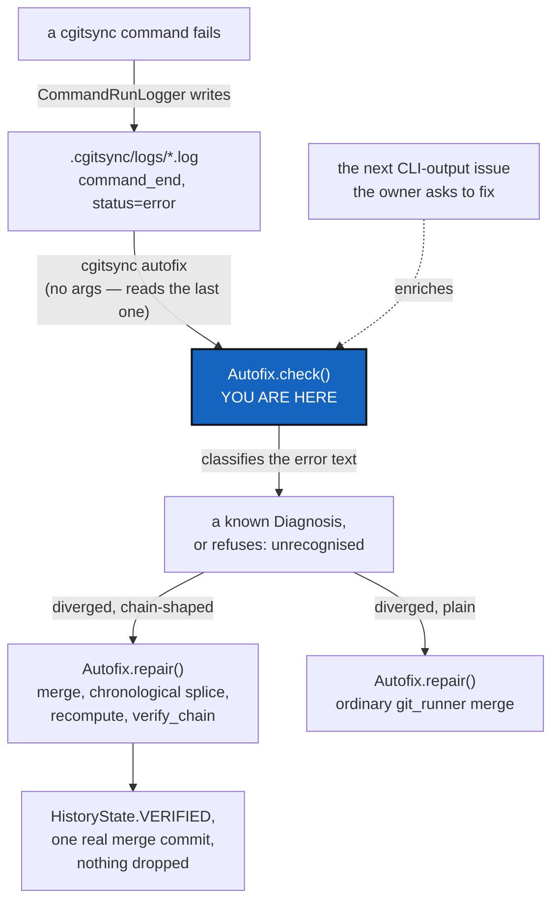

# Autofix — a class that reads the error `cgitsync` just gave you, then repairs the situation

*Created: 2026-09-22*

*Branch: main*

> **Owner incident — 2026-09-22, in conversation.** Two agent sessions
> ("cgsN", this one, and "cgsDbg", a parallel debugging session) both
> committed to the owner's private `.memory` repository from the same
> ancestor. `push --private` was rejected by the remote (`fetch first`);
> `pull` then refused with *"Diverging branches can't be fast-forwarded"*
> and printed exactly one piece of advice: *"You can try cgitsync
> pull-force command."* The owner's own words: *"I am continuing to have
> problem. Even after you intervene."* — a near-identical divergence in
> `.localSpec` minutes earlier needed a hand-run `git merge` to fix,
> because `cgitsync` itself offers nothing between "fast-forward or fail"
> and "force".

> **Owner direction — 2026-09-22, same day.** *"Write a Ticket concerning
> the actual problem and propose a generic resolution as you did with
> merge followed by a sort of memory rebase i would say and recalculation
> of the ledger. This would be part of the autofix.py part of the src."*

> **Owner direction — 2026-09-22, same day, again.** *"autofix.py should
> mobilize a class called autofix that run a check on the situation of a
> git. Let start from cgitsync errors for launching the proper sequence of
> actions. The repair is called by pixi run cgitsync autofix (it takes the
> former error as an entry)."*

> **Owner direction — 2026-09-22, closing the day.** *"can you merge the
> two memory-dev priority 1 tickets into an autofix one in main, and queue
> it first. I think this is essential to initiate this autofix, especially
> that anytime i'll ask to solve an issue from CLI output, you'll enrich
> autofix."* This is that merge: `memory-dev_1-1_DivergedPrivateRepo` and
> `memory-dev_1-2_LedgerAutofix` are archived, superseded by this one
> ticket, on `main` — because `Diagnosis` (§7) is not memory-specific, and
> queued first, because it is the standing instruction the rest of this
> project's tickets now get built against: **the next time a `cgitsync`
> error gets diagnosed and fixed, `Autofix` is where that fix's diagnosis
> and repair sequence get added, not a one-off script.**

## Abstract — read this first

**The one-line version.** `cgitsync`'s only answer to a diverged private
repository is `pull-force` — a hard reset to the remote's tip. That is
free for a repository whose commits are prose (`.localSpec`, which merges
away the divergence for free); for `.memory`, whose commits are a
hash-chained, sequence-numbered ledger, `pull-force` silently discards
every local-only entry. `Autofix` is the class that tells the two apart
and runs the right sequence instead, starting from the error `cgitsync`
already produced.

**What this document is.** One real incident (§1-§3), why nothing already
in this codebase or its tickets solves it generically (§4), what the
hand-run fix proved (§5), and the design of `autofix.py`: one class,
`Autofix`, whose `check()` classifies an error and whose `repair()` acts
on the classification (§6-§7).

**Why it exists.** `cgitsync status`'s `SYNC` column distinguishes
`ahead`/`behind`/`diverged`, and the tool already has a safe path
(`merge`) and a destructive one (`pull-force`) — neither one is chain-
aware, and nothing routes a `.memory` (or any future content-addressed
private repository — `omniscience`'s register is the next one) away from
the destructive path when the safe one would corrupt it just the same.
`Autofix` is also meant to *grow*: every future incident this project's
owner asks to have fixed from a `cgitsync` error is a candidate
`Diagnosis` this class should learn, not a rescue script that gets
written once and forgotten.

**What you will find.** §1-§3 the incident: what happened, why the two
repositories needed opposite answers, and what `pull-force` actually does
(read from the code) that makes its own hint dangerous here. §4 the two
existing tickets this could be mistaken for, and why neither is it. §5
what the hand-run rescue proved. §6 the shape of a general fix. §7
`Autofix`'s design: the class, where "the former error" comes from, the
algorithm, and where it refuses rather than guesses. §8 decisions. §9
work packages. §10 acceptance.

**Who it is for.** The owner, for §8. Then whoever builds `autofix.py`,
and every future ticket that adds a `Diagnosis` to it.

**What you need to do with it.** Read §1-§3 for the concrete example, §7
for the design it generalises into. This ticket is queued first in
`main`'s priority-1 pile on the owner's explicit instruction.



---

## 1. The incident, reproduced

Confirmed against this tree's own `.localSpec` and `.memory` remotes,
2026-09-22:

- `.localSpec` diverged +1/-1 from a genuine parallel edit (the owner's
  `PrivateLocalBranchAtClone` diagnosis, committed to origin while this
  session closed `ProjectSpecSplit` locally). `git merge
  origin/ComplexGitSync` resolved it with **zero conflicts** — a normal
  three-way text merge, because both sides edited independent prose.
- `.memory` diverged +2/-1 the same way, minutes later, from a second
  parallel session ("cgsDbg") folding its own pending memory. `push
  --private` was rejected by the remote for the same reason any diverged
  push is. Plain `pull` then refused outright: `fatal: Not possible to
  fast-forward, aborting`, followed by the CLI's only suggestion:
  `cgitsync pull-force`.

Nothing in the session between the failed `push` and the failed `pull`
told the owner that the `.localSpec` fix (`git merge`) would not be the
right move here too, or that the tool's own suggested command would not
attempt one.

## 2. Why the two repositories needed opposite answers

**`.localSpec` is safe to merge because its history has no invariant
beyond "these are files".** Two branches editing different Markdown prose
merge the way any two feature branches do.

**`.memory` cannot be merged the same way, because its history is not a
set of independent edits — it is a chain.** `memory/ledger_entry.py`'s
`LedgerEntry` carries `seq` and `prev`: `build_next_entry`
(`ledger_entry.py:205-264`) sets each new entry's `seq = prev.seq + 1` and
`prev = prev.entry_hash`, and `memory/ledger_store.py` writes one file per
entry named `<seq:06d>.toml` (`entry_path`, `ledger_store.py:106-108`).
Two sessions that both fold pending memory after the same ancestor both
compute the **same** next `seq` and write to the **same** filename with
**different** content — a plain `git merge` sees an add/add conflict on
`000016.toml` (this incident's real numbers). Resolving that conflict by
picking either side, or by concatenating both, drops the other session's
entry silently, and `memory/integrity.py`'s `verify_chain`
(`integrity.py:204-249`) will flag everything downstream of the drop as
`BROKEN_LINK` the next time anyone checks — the ledger does not fail
loudly at merge time, it fails later.

**The `SYNC` column cannot see this difference.** `ahead`/`behind`/
`diverged` is computed from commit topology alone, the same way for every
private/local repository — it has no notion that this particular
repository's commits are not independent.

## 3. What `pull-force` actually does, and why its hint is dangerous here

`cli/expert.py`'s help text for `pull-force` already calls it
"Destructively resynchronise..." (`cli/expert.py:49`) — the danger is
documented, once, in `--help`. What it does, read from the code: default
scope is the **whole tree** (`orchestre.py:3048-3050`, `RepoScope.ALL`
unless `--private` narrows it), and for each repository in scope with a
remote tracking branch, `git_runner.force_pull` (`git_runner.py:775-792`)
runs `git fetch`, then **`git checkout -B <branch> FETCH_HEAD`** —
rewriting the local branch tip to the remote's, not merging — then
`git clean -fd`. For this incident, that is a hard reset of `.memory` to
`cgsDbg`'s tip: `cgsN`'s two local-only commits become dangling and gone
the moment nothing else references them, which for a leaf-only,
single-workspace repository is immediately.

**The hint the CLI prints on a failed `pull` does not carry that warning
forward.** `git_runner.py`'s failure path for a non-fast-forward `pull`
prints only `"You can try cgitsync pull-force command"` — accurate advice
for a repository like `.claude`/`.localSpec` where the remote's version
should simply win, and the wrong first suggestion for a repository whose
local commits are the only copy of work nobody has pushed anywhere else.

**Preflight does not catch this either.** `operations.py:1785`'s
`_run_preflight_checks` treats `SyncState.AHEAD` as advisory-only
(`operations.py:1981-1988`) and only `push_tree`/`commit_tree` call it at
all — plain `pull` (`operations.py:356-382`) runs no tracking-state
preflight whatsoever, confirmed by grep across all seven call sites.

## 4. The two existing tickets this could be mistaken for, and why neither is it

**`StateLocking`** — "two `cgitsync` processes, one workspace, no
referee" — is *prevention*, scoped to one machine: an advisory lock file
so two local processes never race in the first place. It already named
this exact failure mode in its own §1, back on 2026-09-12, as a
prediction: *"Under a hash chain... two entries claim the same parent,
and the chain forks."* **A lock cannot fix this ticket's problem, because
a lock only protects processes that can see each other.** Two machines
pushing to the same `.memory` branch between pulls are never in the same
lock domain; by the time either would take a local lock, the other has
already finished and pushed. Locking and `Autofix` are complementary:
`StateLocking` stops a fork from happening on one machine; `Autofix`
fixes one that already happened across two.

**`Omniscience`** §4, "two people appending at once", looks like the same
question and answers it completely differently: *"the two records are two
different files. Git's own merge handles it — no strategy, no driver, no
merge rule of ours."* That works **because `Omniscience`'s records are
one-file-per-record with no shared sequence field** — a deliberate design
choice for a register that does not exist yet. `.memory`'s ledger already
exists, was built with sequential filenames before that lesson was
available, and cannot be redesigned retroactively.

**Neither ticket, nor anything else found by searching every open and
archived ticket for "simultaneous"/"concurrent"/"two users"/"two
machines"/"race", proposes an automated fix for an already-forked chain.**

## 5. What the hand-run rescue proved

Fixing the incident (`.memory` diverged: local session "cgsN" wrote
ledger seq 16-19 after ancestor seq 15; origin's session "cgsDbg" wrote a
*different* seq 16-17 after the same ancestor) took:

1. `git merge origin/ComplexGitSync --no-commit` — surfaces an add/add
   conflict on exactly the colliding filenames (`lgr/000016.toml`,
   `lgr/000017.toml`) and nothing else; `state/`/`env/`/`logs/` merge as a
   clean union on their own, since content-addressed names never collide.
2. Read all six entries "new since the ancestor" from both sides.
3. Sort by `recorded_at`, not by which branch — the two sessions
   interleaved in real time, so grouping "one side, then the other" would
   have produced a chain reporting `TIME_REGRESSION`, which is not
   corruption but is not clean either.
4. Rebuild each entry at its new position: same `command`/`argv`/
   `state_id`/`recorded_at`/everything else, only `seq`/`prev`/
   `entry_hash` recomputed via `memory.ledger_entry.compute_entry_hash` —
   the exact function a live write already uses.
5. `memory.integrity.verify_chain` over the rebuilt, 21-entry chain:
   `HistoryState.VERIFIED`, zero findings, before anything was committed.
6. `git add` + `git commit` — a real merge commit, two parents, nothing
   force-anything.

Saved as [scripts/rescue_20260922_memory_ledger_splice.py](../../scripts/rescue_20260922_memory_ledger_splice.py)
— **what it hardcoded, and is exactly what `Autofix` must not**:
`_LOCAL_TIP`, `_ORIGIN_TIP`, `_ANCESTOR_HEAD_HASH` as module-level
constants naming this one incident. The conflict-file list was also read
by eye, not computed.

## 6. The shape of a general fix

Everything §5 did is already parametric in principle — "read entries new
since the merge base, on both sides", "sort by time", "rebuild the
chain", "verify", "commit" — none of it actually needs *this* incident's
hashes, only *a* merge base and *two* tips.

**Why this is not, and should not try to be, a git merge driver.** A
merge driver operates on one file's three versions (ours/theirs/base) at
a time with no visibility into any other file. This fix is not a per-file
operation — repairing one colliding `seq` shifts every entry that comes
after it, on both sides, which is knowledge no single-file driver has.
The right shape is a command that runs *instead of* (or immediately
after) a failed `pull`/`merge`, operating on the whole `lgr/` directory
across both refs.

## 7. `Autofix`'s design

**Where it lives, and why not inside `memory/`.** `memory/`'s own module
contract is explicit: *"Nothing here runs Git."* This fix has to run
`git merge-base`, read blobs from two refs, and complete a merge commit —
real Git operations, which by this project's own rule (`git_runner.py` is
"the sole `import subprocess` module") must go through `git_runner.py`,
never a new subprocess call of this module's own. That makes
`src/ComplexGitSync/autofix.py` a peer of `operations.py`: it orchestrates
`git_runner.py` calls for the Git half and `memory.ledger_entry`/
`memory.ledger_store`/`memory.integrity` calls for the chain half. It
does not become part of `memory/`, and it does not give `memory/` a
reason to import `subprocess`.

**One class, `Autofix`, two responsibilities — check, then repair.**

```python
class Diagnosis(Enum):
    """What Autofix.check() found, or why it found nothing actionable.

    Grows with every future incident this project fixes from a cgitsync
    error — a new member here and a new branch in repair(), not a new
    one-off script."""
    NON_FF_REJECTED = auto()   # push refused: "fetch first"
    DIVERGED_PLAIN = auto()    # pull refused: diverged, content is plain text
    DIVERGED_CHAINED = auto()  # pull refused: diverged, content is a seq/prev chain
    UNRECOGNISED = auto()      # a real error, but not one this class repairs yet

@dataclass(frozen=True, slots=True)
class Situation:
    diagnosis: Diagnosis
    repo: GitRepo
    source_error: str          # the exact text Autofix.check() classified

class Autofix:
    def __init__(self, registry: WorkingGitTree, runner: GitRunner) -> None: ...

    def check(self, error: str, *, repo_name: str | None = None) -> Situation:
        """Classify one already-raised error into a Situation. Pure
        pattern-matching over `error`'s text plus the named repo's mounted
        content shape — runs no Git itself."""

    def repair(self, situation: Situation) -> RepairOutcome:
        """Execute the sequence Situation.diagnosis calls for. Raises
        rather than guesses if a precondition (the disjointness check, for
        DIVERGED_CHAINED) fails."""
```

**Where "the former error" comes from.** `cgitsync` already writes one
structured JSON line per event to `.cgitsync/logs/<command>-<timestamp>.log`
via `orchestre.CommandRunLogger` — a failed run's last line is
`{"event": "command_end", "status": "error", "error": "...", "command":
"..."}` (the `log_file=...` path every failing command in this incident
already printed). `cgitsync autofix`, run with no arguments, finds the
most recent such log under the active workspace, reads that line, and
calls `Autofix.check(error=..., repo_name=...)` with it — the owner's own
*"it takes the former error as an entry"* — so the normal workflow is: a
command fails, the owner runs `cgitsync autofix` next, and nothing has to
be typed twice. `check()` also accepts an explicit `error` string
directly, for tests and for a caller that already has one in hand.

**Detection of *which* situation, given the error text.** `errors.py`'s
own hierarchy is shallow — `push`/`pull`/`merge` failures all raise the
same generic `GitSyncError` — so today the only way to tell "rejected,
fetch first" apart from "diverged, cannot fast-forward" is the message
text `git_runner.py` captured, which is exactly what `check()` pattern-
matches on (the two literal strings already seen twice in this project's
own incidents: `"[rejected]"` for a push, `"Diverging branches can't be
fast-forwarded"` for a pull). Once a message is recognised as a
divergence, a second question decides `DIVERGED_PLAIN` vs
`DIVERGED_CHAINED`: does the named repository mount a `lgr/` directory of
`<seq:06d>.toml` files? A short, explicit registry (repository name →
"this one is a chain"), not content-sniffing every file — recommendation
in D1. Today it has exactly one entry: `.memory`'s `lgr/`.

**`repair()`'s `DIVERGED_CHAINED` sequence** — §5's algorithm, made
parametric over `situation.repo` and its current tracking branch instead
of two hardcoded commit hashes:

1. `git_runner`: compute the merge base of the local branch and its
   upstream.
2. Read every `lgr/<seq>.toml` that exists on either ref but not at the
   merge base — via `git show <ref>:lgr/<seq:06d>.toml`, not by checking
   either ref out.
3. **Refuse, do not guess, if the two sides' new entries are not disjoint
   at the field level** — i.e., if `recorded_at` ties, or if anything
   beyond `seq`/`prev`/`entry_hash` differs from what a real append could
   produce. This is the one judgement call a human, not `Autofix`, should
   make.
4. Sort the union of both sides' new entries by `recorded_at`.
5. Recompute `seq`/`prev`/`entry_hash` for each, chained from the merge
   base's tip, via `memory.ledger_entry.compute_entry_hash` — never a
   hand-rolled hash.
6. Write via `memory.ledger_store.write_entry`, after clearing whatever
   stale, wrongly-numbered files the pre-fix state left.
7. `memory.integrity.verify_chain` over the full, rebuilt chain.
   **`HistoryState.VERIFIED` is the only passing result** — `CORRUPT`
   aborts outright (leaves the merge conflicted, nothing written);
   `TIME_INCONSISTENT` also aborts, even though it is "not corruption",
   because step 4's chronological sort avoids it whenever the entries are
   genuinely independent — reaching it anyway means step 3 was too weak.
8. Only on `VERIFIED`: `git_runner` stages and completes the merge commit,
   with a message naming the operation, the seq range repaired, and that
   `verify_chain` passed — machine-generated, so it is not the
   commit-message rule's "written by hand" case (`AgentConduct.md` §2's
   own carve-out for tooling-generated messages).

**`repair()`'s `DIVERGED_PLAIN` and `NON_FF_REJECTED` sequences** are
thin: `git_runner.merge`/`fetch`-then-`push`, no chain-specific step at
all — the ordinary case `.localSpec` already went through by hand, now
automated because nothing about it needed a human either.

**What it never does.** Never force-pushes (`Omniscience`'s own D5
already settled this for the register `Autofix` will one day also serve:
*"pull, then push again — never force, never rebase"*). Never resolves a
genuine content conflict by picking a side — step 3 refuses instead, and
refusing with a clear reason is `StateLocking`'s own acceptance bar
(*"refusing is an acceptable answer"*) applied one layer up. Never runs on
an `UNRECOGNISED` diagnosis — `check()` saying "I don't know what this
is" is itself the safe answer.

## 8. Decisions

| D | Question | Recommendation | Whose call |
|---|---|---|---|
| **D1** | How does `Autofix` know a repository is chain-shaped? | A short, explicit registry (repository name → the directory/filename pattern to treat as a sequenced chain), not content-sniffing. Today it has exactly one entry: `.memory`'s `lgr/`. `Omniscience`'s own register never needs an entry, by its own design (§4) | Owner |
| **D2** | CLI surface: extend `pull`/`pull-force`, or a new verb? | **Settled by the owner, 2026-09-22: a new verb, `cgitsync autofix`.** Not memory-specific by name, because `Diagnosis` isn't either. Run with no arguments, it reads the *last* error from the run log (§7); `--repo NAME` and `--error "..."` stay available for a caller that already knows what failed. Extending `pull-force` was considered and rejected: its already-destructive default behaviour would then do something conditionally different depending on file contents | Owner — decided |
| **D3** | What happens on refusal (a `CORRUPT`/`TIME_INCONSISTENT` result, or an `UNRECOGNISED` diagnosis)? | Leave the situation exactly as found — a conflicted merge stays conflicted, nothing written — and print what was found and why it was not safe to proceed automatically. Never partially write | Owner |
| **D4** | Does `Autofix` also cover the ledger's `HEAD` cache file? | Yes, trivially — `ledger_store.verify_and_repair_head` already recomputes it from the entry files and never trusts the cached value | Implementer |

## 9. Work packages

| WP | Does | Depends on |
|---|---|---|
| **WP1 — DONE, 2026-09-22** | Resolved the owner's live `.memory` divergence by hand, per §5. `integrity.verify_chain` over the merged, 21-entry chain returned `HistoryState.VERIFIED`, zero findings; `cgitsync status` showed `.memory` `clean ahead(+3)`, `errors=0`. Not pushed — owner's call | — |
| **WP2** | `autofix.py`: the `Autofix` class, `Diagnosis`/`Situation`, and `check()`/`repair()` from §7, covering `NON_FF_REJECTED`, `DIVERGED_PLAIN`, and `DIVERGED_CHAINED` for `.memory`'s `lgr/` shape. Unit tests: `check()` against the real captured error strings from both halves of this incident; `repair()` against two small synthetic diverged chains (disjoint-time, and separately a case that must be refused) | D1 |
| **WP3** | `cgitsync autofix` (D2): the run-log reader that finds "the former error" with no arguments, a `ComplexGitSyncClient.autofix(error, repo_name)` method carrying the semantics, and a thin `_handle_*`/`_execute_*` pair in `cli/` — `cli/` itself never touches `git_runner`/`memory` directly | WP2, D2 |
| **WP4** | Re-run this ticket's own worked example against `autofix.py` (a synthetic replay of the incident, not the real one — that one is already fixed) and confirm it reaches the same `HistoryState.VERIFIED` result the hand-run rescue did | WP2 |
| **WP5** | Fix `pull-force`'s failed-`pull` hint (`git_runner.py`) to name the risk when the repository has local-only commits — print `cgitsync status`'s own `ahead(+N)` count for that repository next to the suggestion | — |
| **WP6** | **The user guide the owner originally asked for**: one document, tricky git states on the left, the safe `cgitsync` command on the right, with an explicit column for "this repository's content has no ordering invariant, plain merge is fine" versus "it does, `cgitsync autofix` handles it." Covers at minimum: ahead-only (push), behind-only (pull), diverged-mergeable (`.localSpec`-shape), diverged-chained (`.memory`/`omniscience`-shape), and what `pull-force`'s hint should have said | WP1 (worked example), WP3 (once `cgitsync autofix` exists to name) |

## 10. Acceptance

- ✅ **The owner's live `.memory` divergence is resolved** (WP1). Not yet
  pushed — owner's call.
- `autofix.py` exists, imports no `subprocess` itself, and every Git
  operation it performs goes through `git_runner.py`.
- `Autofix.check()` correctly classifies both real captured error strings
  this project has on file: `.localSpec`'s `"[rejected]"`/non-fast-forward
  case (→ `DIVERGED_PLAIN`) and `.memory`'s "Diverging branches can't be
  fast-forwarded" case (→ `DIVERGED_CHAINED`).
- A synthetic two-branch divergence with disjoint `recorded_at` values
  reconciles automatically to a `HistoryState.VERIFIED` chain with a real
  merge commit; nothing is force-pushed, nothing is dropped.
- A synthetic divergence that fails the disjointness check is refused,
  with the merge left conflicted and nothing written — not a guess.
- `cgitsync autofix` exists as a real CLI command, runnable with no
  arguments, documented in the README's command table per this project's
  own rule, and mirrors a `ComplexGitSyncClient.autofix` method.
- `pull-force`'s hint (WP5) names what it would discard.
- The guide (WP6) exists and every row names the actual `cgitsync`
  command, not raw `git`.
- `pixi run lint` and `pixi run test` pass; `cgitsync status` shows
  `errors=0`.
