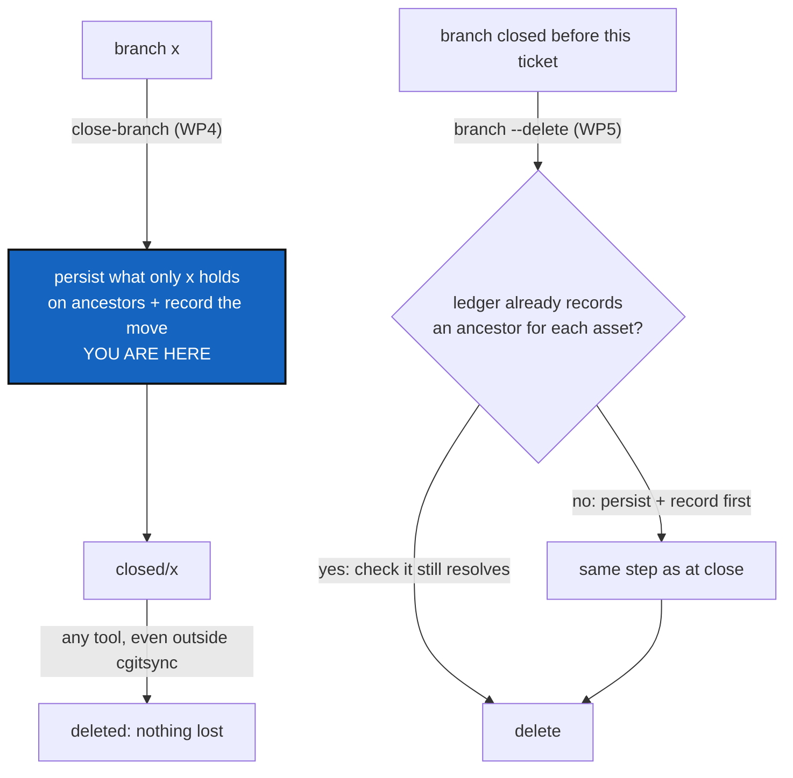

# BranchAncestors — keep what a branch alone holds when it is closed, so deleting it later loses nothing

*Created: 2026-10-02*

*Branch: main*

> **Note — 2026-10-02, from [CliGrammar](main_1-2_CliGrammar_DevPlanTicket.md).** If the owner adopts its grammar, ruling 2's `branch --delete <branch>` is spelled `branch delete <branch>`. The ruling is unchanged; only the spelling moves. CliGrammar's WP1 to WP3 should land before this ticket's WP5.

> **Ticket review — 2026-10-02, after GitLikeCli.** Renumbered `main_1-2` → `main_1-1`: [GitLikeCli](../archive/20261002_GitLikeCli_DevPlanTicket.md) was implemented and archived, so the priority-1 ranks were compacted.

> **From the owner's short ticket `archive/.closedUserTicket/20261002_branch-delete.md`**,
> and the owner's revision in the session the same day. The short ticket asked
> for a delete that checks the ledger's integrity, persists what must survive
> on an "ancestor" branch, records that "address mutation" of each asset in
> the ledger with the ancestor hash, and only then deletes. The revision moves
> the persisting to the moment of **closing**: "it would be wise to use the
> ancestor mechanism during the branch closing so that the branch deletion
> could be done by another tool than cgitsync. [...] for already closed
> branches we need the same mechanism implemented for delete branch. It is
> anyway a data security measure. [...] if the migration was done at closure,
> it must not be done at deletion. Deletion must then first check the ledger
> for records and potential ancestors. If they exist it doesn't duplicate the
> readdressing of the asset." The owner's last sentence was cut off; it is
> read here as "it only checks that the ancestor still holds the asset, then
> deletes".

> **Owner's rulings — 2026-10-02.** (1) One `ancestors` branch **per
> ComplexGitSync project**. (2) The command is `cgitsync branch --delete`.
> (3) Every commit that would become unreachable is persisted, **and what
> `ancestors` holds must be reachable through the search tools**. (4) Persist
> the three closed branches now; the proof of concept deletes one, and **two
> stay for the owner to delete himself, as practice**. (5) The proof of
> concept is `closed/tmp-main-1-2_DiscoverRoundTrip`.

## Abstract — read this first

**The one-line version.** From now on, `close-branch` copies everything only
the branch holds onto the project's permanent `ancestors` branch, and records each move in
the ledger. After that, a closed branch can be deleted by anything, even
GitHub's own button, without losing a commit. A separate `branch --delete`
does the same persisting for branches closed before this existed, skipping
whatever the ledger says is already safe.

**What this document is.** The plan: what deleting can lose, the ancestor
branch, the ledger's address mutation, where each runs (close first, delete
second), the owner's rulings, the work packages and the proof of
concept.

**Why it exists.** Deleting a branch changes no commit, but what becomes
unreachable is eventually discarded. Two closed branches here hold the only
copy of something: `closed/ComplexGitSync_tmpPyPi` in `.memory` (ledger
entries 126 to 129) and `closed/tmpAutoFix` in the root (commit `0e54d78`).
Making the close itself the safe point means safety does not depend on which
tool deletes, so it is a data-security measure first.

**What you will find.** §1 what deleting can lose. §2 the design. §3 the
owner's rulings. §4 the work packages. §5 the proof of concept. §6
acceptance.

**Who it is for.** The worker and orchestrator. Every question has been
ruled (§3).

**What you need to do with it.** Worker: WP1 is read-only
and can start at once; WP2 to WP4 make closing safe, and come before WP5,
the delete; WP6 makes the search tools read through `ancestors`.

---

## 1. What deleting a branch can lose

Deleting a branch removes a name, not a commit. What it loses is what no
other name reaches afterwards. Three kinds of asset matter:

| Asset | Where | Lost when |
|---|---|---|
| **A commit** | any repository | No other ref, local or on origin, reaches it. This always counts: dropping commits is what *The hard prohibitions* forbid |
| **A commit a State names** | a State (`.gts`) records each repository's `commit_sha` | That commit becomes unreachable, so the State a ledger entry names can no longer be checked out or rebuilt |
| **A ledger entry, State file or self-history record** | `.memory`, `.self-history` | The branch holds the only copy, by content (its blob is on no other ref) |

"The ledger's integrity is preserved" means: after the deletion, every
ledger chapter on every remaining ref still verifies, and every State any
entry names can still be resolved, along with every commit those States
name.

## 2. The design

**The ancestor branch is a project branch** (ruling 1). A Git branch can
only keep commits of its own repository, so "one per project" means one
*project* branch, named in each repository by the rule `git_branch.py`
already owns: `ancestors` in a project repository, `<project>_ancestors` in a
private/local one (`ComplexGitSync_ancestors`), and none in a private/distant
one, which never follows the project. It is the same mapping `close-branch`
and `checkout` use, so one name addresses it across the whole tree. It is
permanent, never checked out, and never deleted. In each
repository it starts as an empty root commit. To persist a tip, it gains one merge commit made with
`git merge -s ours --no-ff --allow-unrelated-histories <tip>`. The merge
keeps `ancestors`' own tree, takes the tip as a second parent, and so keeps
the whole history reachable. It only adds commits, never forces, and its
message names the branch it preserves. A tip already reachable from
`ancestors` needs no new merge. One branch holds every preserved history,
so the branch list stays short.

**The address mutation.** The ledger entry written by the step that
persists carries a new, additive field, `relocations`, one item per asset:

| Field | Value |
|---|---|
| `asset` | What moved: `commit:<repo>:<sha>`, or `lgr:<repo>:<chapter>:<seq>` for a ledger entry |
| `from` | Its address before: `<repo>:refs/heads/<branch>` (at close) or `<repo>:refs/heads/closed/<branch>` (at delete) |
| `to` | Its permanent address: `<repo>:refs/heads/ancestors` |
| `ancestor` | The hash it had at its old address: the commit sha, or the entry's `entry_hash` |

The field enters the entry's own hash, so the move is part of the chain
from then on. Like `release`, it is present only on the entries that carry
it, so every chain already written verifies byte for byte. That is an
addition, not a migration, so the work lands on `main` (*Branches and
ticket topics*).

**Verification.** `ChainVerifier` gains one check. For each relocation, the
asset must be found at `to` with the hash recorded in `ancestor`. A
relocation that does not resolve is a finding, and `verify` stops being
`verified`.

**Where it runs.**

- **At close (the safe point).** `close-branch` persists and records
  *before* it renames anything. It does this for whatever would be lost if
  the branch were deleted later. Afterwards, deleting `closed/x` by any
  means loses nothing, because everything it alone held is reachable from
  `ancestors`, and the ledger says so.
- **At delete (for branches closed before this ticket).** `branch --delete`
  first reads the ledger. For each asset that would be lost, it looks for a
  relocation already recorded. If one exists and still resolves, nothing is
  persisted or recorded again. Otherwise it persists and records, exactly
  as the close does. Then it verifies. Only then does it delete, on origin
  first, then locally, leaf-first. Any failure refuses with nothing
  deleted.

## 3. The owner's rulings

| # | Question | Ruling |
|---|---|---|
| 1 | The ancestor's shape | One `ancestors` branch per ComplexGitSync project: a project branch, named per repository by the existing rule (§2) |
| 2 | The delete command | `cgitsync branch --delete <branch>` |
| 3 | What must be persisted | Every commit that would become unreachable. What `ancestors` holds must be found by the search tools (WP6) |
| 4 | The three branches already closed | Persisted now (WP7). The proof of concept deletes one; `closed/tmpAutoFix` and `closed/tmpPyPi` stay for the owner to delete himself |
| 5 | The proof of concept | `closed/tmp-main-1-2_DiscoverRoundTrip` |

## 4. Work packages

| WP | What | Done when |
|---|---|---|
| **WP1** | **The check, read-only.** For a branch, resolve each repository's own name (as `close-branch` does). Report the commits only it reaches; the States in any ledger chapter that name them; the ledger entries, State files and records it holds that no other ref has, by content; and the relocations already recorded for them. The verdict is `safe`, `recorded` (an ancestor exists and resolves) or `needs ancestor`. It writes nothing. | It runs on the three closed branches and its findings match §1's examples |
| **WP2** | **The ancestor.** Create `ancestors` when missing (an empty root commit), persist a tip with the `-s ours` merge unless it is already reachable, and push without force. This is a `git_runner` operation plus a `BranchOperation` step, and it refuses rather than overwrite. | After it, WP1 reports that branch `recorded` or `safe` |
| **WP3** | **The address mutation.** Add the `relocations` field to `LedgerEntry` (additive, in the hash only when present), write it whenever WP2 persists something, and add the `ChainVerifier` check. Write the field's schema into `AdditionalSpecs.md` (*The hash-chained ledger*). | A relocation that resolves verifies; a missing asset or a wrong hash is a finding |
| **WP4** | **Closing becomes the safe point.** `close-branch` runs WP1, then WP2 and WP3 for whatever needs it, then `verify`, and only then renames. It refuses before any rename if a step fails. Update the user guide, the README row and the *hard prohibitions* ruling table: a closed branch is one that any tool may delete. | Deleting a freshly closed branch with plain `git push --delete` leaves `verify` passing and every commit reachable |
| **WP5** | **The delete, for branches closed before WP4.** It reads the ledger first and reuses a recorded relocation that still resolves, never recording one twice. Otherwise it persists and records as WP4 does. Then it verifies, deletes on origin, and deletes locally, leaf-first, refusing at the first failure with nothing deleted. It also covers the client method, the CLI (ruling 2), the docs and the help. | The tests below pass, including a branch closed by WP4 and then deleted with no new relocation written |
| **WP6** | **The search tools see `ancestors`** (ruling 3). `memory list`, `memory show`, `memory explore` and `memory as-of` read a ledger chapter or a State through its relocation when it is no longer on its old branch, and say where they read it from. `branch --list` shows, under `closed:`, which closed branches `ancestors` already preserves, and which were deleted with their history kept there. The verifier, the as-of query and the timeline resolve an asset by its recorded `to` address, never by guessing. | `memory as-of` answers for a date in a deleted branch's chapter, and `memory show` opens a State whose commits are only on `ancestors` |
| **WP7** | **The branches already closed** (ruling 4): run the persisting step on `closed/tmp-main-1-2_DiscoverRoundTrip`, `closed/tmpAutoFix` and `closed/tmpPyPi` without deleting them, on the real tree, with the owner's go-ahead. | WP1 reports all three `recorded` or `safe` |
| **WP8** | **The proof of concept** (§5): `branch --delete tmp-main-1-2_DiscoverRoundTrip`, with the owner's go-ahead, because it writes to remotes. `closed/tmpAutoFix` and `closed/tmpPyPi` are left in place for the owner. | §5's acceptance holds, and the two practice branches are still there, persisted |
| **WP9** | **Release.** `bump-build`, then `bump-version` at the level the orchestrator judges. Rebuild the five PDFs. | Versions agree everywhere |

## 5. The proof of concept

The recommended branch is `closed/tmp-main-1-2_DiscoverRoundTrip`. In the
root and `docs` it is merged into `main`, so the check finds it `safe`
there. In `.memory` it holds the only copy of an earlier chapter (entries 1
to 4, from the 2026-09-24 reboot), so it needs an ancestor, and so does the
one commit it holds in `.localSpec` that no other ref has. The run must
show, per repository, the check, the `ancestors` merge, the relocation
entries, `verify` passing, and only then the deletion. Afterwards,
`git cat-file -e` finds every persisted commit, and `memory as-of` still
answers for the dates that chapter covers. If WP6 has already persisted the
branch, the delete must write no new relocation, which is the case the owner
asked to prove.

**Practice for the owner.** `closed/tmpAutoFix` and `closed/tmpPyPi` are
persisted by WP7 and then left alone. The owner deletes them himself, with
`cgitsync branch --delete` or with plain Git or the provider's web page. The
second way is the real test of the safe point: nothing may be lost either
way. `closed/tmpPyPi`, with entries 126 to 129, has the most at stake.

## 6. Acceptance

- After `close-branch`, deleting the closed branch with plain Git (no
  `cgitsync`) makes no commit unreachable, and `verify` still passes.
- `branch --delete` on a branch closed before WP4 persists, records,
  verifies and deletes. On a branch closed after WP4 it records nothing new.
  A test covers each.
- A delete or close that cannot persist, record or verify refuses with
  nothing renamed or deleted. A test makes each step fail in turn.
- The search tools (`memory list`, `show`, `explore`, `as-of`, and
  `branch --list`) find what `ancestors` holds, and say they read it there.
- After WP8, `closed/tmpAutoFix` and `closed/tmpPyPi` still exist, persisted,
  for the owner to delete.
- The `relocations` field is additive: every chain written before it still
  verifies, and a test pins one.
- Nothing is amended, rebased or force-pushed, and
  `test_rewrites_nothing.py` still passes.
- `pixi run lint`, `pixi run test`, `pixi run check-ceilings` and
  `pixi run check-spectree` pass, and `cgitsync status` shows `errors=0`.
