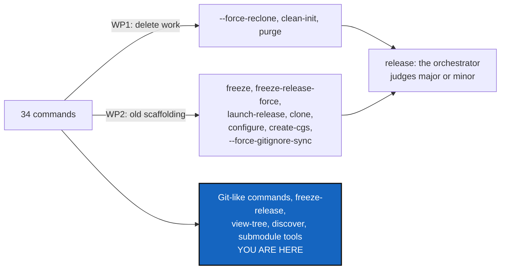

# GitLikeCli — keep the commands that read like Git, remove the rest

*Created: 2026-10-02*

*Branch: main*

> **From the owner's short ticket `archive/.closedUserTicket/20261002_no-force-reclone.md`.**
> "I think we can eliminate force-reclone. [...] it would be wise to reduce
> the number of cgitsync methods, especially the ones that are not very close
> to the git ones." The owner then ruled on every candidate (2026-10-02);
> §2 records the rulings. In the owner's words, it is good to remove the very
> old commands that helped build up the current package but became useless
> as it improved.

## Abstract — read this first

**The one-line version.** Remove ten commands and flags. Three of them can
delete work. The others are old scaffolding that newer commands replaced.
Keep everything that reads like Git, plus the tools the owner uses or wants:
`freeze-release`, `view-tree`, `discover`, and both submodule commands.

**What this document is.** The usage evidence, the owner's ruling on every
command and destructive flag, the work packages that carry the removals out,
and what must stay intact.

**Why it exists.** Every command is a surface to document, test and keep
within the rules. Three of them can still delete commits that exist nowhere
else, against *ComplexGitSync rewrites nothing*, and a command nobody runs
only keeps a risk alive and makes the help longer.

**What you will find.** §1 what is actually used. §2 the rulings. §3 what
must stay intact. §4 the work packages. §5 acceptance.

**Who it is for.** The worker and the orchestrator. Everything has been
ruled except the release level, which §4 leaves to the orchestrator.

**What you need to do with it.** Build §4 against §3 and §5.

---

## 1. What is actually used

The ledger records every command that writes a State. Across every memory
chapter (357 distinct entries, 2026-09-16 to 2026-10-02):

| Runs | Command |
|---:|---|
| 155 | `push` |
| 142 | `commit` |
| 15 | `bootstrap` |
| 14 | `pull` |
| 12 | `checkout` |
| 7 | `merge` |
| 4 | `memory reboot` |
| 3 | `close-branch`, `branch` |

Read-only commands (`status`, `fetch`, `branch --list`, `view-tree`,
`verify`) write no State, so they are not counted. The owner uses
`view-tree`.

## 2. The rulings (owner, 2026-10-02)

| Command or flag | Ruling | Why |
|---|---|---|
| `status`, `fetch`, `pull`, `checkout`, `branch`, `merge`, `add`, `rm`, `commit`, `push`, `tag` | **Keep** | The Git commands, tree-wide |
| `close-branch`, `pull-force` | **Keep** | Used, or Git-like; neither drops a commit since 3.14.11 |
| `bootstrap`, `initialise` | **Keep** | The two integrated install routes, standalone and nested. That pair is ComplexGitSync's own way of cloning, and gives it an identity |
| `freeze-release` | **Keep, as the only freeze procedure** | The owner prefers its explicit name to the bare `freeze` |
| `view-tree` | **Keep** | The owner uses it |
| `discover`, with `--write` | **Keep** | The one way to write a `.cgs` from what is checked out |
| `import-submodules`, `init-from-submodules` (with its `--force`) | **Keep** | The conversion from submodules to ComplexGitSync. `init-from-submodules` is the fully integrated one, "very useful for dummies". Its `--force` only lets it run on a root with no `.gitmodules`; its clone step is still protected by `CloneGuard` |
| `validate`, `autofix`, `verify`, `env`, `env check`, `memory …`, `self-history …`, `repo create` | **Keep** | Checks and infrastructure: the memory, the ledger, the agent record |
| `--force-reclone` (on `initialise`) | **Remove** (WP1) | Deletes a clone holding commits no remote has |
| `clean-init` | **Remove** (WP1) | It is `purge` and then a reclone with `--force-reclone` on |
| `purge` | **Remove** (WP1) | Deletes every child clone with `shutil.rmtree` and asks no `CloneGuard` question, so it can destroy commits no remote has. A breach of the rule today |
| `freeze` | **Remove** (WP2) | `freeze-release` is the one freeze procedure |
| `freeze-release-force` | **Remove** (WP2) | The forced variant; since 3.14.11 it cannot complete when it has something to commit |
| `launch-release` | **Remove** (WP2) | It is `checkout <tag> --ref-kind tag`. Not contested by the owner; recommended |
| `clone` | **Remove** (WP2) | A third install route beside `bootstrap` and `initialise` |
| `--force-gitignore-sync` | **Remove** (WP2) | A hidden fallback to `pull-force` behind a `.gitignore` flag. Run `pull-force` instead |
| `configure`, `create-cgs` | **Remove** (WP2) | Never used; `discover --write` writes a `.cgs` from what is there |

## 3. What must stay intact

- **`ComplexGitSyncClient.configure`**, the `.cgs` writer, stays. Removing
  the `configure` and `create-cgs` commands removes only their CLI handlers.
  The writer is what `discover --write`, `init-from-submodules`, and
  `initialise --project … --repo …` (an install with no `.cgs` yet) all call.
- **The prompts that run on the fly** stay as they are. That covers the
  `memory setup` offer after a recording command (`cli/memory_prompt.py`)
  and every other question asked while a command runs. `configure`'s own
  questionnaire (`_prompt_cgs_definition`) goes with `configure`. It is
  the one prompt that is a command of its own.
- **`init-from-submodules`** works end to end: discover, write the `.cgs`,
  initialise, convert. Its integration tests still pass, and none of its
  steps calls a removed command or flag.
- **`freeze-release`** still does what `freeze` did, as its last step. The
  client method `freeze` may stay as an internal step of `freeze_release`;
  it is only the bare CLI command that goes.

## 4. Work packages

| WP | What | Done when |
|---|---|---|
| **WP1** | **Remove what deletes work.** Remove `--force-reclone`, `clean-init` and `purge`, with their client methods (`clean_init`, `clean_initialise_cgs`, `purge`, `purge_cgs`, `_purge_registry_workspace`) where nothing else calls them. Change the `CloneGuard` message that names `--force-reclone` to say: commit and push, or move the directory aside yourself. | No command can delete a clone holding commits no remote has |
| **WP2** | **Remove the old scaffolding:** `freeze`, `freeze-release-force`, `launch-release`, `clone`, `configure`, `create-cgs`, `--force-gitignore-sync`. Remove each command with its client method, because the CLI mirrors the API, except where §3 keeps one. Remove any flag that only served it. | Every "Remove" ruling of §2 is gone and §3 holds |
| **WP3** | **Docs and specs in the same change:** the README command table and its "Thirteen commands take `--private`" sentence, `docs/Text/user_guide.tex`, `api_python.tex`, tutorials, `cli/help_text.py`, `CLAUDE.md`'s module table, the `AdditionalSpecs.md` ruling table (*The hard prohibitions*), and the tests that count or list commands (`test_cli_expert`'s command count, `test_readme_documents_every_cli_command`). Tests of removed commands go with them. Ceilings only shrink, so tighten the baseline. | `git grep` finds no removed command outside history and archived tickets |
| **WP4** | **Release.** `bump-build`, then `bump-version` at the level **the orchestrator judges**. Removing a command and flags looks like a major change under README *What is stable* ("command names and their documented flags: stable within a major version"). The owner leaves that call to the orchestrator, as a test of the role. Rebuild all five PDFs. Write a changelog line per removed command saying what to run instead. | The version is the one the orchestrator chose and justified, everywhere |

## 5. Acceptance

- No remaining command or flag can delete a commit no remote holds. A test
  plants a local-only commit in a child clone and runs `initialise`,
  `bootstrap`, `pull`, `pull-force` and `init-from-submodules` against it.
- Every removed command is absent from the CLI, the client (except what §3
  keeps), the README, the user guide, the API guide and the help, and the
  command-count tests agree.
- §3 holds: `discover --write`, `init-from-submodules`, `initialise
  --project … --repo …`, `freeze-release` and the `memory setup` offer each
  have a passing test.
- `pixi run lint`, `pixi run test`, `pixi run check-ceilings` and
  `pixi run check-spectree` pass, and `cgitsync status` shows `errors=0`.
- The orchestrator's record says which release level it chose and why.
