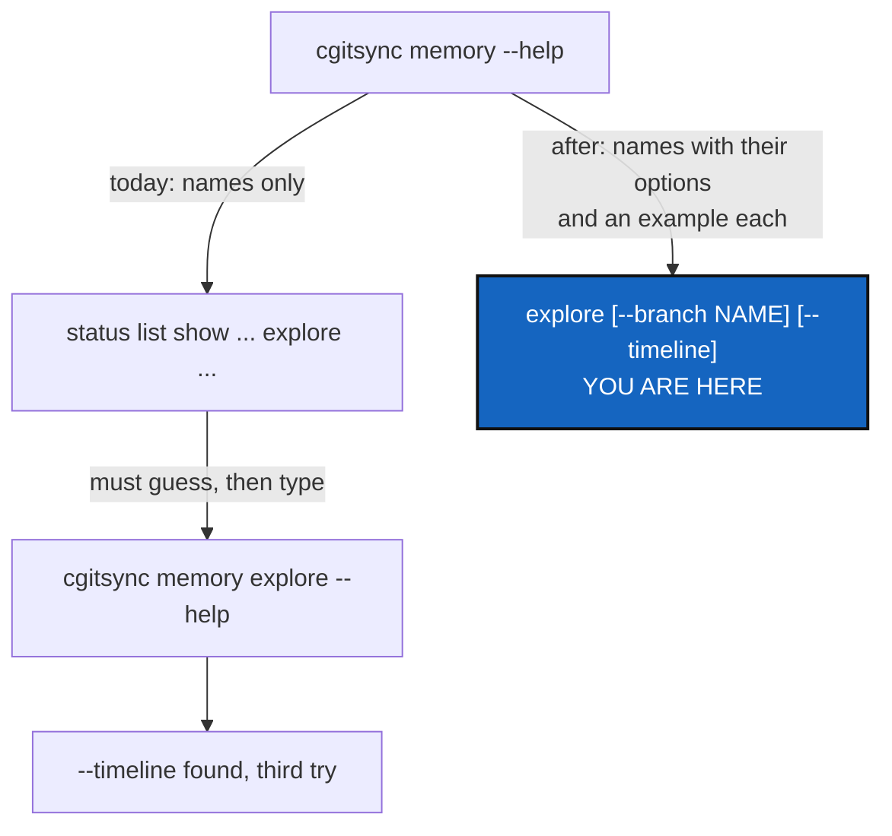

# HelpErgonomy — `--help` that answers the question without the user guide

*Created: 2026-10-01*

*Branch: main*

> **Decisions answered by the owner — 2026-10-01. Ready to implement.**
> D1 `cgitsync help --all` (and `cgitsync help <command…>`); D2 examples
> spelled `cgitsync …`, with one "from a clone, prefix with `pixi run`" line;
> D3 options inline in a group's help; D4 no colour, no pager. All as
> recommended; §3 records them.

> Opened from the owner's request in conversation, 2026-10-01 (filed as
> `archive/.closedUserTicket/20261001_help-ergonomy.md`): *"memory explore
> --timeline doesn't show up with pixi run cgitsync memory --help easily. In
> general the help menu covers just one level of help not the options. It is
> a real drawback of the system because even I cannot use it that well and
> as I am lazy i do not look that much to userguide (i cannot evaluate this
> one)."*

## Abstract — read this first

**The one-line version.** `cgitsync --help` is the only documentation most
people read, and today it shows one level at a time, with no examples and
partly stale text. To find `--timeline` you must already know it lives under
`memory explore`.

**What this document is.** A measured diagnosis of the help system (§1), what
good help looks like for this tool (§2), the owner's decisions (§3), work
packages (§4) and acceptance (§5).

**Why it exists.** The owner, who designed the tool, cannot find options
through `--help`. A user who has never read the user guide has no chance.
Help is the cheapest documentation to keep true, because it is generated
from the parser the code actually runs.

**Who it is for.** Whoever implements it; the owner for §3.

**What you need to do with it.** §3 is answered; implement §4 in order.

---

## 1. What the help shows today (measured 2026-10-01)

Measured by walking the parser `cli.build_parser()` builds:

| Finding | Number |
|---|---|
| Commands (leaves of the parser) | 48, with 186 options between them |
| Command groups with subcommands | 4: `memory`, `self-history`, `repo`, `env` |
| Commands with **no description** — their `--help` shows only options, never what the command does (`memory explore` is one) | 17 of 48 |
| Commands with **an example** of a real call | 0 of 48 |
| Option texts that still describe the old `CGSHOME/.cgitsync/state(<hash>)_n/*.gts` layout (`--search-dir`) | 34 |
| Length of the top-level `usage:` line, a brace list of every command, printed twice | 386 characters |

And three structural problems no number shows:

- **One level at a time.** `cgitsync memory --help` lists the subcommands
  but none of their options. An option is visible only at the third level,
  `cgitsync memory explore --help`, which a user reaches only by knowing
  where to look.
- **No grouping at the top.** The README sorts commands into Minimalist,
  Expert, Configuration and Environment; `cgitsync --help` prints all 34
  top-level commands as one flat list, in registration order.
- **Group descriptions drift.** `memory --help` says it covers "status, list,
  show <state>, explore, reboot" — eight subcommands added since are not
  named. Text written by hand beside the parser goes stale; text generated
  from it cannot.

## 2. What good help looks like here

- **Two levels deep.** A group's help lists each subcommand **with its
  options on the same line**, so `memory --help` alone shows
  `explore [--branch NAME] [--timeline]`.
- **Every command says what it does and shows one call.** A one-sentence
  description and an *Examples* section with one to three real invocations.
- **The top level is grouped and readable.** Commands under the README's own
  headings, `<command>` in the usage line instead of the brace list, and a
  short "start here" epilog with the three most common workflows.
- **One page with everything.** A way to print every command and every
  option at once, so `cgitsync <that> | grep timeline` answers "which command
  has this option?" in one step.
- **True by construction.** Lists of commands and options are generated from
  the parser, never typed by hand; examples are checked by a test that parses
  them.

## 3. Decisions — answered by the owner, 2026-10-01 (all as recommended)

| D | Question | Recommendation (chosen) |
|---|---|---|
| **D1** | How is the full reference printed? | **`cgitsync help --all`**, plus `cgitsync help <command…>` as a synonym of `<command…> --help`. A real subcommand is easier to remember than a flag, and leaves `--help` untouched. Alternative: a `--help-all` flag on the top-level parser |
| **D2** | How do examples spell the command? | **`cgitsync …`**, with one line in the top-level epilog: "from a clone, prefix with `pixi run`". The same spelling a user install will use (see the pending UserInstallPath and the `pixi-global-install` short ticket) |
| **D3** | How long may a group's help become? | **Options inline, one line per subcommand, wrapped at the terminal width.** `memory` has 14 subcommands; inline options roughly double its help. Alternative: only list options with `--verbose` |
| **D4** | Colour, pager? | **Neither.** Plain text, pipeable, no new dependency |

## 4. Work packages

| WP | Touches | Deliverable |
|---|---|---|
| **WP1** | new `cli/help_text.py` | **All human help text in one place**: for every command path (`("memory", "explore")`), a one-sentence description and one to three examples. Applied to the parser after `build_parser()` assembles it, so **`cli/expert.py` does not grow** — it is past the 2000-line ratchet (`pixi run check-oo`, 2498 lines today) and may only shrink. Split into two modules if one would pass the 500-line ceiling for a new module |
| **WP2** | `cli/__init__.py`, `cli/help_text.py` | **Formatter.** A `HelpFormatter` subclass, used by every parser: `<command>` instead of the brace list; group help prints each subcommand's usage line (options included) under its one-line help; an *Examples* epilog kept verbatim |
| **WP3** | `cli/__init__.py`, `cli/help_text.py` | **Grouped top level.** The four README groups as headings (the grouping already exists: `minimalist.COMMANDS`, `expert.COMMANDS`, `configuration.COMMANDS`, `environment.COMMANDS`), and the "start here" epilog |
| **WP4** | `cli/` | **The full reference** (D1): every command, its description, its usage line and every option, generated from the parser. A pure presentation command: it calls no client method, which the CLI-mirrors-API rule permits because it adds no capability — add it to the named exceptions in `tests/unit/test_cli_mirrors_client.py` with that reason |
| **WP5** | `cli/expert.py` (shrinking only), `cli/_shared.py` | **Stale text.** One shared help string for `--search-dir`, describing today's layout (`.cgitsync/state/<hash>.gts`) instead of 34 copies of the old one; refresh the four group descriptions so they name what they hold or are generated |
| **WP6** | `tests/unit/` | **Help stays true**: every command has a description and at least one example; every example parses with `build_parser()` without error; a group's help names every option of every subcommand (the `--timeline` case as its own test); the full reference contains every option string the parser knows; no help text mentions `state(<hash>)_n` |
| **WP7** | `README.md`, `docs/Text/user_guide.tex` | One line each: where the full reference is, and that `--help` now shows options two levels deep. The README command table stays, and its existing test still passes |

**Order.** WP5 (removes the noise) → WP1 → WP2 → WP3 → WP4 → WP6 → WP7.

**Not in scope.** Rewording the commands themselves, renaming options, or
changing any output other than help: the JSON contract
(`json_render.py`) and every command's normal output are untouched.

## 5. Acceptance

- `cgitsync memory --help` shows `--timeline` on the `explore` line.
- `cgitsync <command> --help` shows, for every one of the 48 commands, one
  sentence on what it does and at least one example; a test fails when a new
  command lacks either.
- Every example in the help parses; a test fails otherwise.
- `cgitsync --help` groups commands under the README's headings, and its
  usage line no longer lists every command.
- The full reference (D1) lists every option the parser knows, so
  `| grep <option>` finds which command takes it.
- No help text describes `state(<hash>)_n`.
- `cli/expert.py` does not grow; `pixi run check-oo`, `check-ceilings`,
  `lint` and `test` pass; `cgitsync status` shows `errors=0`; `bump-build`
  for the `src/` change; the version is the orchestrator's call (new
  `help` command: minor).
