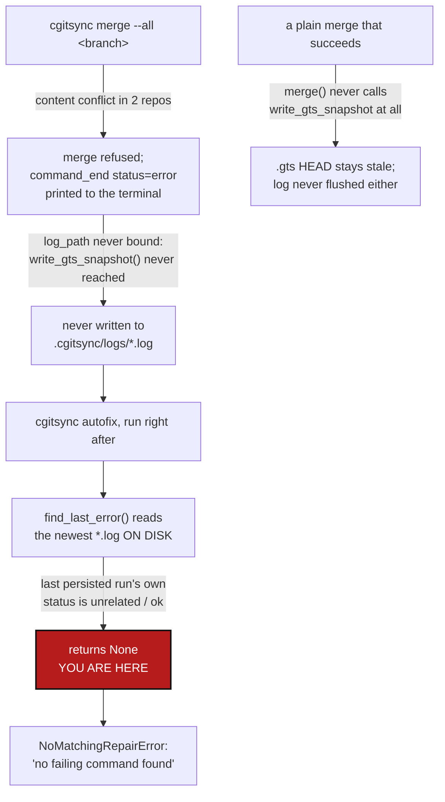

# MergeLogGap — a refused merge, and even a successful plain `merge`, never reaches `.cgitsync/logs/`, so `autofix` and `status` go blind exactly when a merge is the reason to run either

*Created: 2026-09-27*

*Branch: main*

> **Diagnosis ticket**, opened from a live incident on the owner's own tree
> (merging `tmp-main-1-2_DiscoverRoundTrip` into `main`), per the
> instruction to analyse the case rather than patch around it silently.
> §1-§2 are the diagnosis; §3 is the correction plan; §4 is the tutorial
> update the plan owes.

## Abstract — read this first

**The one-line version.** `cgitsync autofix` reads `.cgitsync/logs/*.log`
for the last `command_end`/`status="error"` line, but that line only ever
reaches disk from inside `write_gts_snapshot()` — a call every command's
*success* path reaches, a plain `merge` (no `--into`) never reaches at
all, and no command's own *failure* path ever reaches, because raising is
precisely what stops execution before that call runs. A merge conflict is
therefore invisible to `autofix` by construction, not by accident: it is
the one situation `autofix` exists for, and the one situation it
structurally cannot see.

**What this document is.** The diagnosis of the owner's own live merge on
this tree: `cgitsync merge --all tmp-main-1-2_DiscoverRoundTrip` correctly
refused on two genuine content conflicts (`DocComplexGitSync`,
`ComplexGitSync` itself); `cgitsync autofix`, run immediately afterward,
answered "no failing command found in the run log" — factually true of
the log file on disk, and useless as an answer to what had just happened;
`cgitsync merge --resolve` then handed the owner a `git mergetool`
invocation with no tool configured, leaving the actual conflict resolution
to be done by hand, which the owner is doing separately from this ticket.
Plus a correction plan and the tutorial update it owes.

**Why it exists.** The owner hit this in the ordinary course of finishing
a feature branch — exactly the workflow
[tutorials/04_private_repos.md](../../../../../tutorials/04_private_repos.md)
walks through — and `autofix` gave a wrong-feeling answer at the exact
moment a tool that "diagnoses first" is supposed to be useful
(`cli/_shared.py`'s own `_pull_force_risk_hint` comment calls this out as
the intended order of operations for exactly this kind of failure).
`CLAUDE.md`'s before-committing checklist already treats `cgitsync status`
showing `errors=0` as necessary but not sufficient proof the tool can
describe its own tree; this incident is the same shape one level down — a
quiet log directory is not proof nothing needed to be recorded there.

**What you will find.** §1 the incident, reproduced from the real run. §2
root cause, in two independent parts: (A) log persistence is gated on a
call every failure path skips by definition — general, not merge-specific,
though merge is where it is hit hardest; (B) `merge()` itself (unlike
`merge_into()`, `checkout()`, `commit()`, `pull()`, …) never calls that
write at all, success included, so a plain merge leaves both no on-disk
log and a `.gts` snapshot stale about the very `HEAD`s it just moved. §3
four work packages. §4 the tutorial update this ticket owes —
`04_private_repos.md`, not `05_memory.md` (§4 explains why). §5 acceptance
criteria.

**Who it is for.** Whoever picks up `autofix`/`operations.py` work next —
a peer workstream to
[AutofixCommitHygiene](main_1-6_AutofixCommitHygiene_DevPlanTicket.md)
(also open, also about a defect `autofix` cannot see, for an unrelated
reason: that one is an error `cgitsync` never logs *at all*, because the
commit that caused it happened outside `cgitsync` entirely; this one is an
error `cgitsync` raises and prints to the terminal immediately, but
structurally cannot persist to the file `autofix` actually reads).

**What you need to do with it.** Read §2 for exactly which two calls are
missing and why the gap is not merge-specific even though merge is where
it bites hardest, then WP1-WP2 in §3 — the rest, and §4, follow from it.



---

## 1. What happened today

Condensed from the real run, on this tree, `main`, tree `READY`,
`errors=0`, 12 repositories:

```
$ pixi run cgitsync merge --all tmp-main-1-2_DiscoverRoundTrip
git_command=git merge tmp-main-1-2_DiscoverRoundTrip
UserWarning: merge skipped .self-history: it has no branch
  'ComplexGitSync_tmp-main-1-2_DiscoverRoundTrip' ...
[... six more of the same, one per private/local config repo ...]
{"operation": "CGS-MERGE", "event": "command_end", "command": "merge",
 "status": "error",
 "error": "merge refused; no repository was merged: DocComplexGitSync:
   merging 'tmp-main-1-2_DiscoverRoundTrip' conflicts; ComplexGitSync:
   merging 'tmp-main-1-2_DiscoverRoundTrip' conflicts",
 "tree_lifecycle_state": "READY"}
cgitsync merge: merge refused; no repository was merged: ...

$ pixi run cgitsync autofix
{"operation": "CGS-AUTOFIX", "event": "command_end", "command": "autofix",
 "status": "error",
 "error": "autofix: no failing command found in the run log."}
cgitsync autofix: autofix: no failing command found in the run log.

$ pixi run cgitsync merge --resolve tmp-main-1-2_DiscoverRoundTrip
stopped at DocComplexGitSync: (no file named)
not reached: ComplexGitSync
no merge tool available. Resolve by hand:
  cd .../docs && git mergetool  # then: cgitsync add && cgitsync commit
```

Three things are true at once here, and only the second is a defect:

1. The two content conflicts are real, and `merge --all` refusing to touch
   *any* repository until every one in scope is checked is exactly
   `operations.py`'s documented all-or-nothing guarantee working as
   designed — nothing to fix.
2. `autofix` answering "no failing command found" one command after a
   command that plainly failed, with its own JSON error line printed to
   the same terminal a moment earlier, is not a correct diagnosis of "no
   registered repair matches this" (the answer `autofix` gives further
   down the same code path for a genuinely unrecognised error) — it is a
   tool reading an empty mailbox that was never given the letter.
3. `--resolve` handing the owner `git mergetool` with none configured is a
   real UX gap but a smaller one than #2 — see §5's scope note.

The seven `UserWarning: merge skipped ...` lines (private/local config
repos with no `ComplexGitSync_tmp-main-1-2_DiscoverRoundTrip` branch yet)
are the *documented* behaviour
[tutorials/05_memory.md](../../../../../tutorials/05_memory.md) §2 Step 5
already describes and already tells the reader how to avoid
(`cgitsync memory branch --project-branch <branch>`, once per project
branch) — confirmed accurate against this run and not part of this
ticket's root cause, though the raw `<file>.py:232: UserWarning:` framing
these are printed in (Python's `warnings` module, internal file/line
included) is inconsistent with every other command's structured
`{"operation": ...}` JSON output and is worth a follow-up polish pass, not
folded into WP1-4 below.

## 2. Root cause

### 2.1 Part A — persisting a run's log is gated on a call every failure path skips by construction

`_run_with_logging` (`cli/_shared.py:157`) logs `command_start`, runs the
handler, and on exception logs `command_end`/`status="error"` via
`run_logger.log_event(...)`. `CommandRunLogger.log_event`
(`orchestre.py:359`) only appends that line to a file `if self.log_path is
not None:` — otherwise the line lives only in `_buffered_lines` and in
whatever the Python `logging` module did with it (stdout, in this run,
which is why the JSON was visible on the terminal at all). `log_path` is
set exactly once, by `bind_log_file()` (`orchestre.py:378`), and the only
caller of `bind_log_file` anywhere in the codebase is inside
`write_gts_snapshot()` (`orchestre.py:6236`), at the very end, after a new
`.gts` document has already been built and written to disk.

Every command that raises before reaching its *own* `write_gts_snapshot`
call never binds a log path, so its own `command_end`/`status="error"`
line never reaches disk — and for a refused operation that is every
command, by definition, since refusing is exactly choosing not to write a
new state. `FromCliRepair.find_last_error` (`autofix/repair_from_cli.py:45`)
reads only `.cgitsync/logs/*.log` on disk, sorted by mtime, and inspects
the *last* file's *last* `command_end` line — so it necessarily reads the
last run that *did* reach `write_gts_snapshot`, i.e. the last run that
succeeded, and correctly reports that unrelated run's own status as
`"ok"`. `autofix` is not failing to recognise the merge conflict; it is
reading a file that was never given the chance to record it.

This is general, not merge-specific: any command whose failure is caught
by `_run_with_logging`'s `except Exception` before its own state-mutating
call reaches its own snapshot write has the identical blind spot. Merge is
simply the case that surfaces it hardest, because a conflict is exactly
the situation an owner reaches for `autofix` over.

### 2.2 Part B — `merge()` itself never writes a snapshot, success or failure

`ComplexGitSyncClient.merge()` (`orchestre.py:3472`) calls
`self.orchestre.git_tree.git.merge(...)` and returns — no
`write_gts_snapshot(...)` call anywhere in the method. Its sibling
`merge_into()` (`orchestre.py:3512`, `cgitsync merge --into`) calls
`write_gts_snapshot(command_origin="merge-into")` at line 3564,
immediately after its own `git.merge_into(...)` — the same pattern every
other tree-mutating command follows (`checkout`, `commit`, `pull`,
`branch`, …). Plain `merge` is the one command in that family that skips
it entirely.

That means a **successful** plain merge — the common case, not only the
conflicting one the owner hit today — never flushes its own log to disk
either (Part A's gap, hit here regardless of outcome), and separately
never records the new `HEAD`s it just wrote into a fresh `.gts`, leaving
`status`'s `RECORDED` column and `recorded_mismatch` count stale until
some unrelated later command happens to write a snapshot. `merge_into()`
is not fully exempt from Part A either: its `write_gts_snapshot` call
sits *after* `git.merge_into(...)`, so a refused, conflicting `merge
--into` hits exactly Part A's gap the same way plain `merge` does — the
asymmetry with plain `merge` is only that a *successful* `merge --into`
does get logged and recorded, where a successful plain `merge` never
does, regardless of outcome.

## 3. Correction plan

| WP | Touches | Deliverable |
|---|---|---|
| **WP1** | `orchestre.py::merge`, `operations.py::merge_tree`/`merge_into_tree` | Closes Part B's success-path half. **Preferred shape, not a bare duplicate call:** `merge()` memorizes the tree's own current branch (CWB, the same value `git_tree_branch.py` already exposes) and reuses `merge_into`'s "checkout target, then merge, then `write_gts_snapshot`, all in one process" path with `target_branch=CWB` — one code path instead of two, matching this codebase's own single-implementation rule (`git_branch.py`, `parse_repo_id()`; digest.md, *Architecture — single-implementation rules*). **Load-bearing caveat, checked against the code, not assumed:** `_run_preflight_checks`'s `check_branch_alignment` flag is `True` by default everywhere and `merge_into_tree` is documented as the *one* caller that sets it `False` (`operations.py:1802-1806`: *"for `merge_into_tree` alone... every other caller leaves it at the default... stays enforced for all of them"*), because `merge_into`'s whole job is moving repositories that are not yet aligned to the target. Plain `merge` relies on that alignment check as a real precondition today. Routing it through `merge_into_tree` unchanged would silently drop that check for the plain-merge path — a repo sitting on the wrong branch would get checked out and merged into instead of refused up front. So WP1 must thread `check_branch_alignment` through as a parameter (`merge_into_tree(..., check_branch_alignment=True)` for plain merge's own call, `False` only for `merge --into`'s), not inherit the relaxed default. If threading that parameter through turns out more invasive than it is worth, fall back to the minimal version — a direct `write_gts_snapshot(command_origin="merge")` call added to `merge()` itself, duplicating rather than reusing `merge_into`'s path — and say so in the closing report rather than silently picking one. |
| **WP2** | `orchestre.py::CommandRunLogger`/`create_run_logger`, `cli/_shared.py::_run_with_logging` | Closes Part A, the half that actually matters for this incident: bind a log path (or otherwise guarantee the buffered lines reach a file) at `command_start`, before any state-mutating work happens, instead of only at the end of a successful `write_gts_snapshot`. A `command_end`/`status="error"` logged on the exception path must reach disk unconditionally — WP1 alone still leaves a *refused* merge invisible, since a refusal is precisely the path that never reaches `write_gts_snapshot`. |
| **WP3** | `autofix/repair_from_cli.py`, a new `autofix/repair_merge_conflict.py` | Once WP2 makes the error text reach disk, teach `autofix` to actually recognise it: a `MergeConflictRepair` (or an extension to `FromCliRepair`'s matching) that pattern-matches the persisted `"merging '{branch}' conflicts"` text (`operations.py::_describe_merge_conflict`, line 888) and reports back the conflicting repositories/paths `can_merge_cleanly` (`git_runner.py:369`/`888`) already collected — pointing the owner at `merge --resolve` and the conflicted paths directly, rather than only ever being able to answer "no failing command found" for this class of situation. |
| **WP4** | `tests/`, `.agent/.local/.localSpec/AdditionalSpecs.md` | A regression test reproducing this incident end to end: a small tree with one leaf repo built to conflict, `merge` refused, `autofix` run immediately after (no `error=` given explicitly, exactly as the owner ran it) must find and name the conflict rather than raising `NoMatchingRepairError`. A second test for WP1: a successful plain `merge` produces a `.gts` snapshot and a persisted log file. Update the `operations.py`/`autofix/` rows in `AdditionalSpecs.md`'s architecture table for the new snapshot call and the new repair, per `CLAUDE.md`'s before-committing checklist item 6. |

WP1 and WP2 are independent and both required: WP1 without WP2 fixes the
*successful*-merge staleness (Part B) but leaves every refusal exactly as
blind as today; WP2 without WP1 fixes `autofix` for a refused merge but
leaves a successful plain merge still not recording its own `HEAD`
moves into a fresh snapshot. WP3 has nothing to match against until WP2
lands.

## 4. Tutorial update

The instruction behind this ticket asks for an update to "the merging
tutorial 5" if that is where the topic lives, and another tutorial
otherwise. It is otherwise: `tutorials/05_memory.md` is the memory
tutorial, and its own merge coverage (§2 Step 5, §3, §5.1) is narrow and,
checked against today's run, accurate — the "no branch" warnings §1 above
reproduces are exactly what that document already tells a reader to
expect and how to avoid. No change is owed there.

The tutorial that actually walks through `merge`/`merge --all`/`--private`
mechanics for a general audience is
[tutorials/04_private_repos.md](../../../../../tutorials/04_private_repos.md)
§"Branch, add, commit, push, merge... and `--all`" (around its
`merge multi-branch` / `merge --all multi-branch` examples) — named in
`CLAUDE.md`'s own *Layout* section as this project's worked example for
every kind of private entry, and what CI dogfoods. It documents the
happy path and the "check out the target before you merge" gotcha, but
says nothing about what to do when a real content conflict refuses the
merge. Add, once WP1-3 above have landed:

- What a refusal looks like (`merge refused; no repository was merged: ...`)
  and that it means nothing was touched anywhere in the tree — the
  all-or-nothing guarantee is a feature, not a partial failure to work
  around.
- `cgitsync autofix` now recognises this case (post-WP3) and names the
  conflicting repositories/paths directly.
- `cgitsync merge --resolve` for the case autofix cannot repair
  automatically: it stops at the first conflict, and if no merge tool is
  configured, resolving means opening the named repository, fixing the
  conflict markers by hand, then `cgitsync add && cgitsync commit` there —
  spelled out explicitly, since "no merge tool available" today hands the
  reader a dead-end `git mergetool` invocation with no fallback described
  anywhere in the tutorials.

If WP1-3 are picked up by a different change than the tutorial edit, the
tutorial edit still lands in *this* ticket's closing commit — per
`CLAUDE.md`'s before-committing checklist item 7's spirit (document what
you build, in the same change) — not deferred to a follow-up.

## 5. Acceptance criteria

- A successful plain `merge` (no `--into`) writes a new `.gts` snapshot,
  exactly as `merge_into`/`checkout`/`commit` already do (WP1).
- A command's own `command_end`/`status="error"` line reaches
  `.cgitsync/logs/*.log` on disk unconditionally, not only when the
  operation happened to also write a new state (WP2).
- `cgitsync autofix`, run immediately after a refused merge — with no
  `error=` argument given, the way the owner actually ran it — finds and
  names the conflicting repositories rather than answering "no failing
  command found" (WP3).
- The real incident in §1 is covered by a regression test, plus one for a
  successful plain merge now producing a snapshot and a persisted log
  (WP4).
- `tutorials/04_private_repos.md` documents a refused merge, the
  now-working `autofix` path, and the `--resolve`-with-no-mergetool
  by-hand fallback; `tutorials/05_memory.md` is confirmed unchanged
  (checked in §4, no drift found).
- `.localSpec/AdditionalSpecs.md`'s `orchestre.py`/`autofix/` rows describe
  the new snapshot call and the new repair.
- `pixi run lint` and `pixi run test` pass; `cgitsync status` shows
  `errors=0`.

**Out of scope for this ticket**, noted so it is not lost: the raw
`<file>.py:NNN: UserWarning: ...` framing of the private/local
branch-missing warning (§1, item 3) and `--resolve`'s generic "no merge
tool available" message both deserve a polish pass toward the same
structured-JSON/clean-stderr style the rest of the CLI already uses, but
neither blocks `autofix` or `status` the way §2's gap does, and folding
them in here would blur one clean root cause across two unrelated UX
findings.
