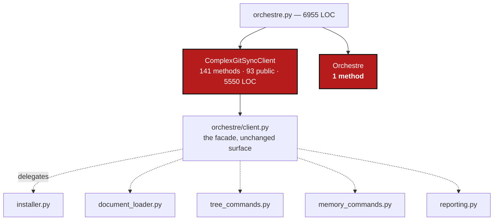

# ModulePackagisation — `orchestre.py` is 6955 lines and one class holds 93 public methods; split the oversized modules into packages

*Created: 2026-09-30*

*Branch: main*

> **Ticket review — 2026-09-30, after ClassFirstPackage.** Renumbered `main_1-2` → `main_1-1`: [ClassFirstPackage](../archive/20260930_ClassFirstPackage_DevPlanTicket.md) was implemented and archived, so the priority-1 ranks were compacted.

> **State after ClassFirstPackage (implemented 2026-09-30).** Its step in the
> sequencing — *ModulePackagisation after ClassFirstPackage* — is satisfied, and
> `operations.py` (2228 lines) and `orchestre.py` (6796 lines) are now the only
> modules over 2000 lines besides the exempt `cli/expert.py`, as recorded in
> `scripts/oo_conformance_baseline.json`. `orchestre.py` still holds four
> behaviour classes, and `operations.py` is procedural: 22 public free functions
> and no class of its own to own them. Both are this ticket's scope, and WP5
> extends the checker that already exists.

> **Renumbered 1-2 → 1-3 in the priority-1 reorganisation of 2026-09-30.**
> Opened by [ClassFirstPackage](../archive/20260930_ClassFirstPackage_DevPlanTicket.md),
> which corrects everything finite; this ticket takes the part that is a
> design job. The rule it implements is the owner's,
> stated in conversation 2026-09-30 and recorded in
> [AgentGuardrails](../archive/20260930_AgentGuardrails_DevPlanTicket.md) §3.1: a source
> file over **2000 lines becomes a directory of that name**, split so each
> file keeps **one clear major class that gives the module its name**, with
> at most two or three classes in all. **`cli/` is exempt**, being derived
> from client methods implemented elsewhere.

## Abstract — read this first

**The one-line version.** Three modules are over 2000 lines. One of them,
`orchestre.py`, is 6955 lines in which a single class — `ComplexGitSyncClient`
— carries **141 methods, 93 of them public, across 5550 lines**, while the
`Orchestre` class that is supposed to be the coordination layer has **one
method**. Split both into packages of collaborator classes behind an
unchanged facade.

**What this document is.** The measurement (§1), the seams to cut along
(§2–§3), five work packages (§4), three decisions (§5), acceptance (§6).

**Why it exists.** The rule was in `DevSpecs.md` and not in `digest.md`, so
nobody applied it —
[AgentGuardrails](../archive/20260930_AgentGuardrails_DevPlanTicket.md) §1 is that story. Correcting it is the expensive
part, which is why it is separated: `__all__` and a missing class are
mechanical, but deciding where `ComplexGitSyncClient` divides is a design
judgement that has to be reviewed as one. Landing it inside a documentation
ticket is how it would get waved through.

**What you will find.** §1 what is over the line. §2 the proposed
`orchestre/` package, by method group. §3 `operations/`. §4 work packages.
§5 decisions. §6 acceptance.

**Who it is for.** Whoever picks it up, with time to do it properly. This is
not a reformat.

**What you need to do with it.** Read §2, then D1–D3 in §5. Do not start before
[AgentGuardrails](../archive/20260930_AgentGuardrails_DevPlanTicket.md) WP1 has written
the rule into `AdditionalSpecs.md`.



---

## 1. What is over the line

| Module | LOC | Classes | Verdict |
|---|---|---|---|
| `orchestre.py` | 6955 | 4 behaviour + 5 value | **Split** (§2) |
| `cli/expert.py` | 2500 | 0 | **Exempt** — `cli/` (D3) |
| `operations.py` | 2193 | 1 nominal behaviour class, 22 free functions | **Split** (§3) |
| `git_tree.py` | 1661 | 3 behaviour | Under the line; ratchet it (WP5) |
| `git_runner.py` | 1452 | 2 behaviour | Under the line; ratchet it (WP5) |

Inside `orchestre.py`:

```
ComplexGitSyncClient   141 methods (93 public), ~5550 lines
CommandRunLogger         5 methods,  ~93 lines
RuntimeStateStore        4 methods,  ~26 lines
Orchestre                1 method,   ~10 lines
+ DiscoveredRepo, DiscoverReport, InitFromSubmodulesReport,
  GitignoreSyncEntry, _StatusView   — value objects, no methods
```

`CLAUDE.md` describes `orchestre.py` as *"the `ComplexGitSyncClient` public
facade **and** `Orchestre` coordination layer"*. In the code the coordination
layer has one method and the facade has everything: a facade that delegates
to nothing is not a facade, it is the implementation. The single largest
method is `discover_repos` at 203 lines.

## 2. The proposed `orchestre/` package

The facade's 93 public methods group cleanly by subject. Each group becomes
one collaborator class in one file named after it; `ComplexGitSyncClient`
keeps **every one of its 93 method names and signatures** and becomes what it
claims to be — each method a delegation of a line or two.

| File | Major class | Absorbs (public methods) | ~count |
|---|---|---|---|
| `orchestre/client.py` | `ComplexGitSyncClient` | the facade itself — unchanged public surface | 93 delegations |
| `orchestre/installer.py` | `Installer` | `configure`, `initialise*`, `clean_init*`, `purge*`, `clone*`, `bootstrap`, `restart`, `resolve_cgshome`, `resolve_initialise_cgshome`, `resolve_clone_root`, `resolve_bootstrap_root` | ~17 |
| `orchestre/document_loader.py` | `DocumentLoader` | `load`, `load_cgs`, `load_gts`, `load_source`, `load_runtime_or_cgs`, `expand`, `validate`, `fix_circularities`, `describe_cgs`, `write_gts_snapshot` | ~10 |
| `orchestre/tree_commands.py` | `TreeCommands` | `pull*`, `checkout`, `branch`, `close_branch`, `commit`, `merge*`, `open_merge_tool`, `add`, `remove`, `removals_outside_scope`, `push`, `tag`, `git`, `refresh_private`, `autofix` | ~21 |
| `orchestre/memory_commands.py` | `MemoryCommands` | `memory_*`, `self_history_*`, `freeze*`, `launch_*`, `get_ledger_history`, `replay_ledger`, `verify` | ~24 |
| `orchestre/discovery_commands.py` | `DiscoveryCommands` | `discover_repos`, `discover_nested_configs`, `import_submodules`, `init_from_submodules`, `repo_create` | ~5 |
| `orchestre/reporting.py` | `Reporting` | `status`, `status_json`, `verify_json`, `view_tree`, `view_operation`, `format_project_tree`, `format_repo_tree`, `print`, `get_tree_state`, `get_dependency_registry`, `is_loaded` | ~11 |
| `orchestre/environment_commands.py` | `EnvironmentCommands` | `environment`, `check_environment`, `build_installed_from`, `validate_branch_topology`, `validate_topology` | ~5 |
| `orchestre/command_run_logger.py` | `CommandRunLogger` | as today | — |
| `orchestre/runtime_state_store.py` | `RuntimeStateStore` | as today | — |
| `orchestre/reports.py` | the five value objects | no behaviour; they do not count against the cap (ClassFirstPackage D1) | — |

The grouping is not invented for this ticket: it is the one `cli/` already
uses (minimalist / expert / configuration / environment), plus memory. That
is the evidence it is a real seam and not a tidy-looking one.

**`Orchestre`'s one method** is D1: fold it into the facade and delete the
class, or make it the coordinator the docstring claims. Whichever is chosen,
`CLAUDE.md`'s description of this module must end up true.

## 3. The proposed `operations/` package

`operations.py` is the module
[ClassFirstPackage](../archive/20260930_ClassFirstPackage_DevPlanTicket.md) §1.1 calls a
fourteenth offender: 2193
lines, 22 public module-level functions, and seven "classes" that are one
enum and six dataclasses — five with no methods at all. It has no behaviour
class to name it after, so this split creates them.

| File | Major class | Absorbs |
|---|---|---|
| `operations/preflight.py` | `Preflight` | the preflight pass, with `PreflightSeverity`/`PreflightDiagnostic` |
| `operations/merge.py` | `MergeOperation` | `merge_tree`, `merge_tree_one_at_a_time`, `merge_status`, with `MergeIntoPlan`/`ResolveOutcome` |
| `operations/commit.py` | `CommitOperation` | `add_tree`, `commit_tree` |
| `operations/push.py` | `PushOperation` | `push_tree` |
| `operations/branch.py` | `BranchOperation` | `close_branch`, topology checks, with `BranchTopologyConflict`/`BranchTopologyReport` |
| `operations/removal.py` | `RemovalOperation` | `remove_paths` — the one scoped operation given its paths rather than sweeping |
| `operations/outcome.py` | `RepoOutcome` | the per-repository result every operation returns |

`operations/__init__.py` re-exports the public surface under `__all__`, so
`orchestre.py`'s imports keep working through the split and the two halves
of the change can land separately.

## 4. Work packages

| WP | Touches | Deliverable |
|---|---|---|
| **WP1** | `operations.py` → `operations/` | Do this one **first**: it is a third the size, its seams are obvious, and it proves the pattern — package directory, `__init__.py` re-exporting, callers untouched. Each operation family is its own commit. |
| **WP2** | `orchestre.py` → `orchestre/`, mechanical half | Create the package; move `CommandRunLogger`, `RuntimeStateStore`, `Orchestre` and the five value objects into their own files. `orchestre/__init__.py` re-exports everything `from .client import ComplexGitSyncClient` and the rest, so no import anywhere else in `src/` or `tests/` changes. No method moves yet. |
| **WP3** | `orchestre/`, the real split | Move the method groups of §2 out of `ComplexGitSyncClient` into their collaborator classes, **one group per commit**, largest first (`memory_commands`, then `tree_commands`, then `installer`). After each commit the facade still exposes all 93 methods and `pixi run test` passes unedited. Settle `Orchestre` per D1. |
| **WP4** | `CLAUDE.md`, `AdditionalSpecs.md` | Update the module responsibility table and the dependency-path diagram — required by `CLAUDE.md`'s before-committing checklist whenever responsibility moves, and this ticket moves a great deal of it. `CLAUDE.md`'s `orchestre.py` row is already inaccurate today (§1) and must end up true. |
| **WP5** | `scripts/check_oo_conformance.py`, `scripts/ceiling_baseline.json` | Ratchet what is left: no module over 2000 lines, `cli/` excepted; `git_tree.py` and `git_runner.py` recorded at today's size so they cannot drift over. This extends `scripts/check_oo_conformance.py`, which ClassFirstPackage already built — do not write a second checker. |

**Order.** WP1 → WP2 → WP3 → WP4 → WP5. Each `src/` commit carries
`pixi run bump-build`.

**The safety property, for every commit here:** the public surface does not
change. `ComplexGitSyncClient` keeps its 93 method names and signatures,
`operations/` re-exports what `operations.py` exported, and **no test is
edited**. A test that has to change means behaviour changed, and no work
package here is allowed to change behaviour. If a seam cannot be cut without
editing a test, stop and write down why — that is a finding about the design,
not a licence to edit the test.

## 5. Decisions

| D | Question | Recommendation | Whose call |
|---|---|---|---|
| **D1** | `Orchestre` has one method. Delete it, or restore it as the coordination layer? | **Delete it** and let `ComplexGitSyncClient` be the single facade over the collaborators of §2. The coordination layer the name promises is exactly what §2's classes become; keeping an empty class beside them would give the package two answers to "where does a command live". `CLAUDE.md`'s row is then corrected to match. | **Owner** |
| **D2** | Does the facade delegate to collaborators it **owns** (composition), or do the collaborators become mixins of it? | **Composition**, per `DevSpecs.md` *"prefer composition over inheritance"*. Mixins would keep one 5550-line object split across files, which is the appearance of a fix rather than one. | **Owner** |
| **D3** | `cli/expert.py` is 2500 lines. Exempt from the class rules — also exempt from the 2000-line rule? | **Exempt for now**, and recorded in the ratchet so it cannot grow. Splitting it is worth its own small ticket, judged on readability rather than on this rule, since `cli/` holds no domain concept to name a module after. | **Owner** |

## 6. Acceptance

- No module under `src/` exceeds 2000 lines except `cli/expert.py`, which is
  recorded at its current size and cannot grow.
- `orchestre/` and `operations/` are packages; every file in them has one
  major class that gives it its name, and at most three classes counting per
  ClassFirstPackage's D1.
- `ComplexGitSyncClient` exposes the same 93 public methods as before, each a
  delegation; no caller in `src/`, `tests/` or `cli/` changed its imports.
- **No test file is modified by this ticket**, and `pixi run test` passes at
  every commit, not only at the end.
- `CLAUDE.md`'s module table and `AdditionalSpecs.md`'s responsibility table
  and dependency diagram describe the packages as they now are.
- `check_oo_conformance.py --check` and `check-ceilings` both exit 0.
- `pixi run lint`, `pixi run test`, `cgitsync status` with `errors=0`;
  `pixi run bump-build` per commit. Version: no public behaviour changes, but
  the package layout does, so **`minor`** — the orchestrator's call.
