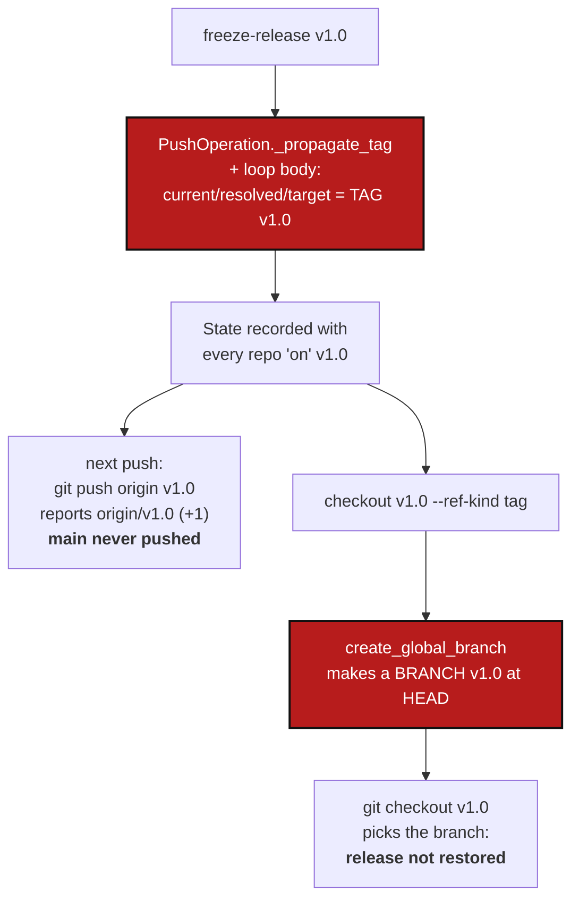

# ReleaseTags — `tag` and `freeze-release` move the tree onto the tag, and everything after them works on the wrong ref

*Created: 2026-10-06*

*Branch: main*

> **Opened from the owner's request of 2026-10-06**, after the bugs were
> found while writing Tutorial 2 (*Working with a Tree*) against a local
> copy of the `CGSil1` sandbox. The owner's words: *"never really tested
> and may not have been considered while developing the branch
> orchestration."* Ranked `1-1`: it breaks the everyday path right after a
> release, which is exactly what the new tutorial teaches.

## Abstract — read this first

**The one-line version.** `tag` and `freeze-release` create a tag but then
record the tag as the branch every repository is on. `freeze-release`
writes that into the State it records, so every later command reads it
back: the next `push` pushes the tag instead of `main`, and reports a
success that never reached the remote. Separately, `checkout <tag>
--ref-kind tag` creates a local *branch* named after the tag, and Git then
checks out that branch instead of the tag.

**What this document is.** A reproduction (§1), the root causes in the code
(§2), the decisions the owner has to make (§3), the work packages (§4), what
is left out (§5), and the acceptance criteria (§6).

**Why it exists.** Branch orchestration (`git_branch.py`,
`git_tree_branch.py`) was built for branches. Tags never went through it:
`operations/push.py` writes ref fields by hand, and `checkout_tree` handles a
tag with the branch path. The one test that covers a release,
`test_complete_git_cycle`, checks out the tag straight after the release,
before any later commit, which is the only moment the bugs do not show.

**Who it is for.** The worker who fixes it, and the orchestrator who quotes
the fix.

**What you need to do with it.** Answer §3 first. Then WP1 and WP2 fix the
cause; WP3 and WP4 fix the two things built on top of it; WP5 and WP6 prove
and document it.



---

## 1. Reproduction

On the `CGSil1` sandbox (three local bare remotes; the harness is
`tests/integration/test_tuto_cgsi1.py`), standalone:

```bash
cgitsync bootstrap CGSil1.cgs CGSil1 --cgs-path ws
export CGSHOME=ws/CGSil1
echo "a first note" > $CGSHOME/CGSil2/notes.txt
cgitsync add && cgitsync commit "first note" && cgitsync push        # fine: origin/main
cgitsync freeze-release v1.0 "first release"                           # fine: tag v1.0 pushed
echo "after the release" >> $CGSHOME/CGSil2/notes.txt
cgitsync add && cgitsync commit "after the release"
cgitsync push
```

```
pushed CGSil2: origin/v1.0 (+1)
skipped CGSih1: origin/v1.0 already up to date
skipped CGSil1: origin/v1.0 already up to date
```

The remote's `main` still points at the release commit; the new commit is
nowhere but this disk. `status` cannot show it either: it compares against
the upstream of the branch actually checked out.

```bash
cgitsync checkout v1.0 --ref-kind tag
cat $CGSHOME/CGSil2/notes.txt          # still contains "after the release"
git -C $CGSHOME/CGSil2 branch          # * main, v1.0  <- a branch, created by checkout
```

Two controls, run the same day:

- `tag v0.9` followed by `add`/`commit`/`push` pushes to `origin/main`
  correctly — but only because `tag` writes no State (§2, R1).
- A fresh `bootstrap` of the `.cgs` after the release pushes correctly, and
  `bootstrap <release>.gts` rebuilds the release exactly. Tutorial 2 relies on
  both, so it does not hit these bugs.

## 2. Root causes

**R1 — `tag_tree` and `freeze_release_tree` rewrite the refs of every
repository** (`operations/push.py`). `_propagate_tag` sets `target_ref_kind
= TAG` and `target_ref_name = <tag>` on *every* repository, and the loop
body then sets `current_ref_*` and `resolved_ref_*` to the tag as well. But
nothing checks the tag out: `HEAD` stays on the branch. The in-memory tree
now says something Git does not.

- `freeze-release` then writes a State (`client.freeze`) from that tree, so
  the false refs are recorded, become part of the State's content hash, and
  are loaded by every later command.
- `tag` writes no State, so the false refs die with the process. On the CLI
  that hides the bug; through `ComplexGitSyncClient`, `tag()` followed by
  `push()` on the same client pushes the tag, not the branch (follows from
  the code; WP5 adds the test).

AdditionalSpecs.md's `operations/` row says `tag_tree` and
`freeze_release_tree` ask `git_tree_branch.py` which branch each repository
follows. They do not: they are the only writers of ref fields in
`operations/` that bypass it.

**R2 — `push_tree` trusts the recorded ref over Git.** It pushes
`repo.resolved_ref_name or current_branch`. Once R1 has recorded a tag there,
`git push origin v1.0` pushes the (already pushed) tag, and the outcome line
reports `origin/v1.0 (+1)` — the `+1` counted against the branch's real
upstream. The result is a success message for a push that sent nothing.

**R3 — `checkout --ref-kind tag` takes the branch path**
(`operations/branch.py`, `checkout_tree`). Step 2 calls
`create_global_branch` unconditionally, which creates a local branch named
after the tag, at `HEAD`, wherever no branch of that name exists. Step 3's
`git checkout v1.0` then resolves the name to that branch, because Git
prefers a branch to a tag of the same name. The tag is never checked out.

**R4 — the tag is propagated wider than it is created.** `tag` and
`freeze-release` create and push the tag only in `RepoScope.WRITABLE`
repositories, but `_propagate_tag` targets every repository, read-only ones
included. `checkout <tag> --ref-kind tag` then asks a read-only repository
for a tag it never received. `propagate_global_branch`'s docstring says *"a
tag still reaches every repo and a frozen release stays reproducible"*; for
read-only repositories only the State's recorded commit does that.

**R5 — the freeze step can make a commit it never pushes.**
`freeze_release_tree` stages, commits when anything is staged, tags, and
pushes **the tag only**. `freeze_release` already ran `add`, `commit`,
`pull` and `push` just before, so this commit is normally empty. Any file
written in between (a `.gitignore` sync, for instance) is committed, tagged
and published through the tag, while the branch on the remote stays one
commit behind it.

## 3. Decisions — the owner's call

| # | Question | Recommendation |
|---|---|---|
| **D1** | After `tag` or `freeze-release`, where is the tree? | **On its branch, as Git says.** A tag is a name for a commit, not a place to work. The release is identified by the ledger's `release` row (`git_tag`), which already exists, and by the State's commits. Nothing moves `HEAD`, so nothing records a move. |
| **D2** | What does `checkout <tag> --ref-kind tag` put each repository on? | **The tag, detached**, in every repository that has it; refuse before touching anything if a writable repository lacks it, naming each one. A read-only repository has no tag by design (R4). Recommended: leave it where it is and say so, and point to `bootstrap <release>.gts` (or a future `checkout --gts`) for the exact tree. Alternative: check it out at the commit the release State recorded, which needs that State to be found from the tag name. |
| **D3** | A local branch already has the tag's name (every workspace the old `checkout` touched) | **Check out `refs/tags/<name>` explicitly**, so a same-named branch can never capture the checkout, and warn once per repository, naming the stray branch and how to remove it (`branch close` then `branch delete`, or by hand). Never delete it automatically: it may hold a commit made after the old `checkout`. |
| **D4** | States already recorded by the old `freeze-release`, with every repository "on" the tag | **Read Git, never rewrite the State.** States are content-addressed and nothing rewrites history (`AdditionalSpecs.md`, *The hard prohibitions*). On load, a repository whose recorded ref is a tag while Git has it on a branch is taken to be on that branch (WP4). The old State keeps its name and content. |
| **D5** | Version | **patch** for WP1–WP2 and WP4 (behaviour fixed, nothing added). WP3 changes what `checkout --ref-kind tag` does — from a broken result to a detached `HEAD` — still a fix, so patch; the orchestrator may judge it `minor` if D2's refusal is considered new interface. |

## 4. Work packages

| WP | Touches | Deliverable |
|---|---|---|
| **WP1** | `operations/push.py` | `tag_tree` and `freeze_release_tree` stop writing `current_ref_*`, `resolved_ref_*` and `target_ref_*`. `_propagate_tag` is deleted. After tagging they refresh only what Git changed — `commit_sha`, read with `rev_parse_head` — so the tree they leave says what Git says (D1). AdditionalSpecs.md's `operations/` row becomes true: any ref they need comes from `git_tree_branch.py`. |
| **WP2** | `operations/push.py` | `freeze_release_tree` pushes the branch as well as the tag when its own commit step made a commit (R5), through the same path `push_tree` uses, so the branch on the remote is never behind the release tag. Alternatively, refuse to tag when the freeze step finds something new to commit, since `freeze_release` committed everything a moment before; the worker picks one and says why. |
| **WP3** | `operations/branch.py`, `git_runner.py`, `git_tree_branch.py` | `checkout_tree` with `RefKind.TAG` never calls `create_global_branch`. A new read-only question in `git_runner.py` says whether a repository holds a tag (locally, or after one `fetch --tags`), so a preflight can ask every repository before checking out any. Writable repositories are checked out at `refs/tags/<name>`, detached; read-only ones per D2; a same-named branch per D3. `git_tree_branch.py` reports a detached tag checkout as `detached`, as `status` already documents. |
| **WP4** | `registry.py` or `git_tree_branch.py`, `operations/push.py` | `push_tree` pushes the branch Git has checked out, and refuses to push a name that is a tag as if it were a branch, naming the repository. When a loaded State records a tag as a repository's ref while Git has a branch checked out, the branch wins (D4), with one line saying so. A workspace left in the broken state by the old `freeze-release` then pushes `main` correctly with no action from its owner. |
| **WP5** | `tests/integration/test_tuto_cgsi1.py`, `tests/unit/` | Regression tests, each failing on today's code: (a) after `freeze-release`, a further `add`/`commit`/`push` in the **same** workspace lands on the remote's `main`, and `push` reports `origin/main`; (b) `checkout v1.0 --ref-kind tag` after a later commit restores the release content and creates no branch; (c) through the Python API, `tag()` then `push()` on one client pushes the branch; (d) a tree with a read-only repository: `checkout <tag> --ref-kind tag` behaves per D2 and changes nothing when it refuses; (e) a workspace whose latest State was recorded by the old `freeze-release` (fixture) pushes `main`; (f) `freeze_release_tree` with something to commit in its own step leaves remote branch and tag on the same commit. `test_complete_git_cycle` keeps passing. |
| **WP6** | `docs/Text/user_guide.tex`, `tutorials/02_working_with_a_tree.md`, `.agent/.local/.localSpec/AdditionalSpecs.md`, `CHANGELOG.md` | The user guide's `tag`, `freeze-release` and `checkout` sections say where the tree is after each (D1, D2). Tutorial 2's step 8 adds `checkout v1.0 --ref-kind tag` as the in-place way back, beside `bootstrap <release>.gts`. AdditionalSpecs.md's `operations/` row is corrected. The changelog entry says plainly that a `push` after a release did not reach the remote, so anyone affected checks their `main`. |

## 5. Out of scope

Two smaller defects found in the same session, worth their own tickets:

- `status` reports the root repository `clean` straight after `bootstrap`,
  although the `.gitignore` it wrote there is uncommitted and `add` stages
  it.
- `commit` and `push` print Python `UserWarning` lines (*"worktree has
  uncommitted changes"*, *"local branch is ahead of its upstream"*) for
  exactly the situation each command exists to resolve.

## 6. Acceptance criteria

- After `freeze-release` (and after `tag`), every repository's recorded ref
  is the branch Git has checked out; a State recorded by `freeze-release`
  names branches, and the release is identified by the ledger's `release`
  row.
- `freeze-release v1.0`, then a change, `add`, `commit` and `push` in the
  same workspace: the change is on the remote's `main`, and `push` says
  `origin/main`.
- `checkout v1.0 --ref-kind tag` restores the release's content in every
  repository holding the tag, creates no branch, and handles repositories
  without the tag as decided in D2 — refusing before it changes anything
  when it refuses.
- A workspace already broken by the old `freeze-release` pushes `main`
  correctly without being repaired by hand, and no State file is rewritten.
- After `freeze-release`, the remote branch and the remote tag point at the
  same commit in every writable repository.
- WP5's six tests exist and fail on the code before this ticket.
- `pixi run lint` and `pixi run test` pass; `cgitsync status` shows
  `errors=0`; `bump-build` and `bump-version` per D5.
